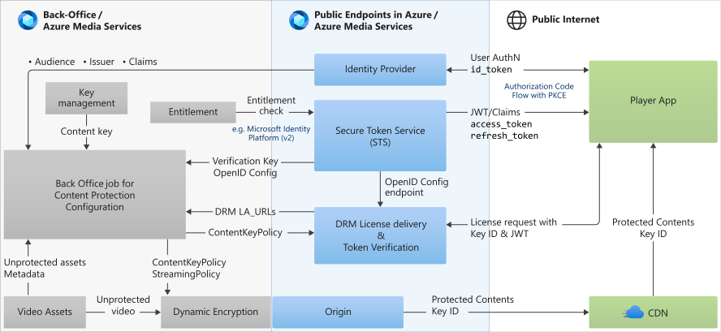
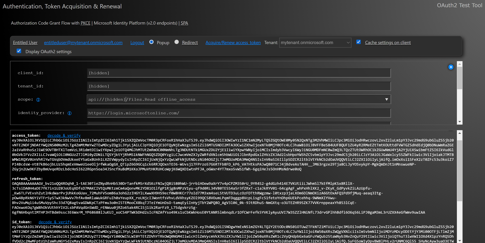
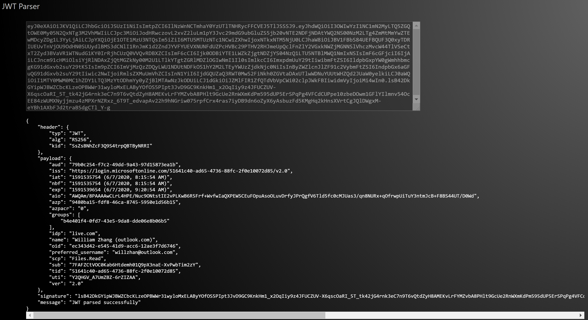
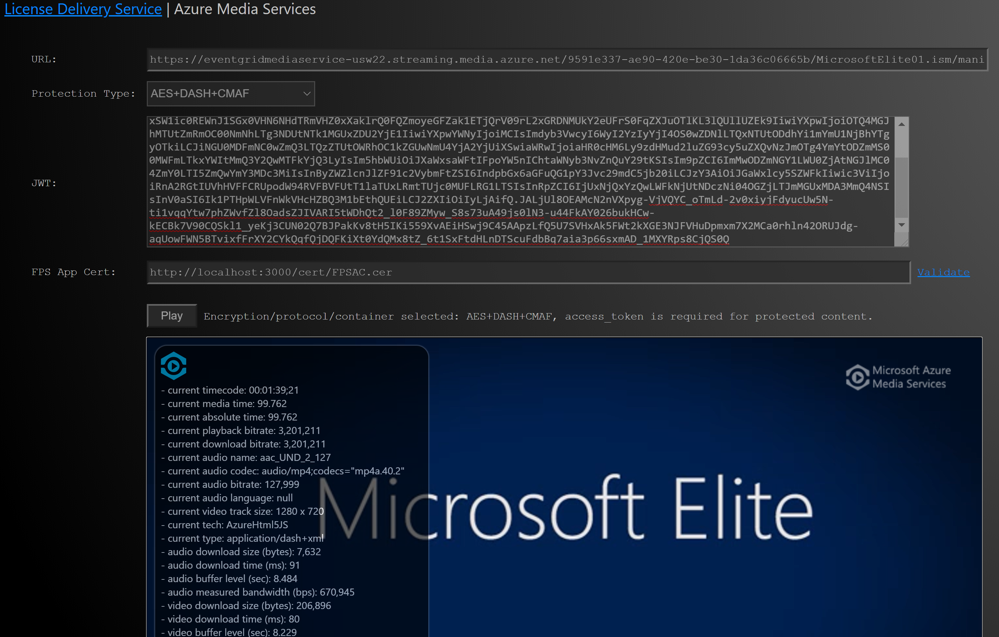

# Tutorial: End-to-End content protection using Azure AD

[!INCLUDE [media services api v3 logo](./includes/v3-hr.md)]

With this tutorial and the provided player sample, you can set up an end-to-end media content protection subsystem on Azure Media Services (AMS) and Azure Active Directory (AAD) to stream media content with all AMS supported DRM/AES-128, streaming protocols, codec, and container formats. The sample is generic enough for secure access to any REST API protected by OAuth 2 through Authorization Code Flow with Proof Key for Code Exchange (PKCE). (Azure Media Services license delivery service is just one of them.) It also works for Microsoft Graph API or any custom developed REST API secured with OAuth 2 Authorization Code Flow. This is the companion document to the [sample code](https://github.com/Azure-Samples/media-services-content-protection-azure-ad).

In this tutorial, you will:

> [!div class="checklist"]
>
> * Consider the authentication requirements
> * Understand how the app works
> * Register a backend resource app
> * Register a client app
> * Set up the media services account content key policy and streaming policies
> * Set up the player app

If you don’t have an Azure Media Services subscription, create an Azure [free trial account](https://azure.microsoft.com/free/) then create a Media Services account.

### Duration
The tutorial should take about two hours to complete after you have the prerequisite technology ready to go.

## Prerequisites

The following latest technology versions and concepts are used. It's recommended that you become familiar with them before beginning this tutorial.

### Prerequisite knowledge

It is optional but recommended that you are familiar with the following concepts before beginning this tutorial:

* Digital Rights Management (DRM)
* [Azure Media Services (AMS) v3](./media-services-overview.md)
* AMS [content key policies](drm-content-key-policy-concept.md) using the AMS API v3, Azure portal, or the [Azure Media Services Explorer (AMSE) tool](https://github.com/Azure/Azure-Media-Services-Explorer)
* Azure AD v2 endpoints on the [Microsoft Identity Platform](../../active-directory/develop/index.yml)
* Modern cloud authentication such as [OAuth 2.0 and OpenID Connect](../../active-directory/develop/active-directory-v2-protocols.md)
  * [Authorization code flow in OAuth 2.0](../../active-directory/develop/v2-oauth2-auth-code-flow.md) and why PKCE is needed
  * [Delegated permission vs application permission](../../active-directory/develop/developer-glossary.md#permissions)
* [JWT token](../../active-directory/develop/access-tokens.md), its claims, and signing key rollover (included in sample.)

### Prerequisite code and installations

* The sample code. Download the [sample code](https://github.com/Azure-Samples/media-services-content-protection-azure-ad).
* An installation of Visual Studio Code. Download Visual Studio Code here [https://code.visualstudio.com/download](https://code.visualstudio.com/download).
* An installation of Node.js. Download Node.js here [https://nodejs.org](https://nodejs.org). NPM comes with the install.
* An [Azure subscription](https://azure.microsoft.com/free/).
* An Azure Media Services (AMS) account.
* @azure/msal-browser v2.0, one of the members in [Microsoft Authentication Library (MSAL)](../../active-directory/develop/msal-overview.md) SDK family for different client platforms
* The latest version of [Azure Media Player](https://github.com/Azure-Samples/azure-media-player-samples)(included in sample.)
* FPS credentials from Apple if you want to include FairPlay DRM and the application certificate hosted with CORS that is accessible via client-side JavaScript.

> [!IMPORTANT]
> This tutorial uses .NET to create the content key policy restriction.  If you are not a .NET developer, but want to try Node.js to connect to Azure Media Services, read [Connect to Media Services v3 API - Node.js](configure-connect-nodejs-howto.md). There is also a Node.js module available to handle key rollover automatically, see Node.js [passport-ad module](https://github.com/AzureAD/passport-azure-ad).

## Consider the authentication and authorization requirements

A few challenges are presented in designing the subsystem. It has multiple moving parts, there are client app constraints, and the Azure AD key rollover that occurs every six weeks.

The Single-Page App (SPA) used in this tutorial takes into account challenges to authentication requirements and the restrictions that follow. It uses:

* Azure AD v2 endpoints as Azure AD developer platform (v1 endpoints) are changing to Microsoft Identity Platform (v2 endpoints).
* Authorization Code Flow because OAuth 2 implicit grant flow has been deprecated.
* An app that is subject to the following constraints:
    * A public client can't hide the client secret.  Authorization Code Flow alone requires hiding the client secret, so Authorization Code Flow with PKCE is used.
    * A browser-based app that is subject to a browser security sandbox (CORS/preflight constraint).
    * A browser-based app using modern JavaScript that is subject to JavaScript security constraints (custom header accessibility, correlation-id).

## Understand the subsystem design

The design of the subsystem is shown in the following diagram.  It has three layers:

* Back-office layer (in black) for configuring the content key policy and publishing content for streaming
* Public endpoints (in blue) that are player/customer-facing endpoints providing authentication, authorization, DRM license, and encrypted content
* Player app (in light blue) which integrates all components and
    * handles user authentication via Azure AD.
    * handles access_token acquisition from Azure AD.
    * receives manifest and encrypted content from AMS/CDN.
    * acquires DRM license from Azure Media Services.
    * handles content decryption, decode, and display.



Read [Design of a multi-DRM content protection system with access control](./architecture-design-multi-drm-system.md) for more details about the subsystem.

## Understand the Single-page app

The player app is a Single-page application (SPA), developed in Visual Studio Code using:

* Node.js with ES 6 JavaScript
* @azure/msal-browser 2.0 beta
* Azure Media Player SDK
* OAuth 2 flow against Azure AD v2 endpoints (Microsoft Identity Platform)

The SPA player app completes the following actions:

* User authentication for users native to the tenant, and guest users from other AAD tenants or MSA accounts. Users can choose to sign in through either a browser popup or redirect (for browsers not allowing popups such as Safari).
* Acquisition of `access_token` through Authorization Code Flow with PKCE.
* Renewal of `access_token` (tokens issued by AAD are valid for 1 hour), for which `refresh_token` is also acquired.
* Parsing JWT tokens (both `access_token` and `id_token`) for test/inspection.
* Acquisition of DRM licenses for all three DRMs or AES-128 content key.
* Streaming of content under various combinations of DRM vs Streaming Protocol vs Container Format. The correct format string is generated for each combination.
* Decryption, decode, and display.
* Microsoft Graph API calls for troubleshooting purposes. <!--See more details in the subsection Shortest path: testing my protected asset in my subscription with your hosted player app and underlying tenant. -->

The screen for sign-in, token acquisition, token renewal, and token display:

 

The screen for parsing JWT tokens (access_token or id_token):



The screen for testing protected content with different combinations of DRM/AES vs Streaming Protocols vs Container Format:


-->

<!-- You can see a hosted version of the sample at [https://aka.ms/ott](https://aka.ms/ott)-->

## Choose an Azure AD tenant

> [!NOTE]
> From here forward, it is assumed that you have logged in to the Azure portal and have at least one Azure AD tenant.

Choose an Azure AD tenant to use for our end-to-end sample. You have two options:

* An existing Azure AD tenant. Any Azure subscription must have one Azure AD tenant, but an Azure AD tenant can be used by multiple Azure subscriptions.
* A new Azure AD tenant that is *not* used by any Azure subscription. If you choose the new tenant option, the media service account and the sample player app must be in an Azure subscription that uses a separate Azure AD tenant. This provides some flexibility. For example, you could use your own Azure AD tenant but also the customer’s media service account in the customer’s Azure subscription.

## Register the backend resource app

1. Navigate to the Azure AD tenant you chose or created.
1. Select **Azure Active Directory** from the menu.
1. Select **App registrations** from the menu.
1. Click **+ New Registration**.
1. Name the app *LicenseDeliveryResource2* (where 2 indicates AAD v2 endpoints).
1. Select **Accounts in this organizational directory only ([*your tenant name*] only - Single tenant)**. If you want to enable access to multiple tenants, select one of the other multitenant options.
1. The **Redirect URI** is optional and can be changed later.
1. Click **Register**. The App registrations view will appear.
1. Select **Manifest** from the menu. The Manifest view will appear.
1. Change the value of the `accessTokenAcceptedVersion` to *2* (no quotes).
1. Change the value of the `groupMembershipClaims` to *"SecurityGroup"* (with quotes).
1. Click **Save**.
1. Select **Expose an API** from the menu. The Add a scope view will appear. (Azure provides an Application ID URI, but if you want to change it, you can edit in the Application ID URI field.)
1. Click **Save and continue**. The view will change. For each of the settings in the Setting column in the table below, enter the value in the Value column, then click **Add scope**.

| Setting | Value | Description |
| ------- | ----- | ----------- |
| Scope name | *DRM.License.Delivery* | How the scope will appear when access to this API is being requested, and in access tokens when the scope has been granted to a client application. This must be unique across this application. A best practice is to use “resource.operation.constraint” as a pattern to generate the name. |
| Who can consent? | *Admins and users* | Determines whether users can consent to this scope in directories where user consent is enabled. |
| Admin consent display name | *DRM license delivery* | What the scope will be called in the consent screen when admins consent to this scope. |
| Admin consent description** | *DRM license delivery backend resource scope* | A detailed description of the scope that is displayed when tenant admins expand a scope on the consent screen. |
| User consent display name | *DRM.License.Delivery* | What the scope will be called in the consent screen when users consent to this scope. |
| User consent description | *DRM license delivery backend resource scope* | This is a detailed description of the scope that is displayed when users expand a scope on the consent screen. |
| State | *Enabled* | Determines whether this scope is available for clients to request. Set it to “Disabled” for scopes that you do not want to be visible to clients. Only disabled scopes can be deleted, and we recommend waiting at least a week after a scope has been disabled before deleting it to ensure no clients are still using it. |

## Register the client app

1. Navigate to the Azure AD tenant you chose or created.
1. Select **Azure Active Directory** from the menu.
1. Select **App registrations** from the menu.
1. Click **+ New Registration**.
1. Give the client app a name, for example, *AMS AAD Content Protection*.
1. Select **Accounts in this organizational directory only ([*your tenant name*] only - Single tenant)**. If you want to enable access to multiple tenants, select one of the other multitenant options.
1. The **Redirect URI** is optional and can be changed later.
1. Click **Register**.
1. Select **API permissions** from the menu.
1. Click **+ Add a permission**. The Request API permissions view will open.
1. Click on the **My API** tab and select the *LicenseDeliveryResource2* app you created in the last section.
1. Click on the DRM arrow and check the *DRM.License.Delivery* permission.
1. Click **Add permissions**. The Add permissions view will close.
1. Select **Manifest** from the menu. The Manifest view will appear.
1. Find and add the following value pairs to the `replyUrlsWithType` attribute:

   ```json
   "replyUrlsWithType": [
        {
            "url": "https://npmwebapp.azurewebsites.net/",
            "type": "SPA"
        },
        {
            "url": "http://localhost:3000/",
            "type": "SPA"
        }
    ],
   ```

    > [!NOTE]
    > At this point, you do not yet have the URL for your player app.  If you are running the app from your localhost webserver, you can use just the localhost value pair. Once you deploy your player app, you can add the entry here with the deployed URL.  If you forget to do so, you will see an error message in the Azure AD sign in.

1. Click **Save**.
1. Finally to verify that your configuration is correct, select **Authentication**.  The Authentication view will appear. Your client application will be listed as a Single Page App (SPA), the redirect URI will be listed, and the grant type will be Authorization Code Flow with PKCE.

### Set up the Media Services account content key policy and streaming policies

**This section assumes that you are a .NET developer and are familiar with using the AMS v3 API.**

> [!NOTE]
> As of this writing, you can't use the Azure portal for the media services account key policy setup because it doesn't support using an asymmetric token signing key with OpenID-Config.  The setup must support Azure AD key rollover because the Azure AD issued token is signed by an asymmetric key and the key rolls over every six weeks. Therefore, this tutorial uses .NET and the AMS v3 API.

Configuration of the [content key policy](drm-content-key-policy-concept.md) and [streaming policies](stream-streaming-policy-concept.md) for DRM and AES-128 apply.  Change the `ContentKeyPolicyRestriction` in the content key policy.

Below is the .NET code for creating the content key policy restriction.

```dotnetcli
ContentKeyPolicyRestriction objContentKeyPolicyRestriction;

//use Azure Active Directory OpenId discovery document, supporting key rollover
objContentKeyPolicyRestriction = new ContentKeyPolicyTokenRestriction()
    {
        OpenIdConnectDiscoveryDocument = ConfigAccessor.AppSettings["ida_AADOpenIdDiscoveryDocument"]
    };

string audience = ConfigAccessor.AppSettings["ida_audience"];
string issuer   = ConfigAccessor.AppSettings["ida_issuer"];

ContentKeyPolicyTokenRestriction objContentKeyPolicyTokenRestriction = (ContentKeyPolicyTokenRestriction)objContentKeyPolicyRestriction;
objContentKeyPolicyTokenRestriction.Audience             = audience;
objContentKeyPolicyTokenRestriction.Issuer               = issuer;
objContentKeyPolicyTokenRestriction.RestrictionTokenType = ContentKeyPolicyRestrictionTokenType.Jwt;

objContentKeyPolicyRestriction = objContentKeyPolicyTokenRestriction;

return objContentKeyPolicyRestriction;
```

Change the `ida_AADOpenIdDiscoveryDocument`, `ida_audience`, and `ida_issuer` values in the above code. To find the values for these items in the Azure portal:

1. Select the AAD tenant you used earlier, click on **App registrations** in the menu, then click on the **Endpoints** link.
1. Select and copy the value of the **OpenIdConnect metadata document** field and paste it into the code as the `ida_AADOpenIdDiscoveryDocument` value.
1. The `ida_audience` value is the Application (client) ID of the registered app *LicenseDeliveryResource2*.
1. The `ida_issuer`value is the URL `https://login.microsoftonline.com/[tenant_id]/v2.0`. Replace [*tenant_id*] with your tenant ID.

## Set up the sample player app

If you haven't done so already, clone or download the app from the source repo: [https://github.com/Azure-Samples/media-services-content-protection-azure-ad](https://github.com/Azure-Samples/media-services-content-protection-azure-ad).

You have two options to set up the player app:

* Minimal customization (only replacing some constant string values such as client_id, tenant_id, and streaming URL), but you must use Visual Studio Code and Node.js.
* If you prefer to use another IDE and web platform such as ASP.NET Core, you can put the web page files, JavaScript files, and CSS file into your project since the player app itself does not use any server-side code.

### Option 1

1. Start Visual Studio Code.
1. To open the project, click File -> Open Folder -> browse to and select the parent folder of the *package.json* file.
1. Open the JavaScript file *public/javascript/constants.js*.
1. Replace `OAUTH2_CONST.CLIENT_ID` by the `client_id` of your registered client app in AAD tenant.  You can find the `client_id` at the Overview section of the registered app in Azure portal. Note: it's the client ID, not object ID.
1. Replace `OAUTH2_CONST.TENANT_ID` by the `tenant_id` of your Azure AD tenant. You can find your `tenant_id` by clicking on Azure Active Directory menu. The tenant_id will appear in the Overview section.
1. Replace `OAUTH2_CONST.SCOPE` by the scope you added into your registered client app. You can find the scope by navigating to the registered client app from the **App registrations** menu then selecting your client app:
    1. Select your client app, click on the **API permissions** menu, then select the scope *DRM.License.Delivery* under the API permission *LicenseDeliveryResource2*. The permission should be in the format like *api://df4ed433-dbf0-4da6-b328-e1fe05786db5/DRM.License.Delivery*. **Important**: Keep the space in front of `offline_access` in `OAUTH2_CONST.SCOPE`.
1. Replace the two constant strings for `AMS_CONST` as shown below. One is the protected streaming URL of your test asset, and the other is FPS Application Certificate URL if you would like to include the FairPlay test case. Otherwise you can leave it as is for `AMS_CONST.APP_CERT_URL`. Then, click **Save**.

```javascript
//defaults in ams.js
class AMS_CONST {
    static get DEFAULT_URL() {
        return "https://eventgridmediaservice-usw22.streaming.media.azure.net/9591e337-ae90-420e-be30-1da36c06665b/MicrosoftElite01.ism/manifest(format=mpd-time-csf,encryption=cenc)";
    }
    //FairPlay application cert URL
    static get APP_CERT_URL() {
     return `${window.location.href}cert/FPSAC.cer`;
    }
}
```

To test locally:

1. In Visual Studio Code (VSC), select **View** from the main menu then **Terminal**.
1. If you haven't already installed npm, at the command prompt enter `npm install`.
1. Enter `npm start` at the command prompt. (If npm doesn't start, try changing the directory to `npmweb` by entering `cd npmweb` at the command prompt.)
1. Use a browser to browse to `http://localhost:3000`.

Depending on the browser you use, pick the correct combination of DRM/AES vs Streaming Protocol vs Container Format to test after sign in (`access_token` acquisition). If you are testing in Safari on macOS, check the Redirect API option since Safari does not allow popups. Most other browsers allow both popups and redirect options.

### Option 2

If you plan to use another IDE/web platform and/or a webserver such as IIS running on your development machine, copy the following files into a new directory in your local webserver. The paths below are where you will find them in the code you downloaded.

* *views/index.ejs* (change suffix to .html)
* *views/jwt.ejs* (change suffix to .html)
* *views/info.ejs* (change suffix to html)
* *public/** (JavaScript files, CSS, images as shown below)

1. Copy the files found in the *view* folder to the root of the new directory.
1. Copy the *folders* found in the *public* folder to the root of the new directory.
1. Change the extensions of the `.ejs` files to `.html`. (No server-side variable is used so you can safely change it.)
1. Open *index.html* in VSC (or other code editor) and change the `<script>` and `<link>` paths so that they reflect where the files are located.  If you followed the previous steps, you only have to delete the `\` in the path.  For example, `<script type="text/javascript" src="/javascript/constants.js"></script>` becomes `<script type="text/javascript" src="javascript/constants.js"></script>`.
1. Customize the constants in the *javascript/constants.js* file as in Option 1.

## Common customer scenarios

Now that you've completed the tutorial and have a working subsystem, you can try modifying it for the following customer scenarios:

### Azure role-based access control (Azure RBAC) for license delivery via Azure AD group membership

So far, the system allows any user who can sign in to get a valid license and play the protected content.

It is a common customer requirement that a subset of authenticated users is allowed to watch content while others are not, for example, a customer who offers basic and premium subscriptions for its video content. Their customers, who paid for a basic subscription should not be able to watch content which requires a premium subscription. Below are the additional steps required to meet this requirement:

#### Set up the Azure AD tenant

1. Set up two accounts in your tenant. They could be named *premium_user* and *basic_user*;
1. Create a user group and call it *PremiumGroup*.
1. Add the *premium_user* to the *PremiumGroup* as a member, but do not add the *basic_user* to the group.
1. Take note of the **Object ID** of the *PremiumGroup*.

#### Set up the Media Services account

Modify `ContentKeyPolicyRestriction` (as shown in the section above in the  Setup in Media Service Account), by adding a claim named *groups*, where `ida_EntitledGroupObjectId` has the object ID of *PremiumGroup* as its value:

```dotnetcli

var tokenClaims = new ContentKeyPolicyTokenClaim[] { new ContentKeyPolicyTokenClaim("groups", ConfigAccessor.AppSettings["ida_EntitledGroupObjectId"])
//, other claims, if any.
};

if (tokenClaims != null && tokenClaims.Length > 0)
{
     objContentKeyPolicyTokenRestriction.RequiredClaims = new List<ContentKeyPolicyTokenClaim>(tokenClaims);
}
```

The *groups* claim is a member of a [Restricted Claim Set](../../active-directory/develop/reference-claims-mapping-policy-type.md#claim-sets) in Azure AD.

#### Test

1. Sign in with the *premium_user* account. You should be able to play the protected content.
1. Sign in with the *basic_user* account. You should get an error indicating the video is encrypted but there is no key to decrypt it. If you view the Events, errors, and downloads with the dropdown at the bottom of the player diagnostic overlay, the error message should indicate license acquire failure due to the missing claim value for groups claim in the JWT issued by Azure AD token endpoint.

### Supporting multiple media service accounts (across multiple subscriptions)

A customer may have multiple media service accounts across either a single or multiple Azure subscriptions. For example, a customer may have one media service account as production primary, another one as secondary/backup, and another for dev/test.

All you need to do is to ensure that you use the same set of parameters as you used in the section (Setup in Media Service Account) in creating the `ContentKeyPolicyRestriction` in all of the media service accounts.

### Supporting a customer, its vendors, and/or subsidiaries across multiple AAD tenants

As users of the solution, a customer's subsidiaries, vendors/partners may reside in different AAD tenants, such as `mycustomer.com`, `mysubsidiary.com`, and `myparther.com`. While this solution is built on a single specific AAD tenant, such as `mycustomer.com`, you can make it work for users from other tenants.

Using `mycustomer.com` for this solution, add a user from `mypartner.com` as a guest user to the `mycustomer.com` tenant. Make sure the `mypartner.com` user activates the guest account. The guest account can be either from another AAD tenant or an `outlook.com` account.

Notice that the guest users from `mypartner.com`, after being activated in `mycustomer.com`, are still authenticated through their own/original AAD tenant, `mypartner.com`, but the `access_token` is issued by `mycustomer.com`.

### Supporting a customer tenant/subscription with a setup in your subscription/tenant

You can use your setup to test protected content in your customer's media service account/subscription. You would set it up with an Azure AD tenant and a media service account in the same subscription. The customer's media service account would be in their Azure subscription with their own Azure AD tenant.

1. Add your customer's account into your tenant as a guest account.
1. Work with your customer to prepare protected content in your customer's media service account by providing the three parameters as listed in the Setup in Media Service Account section.

Your customer can then browse to your setup, sign in with the guest account, and test their own protected content. You can also sign in with your own account and test your customer's content.

Your sample solution may be set up in a Microsoft tenant with Microsoft subscription or custom tenant with Microsoft subscription. The Azure Media Service instance can be from another subscription with its tenant.

## Clean up resources

> [!WARNING]
> If you're not going to continue to use this application, delete the resources you created while following this tutorial. Otherwise, you will be charged for them.

## Next steps

> [!div class="nextstepaction"]
> [Quickstart: Encrypt content](drm-encrypt-content-how-to.md)
