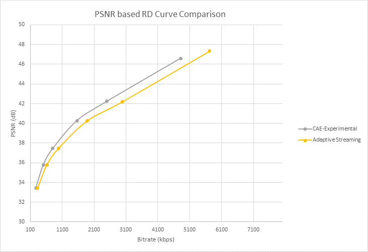

---
# Mandatory fields. See more on aka.ms/skyeye/meta.
title: A preset for content-aware encoding - Azure Media Services 
description: This article discusses content-aware encoding in Microsoft Azure Media Services v3.
services: media-services
documentationcenter: ''
author: Juliako
manager: femila
editor: ''

ms.service: media-services
ms.workload: 
ms.topic: article
ms.date: 04/29/2020
ms.author: juliako
ms.custom: 

---

# Use the content-aware encoding preset to find the optimal bitrate value for a given resolution

In order to prepare content for delivery by [adaptive bitrate streaming](https://en.wikipedia.org/wiki/Adaptive_bitrate_streaming), video needs to be encoded at multiple bit-rates (high to low). This ensures graceful degradation of quality, as the bitrate is lowered so is the resolution of the video. Such multiple bit-rate encoding makes use of a so-called encoding ladder – a table of resolutions and bitrates, see the Media Services [built-in encoding presets](https://docs.microsoft.com/rest/api/media/transforms/createorupdate#encodernamedpreset).

You should be aware of the content you are processing, and customize/tune the encoding ladder to the complexity of the individual video. At each resolution, there is a bitrate beyond which any increase in quality is not perceptive – the encoder operates at this optimal bitrate value. The next level of optimization is to select the resolutions based on the content – for example, a video of a PowerPoint presentation does not benefit from going below 720p. Going further, the encoder can be tasked to optimize the settings for each shot within the video. 

Microsoft's [Adaptive Streaming](autogen-bitrate-ladder.md) preset partially addresses the problem of the variability in the quality and resolution of the source videos. Our customers have a varying mix of content, some at 1080p, others at 720p, and a few at SD and lower resolutions. Furthermore, not all source content is high-quality mezzanines from film or TV studios. The Adaptive Streaming preset addresses these problems by ensuring that the bitrate ladder never exceeds the resolution or the average bitrate of the input mezzanine. However, this preset does not examine source properties other than resolution and bitrate.

## The content-aware encoding 

The content-aware encoding preset extends the "adaptive bitrate streaming" mechanism, by incorporating custom logic that lets the encoder seek the optimal bitrate value for a given resolution, but without requiring extensive computational analysis. This preset produces a set of GOP-aligned MP4s. Given any input content, the service performs an initial lightweight analysis of the input content, and uses the results to determine the optimal number of layers, appropriate bitrate and resolution settings for delivery by adaptive streaming. This preset is particularly effective for low and medium complexity videos, where the output files will be at lower bitrates than the Adaptive Streaming preset but at a quality that still delivers a good experience to viewers. The output will contain MP4 files with video and audio interleaved

The following sample graphs show the comparison using quality metrics like [PSNR](https://en.wikipedia.org/wiki/Peak_signal-to-noise_ratio) and [VMAF](https://en.wikipedia.org/wiki/Video_Multimethod_Assessment_Fusion). The source was created by concatenating short clips of high complexity shots from movies and TV shows, intended to stress the encoder. By definition, this preset produces results that vary from content to content – it also means that for some content, there may not be significant reduction in bitrate or improvement in quality.



**Figure 1: Rate-distortion (RD) curve using PSNR metric for high complexity source**


**Figure 2: Rate-distortion (RD) curve using VMAF metric for high complexity source**

Below are the results for another category of source content, where the encoder was able to determine that the input was of poor quality (many compression artifacts because of the low bitrate). Note that with the content-aware preset, the encoder decided to produce just one output layer – at a low enough bitrate so that most clients would be able to play the stream without stalling.


**Figure 3: RD curve using PSNR for low-quality input (at 1080p)**


**Figure 4: RD curve using VMAF for low-quality input (at 1080p)**

## How to use the content-aware encoding preset 

You can create transforms that use this preset as follows. 

See the [Next steps](#next-steps) section for tutorials that use tranform outputs. The output asset can be delivered from Media Services streaming endpoints in protocols such as MPEG-DASH and HLS (as shown in the tutorials).

> [!NOTE]
> Make sure to use the **ContentAwareEncoding** preset not  ContentAwareEncodingExperimental.

```csharp
TransformOutput[] output = new TransformOutput[]
{
   new TransformOutput
   {
      // The preset for the Transform is set to one of Media Services built-in sample presets.
      // You can customize the encoding settings by changing this to use "StandardEncoderPreset" class.
      Preset = new BuiltInStandardEncoderPreset()
      {
         // This sample uses the new preset for content-aware encoding
         PresetName = EncoderNamedPreset.ContentAwareEncoding
      }
   }
};
```

> [!NOTE]
> Encoding jobs using the `ContentAwareEncoding` preset are being billed based on the output minutes. 
  
## Next steps

* [Tutorial: Upload, encode, and stream videos with Media Services v3](stream-files-tutorial-with-api.md)
* [Tutorial: Encode a remote file based on URL and stream the video - REST](stream-files-tutorial-with-rest.md)
* [Tutorial: Encode a remote file based on URL and stream the video - CLI](stream-files-cli-quickstart.md)
* [Tutorial: Encode a remote file based on URL and stream the video - .NET](stream-files-dotnet-quickstart.md)
* [Tutorial: Encode a remote file based on URL and stream the video - Node.js](stream-files-nodejs-quickstart.md)
