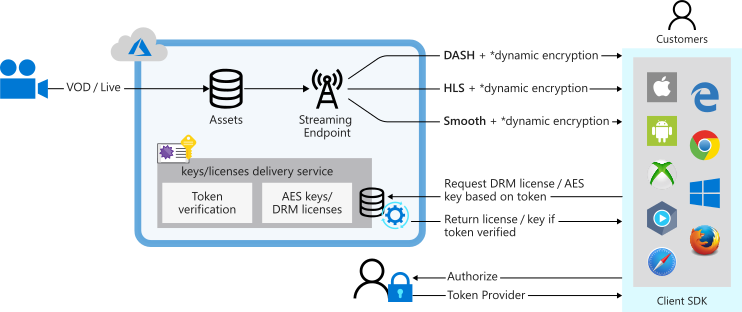

# Protect your content with Media Services dynamic encryption

Use Azure Media Services to help secure your media from the time it leaves your computer all the way through storage, processing, and delivery. With Media Services, you can deliver your live and on-demand content encrypted dynamically with Advanced Encryption Standard (AES-128) or any of the three major digital rights management (DRM) systems: Microsoft PlayReady, Google Widevine, and Apple FairPlay. Media Services also provides a service for delivering AES keys and DRM (PlayReady, Widevine, and FairPlay) licenses to authorized clients.  

In Media Services v3, a content key is associated with Streaming Locator (see [this example](protect-with-aes128.md)). If using the Media Services key delivery service, you can let Azure Media Services generate the content key for you. The content key should be generated yourself if you're using you own key delivery service, or if you need to handle a high availability scenario where you need to have the same content key in two data centers.

When a stream is requested by a player, Media Services uses the specified key to dynamically encrypt your content by using AES clear key or DRM encryption. To decrypt the stream, the player requests the key from Media Services key delivery service or the key delivery service you specified. To decide if the user is authorized to get the key, the service evaluates the content key policy that you specified for the key.

You can use the REST API, or a Media Services client library to configure authorization and authentication policies for your licenses and keys.

The following image illustrates the workflow for Media Services content protection:


  
&#42; *Dynamic encryption supports AES-128 clear key, CBCS, and CENC. For details, see the [support matrix](#streaming-protocols-and-encryption-types).*

This article explains concepts and terminology that help you understand content protection with Media Services.

## Main components of a content protection system

To successfully complete your content protection system, you need to fully understand the scope of the effort. The following sections give an overview of three parts that you need to implement.

> [!NOTE]
> We highly recommended that you focus and fully test each part in the following sections before you move on to the next part. To test your content protection system, use the tools specified in the sections.

### Media Services code
  
The [DRM sample](https://github.com/Azure-Samples/media-services-v3-dotnet-tutorials/blob/master/AMSV3Tutorials/EncryptWithDRM/Program.cs) shows you how to implement a multi-DRM system with Media Services v3 by using .NET. It also shows how to use the Media Services license/key delivery service.
  
You can encrypt each asset with multiple encryption types (AES-128, PlayReady, Widevine, FairPlay). To see what makes sense to combine, see [Streaming protocols and encryption types](#streaming-protocols-and-encryption-types).

The example shows how to:

1. Create and configure a [content key policy](content-key-policy-concept.md).

   You create a content key policy to configure how the content key (which provides secure access to your assets) is delivered to end clients:  

   * Define license delivery authorization. Specify the logic of the authorization check based on claims in JSON Web Token (JWT).
   * Configure [PlayReady](playready-license-template-overview.md), [Widevine](widevine-license-template-overview.md), and/or [FairPlay](fairplay-license-overview.md) licenses. The templates let you configure rights and permissions for each of the DRMs.

     ```
     ContentKeyPolicyPlayReadyConfiguration playReadyConfig = ConfigurePlayReadyLicenseTemplate();
     ContentKeyPolicyWidevineConfiguration widevineConfig = ConfigureWidevineLicenseTempate();
     ContentKeyPolicyFairPlayConfiguration fairPlayConfig = ConfigureFairPlayPolicyOptions();
     ```

2. Create a [streaming locator](streaming-locators-concept.md) that's configured to stream the encrypted asset.
  
   The streaming locator has to be associated with a [streaming policy](streaming-policy-concept.md). In the example, we set `StreamingLocator.StreamingPolicyName` to the "Predefined_MultiDrmCencStreaming" policy.

   The PlayReady and Widevine encryptions are applied, and the key is delivered to the playback client based on the configured DRM licenses. If you also want to encrypt your stream with CBCS (FairPlay), use the "Predefined_MultiDrmStreaming" policy.

   The streaming locator is also associated with the content key policy that you defined.

3. Create a test token.

   The `GetTokenAsync` method shows how to create a test token.
4. Build the streaming URL.

   The `GetDASHStreamingUrlAsync` method shows how to build the streaming URL. In this case, the URL streams the DASH content.

### Player with an AES or DRM client

A video player app based on a player SDK (either native or browser-based) needs to meet the following requirements:

* The player SDK supports the needed DRM clients.
* The player SDK supports the required streaming protocols: Smooth, DASH, and/or HTTP Live Streaming (HLS).
* The player SDK can handle passing a JWT token in a license acquisition request.

You can create a player by using the [Azure Media Player API](https://amp.azure.net/libs/amp/latest/docs/). Use the [Azure Media Player ProtectionInfo API](https://amp.azure.net/libs/amp/latest/docs/) to specify which DRM technology to use on different DRM platforms.

For testing AES or CENC (Widevine and/or PlayReady) encrypted content, you can use [Azure Media Player](https://aka.ms/azuremediaplayer). Make sure that you select **Advanced options** and check your encryption options.

If you want to test FairPlay encrypted content, use [this test player](https://aka.ms/amtest). The player supports Widevine, PlayReady, and FairPlay DRMs, along with AES-128 clear key encryption.

Choose the right browser to test different DRMs:

* Chrome, Opera, or Firefox for Widevine.
* Microsoft Edge or Internet Explorer 11 for PlayReady.
* Safari on macOS for FairPlay.

### Security token service

A security token service (STS) issues JWT as the access token for back-end resource access. You can use the Azure Media Services license/key delivery service as the back-end resource. An STS has to define the following things:

* Issuer and audience (or scope).
* Claims, which are dependent on business requirements in content protection.
* Symmetric or asymmetric verification for signature verification.
* Key rollover support (if necessary).

You can use [this STS tool](https://openidconnectweb.azurewebsites.net/DRMTool/Jwt) to test the STS. It supports all three types of verification keys: symmetric, asymmetric, or Azure Active Directory (Azure AD) with key rollover.

## Streaming protocols and encryption types

You can use Media Services to deliver your content encrypted dynamically with AES clear key or DRM encryption by using PlayReady, Widevine, or FairPlay. Currently, you can encrypt the HLS, MPEG DASH, and Smooth Streaming formats. Each protocol supports the following encryption methods.

### HLS

The HLS protocol supports the following container formats and encryption schemes:

|Container format|Encryption scheme|URL example|
|---|---|---|
|All|AES|`https://amsv3account-usw22.streaming.media.azure.net/00000000-0000-0000-0000-000000000000/ignite.ism/manifest(format=m3u8-aapl,encryption=cbc)`|
|MPG2-TS |CBCS (FairPlay) |`https://amsv3account-usw22.streaming.media.azure.net/00000000-0000-0000-0000-000000000000/ignite.ism/manifest(format=m3u8-aapl,encryption=cbcs-aapl)`|
|CMAF(fmp4) |CBCS (FairPlay) |`https://amsv3account-usw22.streaming.media.azure.net/00000000-0000-0000-0000-000000000000/ignite.ism/manifest(format=m3u8-cmaf,encryption=cbcs-aapl)`|
|MPG2-TS |CENC (PlayReady) |`https://amsv3account-usw22.streaming.media.azure.net/00000000-0000-0000-0000-000000000000/ignite.ism/manifest(format=m3u8-aapl,encryption=cenc)`|
|CMAF(fmp4) |CENC (PlayReady) |`https://amsv3account-usw22.streaming.media.azure.net/00000000-0000-0000-0000-000000000000/ignite.ism/manifest(format=m3u8-cmaf,encryption=cenc)`|

HLS/CMAF + FairPlay (including HEVC/H.265) is supported on the following devices:

* iOS 11 or later.
* iPhone 8 or later.
* MacOS High Sierra with Intel 7th Generation CPU.

### MPEG-DASH

The MPEG-DASH protocol supports the following container formats and encryption schemes:

|Container format|Encryption scheme|URL Examples
|---|---|---|
|All|AES|`https://amsv3account-usw22.streaming.media.azure.net/00000000-0000-0000-0000-000000000000/ignite.ism/manifest(format=mpd-time-csf,encryption=cbc)`|
|CSF(fmp4) |CENC (Widevine + PlayReady) |`https://amsv3account-usw22.streaming.media.azure.net/00000000-0000-0000-0000-000000000000/ignite.ism/manifest(format=mpd-time-csf,encryption=cenc)`|
|CMAF(fmp4)|CENC (Widevine + PlayReady)|`https://amsv3account-usw22.streaming.media.azure.net/00000000-0000-0000-0000-000000000000/ignite.ism/manifest(format=mpd-time-cmaf,encryption=cenc)`|

### Smooth Streaming

The Smooth Streaming protocol supports the following container formats and encryption schemes.

|Protocol|Container format|Encryption scheme|
|---|---|---|
|fMP4|AES|`https://amsv3account-usw22.streaming.media.azure.net/00000000-0000-0000-0000-000000000000/ignite.ism/manifest(encryption=cbc)`|
|fMP4 | CENC (PlayReady) |`https://amsv3account-usw22.streaming.media.azure.net/00000000-0000-0000-0000-000000000000/ignite.ism/manifest(encryption=cenc)`|

### Browsers

Common browsers support the following DRM clients:

|Browser|Encryption|
|---|---|
|Chrome|Widevine|
|Microsoft Edge, Internet Explorer 11|PlayReady|
|Firefox|Widevine|
|Opera|Widevine|
|Safari|FairPlay|

## Controlling content access

You can control who has access to your content by configuring the content key policy. Media Services supports multiple ways of authorizing users who make key requests. The client (player) must meet the policy before the key can be delivered to the client. The content key policy can have *open* or *token* restriction.

An open-restricted content key policy may be used when you want to issue license to anyone without authorization. For example, if your revenue is ad-based and not subscription-based.  

With a token-restricted content key policy, the content key is sent only to a client that presents a valid JWT token or a simple web token (SWT) in the license/key request. This token must be issued by an STS.

You can use Azure AD as an STS or deploy a [custom STS](#using-a-custom-sts). The STS must be configured to create a token signed with the specified key and issue claims that you specified in the token restriction configuration. The Media Services license/key delivery service returns the requested license or key to the client if both of these conditions exist:

* The token is valid.
* The claims in the token match those configured for the license or key.

When you configure the token-restricted policy, you must specify the primary verification key, issuer, and audience parameters. The primary verification key contains the key that the token was signed with. The issuer is the STS that issues the token. The audience, sometimes called scope, describes the intent of the token or the resource that the token authorizes access to. The Media Services license/key delivery service validates that these values in the token match the values in the template.

### Token replay prevention

The *Token Replay Prevention* feature allows Media Services customers to set a limit on how many times the same token can be used to request a key or a license. The customer can add a claim of type `urn:microsoft:azure:mediaservices:maxuses` in the token, where the value is the number of times the token can be used to acquire a license or key. All subsequent requests with the same token to Key Delivery will return an unauthorized response. See how to add the claim in the [DRM sample](https://github.com/Azure-Samples/media-services-v3-dotnet-tutorials/blob/master/AMSV3Tutorials/EncryptWithDRM/Program.cs#L601).
 
#### Considerations

* Customers must have control over token generation. The claim needs to be placed in the token itself.
* When using this feature, requests with tokens whose expiry time is more than one hour away from the time the request is received are rejected with an unauthorized response.
* Tokens are uniquely identified by their signature. Any change to the payload (for example, update to the expiry time or the claim) changes the signature of the token and it will count as a new token that Key Delivery hasn't come across before.
* Playback fails if the token has exceeded the `maxuses` value set by the customer.
* This feature can be used for all existing protected content (only the token issued needs to be changed).
* This feature works with both JWT and SWT.

## Using a custom STS

A customer might choose to use a custom STS to provide tokens. Reasons include:

* The identity provider (IDP) used by the customer doesn't support STS. In this case, a custom STS might be an option.
* The customer might need more flexible or tighter control to integrate STS with the customer's subscriber billing system.

   For example, an [OTT](https://en.wikipedia.org/wiki/Over-the-top_media_services) service operator might offer multiple subscriber packages, such as premium, basic, and sports. The operator might want to match the claims in a token with a subscriber's package so that only the contents in a specific package are made available. In this case, a custom STS provides the needed flexibility and control.

* To include custom claims in the token to select between different ContentKeyPolicyOptions with different DRM license parameters (a subscription license versus a rental license).
* To include a claim representing the content key identifier of the key that the token grants access to.

When you use a custom STS, two changes must be made:

* When you configure license delivery service for an asset, you need to specify the security key used for verification by the custom STS instead of the current key from Azure AD.
* When a JTW token is generated, a security key is specified instead of the private key of the current X509 certificate in Azure AD.

There are two types of security keys:

* Symmetric key: The same key is used to generate and to verify a JWT.
* Asymmetric key: A public-private key pair in an X509 certificate is used with a private key to encrypt/generate a JWT and with the public key to verify the token.

If you use .NET Framework/C# as your development platform, the X509 certificate used for an asymmetric security key must have a key length of at least 2048. This key length is a requirement of the class System.IdentityModel.Tokens.X509AsymmetricSecurityKey in .NET Framework. Otherwise, the following exception is thrown: IDX10630: The 'System.IdentityModel.Tokens.X509AsymmetricSecurityKey' for signing can't be smaller than '2048' bits.

## Custom key and license acquisition URL

Use the following templates if you want to specify a different license/key delivery service (not Media Services). The two replaceable fields in the templates are there so that you can share your streaming policy across many assets instead of creating a streaming policy per asset. 

* `EnvelopeEncryption.CustomKeyAcquisitionUrlTemplate`: Template for the URL of the custom service that delivers keys to end-user players. It isn't required when you're using Azure Media Services for issuing keys. 

   The template supports replaceable tokens that the service will update at runtime with the value specific to the request.  The currently supported token values are:
   * `{AlternativeMediaId}`, which is replaced with the value of StreamingLocatorId.AlternativeMediaId.
   * `{ContentKeyId}`, which is replaced with the value of the identifier of the requested key.
* `StreamingPolicyPlayReadyConfiguration.CustomLicenseAcquisitionUrlTemplate`: Template for the URL of the custom service that delivers licenses to end-user players. It isn't required when you're using Azure Media Services for issuing licenses.

   The template supports replaceable tokens that the service will update at runtime with the value specific to the request. The currently supported token values are:  
   * `{AlternativeMediaId}`, which is replaced with the value of StreamingLocatorId.AlternativeMediaId.
   * `{ContentKeyId}`, which is replaced with the value of the identifier of the requested key. 
* `StreamingPolicyWidevineConfiguration.CustomLicenseAcquisitionUrlTemplate`: Same as the previous template, only for Widevine. 
* `StreamingPolicyFairPlayConfiguration.CustomLicenseAcquisitionUrlTemplate`: Same as the previous template, only for FairPlay.  

For example:

```csharp
streamingPolicy.EnvelopEncryption.customKeyAcquisitionUrlTemplate = "https://mykeyserver.hostname.com/envelopekey/{AlternativeMediaId}/{ContentKeyId}";
```

`ContentKeyId` has a value of the requested key. You can use `AlternativeMediaId` if you want to map the request to an entity on your side. For example, `AlternativeMediaId` can be used to help you look up permissions.

For REST examples that use custom license/key acquisition URLs, see [Streaming Policies - Create](https://docs.microsoft.com/rest/api/media/streamingpolicies/create).

> [!NOTE]
> Widevine is a service provided by Google Inc. and subject to the terms of service and Privacy Policy of Google, Inc.

## Troubleshoot

If you get the `MPE_ENC_ENCRYPTION_NOT_SET_IN_DELIVERY_POLICY` error, make sure that you specify the appropriate streaming policy.

If you get errors that end with `_NOT_SPECIFIED_IN_URL`, make sure that you specify the encryption format in the URL. An example is `…/manifest(format=m3u8-cmaf,encryption=cbcs-aapl)`. See [Streaming protocols and encryption types](#streaming-protocols-and-encryption-types).

## Ask questions, give feedback, get updates

Check out the [Azure Media Services community](media-services-community.md) article to see different ways you can ask questions, give feedback, and get updates about Media Services.

## Next steps

* [Protect with AES encryption](protect-with-aes128.md)
* [Protect with DRM](protect-with-drm.md)
* [Design multi-DRM content protection system with access control](design-multi-drm-system-with-access-control.md)
* [Storage side encryption](storage-account-concept.md#storage-side-encryption)
* [Frequently asked questions](frequently-asked-questions.md)
* [JSON Web Token Handler](https://docs.microsoft.com/dotnet/framework/security/json-web-token-handler)
