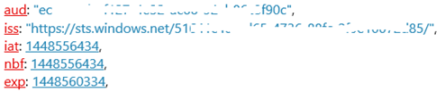
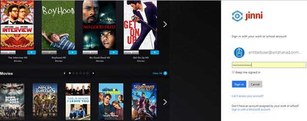
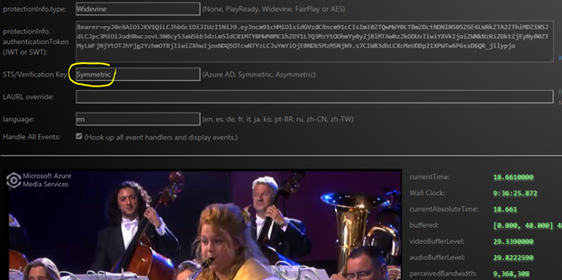
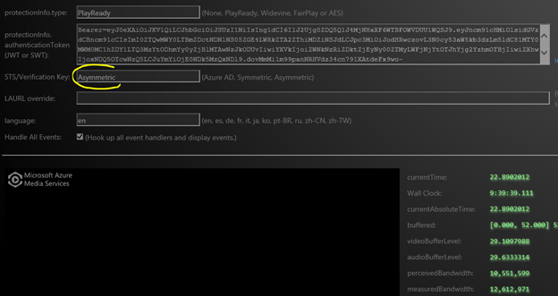

# Design of a multi-DRM content protection system with access control 

Designing and building a Digital Rights Management (DRM) subsystem for an over-the-top (OTT) or online streaming solution is a complex task. Operators/online video providers typically outsource this task to specialized DRM service providers. The goal of this document is to present a reference design and a reference implementation of an end-to-end DRM subsystem in an OTT or online streaming solution.

The targeted readers for this document are engineers who work in DRM subsystems of OTT or online streaming/multiscreen solutions or readers who are interested in DRM subsystems. The assumption is that readers are familiar with at least one of the DRM technologies on the market, such as PlayReady, Widevine, FairPlay, or Adobe Access.

In this discussion, by multi-DRM we include the 3 DRMs supported by Azure Media Services: Common Encryption (CENC) for PlayReady and Widevine, FairPlay as well as AES-128 clear key encryption. A major trend in online streaming and the OTT industry is to use native DRMs on various client platforms. This trend is a shift from the previous one that used a single DRM and its client SDK for various client platforms. When you use CENC with multi-native DRM, both PlayReady and Widevine are encrypted per the [Common Encryption (ISO/IEC 23001-7 CENC)](https://www.iso.org/iso/home/store/catalogue_ics/catalogue_detail_ics.htm?csnumber=65271/) specification.

The benefits of using native multi-DRM for content protection are that it:

* Reduces encryption cost because a single encryption process is used to target different platforms with its native DRMs.
* Reduces the cost of managing assets because only a single copy of asset is needed in storage.
* Eliminates DRM client licensing cost because the native DRM client is usually free on its native platform.

### Goals of the article

The goals of this article are to:

* Provide a reference design of a DRM subsystem that uses all 3 DRMs (CENC for DASH, FairPlay for HLS and PlayReady for smooth streaming).
* Provide a reference implementation on Azure and Azure Media Services platform.
* Discuss some design and implementation topics.

The following table summarizes native DRM support on different platforms and EME support in different browsers.

| **Client platform** | **Native DRM** | **EME** |
| --- | --- | --- |
| **Smart TVs, STBs** | PlayReady, Widevine, and/or other | Embedded browser/EME for PlayReady and/or Widevine|
| **Windows 10** | PlayReady | Microsoft Edge/IE11 for PlayReady|
| **Android devices (phone, tablet, TV)** |Widevine |Chrome for Widevine |
| **iOS** | FairPlay | Safari for FairPlay (since iOS 11.2) |
| **macOS** | FairPlay | Safari for FairPlay (since Safari 9+ on Mac OS X 10.11+ El Capitan)|
| **tvOS** | FairPlay | |

Considering the current state of deployment for each DRM, a service typically wants to implement two or three DRMs to make sure you address all the types of endpoints in the best way.

There is a tradeoff between the complexity of the service logic and the complexity on the client side to reach a certain level of user experience on the various clients.

To make your selection, keep in mind:

* PlayReady is natively implemented in every Windows device, on some Android devices, and available through software SDKs on virtually any platform.
* Widevine is natively implemented in every Android device, in Chrome, and in some other devices. Widevine is also supported in Firefox and Opera browsers over DASH.
* FairPlay is available on iOS, macOS and tvOS.

## A reference design
This section presents a reference design that is agnostic to the technologies used to implement it.

A DRM subsystem can contain the following components:

* Key management
* DRM encryption packaging
* DRM license delivery
* Entitlement check/access control
* User authentication/authorization
* Player app
* Origin/content delivery network (CDN)

The following diagram illustrates the high-level interaction among the components in a DRM subsystem:

The design has three basic layers:

* A back-office layer (black) is not exposed externally.
* A DMZ layer (dark blue) contains all the endpoints that face the public.
* A public internet layer (light blue) contains the CDN and players with traffic across the public internet.

There also should be a content management tool to control DRM protection, regardless of whether it's static or dynamic encryption. The inputs for DRM encryption include:

* MBR video content
* Content key
* License acquisition URLs

Here's the high-level flow during playback time:

* The user is authenticated.
* An authorization token is created for the user.
* DRM protected content (manifest) is downloaded to the player.
* The player submits a license acquisition request to license servers together with a key ID and an authorization token.

The following section discusses the design of key management.

| **ContentKey-to-asset** | **Scenario** |
| --- | --- |
| 1-to-1 |The simplest case. It provides the finest control. But this arrangement generally results in the highest license delivery cost. At minimum, one license request is required for each protected asset. |
| 1-to-many |You could use the same content key for multiple assets. For example, for all the assets in a logical group, such as a genre or the subset of a genre (or movie gene), you can use a single content key. |
| Many-to-1 |Multiple content keys are needed for each asset.   For example, if you need to apply dynamic CENC protection with multi-DRM for MPEG-DASH and dynamic AES-128 encryption for HLS, you need two separate content keys. Each content key needs its own ContentKeyType. (For the content key used for dynamic CENC protection, use ContentKeyType.CommonEncryption. For the content key used for dynamic AES-128 encryption, use ContentKeyType.EnvelopeEncryption.)  As another example, in CENC protection of DASH content, in theory, you can use one content key to protect the video stream and another content key to protect the audio stream. |
| Many-to-many |Combination of the previous two scenarios. One set of content keys is used for each of the multiple assets in the same asset group. |

Another important factor to consider is the use of persistent and nonpersistent licenses.

Why are these considerations important?

If you use a public cloud for license delivery, persistent and nonpersistent licenses have a direct impact on license delivery cost. The following two different design cases serve to illustrate:

* Monthly subscription: Use a persistent license and 1-to-many content key-to-asset mapping. For example, for all the kids' movies, we use a single content key for encryption. In this case:

    Total number of licenses requested for all kids' movies/device = 1

* Monthly subscription: Use a nonpersistent license and 1-to-1 mapping between content key and asset. In this case:

    Total number of licenses requested for all kids' movies/device = [number of movies watched] x [number of sessions]

The two different designs result in very different license request patterns. The different patterns result in different license delivery cost if license delivery service is provided by a public cloud such as Media Services.

## Map design to technology for implementation
Next, the generic design is mapped to technologies on the Azure/Media Services platform by specifying which technology to use for each building block.

The following table shows the mapping.

| **Building block** | **Technology** |
| --- | --- |
| **Player** |[Azure Media Player](https://azure.microsoft.com/services/media-services/media-player/) |
| **Identity Provider (IDP)** |Azure Active Directory (Azure AD) |
| **Secure Token Service (STS)** |Azure AD |
| **DRM protection workflow** |Azure Media Services dynamic protection |
| **DRM license delivery** |* Media Services license delivery (PlayReady, Widevine, FairPlay)  * Axinom license server  * Custom PlayReady license server |
| **Origin** |Azure Media Services streaming endpoint |
| **Key management** |Not needed for reference implementation |
| **Content management** |A C# console application |

In other words, both IDP and STS are provided by Azure AD. The [Azure Media Player API](https://amp.azure.net/libs/amp/latest/docs/) is used for the player. Both Azure Media Services and Azure Media Player support CENC over DASH, FairPlay over HLS, PlayReady over smooth streaming, and AES-128 encryption for DASH, HLS and smooth.

The following diagram shows the overall structure and flow with the previous technology mapping:

To set up DRM content protection, the content management tool uses the following inputs:

* Open content
* Content key from key management
* License acquisition URLs
* A list of information from Azure AD, such as audience, issuer, and token claims

Here's the output of the content management tool:

* ContentKeyPolicy describes DRM license template for each kind of DRM used;
* ContentKeyPolicyRestriction describes the access control before a DRM license is issued
* Streamingpolicy describes the various combinations of DRM - encryption mode - streaming protocol - container format, for streaming
* StreamingLocator describes content key/IV used for encryption, and streaming URLs 

Here's the flow during runtime:

* Upon user authentication, a JWT is generated.
* One of the claims contained in the JWT is a groups claim that contains the group object ID EntitledUserGroup. This claim is used to pass the entitlement check.
* The player downloads the client manifest of CENC-protected content and identifies the following:
   * Key ID.
   * The content is DRM protected.
   * License acquisition URLs.
* The player makes a license acquisition request based on the browser/DRM supported. In the license acquisition request, the key ID and the JWT are also submitted. The license delivery service verifies the JWT and the claims contained before it issues the needed license.

## Implementation
### Implementation procedures
Implementation includes the following steps:

1. Prepare test assets. Encode/package a test video to multi-bitrate fragmented MP4 in Media Services. This asset is *not* DRM protected. DRM protection is done by dynamic protection later.

2. Create a key ID and a content key (optionally from a key seed). In this instance, the key management system isn't needed because only a single key ID and content key are required for a couple of test assets.

3. Use the Media Services API to configure multi-DRM license delivery services for the test asset. If you use custom license servers by your company or your company's vendors instead of license services in Media Services, you can skip this step. You can specify license acquisition URLs in the step when you configure license delivery. The Media Services API is needed to specify some detailed configurations, such as authorization policy restriction and license response templates for different DRM license services. At this time, the Azure portal doesn't provide the needed UI for this configuration. For API-level information and sample code, see [Use PlayReady and/or Widevine dynamic common encryption](protect-with-drm.md).

4. Use the Media Services API to configure the asset delivery policy for the test asset. For API-level information and sample code, see [Use PlayReady and/or Widevine dynamic common encryption](protect-with-drm.md).

5. Create and configure an Azure AD tenant in Azure.

6. Create a few user accounts and groups in your Azure AD tenant. Create at least an "Entitled User" group, and add a user to this group. Users in this group pass the entitlement check in license acquisition. Users not in this group fail to pass the authentication check and can't acquire a license. Membership in this "Entitled User" group is a required groups claim in the JWT issued by Azure AD. You specify this claim requirement in the step when you configure multi-DRM license delivery services.

7. Create an ASP.NET MVC app to host your video player. This ASP.NET app is protected with user authentication against the Azure AD tenant. Proper claims are included in the access tokens obtained after user authentication. We recommend OpenID Connect API for this step. Install the following NuGet packages:

   * Install-Package Microsoft.Azure.ActiveDirectory.GraphClient
   * Install-Package Microsoft.Owin.Security.OpenIdConnect
   * Install-Package Microsoft.Owin.Security.Cookies
   * Install-Package Microsoft.Owin.Host.SystemWeb
   * Install-Package Microsoft.IdentityModel.Clients.ActiveDirectory

8. Create a player by using the [Azure Media Player API](https://amp.azure.net/libs/amp/latest/docs/). Use the [Azure Media Player ProtectionInfo API](https://amp.azure.net/libs/amp/latest/docs/) to specify which DRM technology to use on different DRM platforms.

9. The following table shows the test matrix.

    | **DRM** | **Browser** | **Result for entitled user** | **Result for unentitled user** |
    | --- | --- | --- | --- |
    | **PlayReady** |Microsoft Edge or Internet Explorer 11 on Windows 10 |Succeed |Fail |
    | **Widevine** |Chrome, Firefox, Opera |Succeed |Fail |
    | **FairPlay** |Safari on macOS      |Succeed |Fail |
    | **AES-128** |Most modern browsers  |Succeed |Fail |

For information on how to set up Azure AD for an ASP.NET MVC player app, see [Integrate an Azure Media Services OWIN MVC-based app with Azure Active Directory and restrict content key delivery based on JWT claims](http://gtrifonov.com/2015/01/24/mvc-owin-azure-media-services-ad-integration/).

For more information, see [JWT token authentication in Azure Media Services and dynamic encryption](http://gtrifonov.com/2015/01/03/jwt-token-authentication-in-azure-media-services-and-dynamic-encryption/).  

For information on Azure AD:

* You can find developer information in the [Azure Active Directory developer's guide](../../active-directory/develop/v1-overview.md).
* You can find administrator information in [Administer your Azure AD tenant directory](../../active-directory/fundamentals/active-directory-administer.md).

### Some issues in implementation

Use the following troubleshooting information for help with implementation issues.

* The issuer URL must end with "/". The audience must be the player application client ID. Also, add "/" at the end of the issuer URL.

        <add key="ida:audience" value="[Application Client ID GUID]" />
        <add key="ida:issuer" value="https://sts.windows.net/[AAD Tenant ID]/" />

    In the [JWT Decoder](http://jwt.calebb.net/), you see **aud** and **iss**, as shown in the JWT:

    

* Add permissions to the application in Azure AD on the **Configure** tab of the application. Permissions are required for each application, both local and deployed versions.

    

* Use the correct issuer when you set up dynamic CENC protection.

        <add key="ida:issuer" value="https://sts.windows.net/[AAD Tenant ID]/"/>

    The following doesn't work:

        <add key="ida:issuer" value="https://willzhanad.onmicrosoft.com/" />

    The GUID is the Azure AD tenant ID. The GUID can be found in the **Endpoints** pop-up menu in the Azure portal.

* Grant group membership claims privileges. Make sure the following is in the Azure AD application manifest file: 

    "groupMembershipClaims": "All"    (the default value is null)

* Set the proper TokenType when you create restriction requirements.

        objTokenRestrictionTemplate.TokenType = TokenType.JWT;

    Because you add support for JWT (Azure AD) in addition to SWT (ACS), the default TokenType is TokenType.JWT. If you use SWT/ACS, you must set the token to TokenType.SWT.

## The completed system and test

This section walks you through the following scenarios in the completed end-to-end system so that you can have a basic picture of the behavior before you get a sign-in account:

* If you need a non-integrated scenario:

    * For video assets hosted in Media Services that are either unprotected or DRM protected but without token authentication (issuing a license to whoever requested it), you can test it without signing in. Switch to HTTP if your video streaming is over HTTP.

* If you need an end-to-end integrated scenario:

    * For video assets under dynamic DRM protection in Media Services, with the token authentication and JWT generated by Azure AD, you need to sign in.

For the player web application and its sign-in, see [this website](https://openidconnectweb.azurewebsites.net/).

### User sign-in
To test the end-to-end integrated DRM system, you need to have an account created or added.

What account?

Although Azure originally allowed access only by Microsoft account users, access is now allowed by users from both systems. All Azure properties now trust Azure AD for authentication, and Azure AD authenticates organizational users. A federation relationship was created where Azure AD trusts the Microsoft account consumer identity system to authenticate consumer users. As a result, Azure AD can authenticate guest Microsoft accounts as well as native Azure AD accounts.

Because Azure AD trusts the Microsoft account domain, you can add any accounts from any of the following domains to the custom Azure AD tenant and use the account to sign in:

| **Domain name** | **Domain** |
| --- | --- |
| **Custom Azure AD tenant domain** |somename.onmicrosoft.com |
| **Corporate domain** |microsoft.com |
| **Microsoft account domain** |outlook.com, live.com, hotmail.com |

You can contact any of the authors to have an account created or added for you.

The following screenshots show different sign-in pages used by different domain accounts:

**Custom Azure AD tenant domain account**: The customized sign-in page of the custom Azure AD tenant domain.

**Microsoft domain account with smart card**: The sign-in page customized by Microsoft corporate IT with two-factor authentication.

**Microsoft account**: The sign-in page of the Microsoft account for consumers.

### Use Encrypted Media Extensions for PlayReady

On a modern browser with Encrypted Media Extensions (EME) for PlayReady support, such as Internet Explorer 11 on Windows 8.1 or later and Microsoft Edge browser on Windows 10, PlayReady is the underlying DRM for EME.

The dark player area is because PlayReady protection prevents you from making a screen capture of protected video.

The following screenshot shows the player plug-ins and Microsoft Security Essentials (MSE)/EME support:

EME in Microsoft Edge and Internet Explorer 11 on Windows 10 allows [PlayReady SL3000](https://www.microsoft.com/playready/features/EnhancedContentProtection.aspx/) to be invoked on Windows 10 devices that support it. PlayReady SL3000 unlocks the flow of enhanced premium content (4K, HDR) and new content delivery models (for enhanced content).

To focus on the Windows devices, PlayReady is the only DRM in the hardware available on Windows devices (PlayReady SL3000). A streaming service can use PlayReady through EME or through a Universal Windows Platform application and offer a higher video quality by using PlayReady SL3000 than another DRM. Typically, content up to 2K flows through Chrome or Firefox, and content up to 4K flows through Microsoft Edge/Internet Explorer 11 or a Universal Windows Platform application on the same device. The amount depends on service settings and implementation.

#### Use EME for Widevine

On a modern browser with EME/Widevine support, such as Chrome 41+ on Windows 10, Windows 8.1, Mac OSX Yosemite, and Chrome on Android 4.4.4, Google Widevine is the DRM behind EME.

Widevine doesn't prevent you from making a screen capture of protected video.

#### Use EME for FairPlay

Similarly, you can test FairPlay protected content in this test player in Safari on macOS or iOS 11.2 and later.

Make sure you put "FairPlay" as protectionInfo.type and put in the right URL for your Application Certificate in FPS AC Path (FairPlay Streaming Application Certificate Path).

### Unentitled users

If a user isn't a member of the "Entitled Users" group, the user doesn't pass the entitlement check. The multi-DRM license service then refuses to issue the requested license as shown. The detailed description is "License acquire failed," which is as designed.

### Run a custom security token service

If you run a custom STS, the JWT is issued by the custom STS by using either a symmetric or an asymmetric key.

The following screenshot shows a scenario that uses a symmetric key (using Chrome):

The following screenshot shows a scenario that uses an asymmetric key via an X509 certificate (using a Microsoft modern browser):

In both of the previous cases, user authentication stays the same. It takes place through Azure AD. The only difference is that JWTs are issued by the custom STS instead of Azure AD. When you configure dynamic CENC protection, the license delivery service restriction specifies the type of JWT, either a symmetric or an asymmetric key.

## Next steps

* [Frequently asked questions](frequently-asked-questions.md)
* [Content protection overview](content-protection-overview.md)
* [Protect your content with DRM](protect-with-drm.md)
