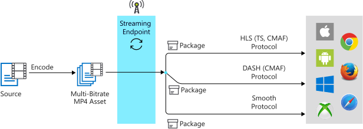

# Dynamic packaging in Media Services v3

Microsoft Azure Media Services can be used to encode many media source file formats. It delivers them via different streaming protocols, with or without content protection, to reach all major devices (like iOS and Android devices). These clients understand different protocols. For example, iOS requires streams to be delivered in HTTP Live Streaming (HLS) format and Android devices support HLS as well as MPEG DASH.

In Media Services, a [streaming endpoint](streaming-endpoint-concept.md) (origin) represents a dynamic (just-in-time) packaging and origin service that can deliver your live and on-demand content directly to a client player app. It uses one of the common streaming media protocols mentioned in the following section. *Dynamic packaging* is a feature that comes standard on all streaming endpoints (Standard or Premium).

> [!NOTE]
> You can use the [Azure portal](https://portal.azure.com/) to manage v3 [live events](live-events-outputs-concept.md), view v3 [assets](assets-concept.md), get info about accessing APIs. For all other management tasks (for example, transforms and jobs), use the [REST API](https://docs.microsoft.com/rest/api/media/), [CLI](https://aka.ms/ams-v3-cli-ref), or one of the supported [SDKs](media-services-apis-overview.md#sdks).

## To prepare your source files for delivery

To take advantage of dynamic packaging, you need to [encode](encoding-concept.md) your mezzanine (source) file into a set of multiple bitrate MP4 (ISO Base Media 14496-12) files. You need to have an [asset](assets-concept.md) with the encoded MP4 and streaming configuration files needed by Media Services dynamic packaging. From this set of MP4 files, you can use dynamic packaging to deliver video via the streaming media protocols described below.

> [!TIP]
> One way to get the MP4 and streaming configuration files is to [encode your mezzanine file with Media Services](#encode-to-adaptive-bitrate-mp4s). 

To make videos in the encoded asset available to clients for playback, you have to create a [Streaming Locator](streaming-locators-concept.md) and build streaming URLs. Then, based on the specified format in the streaming client manifest (HLS, MPEG DASH, or Smooth Streaming), you receive the stream in the protocol you've chosen.

As a result, you only need to store and pay for the files in single storage format and Media Services service will build and serve the appropriate response based on requests from a client.

If you plan to protect your content by using Media Services dynamic encryption, see [Streaming protocols and encryption types](content-protection-overview.md#streaming-protocols-and-encryption-types).

### HLS protocol

Your streaming client can specify the following HLS formats:

|Protocol|Example|
|---|---|
|HLS V4	|`https://amsv3account-usw22.streaming.media.azure.net/21b17732-0112-4d76-b526-763dcd843449/ignite.ism/manifest(format=m3u8-aapl)`||
|HLS V3	|`https://amsv3account-usw22.streaming.media.azure.net/21b17732-0112-4d76-b526-763dcd843449/ignite.ism/manifest(format=m3u8-aapl-v3)`||
|HLS CMAF| `https://amsv3account-usw22.streaming.media.azure.net/21b17732-0112-4d76-b526-763dcd843449/ignite.ism/manifest(format=m3u8-cmaf)`||

### MPEG-DASH protocol

Your streaming client can specify the following MPEG-DASH formats:

|Protocol|Example|
|---|---|
|MPEG-DASH CSF| `https://amsv3account-usw22.streaming.media.azure.net/21b17732-0112-4d76-b526-763dcd843449/ignite.ism/manifest(format=mpd-time-csf)` ||
|MPEG-DASH CMAF|`https://amsv3account-usw22.streaming.media.azure.net/21b17732-0112-4d76-b526-763dcd843449/ignite.ism/manifest(format=mpd-time-cmaf)` ||

### Smooth Streaming protocol

Your streaming client can specify the following Smooth Streaming formats:

|Protocol|Notes/examples| 
|---|---|
|Smooth Streaming| `https://amsv3account-usw22.streaming.media.azure.net/21b17732-0112-4d76-b526-763dcd843449/ignite.ism/manifest`||
|Smooth Streaming 2.0 (legacy manifest)|By default, Smooth Streaming manifest format contains the repeat tag (r-tag). However, some players do not support the `r-tag`. Clients with these players can use a format that disables the r-tag:<br/><br/>`https://amsv3account-usw22.streaming.media.azure.net/21b17732-0112-4d76-b526-763dcd843449/ignite.ism/manifest(format=fmp4-v20)`|

> [!NOTE]
> Smooth Streaming requires that both audio and video should be present in your stream.

## On-demand streaming workflow

The following steps show a common Media Services streaming workflow where dynamic packaging is used along with the Standard Encoder in Azure Media Services.

1. Upload an input file such as a QuickTime/MOV or MXF file. This file is also referred to as the mezzanine or source file. For the list of supported formats, see [Formats Supported by the Standard Encoder](media-encoder-standard-formats.md).
1. [Encode](#encode-to-adaptive-bitrate-mp4s) your mezzanine file into an H.264/AAC MP4 adaptive bitrate set.
1. Publish the output asset that contains the adaptive bitrate MP4 set. You publish by creating a [streaming locator](streaming-locators-concept.md).
1. Build URLs that target different formats (HLS, MPEG-DASH, and Smooth Streaming). The *streaming endpoint* would take care of serving the correct manifest and requests for all these different formats.
    
The following diagram shows the on-demand streaming with dynamic packaging workflow.



The download path is present in the above image just to show you that you can download an MP4 file directly through the *streaming endpoint* (origin) (you specify the downloadable [streaming policy](streaming-policy-concept.md) on the streaming locator).<br/>The dynamic packager is not altering the file. 

### Encode to adaptive bitrate MP4s

The following articles show examples of [how to encode a video with Media Services](encoding-concept.md):

* [Encode from an HTTPS URL by using built-in presets](job-input-from-http-how-to.md).
* [Encode a local file by using built-in presets](job-input-from-local-file-how-to.md).
* [Build a custom preset to target your specific scenario or device requirements](customize-encoder-presets-how-to.md).

See the list of Standard Encoder [formats and codecs](media-encoder-standard-formats.md).

## Live streaming workflow

A live event can be set to either a *pass-through* (an on-premises live encoder sends a multiple bitrate stream) or *live encoding* (an on-premises live encoder sends a single bitrate stream). 

Here's a common workflow for live streaming with *dynamic packaging*:

1. Create a [live event](live-events-outputs-concept.md).
1. Get the ingest URL and configure your on-premises encoder to use the URL to send the contribution feed.
1. Get the preview URL and use it to verify that the input from the encoder is being received.
1. Create a new asset.
1. Create a live output and use the asset name that you created.<br />The live output archives the stream into the asset.
1. Create a streaming locator with the built-in streaming policy types.<br />If you intend to encrypt your content, review [Content protection overview](content-protection-overview.md).
1. List the paths on the streaming locator to get the URLs to use.
1. Get the host name for the streaming endpoint you want to stream from.
1. Build URLs that target different formats (HLS, MPEG-DASH, and Smooth Streaming). The *streaming endpoint* takes care of serving the correct manifest and requests for the different formats.

This diagram shows the workflow for live streaming with *dynamic packaging*:


For information about live streaming in Media Services v3, see [Live streaming overview](live-streaming-overview.md).

## Video codecs supported by Dynamic Packaging

Dynamic packaging supports MP4 files which contain video that's encoded with [H.264](https://en.m.wikipedia.org/wiki/H.264/MPEG-4_AVC) (MPEG-4 AVC or AVC1) or [H.265](https://en.m.wikipedia.org/wiki/High_Efficiency_Video_Coding) (HEVC, hev1, or hvc1).

> [!NOTE]
> Resolutions of up to 4K and frame rates of up to 60 frames/second have been tested with *dynamic packaging*. The [Premium Encoder](https://docs.microsoft.com/azure/media-services/previous/media-services-encode-asset#media-encoder-premium-workflow) supports encoding to H.265 via the legacy v2 APIs.

## Audio codecs supported by dynamic packaging

Dynamic packaging supports audio that's encoded with the following protocols:

* [AAC](https://en.wikipedia.org/wiki/Advanced_Audio_Coding) (AAC-LC, HE-AAC v1, or HE-AAC v2)
* [Dolby Digital Plus](https://en.wikipedia.org/wiki/Dolby_Digital_Plus) (Enhanced AC-3 or E-AC3)
* Dolby Atmos

   Streaming Dolby Atmos content is supported for standards like the MPEG-DASH protocol with either Common Streaming Format (CSF) or Common Media Application Format (CMAF) fragmented MP4, and via HTTP Live Streaming (HLS) with CMAF.
* [DTS](https://en.wikipedia.org/wiki/DTS_%28sound_system%29)<br />
   DTS codecs supported by DASH-CSF, DASH-CMAF, HLS-M2TS, and HLS-CMAF packaging formats are:  

    * DTS Digital Surround (dtsc)
    * DTS-HD High Resolution and DTS-HD Master Audio  (dtsh)
    * DTS Express (dtse)
    * DTS-HD Lossless (no core) (dtsl)

Dynamic packaging supports multiple audio tracks with DASH or HLS (version 4 or later) for streaming assets that have multiple audio tracks with multiple codecs and languages.

### Limitations

#### iOS limitation on AAC 5.1 audio

Apple iOS devices do not support 5.1 AAC audio codec. Multi-channel audio must be encoded using Dolby Digital or Dolby Digital Plus codecs.

For detailed information, see [HLS authoring specification for apple devices](https://developer.apple.com/documentation/http_live_streaming/hls_authoring_specification_for_apple_devices).

> [!NOTE]
> Media Services does not support encoding of Dolby Digital, Dolby Digital Plus or Dolby Digital Plus with Dolby Atmos multi-channel audio formats.

#### Dolby Digital audio

Media Services dynamic packaging does not currently support files that contain [Dolby Digital](https://en.wikipedia.org/wiki/Dolby_Digital) (AC3) audio (as this is considered a legacy codec by Dolby).

## Manifests

In Media Services *dynamic packaging*, the streaming client manifests for HLS, MPEG-DASH, and Smooth Streaming are dynamically generated based on the format selector in the URL.  

A manifest file includes streaming metadata such as track type (audio, video, or text), track name, start and end time, bitrate (qualities), track languages, presentation window (sliding window of fixed duration), and video codec (FourCC). It also instructs the player to retrieve the next fragment by providing information about the next playable video fragments that are available and their location. Fragments (or segments) are the actual "chunks" of video content.

### Examples

#### HLS

Here's an example of an HLS manifest file, also called an HLS master playlist: 

```
#EXTM3U
#EXT-X-VERSION:4
#EXT-X-MEDIA:TYPE=AUDIO,GROUP-ID="audio",NAME="aac_eng_2_128041_2_1",LANGUAGE="eng",DEFAULT=YES,AUTOSELECT=YES,URI="QualityLevels(128041)/Manifest(aac_eng_2_128041_2_1,format=m3u8-aapl)"
#EXT-X-STREAM-INF:BANDWIDTH=536608,RESOLUTION=320x180,CODECS="avc1.64000d,mp4a.40.2",AUDIO="audio"
QualityLevels(381048)/Manifest(video,format=m3u8-aapl)
#EXT-X-I-FRAME-STREAM-INF:BANDWIDTH=536608,RESOLUTION=320x180,CODECS="avc1.64000d",URI="QualityLevels(381048)/Manifest(video,format=m3u8-aapl,type=keyframes)"
#EXT-X-STREAM-INF:BANDWIDTH=884544,RESOLUTION=480x270,CODECS="avc1.640015,mp4a.40.2",AUDIO="audio"
QualityLevels(721495)/Manifest(video,format=m3u8-aapl)
#EXT-X-I-FRAME-STREAM-INF:BANDWIDTH=884544,RESOLUTION=480x270,CODECS="avc1.640015",URI="QualityLevels(721495)/Manifest(video,format=m3u8-aapl,type=keyframes)"
#EXT-X-STREAM-INF:BANDWIDTH=1327398,RESOLUTION=640x360,CODECS="avc1.64001e,mp4a.40.2",AUDIO="audio"
QualityLevels(1154816)/Manifest(video,format=m3u8-aapl)
#EXT-X-I-FRAME-STREAM-INF:BANDWIDTH=1327398,RESOLUTION=640x360,CODECS="avc1.64001e",URI="QualityLevels(1154816)/Manifest(video,format=m3u8-aapl,type=keyframes)"
#EXT-X-STREAM-INF:BANDWIDTH=2413312,RESOLUTION=960x540,CODECS="avc1.64001f,mp4a.40.2",AUDIO="audio"
QualityLevels(2217354)/Manifest(video,format=m3u8-aapl)
#EXT-X-I-FRAME-STREAM-INF:BANDWIDTH=2413312,RESOLUTION=960x540,CODECS="avc1.64001f",URI="QualityLevels(2217354)/Manifest(video,format=m3u8-aapl,type=keyframes)"
#EXT-X-STREAM-INF:BANDWIDTH=3805760,RESOLUTION=1280x720,CODECS="avc1.640020,mp4a.40.2",AUDIO="audio"
QualityLevels(3579827)/Manifest(video,format=m3u8-aapl)
#EXT-X-I-FRAME-STREAM-INF:BANDWIDTH=3805760,RESOLUTION=1280x720,CODECS="avc1.640020",URI="QualityLevels(3579827)/Manifest(video,format=m3u8-aapl,type=keyframes)"
#EXT-X-STREAM-INF:BANDWIDTH=139017,CODECS="mp4a.40.2",AUDIO="audio"
QualityLevels(128041)/Manifest(aac_eng_2_128041_2_1,format=m3u8-aapl)
```

#### MPEG-DASH

Here's an example of an MPEG-DASH manifest file, also called an MPEG-DASH Media Presentation Description (MPD):

```xml
<?xml version="1.0" encoding="UTF-8"?>
<MPD xmlns="urn:mpeg:dash:schema:mpd:2011" xmlns:xsi="https://www.w3.org/2001/XMLSchema-instance" profiles="urn:mpeg:dash:profile:isoff-live:2011" type="static" mediaPresentationDuration="PT1M10.315S" minBufferTime="PT7S">
   <Period>
      <AdaptationSet id="1" group="5" profiles="ccff" bitstreamSwitching="false" segmentAlignment="true" contentType="audio" mimeType="audio/mp4" codecs="mp4a.40.2" lang="en">
         <SegmentTemplate timescale="10000000" media="QualityLevels($Bandwidth$)/Fragments(aac_eng_2_128041_2_1=$Time$,format=mpd-time-csf)" initialization="QualityLevels($Bandwidth$)/Fragments(aac_eng_2_128041_2_1=i,format=mpd-time-csf)">
            <SegmentTimeline>
               <S d="60160000" r="10" />
               <S d="41386666" />
            </SegmentTimeline>
         </SegmentTemplate>
         <Representation id="5_A_aac_eng_2_128041_2_1_1" bandwidth="128041" audioSamplingRate="48000" />
      </AdaptationSet>
      <AdaptationSet id="2" group="1" profiles="ccff" bitstreamSwitching="false" segmentAlignment="true" contentType="video" mimeType="video/mp4" codecs="avc1.640020" maxWidth="1280" maxHeight="720" startWithSAP="1">
         <SegmentTemplate timescale="10000000" media="QualityLevels($Bandwidth$)/Fragments(video=$Time$,format=mpd-time-csf)" initialization="QualityLevels($Bandwidth$)/Fragments(video=i,format=mpd-time-csf)">
            <SegmentTimeline>
               <S d="60060000" r="10" />
               <S d="42375666" />
            </SegmentTimeline>
         </SegmentTemplate>
         <Representation id="1_V_video_1" bandwidth="3579827" width="1280" height="720" />
         <Representation id="1_V_video_2" bandwidth="2217354" codecs="avc1.64001F" width="960" height="540" />
         <Representation id="1_V_video_3" bandwidth="1154816" codecs="avc1.64001E" width="640" height="360" />
         <Representation id="1_V_video_4" bandwidth="721495" codecs="avc1.640015" width="480" height="270" />
         <Representation id="1_V_video_5" bandwidth="381048" codecs="avc1.64000D" width="320" height="180" />
      </AdaptationSet>
   </Period>
</MPD>
```
#### Smooth Streaming

Here's an example of a Smooth Streaming manifest file:

```xml
<?xml version="1.0" encoding="UTF-8"?>
<SmoothStreamingMedia MajorVersion="2" MinorVersion="2" Duration="703146666" TimeScale="10000000">
   <StreamIndex Chunks="12" Type="audio" Url="QualityLevels({bitrate})/Fragments(aac_eng_2_128041_2_1={start time})" QualityLevels="1" Language="eng" Name="aac_eng_2_128041_2_1">
      <QualityLevel AudioTag="255" Index="0" BitsPerSample="16" Bitrate="128041" FourCC="AACL" CodecPrivateData="1190" Channels="2" PacketSize="4" SamplingRate="48000" />
      <c t="0" d="60160000" r="11" />
      <c d="41386666" />
   </StreamIndex>
   <StreamIndex Chunks="12" Type="video" Url="QualityLevels({bitrate})/Fragments(video={start time})" QualityLevels="5">
      <QualityLevel Index="0" Bitrate="3579827" FourCC="H264" MaxWidth="1280" MaxHeight="720" CodecPrivateData="0000000167640020ACD9405005BB011000003E90000EA600F18319600000000168EBECB22C" />
      <QualityLevel Index="1" Bitrate="2217354" FourCC="H264" MaxWidth="960" MaxHeight="540" CodecPrivateData="000000016764001FACD940F0117EF01100000303E90000EA600F1831960000000168EBECB22C" />
      <QualityLevel Index="2" Bitrate="1154816" FourCC="H264" MaxWidth="640" MaxHeight="360" CodecPrivateData="000000016764001EACD940A02FF9701100000303E90000EA600F162D960000000168EBECB22C" />
      <QualityLevel Index="3" Bitrate="721495" FourCC="H264" MaxWidth="480" MaxHeight="270" CodecPrivateData="0000000167640015ACD941E08FEB011000003E90000EA600F162D9600000000168EBECB22C" />
      <QualityLevel Index="4" Bitrate="381048" FourCC="H264" MaxWidth="320" MaxHeight="180" CodecPrivateData="000000016764000DACD941419F9F011000003E90000EA600F14299600000000168EBECB22C" />
      <c t="0" d="60060000" r="11" />
      <c d="42375666" />
   </StreamIndex>
</SmoothStreamingMedia>
```

### Naming of tracks in the manifest

If an audio track name is specified in the .ism file, Media Services adds a `Label` element within an `AdaptationSet` to specify the textural information for the specific audio track. An example of the output DASH manifest:

```xml
<AdaptationSet codecs="mp4a.40.2" contentType="audio" lang="en" mimeType="audio/mp4" subsegmentAlignment="true" subsegmentStartsWithSAP="1">
  <Label>audio_track_name</Label>
  <Role schemeIdUri="urn:mpeg:dash:role:2011" value="main"/>
  <Representation audioSamplingRate="48000" bandwidth="131152" id="German_Forest_Short_Poem_english-en-68s-2-lc-128000bps_seg">
    <BaseURL>German_Forest_Short_Poem_english-en-68s-2-lc-128000bps_seg.mp4</BaseURL>
  </Representation>
</AdaptationSet>
```

The player can use the `Label` element to display on its UI.

### Signaling audio description tracks

You can add a narration track to your video to help visually impaired clients follow the video recording by listening to the narration. You need to annotate an audio track as audio description in the manifest. To do that, add “accessibility” and “role” parameters to the .ism file. It's your responsibility to set these parameters correctly to signal an audio track as audio description. For example, add `<param name="accessibility" value="description" />` and `<param name="role" value="alternate"` to the .ism file for a specific audio track. 

For more information, see the [How to signal a descriptive audio track](signal-descriptive-audio-howto.md) example.

#### Smooth Streaming manifest

If you're playing a Smooth Streaming stream, the manifest would carry values in `Accessibility` and `Role` attributes for that audio track. For example, `Role="alternate" Accessibility="description"` would be added in the `StreamIndex` element to indicate it's an audio description.

#### DASH manifest

For DASH manifest, the following two elements would be added to signal the audio description:

```xml
<Accessibility schemeIdUri="urn:mpeg:dash:role:2011" value="description"/>
<Role schemeIdUri="urn:mpeg:dash:role:2011" value="alternate"/>
```

#### HLS playlist

For HLS v7 and above `(format=m3u8-cmaf)`, its playlist would carry `AUTOSELECT=YES,CHARACTERISTICS="public.accessibility.describes-video"` when the audio description track is signaled.

#### Example

For more information, see [How to signal audio description tracks](signal-descriptive-audio-howto.md).

## Dynamic manifest

To control the number of tracks, formats, bitrates, and presentation time windows that are sent to players, you can use dynamic filtering with the Media Services dynamic packager. For more information, see [Pre-filtering manifests with the dynamic packager](filters-dynamic-manifest-overview.md).

## Dynamic encryption

You can use *dynamic encryption* to dynamically encrypt your live or on-demand content with AES-128 or any of the three major digital rights management (DRM) systems: Microsoft PlayReady, Google Widevine, and Apple FairPlay. Media Services also provides a service for delivering AES keys and DRM licenses to authorized clients. For more information, see [dynamic encryption](content-protection-overview.md).

> [!NOTE]
> Widevine is a service provided by Google Inc. and subject to the terms of service and Privacy Policy of Google, Inc.

## More information

Check out [Azure Media Services community](media-services-community.md) to see different ways you can ask questions, give feedback, and get updates about Media Services.

## Need help?

You can open a support ticket by navigating to [New support request](https://portal.azure.com/#blade/Microsoft_Azure_Support/HelpAndSupportBlade/newsupportrequest).

## Next steps

[Upload, encode, and stream videos](stream-files-tutorial-with-api.md)
