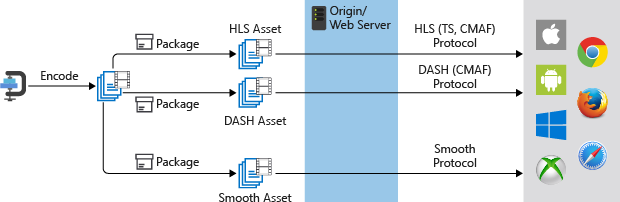

# Dynamic packaging

Microsoft Azure Media Services can be used to deliver many media source file formats, media streaming formats, and content protection formats to a variety of client technologies (for example, iOS and XBOX). These clients understand different protocols, for example iOS requires an HTTP Live Streaming (HLS) format and Xbox require Smooth Streaming. If you have a set of adaptive bitrate (multi-bitrate) MP4 (ISO Base Media 14496-12) files or a set of adaptive bitrate Smooth Streaming files that you want to serve to clients that understand HLS, MPEG DASH, or Smooth Streaming, you should take advantage of Media Services dynamic packaging.

With dynamic packaging all, you need is to create an asset that contains a set of adaptive bitrate MP4 files. Then, based on the specified format in the manifest or fragment request, the On-Demand Streaming server will ensure that you receive the stream in the protocol you have chosen. As a result, you only need to store and pay for the files in single storage format and Media Services service will build and serve the appropriate response based on requests from a client.

The following diagram shows the traditional encoding and static packaging workflow.

The following diagram shows the dynamic packaging workflow.

## Common scenario

1. Upload an input file (called a mezzanine file). For example, H.264, MP4, or WMV (for the list of supported formats see [Formats Supported by the Media Encoder Standard](media-encoder-standard-formats.md).
2. Encode your mezzanine file to H.264 MP4 adaptive bitrate sets.
3. Publish the asset that contains the adaptive bitrate MP4 set.
4. Build the streaming URLs to access and stream your content.

## Audio codecs supported by dynamic packaging

Dynamic Packaging supports MP4 files which contain audio encoded with [AAC](https://en.wikipedia.org/wiki/Advanced_Audio_Coding) (AAC-LC, HE-AAC v1, HE-AAC v2), [Dolby Digital Plus](https://en.wikipedia.org/wiki/Dolby_Digital_Plus) (Enhanced AC-3 or E-AC3), or [DTS](https://en.wikipedia.org/wiki/DTS_%28sound_system%29) (DTS Express, DTS LBR, DTS HD, DTS HD Lossless).

> [!NOTE]
> Dynamic Packaging does not support files that contain [Dolby Digital](https://en.wikipedia.org/wiki/Dolby_Digital) (AC3) audio (it is a legacy codec).

## Next steps

[Upload, encode, stream videos](stream-files-tutorial-with-api.md)
