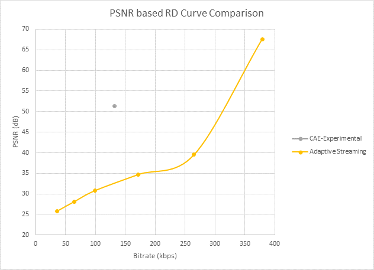

# Content-aware encoding

[!INCLUDE [media services api v3 logo](./includes/v3-hr.md)]

## Overview of the content-aware encoding preset

To prepare content for delivery using [adaptive bitrate streaming](https://en.wikipedia.org/wiki/Adaptive_bitrate_streaming), video needs to be encoded at multiple bit-rates (high to low) and multiple resolutions. This technique allows today's modern video players on Apple iOS, Android, Windows, and Mac to use streaming protocols that smoothly stream content without buffering. These different renditions of display size (resolution) and quality (bitrate) allows the player to select the best version of the video that the current network conditions can support. The network could vary widely from LTE, 4G, 5G, public Wi-Fi, or a home network.

The process of encoding content into multiple renditions requires the generation of an "encoding ladder" – a table of resolutions and bitrates that tells the encoder what to generate. For an example of such a ladder, see the Media Services [built-in encoding presets](/rest/api/media/transforms/createorupdate#encodernamedpreset).

In ideal conditions, you want to be aware of the type of content you are encoding. Using this information you can tune the encoding ladder to match the complexity and motion in your source video. This means that at each display size (resolution) in the ladder, there should be a bitrate beyond which any increase in quality is not perceptive – the encoder operates at this optimal bitrate value.

The next level of optimization that can be made is to select the resolutions based on the content – for example, a video of a PowerPoint presentation with small text would look blurry when encoded below 720 pixel lines in height. In addition, you may also have a video that changes motion and complexity throughout based on how it was shot and edited.  This provides an opportunity to tune and adjust the encoding settings at each scene or shot boundary. A smart encoder can be tasked to optimize encoding settings for each shot within the video.

Azure Media Services provides an [Adaptive Streaming](encode-autogen-bitrate-ladder.md) preset that partially addresses the problem of the variability in the bitrate and resolution of the source videos. However, this preset does not analyze the source content to see how complex it is, or how much motion it contains. 

The content-aware encoding preset improves on the more static "adaptive bitrate streaming" encoding preset by adding  logic that allows the encoder to seek an optimal bitrate value for a given resolution, but without requiring extensive computational analysis. This preset outputs a uniques "ladder" of GOP-aligned MP4s based on the source file. Given a source video, the preset performs an initial fast analysis of the input content and uses the results to determine the optimal number of layers, bitrate, and resolutions needed to deliver the highest-quality adaptive bitrate streaming experience. This preset is effective with low-to-medium complexity videos, where the output files will be at lower bitrates than the more static Adaptive Streaming preset but at a quality that still delivers a good experience to audiences. The output folder will contain several MP4 files with video and audio ready for streaming.

## Configure output settings

In addition, developers can also control the range of outputs that the content-aware encoding preset uses when deciding the optimal settings for encoding the adaptive bitrate streaming ladder.

By using the **PresetConfigurations** class, developers can pass in a set of constraints and options to the content-aware encoding preset to control the resulting files generated by the encoder. The properties are especially useful for situations where you want to limit all encoding to a specific maximum resolution to control the experience or costs of your encoding jobs.  It is also useful to be able to control the maximum and minimum bitrates that your audience may be able to support on a mobile network or in a global region that has bandwidth constraints.

## Supported codecs

The content-aware encoding preset is available for use with the following codecs:
-  H.264
-  HEVC (H.265)

## How-to use

See the [content-aware encoding how-to](./encode-content-aware-How-to.md) for details on using the preset in your code and links to complete samples.

## Technical details on content-aware preset

Lets now dig a bit deeper into how the content-aware encoding preset works.  following sample graphs show the comparison using quality metrics like [PSNR](https://en.wikipedia.org/wiki/Peak_signal-to-noise_ratio) and [VMAF](https://en.wikipedia.org/wiki/Video_Multimethod_Assessment_Fusion). The source was created by concatenating short clips of high complexity shots from movies and TV shows, intended to stress the encoder. By definition, this preset produces results that vary from content to content – it also means that for some content, there may not be significant reduction in bitrate or improvement in quality.

**Figure 1: Rate-distortion (RD) curve using PSNR metric for high complexity source**

**Figure 2: Rate-distortion (RD) curve using VMAF metric for high complexity source**

Below are the results for another category of source content, where the encoder was able to determine that the input was of poor quality (many compression artifacts because of the low bitrate). With the content-aware preset, the encoder decided to produce just one output layer – at a low enough bitrate so that most clients would be able to play the stream without stalling.

**Figure 3: RD curve using PSNR for low-quality input (at 1080p)**

**Figure 4: RD curve using VMAF for low-quality input (at 1080p)**

  
## Next steps
* [How to use the content-aware encoding presets](encode-content-aware-how-to.md)
* [Tutorial: Upload, encode, and stream videos with Media Services v3](stream-files-tutorial-with-api.md)