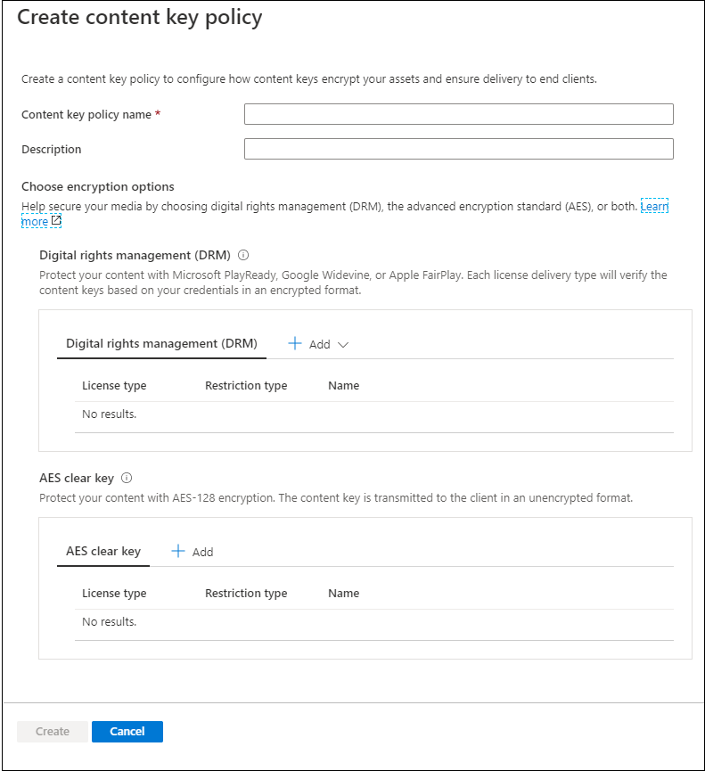

# Quickstart: Use portal to encrypt content

[!INCLUDE [media services api v3 logo](./includes/v3-hr.md)]

Use Azure Media Services to help secure your media from the time it leaves your computer all the way through storage, processing, and delivery. With Media Services, you can deliver your live and on-demand content encrypted dynamically with Advanced Encryption Standard (AES-128) or any of the three major digital rights management (DRM) systems: Microsoft PlayReady, Google Widevine, and Apple FairPlay. Media Services also provides a service for delivering AES keys and DRM (PlayReady, Widevine, and FairPlay) licenses to authorized clients. 
 
To specify encryption options (if any) on your stream, you use a **streaming policy** and associate it with your streaming locator. You create the **content key policy** to configure how the content key (that provides secure access to your **assets**) is delivered to end clients. You need to set the requirements (restrictions) on the content key policy that must be met in order for keys with the specified configuration to be delivered to clients. 

> [!NOTE]
> The content key policy is not needed for clear streaming or downloading.

When a stream is requested by a player, Media Services uses the specified key to dynamically encrypt your content by using AES clear key or DRM encryption. To decrypt the stream, the player requests the key from Media Services key delivery service or the key delivery service you specified. To decide if the user is authorized to get the key, the service evaluates the  **content key policy** that you specified for the key.

This quickstart shows you how to create a content key policy where you specify what encryption should be applied to your asset when it is streamed. The quickstart also shows how to set the configured encryption on your asset.

### Suggested pre-reading

* [Dynamic encryption and key delivery](content-protection-overview.md)
* [Streaming locators](streaming-locators-concept.md)
* [Streaming policies](streaming-policy-concept.md)
* [Content key policies](content-key-policy-concept.md)

## Prerequisites

Upload and process your content as described in [manage assets in the Azure portal](manage-assets-quickstart.md)

## Create a content key policy

Create the **content key policy** to configure how the content key (that provides secure access to your **assets**) is delivered to end clients.

1. Sign in at the [Azure portal](https://portal.azure.com/).
1. Locate and click on your Media Services account.
1. Select **Content key policies (new)**.
1. Press **+ Add content key policy** in the top of the window. 

The **Create a content key policy** window appears. In this window, you choose encryption options. You can choose to protect your media by choosing digital rights management (DRM), the advanced encryption standard (AES), or both.  

Whether you choose one of the DRM options or an AES-128 clear key option, you will be recommended to specify how you want to configure restrictions. You can choose to have an open or token restriction. For detailed explanation, see [Controlling content access](content-protection-overview.md#controlling-content-access).

### Add a DRM content key

You can choose to protect your content with Microsoft PlayReady and/or Google Widevine, or Apple FairPlay. Each license delivery type will verify the content keys based on your credentials in an encrypted format.

#### License templates

For details about license templates, see:

* [Google Widevine license template](widevine-license-template-overview.md)

    > [!NOTE]
    > You can create an empty license template with no values, just "{}." Then a license template is created with defaults. The default works for most cases.
* [Apple FairPlay license requirements and configuration](fairplay-license-overview.md)
* [PlayReady license template](playready-license-template-overview.md)

### Add AES clear key

You can also add an AES-128 clear key encryption to your content. The content key is transmitted to the client in an unencrypted format.

## Create a streaming locator for your asset

1. Locate and click on your Media Services account.
1. Select **Assets (new)**.
1. From the list of assets, select the one you want to encrypt.  
1. In the **Streaming locator** section for the selected asset, press **+ Add a streaming locator**. 
1. Select a **streaming policy** that is appropriate for the **content key policy** that you configured.

    The [Streaming policies](streaming-policy-concept.md) topic gives details on what streaming policy matches what content key policy.
1. Once you select the appropriate streaming policy, you can select the content key policy from the drop-down list.
1. Press **Add** to add the streaming locator to your asset.

    This publishes the asset and generates the streaming URLs.

## Cleanup resources

If you intend to try the other quickstarts, you should hold on to the resources created. Otherwise, go to the Azure portal, browse to your resource groups, select the resource group under which you ran this quickstart, and delete all the resources.

## Next steps

[Manage assets](manage-assets-quickstart.md)
