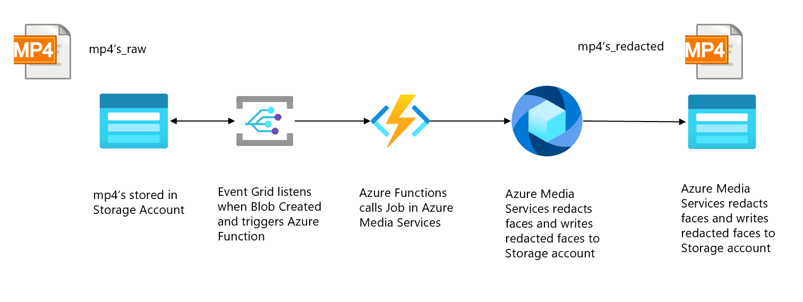
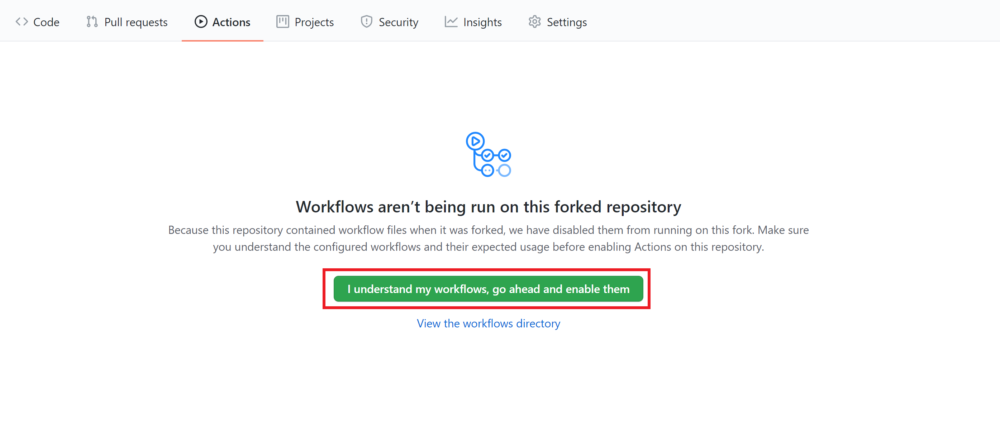
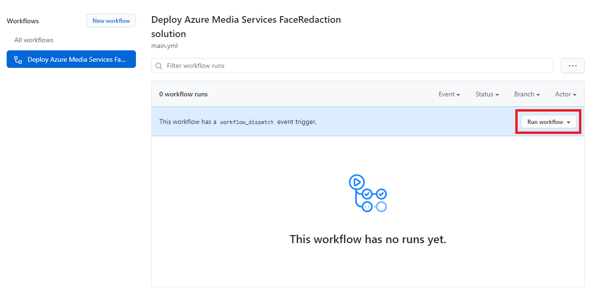
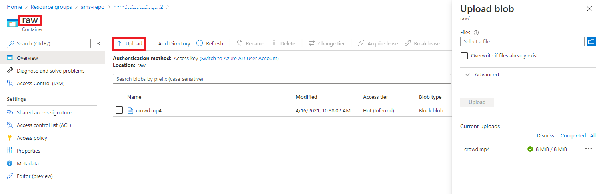
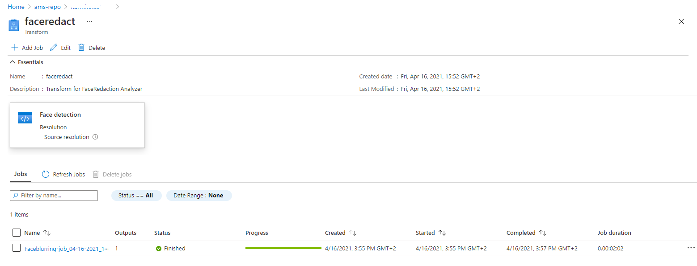
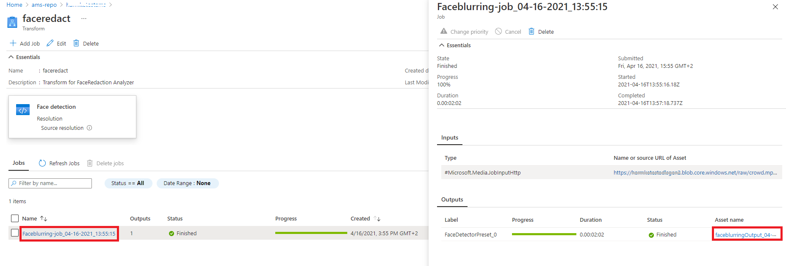

# Event-based Face Redaction

[!INCLUDE [media services api v3 logo](./includes/v3-hr.md)]

## Introduction
 
In some scenarios or use-cases, Azure Media Services should process or analyze videos the moment videos land on a data store. An example use-case could be where a team wants to analyze videos of a site or plant to see if people on-site follow security instructions (e.g. wear helmets). For this use-case, an Edge device on-site could capture the videos when motion is detected, and then send to Azure. To comply with privacy standards, the faces of people captured on the videos should be redacted before they can be analyzed by the team. To be able to share the enriched videos as soon as possible with team, the face redaction step should be done the moment a video lands on Azure. This quickstart shows how to use Azure Media Services in such an event-based scenario on Azure. Videos uploaded to a storage account will be transformed using a Job in Azure Media Services. It uses the Media Service v3 API.

The specific transformation that will be used is called [Face Redactor](./analyze-face-redaction-concept.md). This is an Azure Media Analytics preset, that allows you to modify your video by blurring faces of selected individuals.

By the end of the quickstart you will be able to redact faces in a video:

 

## Solution Overview

 
          
This quickstart shows how to deploy the solution that can be found in the solution overview above. It starts with a storage account (Azure Data Lake Storage Gen2), with an Event Listener connected to it (Event Grid), that triggers an Azure Function when new .mp4 files are uploaded to the storage account. The Azure Function will submit a job to a pre-configured Transform in Azure Media Services. The resulting redacted video will be stored on a Blob Storage account.

## Prerequisites

- If you don't have an Azure subscription, create a [free account](https://azure.microsoft.com/free/?WT.mc_id=A261C142F) before you begin.
- Create a resource group to use with this quickstart.

## Get the sample and understand its deployment

Create a fork of the [Python samples repository](https://github.com/Azure-Samples/media-services-v3-python). For this quickstart, we're working with the FaceRedactorEventBased sample.

The deployment of this sample consists of three separate steps: deploying the Azure services to setup the overall solution, deploying the Function App that submits a job to Azure Media Services when a new file is uploaded, and configuring the Eventgrid trigger. We have created a GitHub Actions workflow that performs these steps. Therefore, this solution can be deployed by adding the necessary variables to your GitHub environment, which means that no local development tools are required.

## Create a Service Principal

Before the GitHub Actions workflow can be run, a Service principal has to be created that has *Contributor* and *Storage Blob Data Reader* roles on the Resource Group. This Service Principal will be the app that will provision and configure all Azure services on behalf of GitHub Actions. The Service Principal is also used after the solution is deployed to generate a SAS token for videos that need to be processed.

To create the Service Principal and give it the roles that are needed on the Resource Group, fill in the variables in the following bash command and running it in the Cloud Shell:
```bash
# Replace <subscription-id>, <name-of-resource-group> and <name-of-app> with the corresponding values. 
# Make sure to use a unique name for the app name parameter.

app_name="<name-of-app>"
resource_group="<name-of-resource-group>"
subscription_id="<subscription-id>"

az ad sp create-for-rbac --name $app_name --role contributor \
                     --scopes /subscriptions/$subscription_id/resourceGroups/$resource_group \
                     --sdk-auth

object_id=$(az ad sp list --display-name $app_name --query [0].objectId -o tsv)

az role assignment create --assignee $object_id --role "Storage Blob Data Reader" \
                      --scope /subscriptions/$subscription_id/resourceGroups/$resource_group
```
  
The command should output a JSON object similar to this:
   
```json
{
  "clientId": "<GUID>",
  "clientSecret": "<GUID>",
  "subscriptionId": "<GUID>",
  "tenantId": "<GUID>",
  (...)
}
```
Make sure to copy the output and have it available for the next step.
 
## Add Service Principal details to GitHub Secrets 

The Service Principal details should be stored as a [GitHub Secret](https://docs.github.com/en/actions/reference/encrypted-secrets) so that GitHub Actions can deploy and configure the necessary services within Azure. Go to the Repo Settings -> Secrets of your forked repo and click on 'Create New Secrets'. Create the following secrets:
 - Create 'AZURE_CREDENTIALS' and paste the output from the previous step (full json). In the GitHub Action workflow this secret will be used to create a connection to Azure. 
 - Create 'CLIENT_ID' and paste the value of 'clientId' from the previous step.
 - Create 'CLIENT_SECRET' and paste the value of 'clientSecret' from the previous step.
 - Create 'TENANT_ID' and paste the value of 'tenantId' from the previous step.
 
## Create the .env file

Copy the contents from the sample.env file that is in your forked repo in the VideoAnalytics/FaceRedactorEventBased folder. Then, create your own .env file by clicking on Add file -> Create new file. Name the file *.env* and fill in the variables. When you're done, click on 'Commit new file'. We are now ready to deploy the solution, but we will first examine the code files that we will be using.

## Examine the code for provisioning the Azure Resources

The bash script below provisions the Azure services used in this solution. The bash script uses the Azure CLI and executes the following actions:
- Load environment variables into local variables.
- Define names for ADLSgen2, a generic Azure Storage account, Azure Media Services, Azure Function App, and an Event Grid System Topic and Subscription.
- Provision the Azure services defined.

[!code-bash[Main](../../../media-services-v3-python/VideoAnalytics/FaceRedactorEventBased/AzureServicesProvisioning/deploy_resources.azcli)]

## Examine Azure Function code

After successfully provisioning the Azure Resources, we are ready to deploy the Python code to our Azure Function. The **/azure-function/EventGrid_AMSJob/__init__.py** file contains the logic to trigger an AMS job whenever a file is landing in the Azure Data Lake Gen2 file system. The script performs the following steps:
- Import dependencies and libraries.
- Use Function binder to listen to Azure Event Grid.
- Grab and define variables from event schema.
- Create Input/Output asset for AMS Job.
- Connect to Azure Data Lake Gen2 using DataLakeService Client, and generate a SAS-token to use as authentication for the AMS job input.
- Configure and create the Job.

[!code-python[Main](../../../media-services-v3-python/VideoAnalytics/FaceRedactorEventBased/AzureFunction/EventGrid_AMSJob/__init__.py)]

## Examine the code for configuring the Azure Resources 

The bash script below is used for configuring the Resources after they have been provisioned. Executing this script is the last step of the deployment of the solution, after deploying our Function code. The script executes the following steps:
- Configure App Settings for the Function App.
- Create an Azure Event Grid System Topic.
- Create the Event subscription, so that when a Blob is created in the ADLSg2 Raw folder, the Azure Function is triggered.
- Create the Azure Media Services Transform using a REST API call. This transform will be called in the Azure Function.

> [!NOTE]
> Currently, neither the Azure Media Services v3 Python SDK, nor Azure CLI did support the creation of a FaceRedaction Transform. We therefore the Rest API method to create the transform job.

[!code-bash[Main](../../../media-services-v3-python/VideoAnalytics/FaceRedactorEventBased/AzureServicesProvisioning/configure_resources.azcli)]
 
## Enable GitHub Actions pipeline
 The Workflow file in this repository contains the steps to execute the deployment of this solution. To start the Workflow, it needs to be enabled for your own repo. In order to enable it, go to the Actions tab in your repo and select 'I understand my workflows, go ahead and enable them'.
 
  
 
After enabling the GitHub Actions, you can find the workload file here: [.github/workflows/main.yml](https://github.com/Azure-Samples/media-services-v3-python/blob/main/.github/workflows/main.yml).  Aside from the triggers, there is a build job with a couple of steps. The following steps are included:
- **Env**: In here, multiple environment variables are defined, referring to the GitHub Secrets that we added earlier.
- **Read Environment file**: The environment file is read for the build job.
- **Resolve Project Dependencies using Pip**: The needed libraries in our Azure functions are loaded into the GitHub Actions environment
- **Azure Login**: This step uses the GitHub Secret for logging into the Azure CLI using the Service Principal details.
- **Deploy Azure Resources using Azure CLI script file**: runs the deployment script for provisioning the Azure Resources
- **Deploy Azure Function code**: This step packages and deploys the Azure function in the directory './azure-function'. When the Azure Function is deployed successfully, it should be visible in the Azure portal under the name 'EventGrid_AMSJob':
 

- **Configure Azure Resources using Azure CLI script file**:  If all correct, the last step is to configure the deployed Azure services to activate the event-listener.

After enabling the workflows, select the 'Deploy Azure Media Service FaceRedaction solution' workflow and select 'Run workflow'. Now, the solution will be deployed using the variables added in the previous steps. Wait a couple of minutes and verify that it has run successfully.

 

## Test your solution
Go to the storage explorer of your ADLS Gen2 in the Azure portal. Upload a video to the Raw container. If you're looking for a test video, download one from [this website](https://www.pexels.com/search/videos/group/). See the image below for guidance on uploading a video to the ADLS Gen2 storage account:

 

Verify in you Azure Media Services instance that a job is created by going to your Azure Media Services account and select Transforms + Jobs from the menu. Then select the face redactor transformation.

 

This page should show the job that was fired by the Azure Function. The job can either be finished or still processing.

  

By selecting the job, you'll see some details about the specific job. If you select the Output asset name and then use the link to the storage container that is linked to it, you can see your processed video when the job is finished.

  

## Clean up Resources

When you're finished with the quickstart, delete the Resources created in the resource group. Additionally, you can delete the forked repo.

## Next steps

If you would like to modify this example, chances are you would like to run the code locally. For local development, the variables in the sample.env file are sufficient because the Service Principal is not needed when a user account is logged in to the locally installed Azure CLI. For guidance on working locally with your Azure Function, we refer to [these docs](../../azure-functions/create-first-function-vs-code-python.md).
