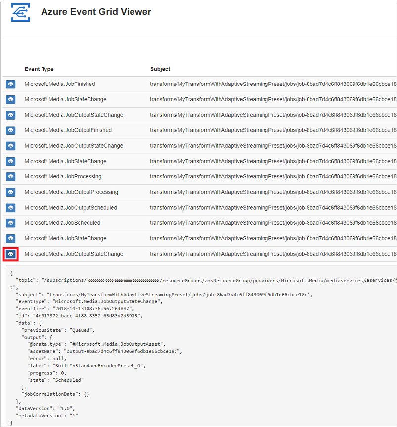

# Create and monitor Media Services events with Event Grid using the Azure CLI

Azure Event Grid is an eventing service for the cloud. In this article, you use the Azure CLI to subscribe to events for your Azure Media Services account and trigger events to view the result. Typically, you send events to an endpoint that processes the event data and takes actions. However, to simplify this article, you send the events to a web app that collects and displays the messages.

## Prerequisites

- Have an active Azure subscription.
- [Create a Media Services account](create-account-cli-how-to.md).

    Make sure to remember the values that you used for the resource group name and Media Services account name.

- Install the [Azure CLI](https://docs.microsoft.com/cli/azure/install-azure-cli?view=azure-cli-latest). This article requires the Azure CLI version 2.0 or later. Run `az --version` to find the version you have. You can also use the [Azure Cloud Shell](https://shell.azure.com/bash).

## Create a message endpoint

Before subscribing to the events for the Media Services account, let's create the endpoint for the event message. Typically, the endpoint takes actions based on the event data. To simplify this article, you deploy a [pre-built web app](https://github.com/Azure-Samples/azure-event-grid-viewer) that displays the event messages. The deployed solution includes an App Service plan, an App Service web app, and source code from GitHub.

1. Select **Deploy to Azure** to deploy the solution to your subscription. In the Azure portal, provide values for the parameters.

   <a href="https://portal.azure.com/#create/Microsoft.Template/uri/https%3A%2F%2Fraw.githubusercontent.com%2FAzure-Samples%2Fazure-event-grid-viewer%2Fmaster%2Fazuredeploy.json" target="_blank"></a>

1. The deployment may take a few minutes to complete. After the deployment has succeeded, view your web app to make sure it's running. In a web browser, navigate to: 
`https://<your-site-name>.azurewebsites.net`

If you switch to the "Azure Event Grid Viewer" site, you see it has no events yet.
   
[!INCLUDE [event-grid-register-provider-portal.md](../../includes/event-grid-register-provider-portal.md)]

## Subscribe to Media Services events

You subscribe to an article to tell Event Grid which events you want to track. The following example subscribes to the Media Services account you created, and passes the URL from the website you created as the endpoint for event notification. 

Replace `<event_subscription_name>` with a unique name for your event subscription. For `<resource_group_name>` and `<ams_account_name>`, use the values you used when creating the Media Services account. For the `<endpoint_URL>`, provide the URL of your web app and add `api/updates` to the home page URL. By specifying an endpoint when subscribing, Event Grid handles the routing of events to that endpoint. 

```cli
amsResourceId=$(az ams account show --name <ams_account_name> --resource-group <resource_group_name> --query id --output tsv)

az eventgrid event-subscription create \
  --resource-id $amsResourceId \
  --name <event_subscription_name> \
  --endpoint <endpoint_URL>
```

The Media Services account resource id value looks similar to this:

```
/subscriptions/81212121-2f4f-4b5d-a3dc-ba0015515f7b/resourceGroups/amsResourceGroup/providers/Microsoft.Media/mediaservices/amstestaccount
```

Now, let's trigger events to see how Event Grid distributes the message to your endpoint.

## Send an event to your endpoint

You can trigger events for the Media Services account running an encoding job. You can follow [this quickstart](stream-files-dotnet-quickstart.md) to encode a file and start sending events. If you subscribed to all events, you will see a screen similar to the following:

View your web app again, and notice that a subscription validation event has been sent to it. 

Event Grid sends the validation event so the endpoint can verify that it wants to receive event data. The endpoint has to set `validationResponse` to `validationCode`. For more information, see [Event Grid security and authentication](../../event-grid/security-authentication.md). The web app includes code to validate the subscription.

> [!TIP]
> Select the eye icon to expand the event data. Do not refresh the page, if you want to view all the events.



## Next steps

[Upload, encode, and stream](stream-files-tutorial-with-api.md)
