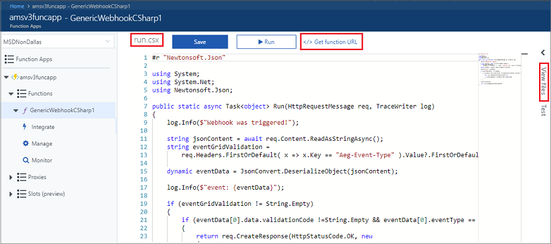
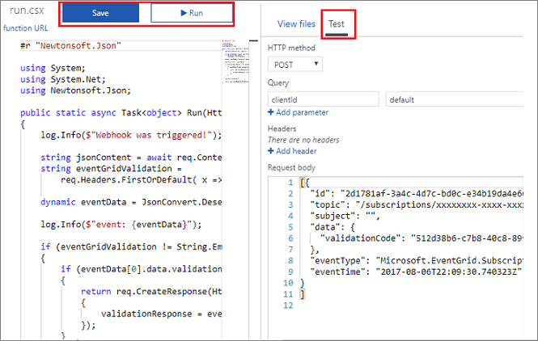
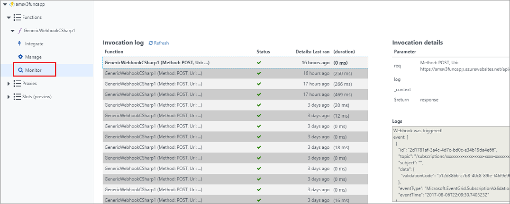

# Route Azure Media Services events to a custom web endpoint using CLI

Azure Event Grid is an eventing service for the cloud. In this article, you use the Azure CLI to subscribe to Azure Media Services job state change events, and trigger the event to view the result. 

Typically, you send events to an endpoint that responds to the event, such as a webhook or Azure Function. This tutorial, shows how to create and set a webhook.

When you complete the steps described in this article, you see that the event data has been sent to an endpoint.

## Prerequisites

- Have an active Azure subscription.
- [Create a Media Services account](create-account-cli-how-to.md).

    Make sure to remember the values that you used for the resource group name and Media Services account name.

- Install the [Azure CLI](https://docs.microsoft.com/cli/azure/install-azure-cli?view=azure-cli-latest). This article requires the Azure CLI version 2.0 or later. Run `az --version` to find the version you have. You can also use the [Azure Cloud Shell](https://shell.azure.com/bash).

## Enable Event Grid resource provider

First thing you need to do is make sure that you have Event Grid resource provider enabled on your subscription. 

In the **Azure** portal do the following:

1. Go to Subscriptions.
2. Select your subscription.
3. Under Settings, select Resource Providers.
4. Search for "EventGrid".
5. Make sure Event Grid is registered. If not, press the **Register** button.  

## Create a generic Azure Function webhook 

### Create a message endpoint

Before subscribing to the Event Grid's article, create an endpoint that collects the messages so you can view them.

Create a function triggered by a generic webhook as described in the [generic webhook](https://docs.microsoft.com/azure/azure-functions/functions-create-generic-webhook-triggered-function) article. In this tutorial, the **C#** code is used.

Once the webhook is created, copy the URL by clicking on the *Get function URL* link at the top of the **Azure** portal window. You do not need the last part of the URL (*&clientID=default*).



### Validate the webhook

When you register your own webhook endpoint with Event Grid, it sends you a POST request with a simple validation code to prove endpoint ownership. Your app needs to respond by echoing back the validation code. Event Grid doesn't deliver events to webHook endpoints that haven't passed the validation. For more information, see [Event Grid security and authentication](https://docs.microsoft.com/azure/event-grid/security-authentication). This section defines two parts that must be defined for the validation to pass.

#### Update the source code

After you created your webhook, the **run.csx** file appears in the browser. Replace the default code with the following code. 

```csharp
#r "Newtonsoft.Json"

using System;
using System.Net;
using Newtonsoft.Json;

public static async Task<object> Run(HttpRequestMessage req, TraceWriter log)
{
    log.Info($"Webhook was triggered!");

    string jsonContent = await req.Content.ReadAsStringAsync();
    string eventGridValidation = 
        req.Headers.FirstOrDefault( x => x.Key == "Aeg-Event-Type" ).Value?.FirstOrDefault();

    dynamic eventData = JsonConvert.DeserializeObject(jsonContent);

    log.Info($"event: {eventData}");

    if (eventGridValidation != String.Empty)
    {
        if (eventData[0].data.validationCode !=String.Empty && eventData[0].eventType == "Microsoft.EventGrid.SubscriptionValidationEvent")
        {
            return req.CreateResponse(HttpStatusCode.OK, new 
            {
                validationResponse = eventData[0].data.validationCode
            });
        }
    }
    
    log.Info(jsonContent);

    return req.CreateResponse(HttpStatusCode.OK);
}
```

#### Update test request body

On the right of the **Azure** portal window you see two tabs: **View files** and **Test**. Select the **Test** tab. In the **Request body**, paste the following json. You can paste it as is, no need to change any values.

```json
[{
  "id": "2d1781af-3a4c-4d7c-bd0c-e34b19da4e66",
  "topic": "/subscriptions/xxxxxxxx-xxxx-xxxx-xxxx-xxxxxxxxxxxx",
  "subject": "",
  "data": {
    "validationCode": "512d38b6-c7b8-40c8-89fe-f46f9e9622b6"
  },
  "eventType": "Microsoft.EventGrid.SubscriptionValidationEvent",
  "eventTime": "2017-08-06T22:09:30.740323Z"
}
]
```

Press **Save and run** at the top of the window.



## Register for the Event Grid subscription 

You subscribe to an article to tell Event Grid which events you want to track. The following example subscribes to the Media Services account you created, and passes the URL from  Azure Function webhook you created as the endpoint for event notification. 

Replace `<event_subscription_name>` with a unique name for your event subscription. For `<resource_group_name>` and `<ams_account_name>`, use the values you used when creating the Media Services account. For the `<endpoint_URL>` paste your endpoint URL. Remove *&clientID=default* from the URL. By specifying an endpoint when subscribing, Event Grid handles the routing of events to that endpoint. 

```cli
amsResourceId=$(az ams account show --name <ams_account_name> --resource-group <resource_group_name> --query id --output tsv)

az eventgrid event-subscription create \
  --resource-id $amsResourceId \
  --name <event_subscription_name> \
  --endpoint <endpoint_URL>
```

The Media Services account resource id value looks similar to this:

```
/subscriptions/81212121-2f4f-4b5d-a3dc-ba0015515f7b/resourceGroups/amsResourceGroup/providers/Microsoft.Media/mediaservices/amstestaccount
```

## Test the events

Run an encoding job. For example, as described in the [Stream video files](stream-files-dotnet-quickstart.md) quickstart.

You have triggered the event, and Event Grid sent the message to the endpoint you configured when subscribing. Browse to the webhook you created earlier. Click **Monitor** and **Refresh**. You see the job's state changes events: "Queued", "Scheduled", "Processing", "Finished", "Error", "Canceled", "Canceling".  For more information, see [Media Services event schemas](media-services-event-schemas.md).

The following example shows the schema of the JobStateChange event:

```json
[{
  "topic": "/subscriptions/<subscription id>/resourceGroups/amsResourceGroup/providers/Microsoft.Media/mediaservices/amsaccount",
  "subject": "transforms/VideoAnalyzerTransform/jobs/<job id>",
  "eventType": "Microsoft.Media.JobStateChange",
  "eventTime": "2018-04-20T21:17:26.2534881",
  "id": "<id>",
  "data": {
    "previousState": "Scheduled",
    "state": "Processing"
  },
  "dataVersion": "1.0",
  "metadataVersion": "1"
}]
```



## Next steps

[Reacting to events](reacting-to-media-services-events.md)

## See also

[Azure CLI](https://docs.microsoft.com/en-us/cli/azure/ams?view=azure-cli-latest)
