# Create an Azure Media Services live stream with OBS

This quickstart will help you create an Azure Media Services live stream by using the Azure portal and Open Broadcasting Studio (OBS). It assumes that you have an Azure subscription and have created a Media Services account.

In this quickstart, we'll cover:

- Setting up an on-premises encoder with OBS.
- Setting up a live stream.
- Setting up live stream outputs.
- Running a default streaming endpoint.
- Using Azure Media Player to view the live stream and on-demand output.

## Prerequisites

If you don't have an Azure subscription, create a [free account](https://azure.microsoft.com/free/) before you begin.

## Sign in to the Azure portal

Open your web browser, and go to the [Microsoft Azure portal](https://portal.azure.com/). Enter your credentials to sign in to the portal. The default view is your service dashboard.

## Set up an on-premises encoder by using OBS

1. Download and install OBS for your operating system on the [Open Broadcaster Software website](https://obsproject.com/).
1. Start the application and keep it open.

## Run the default streaming endpoint

1. Select **Streaming endpoints** in the Media Services listing.

   
1. If the default streaming endpoint status is stopped, select it. This step takes you to the page for that endpoint.
1. Select **Start**.

   

## Set up an Azure Media Services live stream

1. Go to the Azure Media Services account within the portal, and then select **Live streaming** from the **Media Services** listing.

   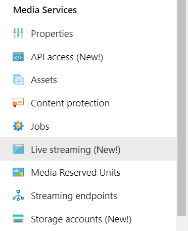
1. Select **Add live event** to create a new live streaming event.

   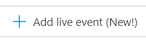
1. Enter a name for your new event, such as *TestLiveEvent*, in the **Live event name** box.

   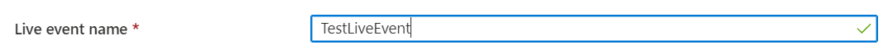
1. Enter an optional description of the event in the **Description** box.
1. Select the **Pass-through – no cloud encoding** option.

   
1. Select the **RTMP** option.
1. Make sure that the **No** option is selected for **Start live event**, to avoid being billed for the live event before it's ready. (Billing will begin when the live event is started.)

   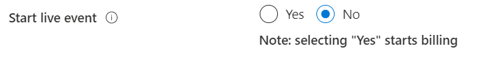
1. Select the **Review + create** button to review the settings.
1. Select the **Create** button to create the live event. You're then returned to the live event listing.
1. Select the link to the live event that you just created. Notice that your event is stopped.
1. Keep this page open in your browser. We'll come back to it later.

## Set up a live stream by using OBS Studio

OBS starts with a default scene but with no inputs selected.

   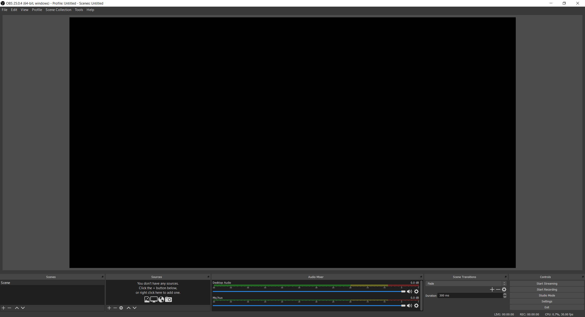

### Add a video source

1. From the **Sources** panel, click the **add** icon to select a new source device. The **Sources** menu will open.

1. Select **Video Capture Device** from the source device menu. The **Create/Select Source** menu will open.

   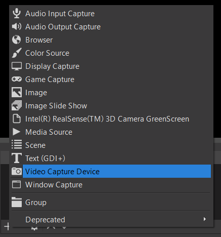

1. Select the **Add Existing** radio button, then click **OK**. The **Properties for Video Device** menu will open.

   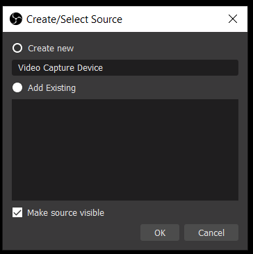

1. From the **Device** dropdown list, select the video input you want to use for your broadcast. Leave the rest of the settings alone for now, and click **OK**. The input source will be added to the **Sources** panel, and the video input view will show up in the **Preview** area.

   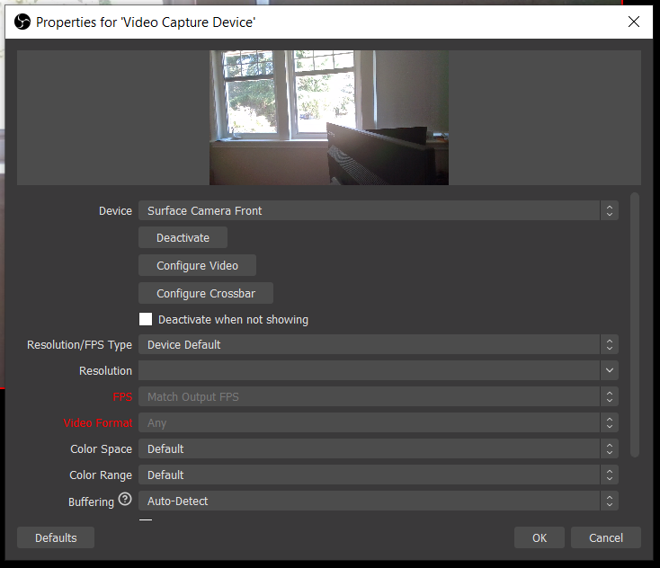

### Add an audio source

1. From the **Sources** panel, click the **add** icon to select a new source device. The Source Device menu will open.

1. Select **Audio Input Capture** from the source device menu. The **Create/Select Source** menu will open.

   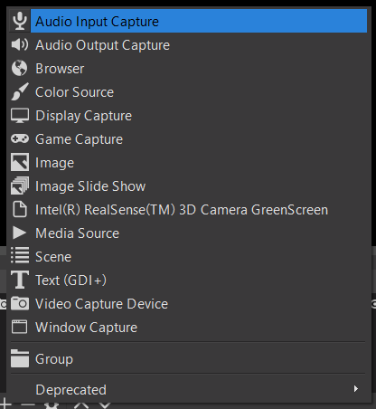

1. Select the **Add Existing** radio button, then click **OK**. The **Properties for Audio Input Capture** menu will open.

   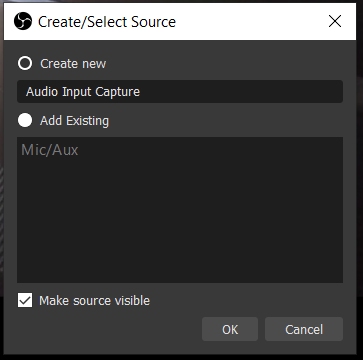

1. From the **Device** dropdown list, select the audio capture device you want to use for your broadcast. Leave the rest of the settings alone for now, and click OK. The audio capture device will be added to the audio mixer panel.

   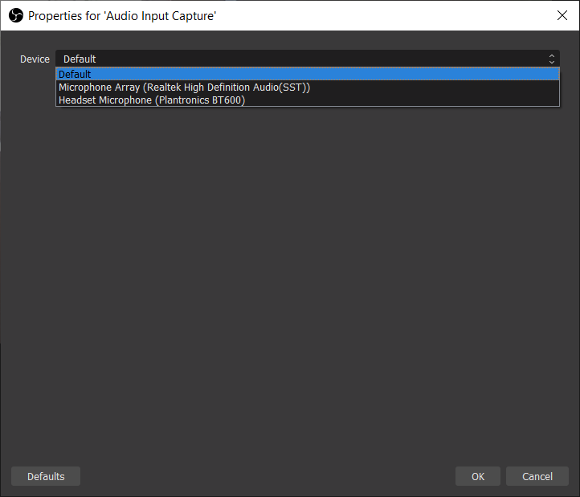

### Set up streaming in OBS

In the next procedure, you'll go back to Azure Media Services in your browser to copy the input URL to enter into the output settings:

1. On the Azure Media Services page of the portal, select **Start** to start the live stream event. (Billing starts now.)

   
1. Set the **RTMP** toggle to **RTMPS**.
1. In the **Input URL** box, copy the URL to your clipboard.

   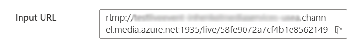

1. Switch to the OBS application.

1. Click the **Settings** button in the **Controls** panel. The Settings options will open.

   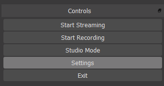

1. Select **Stream** from the **Settings** menu.

1. From the **Service** dropdown list, select Show all, then select **Custom...**.

1. In the **Server** field, paste the RTMPS URL you copied to your clipboard.

1. Enter something into the **Stream key** field.  It doesn't really matter what it is, but it needs to have a value.

    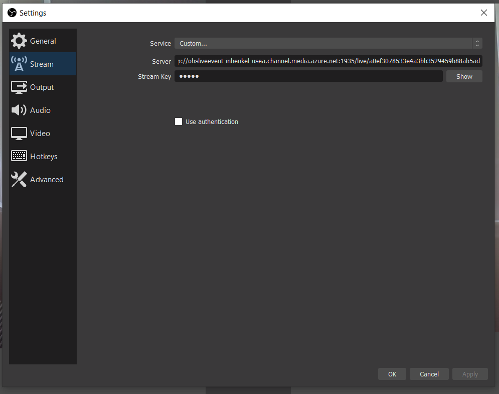

1. Select **Output** from the **Settings** menu.

1. Enter *2* into the **Keyframe interval** field. This sets the fragment length to 2 seconds. For lower latency live delivery, use the value of 1 second.

1. OPTIONAL: Set the **CPU Usage Preset** to *veryfast* if you are using a computer that is low on processing power. Optionally, you can set the kbps to something lower if there are undesirable network conditions.

   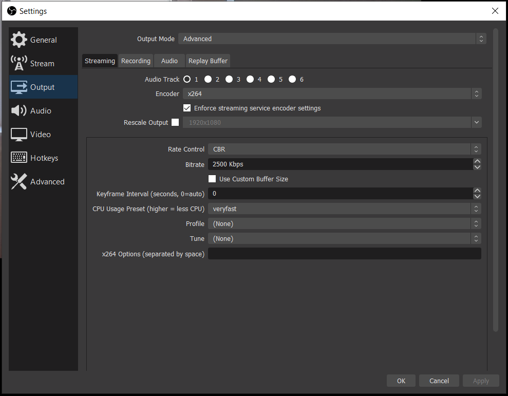

1. Leave the rest of the settings unchanged and click **OK**.

### Start streaming

1. In the **Controls** panel, click **Start Streaming**.

    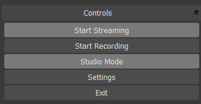

2. Switch to the Azure Media Services Live event screen in your browser and click the **Reload Player** link. You should now see your stream in the Preview player.

## Set up outputs

This part will set up your outputs and enable you to save a recording of your live stream.  

> [!NOTE]
> For you to stream this output, the streaming endpoint must be running. See the later [Run the default streaming endpoint](#run-the-default-streaming-endpoint) section.

1. Select the **Create outputs** link below the **Outputs** video viewer.
1. If you like, edit the name of the output in the **Name** box to something more user-friendly so it's easy to find later.

   
1. Leave all the rest of the boxes alone for now.
1. Select **Next** to add a streaming locator.
1. Change the name of the locator to something more user-friendly, if you want.

   
1. Leave everything else on this screen alone for now.
1. Select **Create**.

## Play the output broadcast by using Azure Media Player

1. Copy the streaming URL under the **Output** video player.
1. In a web browser, open the [Azure Media Player demo](https://ampdemo.azureedge.net/azuremediaplayer.html).
1. Paste the streaming URL into the **URL** box of Azure Media Player.
1. Select the **Update Player** button.
1. Select the **Play** icon on the video to see your live stream.

## Stop the broadcast

When you think you've streamed enough content, stop the broadcast.

1. In the portal, select **Stop**.

1. In OBS, select the **Stop Streaming** button in the **Controls** panel. This step stops the broadcast from OBS.

## Play the on-demand output by using Azure Media Player

The output that you created is now available for on-demand streaming as long as your streaming endpoint is running.

1. Go to the Media Services listing and select **Assets**.
1. Find the event output that you created earlier and select the link to the asset. The asset output page opens.
1. Copy the streaming URL under the video player for the asset.
1. Return to Azure Media Player in the browser and paste the streaming URL into the URL box.
1. Select **Update Player**.
1. Select the **Play** icon on the video to view the on-demand asset.

## Clean up resources

> [!IMPORTANT]
> Stop the services! After you've completed the steps in this quickstart, be sure to stop the live event and the streaming endpoint, or you'll be billed for the time they remain running. To stop the live event, see the [Stop the broadcast](#stop-the-broadcast) procedure, steps 2 and 3.

To stop the streaming endpoint:

1. From the Media Services listing, select **Streaming endpoints**.
2. Select the default streaming endpoint that you started earlier. This step opens the endpoint's page.
3. Select **Stop**.

> [!TIP]
> If you don't want to keep the assets from this event, be sure to delete them so you're not billed for storage.

## Next steps

> [!div class="nextstepaction"]
> [Live events and live outputs in Media Services](./live-events-outputs-concept.md)
