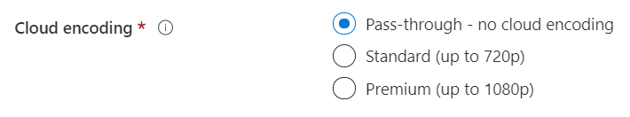
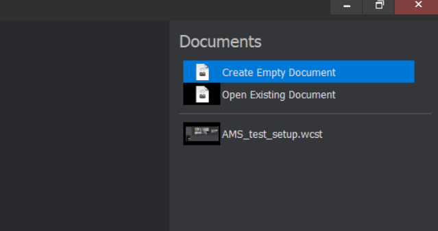
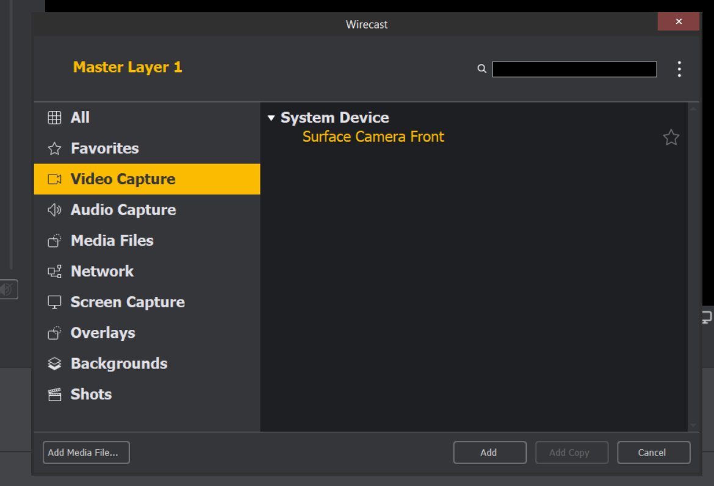
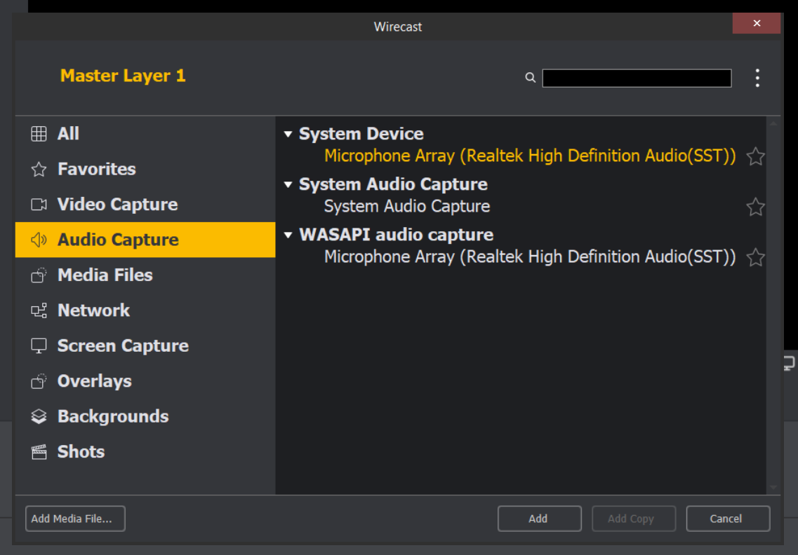
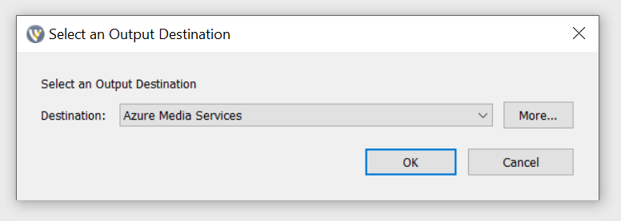
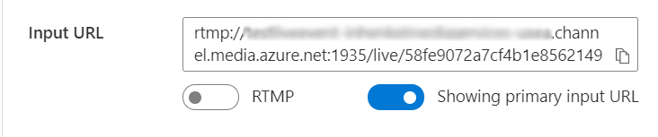
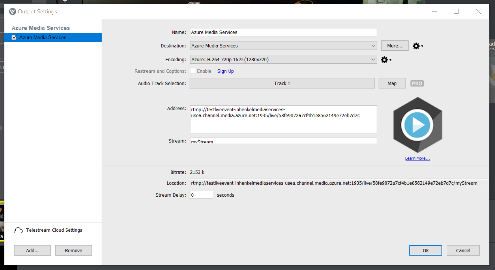
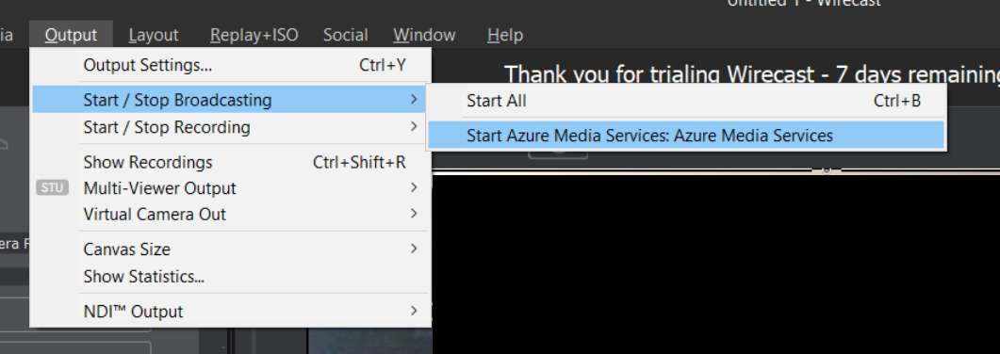
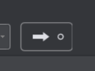
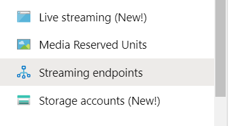

# Create an Azure Media Services live stream

This quickstart will help you create an Azure Media Services live stream by using the Azure portal and Telestream Wirecast. It assumes that you have an Azure subscription and have created a Media Services account.

If you don't have an Azure subscription, create a [free account](https://azure.microsoft.com/free/) before you begin.

## Sign in to the Azure portal

Open your web browser, and go to the [Microsoft Azure portal](https://portal.azure.com/). Enter your credentials to sign in to the portal. The default view is your service dashboard.

In this quickstart, we'll cover:

- Setting up an on-premises encoder with a free trial of Telestream Wirecast.
- Setting up a live stream.
- Setting up live stream outputs.
- Running a default streaming endpoint.
- Using the Azure Media Player to view the live stream and on-demand output.

To keep things simple, we'll use an encoding preset for Azure Media Services in Wirecast, pass-through cloud encoding, and RTMP.

## Set up an on-premises encoder by using Wirecast

1. Download and install Wirecast for your operating system on the [Telestream website](https://www.telestream.net).
1. Start the application and use your favorite email address to register the product. Keep the application open.
1. In the email that you receive, verify your email address. Then the application will start the free trial.
1. Recommended: Watch the video tutorial in the opening application screen.

## Set up an Azure Media Services live stream

1. Go to the Azure Media Services account within the portal, and then select **Live streaming** from the **Media Services** listing.

   
1. Select **Add live event** to create a new live streaming event.

   
1. Enter a name for your new event, such as *TestLiveEvent*, in the **Live event name** box.

   
1. Enter an optional description of the event in the **Description** box.
1. Select the **Pass-through – no cloud encoding** option.

   
1. Select the **RTMP** option.
1. Make sure that the **No** option is selected for **Start live event**, to avoid being billed for the live event before it's ready. (Billing will begin when the live event is started.)

   
1. Select the **Review + create** button to review the settings.
1. Select the **Create** button to create the live event. You're then returned to the live event listing.
1. Select the link to the live event that you just created. Notice that your event is stopped.
1. Keep this page open in your browser. We'll come back to it later.

## Set up a live stream by using Wirecast Studio

1. In the Wirecast application, select **Create Empty Document** from the main menu, and then select **Continue**.

   
1. Hover over the first layer in the **Wirecast layers** area.  Select the **Add** icon that appears, and select the video input that you want to stream. The Master Layer 1 dialog box opens.

   
1. Select **Video Capture** from the menu, and then select the camera that you want to use. The view from the camera appears in the preview area.

   
1. Hover over the second layer in the **Wirecast layers** area. Select the **Add** icon that appears, and select the audio input that you want to stream. The **Master Layer 2** dialog box opens.
1. Select **Audio capture** from the menu and then select the audio input that you want to use.

   
1. From the main menu, select **Output settings**. The **Output** dialog box appears.
1. Select **Azure Media Services** from the **Destination** drop-down list. The output setting for Azure Media Services automatically populates *most* of the output settings.

   

In the next procedure, you'll go back to Azure Media Services in your browser to copy the input URL to enter into the output settings:

1. On the Azure Media Services page of the portal, select **Start** to start the live stream event. (Billing starts now.)

   
2. Set the **Secure/Not secure** toggle to **Not secure**. This step sets the protocol to RTMP instead of RTMPS.
3. In the **Input URL** box, copy the URL to your clipboard.

   
4. Switch to the Wirecast application and paste the **Input URL** into the **Address** field in the output settings.

   
5. Select **OK**.

## Set up outputs

This part will set up your outputs and enable you to save a recording of your live stream.  

> [!NOTE]
> In order to stream this output, the streaming endpoint must be running.  See Running the default streaming endpoint section below.

1. Select the **Create outputs** link below the Outputs video viewer.
1. If you like, edit the name of the output in the **Name** field to something more user friendly so it is easy to find later.
   
1. Leave all the rest of the fields alone for now.
1. Select **Next** add streaming locator.
1. Change the name of the locator to something more user friendly, if wanted.
   
1. Leave everything else on this screen alone for now.
1. Select **Create**.

## Start the broadcast

1. In Wirecast, select **Output > Start / Stop broadcasting > Start Azure Media Services : Azure Media Services** from the main menu.  When the stream has been sent to the live event, the Live window in Wirecast will be show up in the live event video player on the live event page in Azure Media Services.

   

1. Select the **Go** button under the preview window to start broadcasting the video and audio you selected for the Wirecast layers.

   

   > [!TIP]
   > If there is an error, try reloading the player by selecting the Reload player link above the player.

## Run the default streaming endpoint

1. Make sure your streaming endpoint is running by selecting **Streaming endpoints** in the Media Services listing. You will be taken to the streaming endpoints page.
   
1. If the default streaming endpoint status is stopped, select the **default** streaming endpoint. This will take you to the page for that endpoint.
1. Select **Start**.  This will start the streaming endpoint.
   

## Play the output broadcast by using Azure Media Player

1. Copy the **Streaming URL** under the Output video player.
1. In a web browser, open the demo Azure Media Player https://ampdemo.azureedge.net/azuremediaplayer.html
1. Paste the **Streaming URL** into the URL field of the Azure Media Player.
1. Select the **Update Player** button.
1. Select the **play** icon on the video to see your live stream.

## Stop the broadcast

When you think you have streamed enough content, stop the broadcast.

1. In Wirecast, select the **broadcast** button.  This will stop the broadcast from Wirecast.
1. In the portal, select **Stop**. You will get a warning message that the live stream stop but the output will now become an on-demand asset.
1. Select **Stop** in the warning message. The Azure Media Player will also now show an error as the live stream is no longer available.

## Play the on-demand output by using Azure Media Player

The output you created is now available for on-demand streaming as long as your streaming endpoint is running.

1. Navigate to the Media Services listing and select **Assets**.
1. Find the event output you created earlier and select the **link to the asset**. The asset output page will open.
1. Copy the **Streaming URL** under the video player for the asset.
1. Return to the Azure Media Player in the browser and paste the **Streaming URL** into the URL field of the Azure Media Player.
1. Select **Update Player**.
1. Select the **play** icon on the video to view the on-demand asset.

## Clean up resources

> [!IMPORTANT]
> Stop the services! Once you have completed the steps in this quickstart, be certain to stop the live event and the streaming endpoint or you will continue to be billed for the time they remain running. To stop the live event, see the Stopping the broadcast, steps 2 and 3 above.

### Stop the streaming endpoint

1. From the Media Services listing, select **Streaming endpoints**.
2. Select the **default** streaming endpoint you started earlier. This will open the endpoint's page.
3. Select **Stop**.  This will stop the streaming endpoint.

> [!TIP]
> If you don't want to keep the assets from this event, be sure to delete them in order to prevent being billed for storage.

## Next steps
> [!div class="nextstepaction"]
> [Live Events and Live Outputs in Media Services](./live-events-outputs-concept.md)
