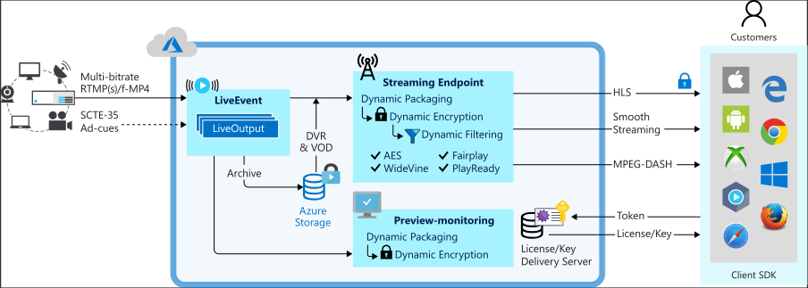
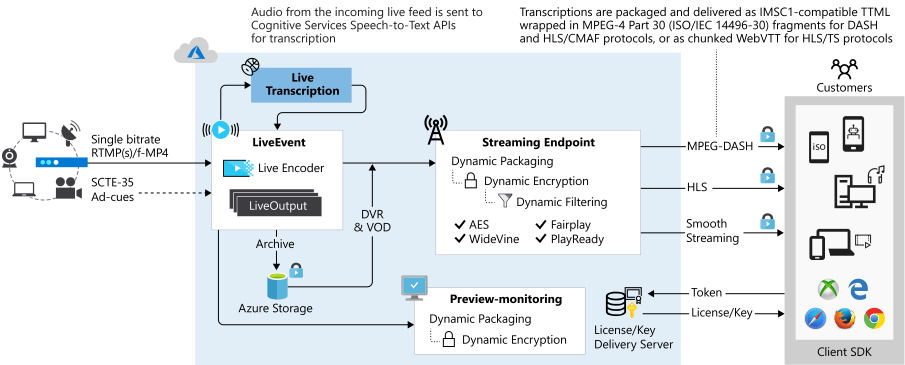

# Live streaming with Azure Media Services v3

Azure Media Services enables you to deliver live events to your customers on the Azure cloud. To stream your live events with Media Services, you need the following:  

- A camera that is used to capture the live event. For setup ideas, check out [Simple and portable event video gear setup]( https://link.medium.com/KNTtiN6IeT).

    If you do not have access to a camera, tools such as [Telestream Wirecast](https://www.telestream.net/wirecast/overview.htm) can be used generate a live feed from a video file.
- A live video encoder that converts signals from a camera (or another device, like a laptop) into a contribution feed that is sent to Media Services. The contribution feed can include signals related to advertising, such as SCTE-35 markers. For a list of recommended live streaming encoders, see [live streaming encoders](recommended-on-premises-live-encoders.md). Also, check out this blog: [Live streaming production with OBS](https://link.medium.com/ttuwHpaJeT).
- Components in Media Services, which enable you to ingest, preview, package, record, encrypt, and broadcast the live event to your customers, or to a CDN for further distribution.

This article gives an overview and guidance of live streaming with Media Services and links to other relevant articles.
 
> [!NOTE]
> Currently, you cannot use the Azure portal to manage v3 resources. Use the [REST API](https://aka.ms/ams-v3-rest-ref), [CLI](https://aka.ms/ams-v3-cli-ref), or one of the supported [SDKs](media-services-apis-overview.md#sdks).

## Dynamic Packaging

With Media Services, you can take advantage of [Dynamic Packaging](dynamic-packaging-overview.md), which allows you to preview and broadcast your live streams in [MPEG DASH, HLS, and Smooth Streaming formats](https://en.wikipedia.org/wiki/Adaptive_bitrate_streaming) from the contribution feed that is being sent to the service. Your viewers can play back the live stream with any HLS, DASH, or Smooth Streaming compatible players. You can use [Azure Media Player](https://amp.azure.net/libs/amp/latest/docs/index.html) in your web or mobile applications to deliver your stream in any of these protocols.

## Dynamic Encryption

Dynamic encryption enables you to dynamically encrypt your live or on-demand content with AES-128 or any of the three major digital rights management (DRM) systems: Microsoft PlayReady, Google Widevine, and Apple FairPlay. Media Services also provides a service for delivering AES keys and DRM (PlayReady, Widevine, and FairPlay) licenses to authorized clients. For more information, see [Dynamic encryption](content-protection-overview.md).

## Dynamic Manifest

Dynamic filtering is used to control the number of tracks, formats, bitrates, and presentation time windows that are sent out to the players. For more information, see [filters and dynamic manifests](filters-dynamic-manifest-overview.md).

## Live Event types

[Live Events](https://docs.microsoft.com/rest/api/media/liveevents) are responsible for ingesting and processing the live video feeds. A Live Event can be one of two types: pass-through and live encoding. For details about live streaming in Media Services v3, see [Live Events and Live Outputs](live-events-outputs-concept.md).

### Pass-through

When using the pass-through **Live Event**, you rely on your on-premises live encoder to generate a multiple bitrate video stream and send that as the contribution feed to the Live Event (using RTMP or fragmented-MP4 input protocol). The Live Event then carries through the incoming video streams  to the dynamic packager (Streaming Endpoint) without any further transcoding. Such a pass-through Live Event is optimized for long-running live events or 24x365 linear live streaming. 

### Live encoding  

When using cloud encoding with Media Services, you would configure your on-premises live encoder to send a single bitrate video as the contribution feed (up to 32Mbps aggregate) to the Live Event (using RTMP or fragmented-MP4 input protocol). The Live Event transcodes the incoming single bitrate stream into [multiple bitrate video streams](https://en.wikipedia.org/wiki/Adaptive_bitrate_streaming) at varying resolutions to improve delivery and makes it available for delivery to playback devices via industry standard protocols like MPEG-DASH, Apple HTTP Live Streaming (HLS), and Microsoft Smooth Streaming. 

## Live streaming workflow

To understand the live streaming workflow in Media Services v3, you have to first review and understand the following concepts: 

- [Streaming Endpoints](streaming-endpoint-concept.md)
- [Live Events and Live Outputs](live-events-outputs-concept.md)
- [Streaming Locators](streaming-locators-concept.md)

### General steps

1. In your Media Services account, make sure the **Streaming Endpoint** (Origin) is running. 
2. Create a [Live Event](live-events-outputs-concept.md).  When creating the event, you can specify to autostart it. Alternatively, you can start the event when you are ready to start streaming.  When autostart is set to true, the Live Event will be started right after creation. The billing starts as soon as the Live Event starts running. You must explicitly call Stop on the Live Event resource to halt further billing. For more information, see [Live Event states and billing](live-event-states-billing.md).
3. Get the ingest URL(s) and configure your on-premises encoder to use the URL to send the contribution feed. See [recommended live encoders](recommended-on-premises-live-encoders.md).
4. Get the preview URL and use it to verify that the input from the encoder is actually being received.
5. Create a new **Asset** object.
6. Create a **Live Output** and use the asset name that you created. The **Live Output** will archive the stream into the **Asset**.
7. Create a **Streaming Locator** with the [built-in Streaming Policy types](streaming-policy-concept.md)
8. List the paths on the **Streaming Locator** to get back the URLs to use (these are deterministic).
9. Get the hostname for the **Streaming Endpoint** (Origin) you wish to stream from.
10. Combine the URL from step 8 with the hostname in step 9 to get the full URL.
11. If you wish to stop making your **Live Event** viewable, you need to stop streaming the event and delete the **Streaming Locator**.

## Other important articles

- [Recommended live encoders](recommended-on-premises-live-encoders.md)
- [Using a cloud DVR](live-event-cloud-dvr.md)
- [Live Event types feature comparison](live-event-types-comparison.md)
- [States and billing](live-event-states-billing.md)
- [Latency](live-event-latency.md)

## Ask questions, give feedback, get updates

Check out the [Azure Media Services community](media-services-community.md) article to see different ways you can ask questions, give feedback, and get updates about Media Services.

## Next steps

* [Live streaming tutorial](stream-live-tutorial-with-api.md)
* [Migration guidance for moving from Media Services v2 to v3](migrate-from-v2-to-v3.md)
