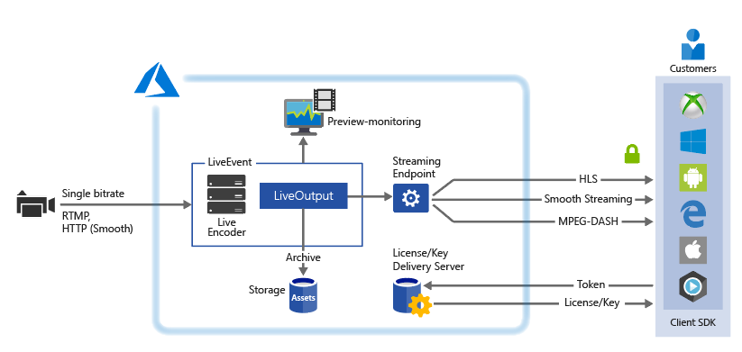
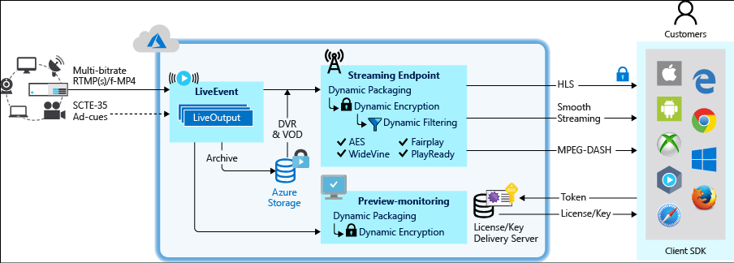

# Live streaming with Azure Media Services v3

When delivering live streaming events with Azure Media Services the following components are commonly involved:

* A camera that is used to broadcast an event.
* A live video encoder that converts signals from the camera (or another device, like laptop) to streams that are sent to the Media Services live streaming service. The signals may also include advertising SCTE-35 and Ad-cues. 
* The Media Services live streaming service enables you to ingest, preview, package, record, encrypt, and broadcast the content to your customers, or to a CDN for further distribution.

This article gives a detailed overview and includes diagrams of major components involved in live streaming with Media Services.

## Overview of main components

In Media Services, [LiveEvents](https://docs.microsoft.com/rest/api/media/liveevents) are responsible for processing live streaming content. A LiveEvent provides an input endpoint (ingest URL) that you then provide to an on-premises live encoder. The LiveEvent receives live input streams from the live encoder in RTMP or Smooth Streaming format and makes it available for streaming through one or more [StreamingEndpoints](https://docs.microsoft.com/rest/api/media/streamingendpoints). A [LiveOutput](https://docs.microsoft.com/rest/api/media/liveoutputs) enables you to control the publishing, recording, and DVR window settings of the live stream. The LiveEvent also provides a preview endpoint (preview URL) that you use to preview and validate your stream before further processing and delivery. 

Media Services provides **Dynamic Packaging**, which allows you to preview and broadcast your content in MPEG DASH, HLS, Smooth Streaming streaming formats without you having to manually repackage into these streaming formats. You can play back with any HLS, DASH, or Smooth compatible players. You can also use [Azure Media Player](http://amp.azure.net/libs/amp/latest/docs/index.html) to test your stream.

Media Services enables you to deliver your content encrypted dynamically (**Dynamic Encryption**) with Advanced Encryption Standard (AES-128) or any of the three major digital rights management (DRM) systems: Microsoft PlayReady, Google Widevine, and Apple FairPlay. Media Services also provides a service for delivering AES keys and DRM (PlayReady, Widevine, and FairPlay) licenses to authorized clients.

If desired, you can also apply **Dynamic Filtering**, which can be used to control the number of tracks, formats, bitrates, that are sent out to the players. Media Services also supports ad-insertion.

## LiveEvent types

A  [LiveEvent](https://docs.microsoft.com/rest/api/media/liveevents) can be one of two types: live encoding and pass-through. 

### Live encoding with Media Services

An on-premises live encoder sends a single-bitrate stream to the LiveEvent that is enabled to perform live encoding with Media Services in one of the following protocols: RTMP or Smooth Streaming (fragmented MP4). The LiveEvent then performs live encoding of the incoming single bitrate stream to a multi-bitrate (adaptive) video stream. When requested, Media Services delivers the stream to customers.

When creating this type of LiveEvent, specify **Basic** (LiveEventEncodingType.Basic).

### Pass-through

Pass-through is optimized for long-running live streams or 24x7 linear live encoding using an on-premises live encoder. The on-premises encoder sends multi-bitrate **RTMP** or **Smooth Streaming** (fragmented MP4) to the LiveEvent that is configured for **pass-through** delivery. The **pass-through** delivery is when the ingested streams pass through **LiveEvent**s without any further processing. 

Pass-through LiveEvents can support up to 4K resolution, and HEVC pass through when used with Smooth Streaming ingest protocol. 

When creating this type of LiveEvent, specify **None** (LiveEventEncodingType.None).

> [!NOTE]
> Using a pass-through method is the most economical way to do live streaming when you are doing multiple events over a long period of time, and you have already invested in on-premises encoders. See [pricing](https://azure.microsoft.com/pricing/details/media-services/) details.
> 

## LiveEvent types comparison 

The following table compares features of the two LiveEvent types.

| Feature | Pass-through LiveEvent | Basic LiveEvent |
| --- | --- | --- |
| Single bitrate input is encoded into multiple bitrates in the cloud |No |Yes |
| Maximum resolution, number of layers |4Kp30  |720p, 6 layers, 30 fps |
| Input protocols |RTMP, Smooth Streaming |RTMP, Smooth Streaming |
| Price |See the [pricing page](https://azure.microsoft.com/pricing/details/media-services/) and click on "Live Video" tab |See the [pricing page](https://azure.microsoft.com/pricing/details/media-services/) |
| Maximum run time |24x7 |24x7 |
| Support for inserting slates |No |Yes |
| Support for ad signaling via API|No |Yes |
| Support for ad signaling via SCTE35 inband|Yes |Yes |
| Pass-through CEA 608/708 captions |Yes |Yes |
| Ability to recover from brief stalls in contribution feed |Yes |No (LiveEvent will begin slating after 6+ seconds w/o input data)|
| Support for non-uniform input GOPs |Yes |No – input must be fixed 2 sec GOPs |
| Support for variable frame rate input |Yes |No – input must be fixed frame rate. Minor variations are tolerated, for example, during high motion scenes. But encoder cannot drop to 10 frames/sec. |
| Auto-shutoff of LiveEvent when input feed is lost |No |After 12 hours, if there is no LiveOutput running |

## LiveEvent states 

The current state of a LiveEvent. Possible values include:

|State|Description|
|---|---|
|**Stopped**| This is the initial state of the LiveEvent after its creation (unless autostart was selected specified.) No billing occurs in this state. In this state, the LiveEvent properties can be updated but streaming is not allowed.|
|**Starting**| The LiveEvent is being started. No billing occurs in this state. No updates or streaming is allowed during this state. If an error occurs, the LiveEvent returns to the Stopped state.|
|**Running**| The LiveEvent is capable of processing live streams. It is now billing usage. You must stop the LiveEvent to prevent further billing.|
|**Stopping**| The LiveEvent is being stopped. No billing occurs in this transient state. No updates or streaming is allowed during this state.|
|**Deleting**| The LiveEvent is being deleted. No billing occurs in this transient state. No updates or streaming is allowed during this state.|

## LiveOutput

A [LiveOutput](https://docs.microsoft.com/rest/api/media/liveoutputs) enables you to control the publishing, recording, and DVR window settings of the live stream. The LiveEvent and LiveOutput relationship is similar to traditional media where a channel (LiveEvent) has a constant stream of content and a program (LiveOutput) is scoped to some timed event on that LiveEvent.
You can specify the number of hours you want to retain the recorded content for the LiveOutput by setting the **ArchiveWindowLength** property. **ArchiveWindowLength** is an ISO 8601 timespan duration of the archive window length (Digital Video Recorder or DVR). This value can be set from a minimum of 5 minutes to a maximum of 25 hours. 

**ArchiveWindowLength** also dictates the maximum number of time clients can seek back in time from the current live position. LiveOutputs can run over the specified amount of time, but content that falls behind the window length is continuously discarded. The value of this property also determines how long the client manifests can grow.

Each LiveOutput is associated with an [Asset](https://docs.microsoft.com/rest/api/media/assets), and records data into a container in the Azure storage attached to the Media Services account. To publish the LiveOutput, you must create a [StreamingLocator](https://docs.microsoft.com/rest/api/media/streaminglocators) for the associated asset. Having this locator will enable you to build a streaming URL that you can provide to your clients.

A LiveEvent supports up to three concurrently running LiveOutputs so you can create multiple archives of the same incoming stream. This allows you to publish and archive different parts of an event as needed. For example, your business requirement is to broadcast a 24x7 live linear feed, but you want to create "recordings" of programs throughout the day to offer to customers as on-demand content for catch-up viewing.  For this scenario, you first create a primary LiveOutput, with a short archive window of 1 hour or less for customers to tune into as the primary live stream. You would create a StreamingLocator for this LiveOutput and publish it to your application or web site as the "Live" feed.  As the feed is running, you can programmatically create a second concurrent LiveOutput at the beginning of a show (or 5 minutes early to provide some handles to trim later.) This second LiveOutput can be stopped 5 minutes after the program or event ends, and you can then create a new StreamingLocator to publish this program as an on-demand asset in your application's catalog.  You can repeat this process multiple times for other program boundaries or highlights that you wish to share as on-demand immediately, all while the "Live" feed from the first LiveOutput continues to broadcast the linear feed.  In addition, you can take advantage of the Dynamic Filter support to trim the head and tail of the archive from the LiveOutput that you introduced for "overlap safety" between programs and achieve a more accurate start and end of the content. Archived content can also be submitted to a [Transform](https://docs.microsoft.com/rest/api/media/transforms) for encoding or frame accurate subclipping to multiple output formats to be used as syndication to other services.

## StreamingEndpoint

Once you have the stream flowing into the LiveEvent, you can begin the streaming event by creating an Asset, LiveOutput, and StreamingLocator. This will archive the stream and make it available to viewers through the [StreamingEndpoint](https://docs.microsoft.com/rest/api/media/streamingendpoints).

When your Media Services account is created a default streaming endpoint is added to your account in the Stopped state. To start streaming your content and take advantage of dynamic packaging and dynamic encryption, the streaming endpoint from which you want to stream content has to be in the Running state.

## Billing

A LiveEvent begins billing as soon as its state transitions to "Running". To stop the LiveEvent from billing, you have to Stop the LiveEvent.

> [!NOTE]
> When **LiveEventEncodingType** on your [LiveEvent](https://docs.microsoft.com/rest/api/media/liveevents) is set to Basic, Media Services will auto shutoff any LiveEvent that is still in the "Running" state 12 hours after the input feed is lost, and there are no LiveOutputs running. However, you will still be billed for the time the LiveEvent was in the "Running" state.
>

The following table shows how LiveEvent states map to the billing mode.

| LiveEvent state | Is it Billing? |
| --- | --- |
| Starting |No (transient state) |
| Running |YES |
| Stopping |No (transient state) |
| Stopped |No |

## Next steps

[Live streaming tutorial](stream-live-tutorial-with-api.md)
