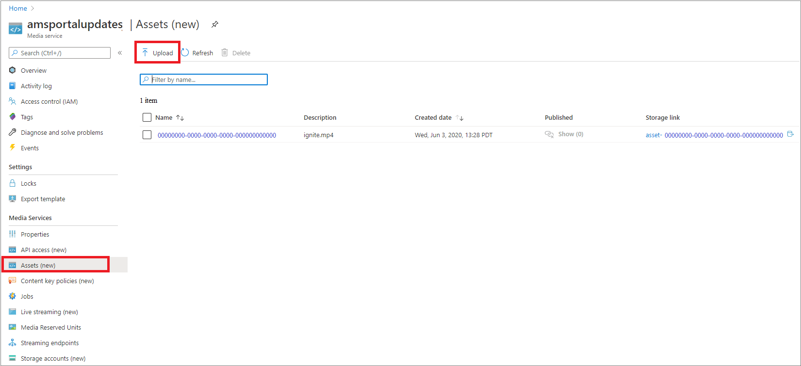
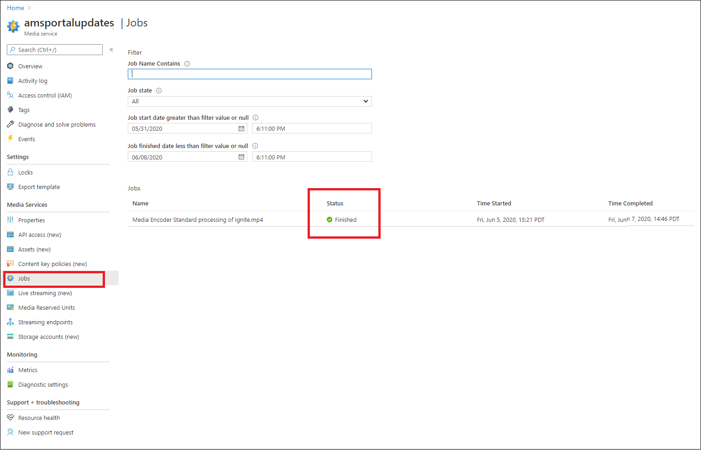
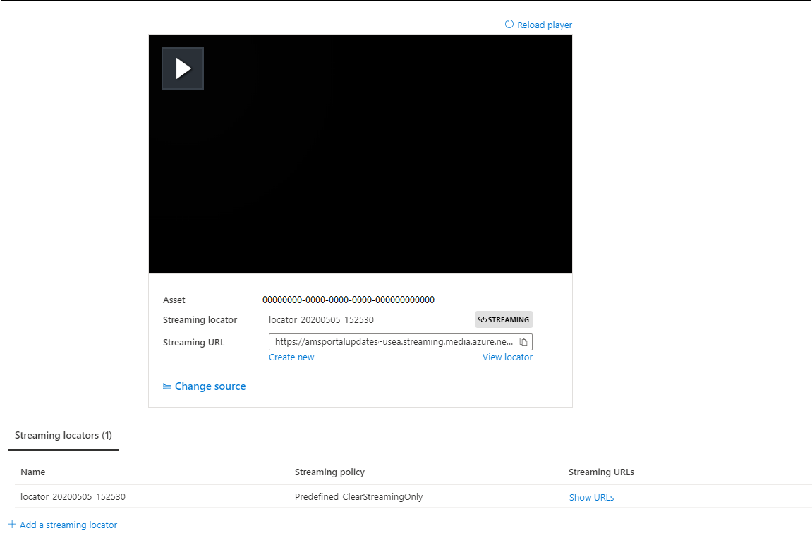

# Quickstart: Upload, encode, and stream content with portal

[!INCLUDE [media services api v3 logo](./includes/v3-hr.md)]

This quickstart shows you how to use the Azure portal to upload, encode, and stream content with Azure Media Services.

> [!NOTE]
> Make sure to review: [the Azure portal limitations for Media Services v3](frequently-asked-questions.md#what-are-the-azure-portal-limitations-for-media-services-v3).
  
## Overview

* To start managing, encrypting, encoding, analyzing, and streaming media content in Azure, you need to create a Media Services account and upload your high-quality digital media file into an **asset**. 
    
    > [!NOTE]
    > If your video was previously uploaded into the Media Services account using Media Services v3 API or the content was generated based on a live output, you will not see the **Encode**, **Analyze**, or **Encrypt** buttons in the Azure portal. Use the Media Services v3 APIs to perform these tasks.

    Review the following: 

  * [Cloud upload and storage](storage-account-concept.md)
  * [Assets concept](assets-concept.md)
* Once you upload your high-quality digital media file into an asset (an input asset), you can process it (encode or analyze). The processed content goes into another asset (output asset). 
    * [Encode](encoding-concept.md) your uploaded file into formats that can be played on a wide variety of browsers and devices.
    * [Analyze](analyzing-video-audio-files-concept.md) your uploaded file. 

        Currently, when using the Azure portal, you can do the following: generate a TTML and WebVTT closed caption files. Files in these formats can be used to make audio and video files accessible to people with hearing disability. You can also extract keywords from your content.

        For a rich experience that enables you to extract insights from your video and audio files, use Media Services v3 presets (as described in [Tutorial: Analyze videos with Media Services v3](analyze-videos-tutorial-with-api.md)).  If you want more detailed insights, use [Video Indexer](../video-indexer/index.yml) directly.    
* Once your content is processed, you can deliver media content to client players. To make videos in the output asset available to clients for playback, you have to create a **streaming locator**. When creating the **streaming locator**, you need to specify a **streaming policy**. **Streaming policies** enable you to define streaming protocols and encryption options (if any) for your **streaming locators**.
    
    Review:

    * [Streaming locators](streaming-locators-concept.md)
    * [Streaming policies](streaming-policy-concept.md)
    * [Packaging and delivery](dynamic-packaging-overview.md)
    * [Filters](filters-concept.md)
* You can protect your content by encrypting it with Advanced Encryption Standard (AES-128) or/and any of the three major DRM systems: Microsoft PlayReady, Google Widevine, and Apple FairPlay. The [Encrypt content with the Azure portal](encrypt-content-quickstart.md) quickstart shows how to configure content protection.
        
## Prerequisites

[!INCLUDE [quickstarts-free-trial-note](../../../includes/quickstarts-free-trial-note.md)]

[Create a Media Services account](create-account-howto.md)

## Upload

1. Sign in at the [Azure portal](https://portal.azure.com/).
1. Locate and click on your Media Services account.
1. Select **Assets (new)**.
1. Press **Upload** in the top of the window. 
1. Drag and drop or browse to a file that you want to upload.

If you navigate to your assets window, you will see that a new asset was added to the list:

## Encode

1. Select **Assets (new)**.
1. Select your new asset (added in the last step).
1. Click **Encode** at the top of the window.

    Pressing this button starts the encoding job. When it completes successfully generates an output asset that contains the encoded content.

If you navigate to your assets window, you will see that the output asset was added to the list:

## Monitor the job progress

To view job status, navigate to **Jobs**. The job usually goes through the following states: Scheduled, Queued, Processing, Finished (the final state). If the job has encountered an error, you get the Error state.

## Publish and stream

To publish an asset, you now need to add a streaming locator to your asset.

### Streaming locator 

1. In the **Streaming locator** section, press **+ Add a streaming locator**.
    This publishes the asset and generates the streaming URLs.

    > [!NOTE]
    > If you want for your stream to be encrypted, you need to create a content key policy and set it on the streaming locator. For details, see [Encrypt content with the Azure portal](encrypt-content-quickstart.md).
1. In the **Add streaming locator** window, you choose one of the predefined streaming policies. For detailed information, see [streaming policies](streaming-policy-concept.md)

    

Once the asset has been published, you can stream it right in the portal. 

Or, copy the streaming URL and use it in your client player.

> [!NOTE]
> Make sure the [streaming endpoint](streaming-endpoint-concept.md) is running. When you first create a Media Service account, the default streaming endpoint is created and it is in a stopped state, so you need to start it before you can stream your content. You're only billed when your streaming endpoint is in the running state.

## Cleanup resources

If you intend to try the other quickstarts, you should hold on to the resources created. Otherwise, go to the Azure portal, browse to your resource groups, select the resource group under which you ran this quickstart, and delete all the resources.

## Next steps

[Use portal to encrypt content](encrypt-content-quickstart.md)
