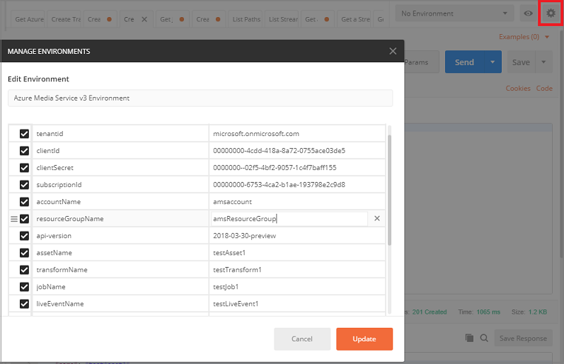
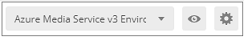
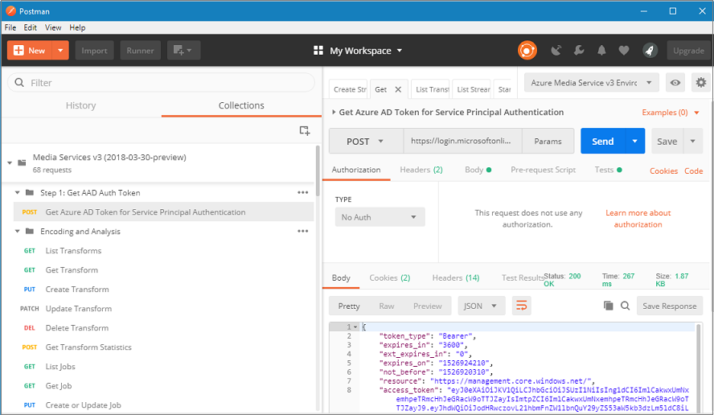

# Configure Postman for Media Services REST API calls

This article shows you how to configure **Postman** so it can be used to call Azure Media Services (AMS) REST APIs. The article shows how to import environment and collection files into **Postman**. The collection contains grouped definitions of HTTP requests that call Azure Media Services (AMS) REST APIs. The environment file contains variables that are used by the collection.

Before you start developing, review [Developing with Media Services v3 APIs](media-services-apis-overview.md).

## Prerequisites

- [Create a Media Services account](create-account-cli-how-to.md). Make sure to remember the resource group name and the Media Services account name. 
- Get information needed to [access APIs](access-api-cli-how-to.md)
- Install the [Postman](https://www.getpostman.com/) REST client to execute the REST APIs shown in some of the AMS REST tutorials. 

    We are using **Postman** but any REST tool would be suitable. Other alternatives are: **Visual Studio Code** with the REST plugin or **Telerik Fiddler**. 

## Download Postman files

Clone a GitHub repository that contains the  Postman collection and environment files.

 ```bash
 git clone https://github.com/Azure-Samples/media-services-v3-rest-postman.git
 ```

## Configure Postman

This section configures the Postman.

### Configure the environment 

1. Open the **Postman**.
2. On the right of the screen, select the **Manage environment** option.

    
4. From the **Manage environment** dialog, click **Import**.
2. Browse to the `Azure Media Service v3 Environment.postman_environment.json` file that was downloaded when you cloned `https://github.com/Azure-Samples/media-services-v3-rest-postman.git`.
6. The **Azure Media Service v3 Environment** environment is added.

    > [!Note]
    > Update access variables with values you got from the **Access the Media Services API** section above.

7. Double-click on the selected file and enter values that you got by following the accessing API steps.
8. Close the dialog.
9. Select the **Azure Media Service v3 Environment** environment from the dropdown.

    
   
### Configure the collection

1. Click **Import** to import the collection file.
1. Browse to the `Media Services v3.postman_collection.json` file that was downloaded when you cloned `https://github.com/Azure-Samples/media-services-v3-rest-postman.git`
3. Choose the **Media Services v3.postman_collection.json** file.

    

## Get Azure AD Token 

Before you start manipulating AMS v3 resources you need to get and set Azure AD Token for Service Principal Authentication.

1. In the left window of the Postman, select "Step 1: Get AAD Auth token".
2. Then, select "Get Azure AD Token for Service Principal Authentication".
3. Press **Send**.

    The following **POST** operation is sent.

    ```
    https://login.microsoftonline.com/:tenantId/oauth2/token
    ```

4. The response comes back with the token and sets the "AccessToken" environment variable to the token value.  

    

## See also

- [Upload files into a Media Services account - REST](upload-files-rest-how-to.md)
- [Create filters with Media Services - REST](filters-dynamic-manifest-rest-howto.md)
- [Azure Resource Manager based REST API](https://github.com/Azure-Samples/media-services-v3-arm-templates)

## Next steps

- [Stream files with REST](stream-files-tutorial-with-rest.md).  
- [Tutorial: Encode a remote file based on URL and stream the video - REST](stream-files-tutorial-with-rest.md)
