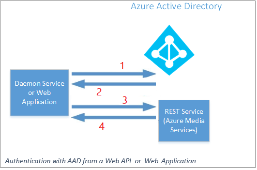

---
# Mandatory fields. See more on aka.ms/skyeye/meta.
title: Develop with v3 APIs
titleSuffix: Azure Media Services
description: Learn about rules that apply to entities and APIs when developing with Media Services v3. 
services: media-services
documentationcenter: ''
author: Juliako
manager: femila
editor: ''

ms.service: media-services
ms.workload: 
ms.topic: article
ms.date: 10/21/2019
ms.author: juliako
ms.custom: seodec18

---

# Develop with Media Services v3 APIs

As a developer, you can use Media Services [REST API](https://docs.microsoft.com/rest/api/media/) or client libraries that allow you to interact with the REST API to easily create, manage, and maintain custom media workflows. The [Media Services v3](https://aka.ms/ams-v3-rest-sdk) API is based on the OpenAPI specification (formerly known as a Swagger).

This article discusses rules that apply to entities and APIs when you develop with Media Services v3.

## Accessing the Azure Media Services API

To be authorized to access Media Services resources and the Media Services API, you must first be authenticated. Media Services supports [Azure Active Directory (Azure AD)-based](../../active-directory/fundamentals/active-directory-whatis.md) authentication. Two common authentication options are:
 
* **Service principal authentication**: Used to authenticate a service (for example: web apps, function apps, logic apps, API, and microservices). Applications that commonly use this authentication method are apps that run daemon services, middle-tier services, or scheduled jobs. For example, for web apps there should always be a mid-tier that connects to Media Services with a Service Principal.
* **User authentication**: Used to authenticate a person who is using the app to interact with Media Services resources. The interactive app should first prompt the user for the user's credentials. An example is a management console app used by authorized users to monitor encoding jobs or live streaming.

The Media Services API requires that the user or app making the REST API requests have access to the Media Services account resource and use a **Contributor** or **Owner** role. The API can be accessed with the **Reader** role but only **Get** or **List**  operations will be available. For more information, see [Role-based access control for Media Services accounts](rbac-overview.md).

Instead of creating a service principal, consider using managed identities for Azure resources to access the Media Services API through Azure Resource Manager. To learn more about managed identities for Azure resources, see [What is managed identities for Azure resources](../../active-directory/managed-identities-azure-resources/overview.md).

### Azure AD service principal

If you're creating an Azure AD app and service principal, the app has to be in its own tenant. After you create the app, give the app **Contributor** or **Owner** role access to the Media Services account.

If you're not sure whether you have permissions to create an Azure AD app, see [Required permissions](../../active-directory/develop/howto-create-service-principal-portal.md#permissions-required-for-registering-an-app).

In the following figure, the numbers represent the flow of the requests in chronological order:

1. A middle-tier app requests an Azure AD access token that has the following parameters:  

   * Azure AD tenant endpoint.
   * Media Services resource URI.
   * Resource URI for REST Media Services.
   * Azure AD app values: the client ID and client secret.

   To get all the needed values, 
see [Access Azure Media Services API](access-api-cli-how-to.md).

2. The Azure AD access token is sent to the middle tier.
4. The middle tier sends request to the Azure Media REST API with the Azure AD token.
5. The middle tier gets back the data from Media Services.

### Samples

See the following samples that show how to connect with Azure AD service principal:

* [Connect with REST](media-rest-apis-with-postman.md)  
* [Connect with Java](configure-connect-java-howto.md)
* [Connect with .NET](configure-connect-dotnet-howto.md)
* [Connect with Node.js](configure-connect-nodejs-howto.md)
* [Connect with Python](configure-connect-python-howto.md)

## Naming conventions

Azure Media Services v3 resource names (for example, Assets, Jobs, Transforms) are subject to Azure Resource Manager naming constraints. In accordance with Azure Resource Manager, the resource names are always unique. Thus, you can use any unique identifier strings (for example, GUIDs) for your resource names.

Media Services resource names can't include: '<', '>', '%', '&', ':', '&#92;', '?', '/', '*', '+', '.', the single quote character, or any control characters. All other characters are allowed. The max length of a resource name is 260 characters.

For more information about Azure Resource Manager naming, see [Naming requirements](https://github.com/Azure/azure-resource-manager-rpc/blob/master/v1.0/resource-api-reference.md#arguments-for-crud-on-resource) and [Naming conventions](/azure/cloud-adoption-framework/ready/azure-best-practices/naming-and-tagging).

### Names of files/blobs within an asset

The names of files/blobs within an asset must follow both the [blob name requirements](https://docs.microsoft.com/rest/api/storageservices/Naming-and-Referencing-Containers--Blobs--and-Metadata) and the [NTFS name requirements](https://docs.microsoft.com/windows/win32/fileio/naming-a-file). The reason for these requirements is the files can get copied from blob storage to a local NTFS disk for processing.

## Long-running operations

The operations marked with `x-ms-long-running-operation` in the Azure Media Services [swagger files](https://github.com/Azure/azure-rest-api-specs/blob/master/specification/mediaservices/resource-manager/Microsoft.Media/stable/2018-07-01/streamingservice.json) are long running operations. 

For details about how to track asynchronous Azure operations, see [Async operations](https://docs.microsoft.com/azure/azure-resource-manager/resource-manager-async-operations#monitor-status-of-operation).

Media Services has the following long-running operations:

* [Create Live Events](https://docs.microsoft.com/rest/api/media/liveevents/create)
* [Update Live Events](https://docs.microsoft.com/rest/api/media/liveevents/update)
* [Delete Live Event](https://docs.microsoft.com/rest/api/media/liveevents/delete)
* [Start Live Event](https://docs.microsoft.com/rest/api/media/liveevents/start)
* [Stop LiveEvent](https://docs.microsoft.com/rest/api/media/liveevents/stop)

  Use the `removeOutputsOnStop` parameter to delete all associated Live Outputs when stopping the event.  
* [Reset LiveEvent](https://docs.microsoft.com/rest/api/media/liveevents/reset)
* [Create LiveOutput](https://docs.microsoft.com/rest/api/media/liveevents/create)
* [Delete LiveOutput](https://docs.microsoft.com/rest/api/media/liveevents/delete)
* [Create StreamingEndpoint](https://docs.microsoft.com/rest/api/media/streamingendpoints/create)
* [Update StreamingEndpoint](https://docs.microsoft.com/rest/api/media/streamingendpoints/update)
* [Delete StreamingEndpoint](https://docs.microsoft.com/rest/api/media/streamingendpoints/delete)
* [Start StreamingEndpoint](https://docs.microsoft.com/rest/api/media/streamingendpoints/start)
* [Stop StreamingEndpoint](https://docs.microsoft.com/rest/api/media/streamingendpoints/stop)
* [Scale StreamingEndpoint](https://docs.microsoft.com/rest/api/media/streamingendpoints/scale)

On successful submission of a long operation, you receive a '202 Accepted' and must poll for operation completion using the returned operation ID.

The [track asynchronous Azure operations](https://docs.microsoft.com/azure/azure-resource-manager/resource-manager-async-operations) article explains in depth how to track the status of asynchronous Azure operations through values returned in the response.

Only one long-running operation is supported for a given Live Event or any of its associated Live Outputs. Once started, a long running operation must complete before starting a subsequent long-running operation on the same LiveEvent or any associated Live Outputs. For Live Events with multiple Live Outputs, you must await the completion of a long running operation on one Live Output before triggering a long running operation on another Live Output. 

## SDKs

> [!NOTE]
> The Azure Media Services v3 SDKs aren't guaranteed to be thread-safe. When developing a multi-threaded app, you should add your own thread synchronization logic to protect the client or use a new AzureMediaServicesClient object per thread. You should also be careful of multi-threading issues introduced by optional objects provided by your code to the client (like an HttpClient instance in .NET).

|SDK|Reference|
|---|---|
|[.NET SDK](https://aka.ms/ams-v3-dotnet-sdk)|[.NET ref](https://aka.ms/ams-v3-dotnet-ref)|
|[Java SDK](https://aka.ms/ams-v3-java-sdk)|[Java ref](https://aka.ms/ams-v3-java-ref)|
|[Python SDK](https://aka.ms/ams-v3-python-sdk)|[Python ref](https://aka.ms/ams-v3-python-ref)|
|[Node.js SDK](https://aka.ms/ams-v3-nodejs-sdk) |[Node.js ref](/javascript/api/overview/azure/mediaservices/management)| 
|[Go SDK](https://aka.ms/ams-v3-go-sdk) |[Go ref](https://aka.ms/ams-v3-go-ref)|
|[Ruby SDK](https://aka.ms/ams-v3-ruby-sdk)||

### See also

- [EventGrid .NET SDK that includes Media Service events](https://www.nuget.org/packages/Microsoft.Azure.EventGrid/)
- [Definitions of Media Services events](https://github.com/Azure/azure-rest-api-specs/blob/master/specification/eventgrid/data-plane/Microsoft.Media/stable/2018-01-01/MediaServices.json)

## Azure Media Services Explorer

[Azure Media Services Explorer](https://github.com/Azure/Azure-Media-Services-Explorer) (AMSE) is a tool available to Windows customers who want to learn about Media Services. AMSE is a Winforms/C# application that does upload, download, encode, stream VOD and live content with Media Services. The AMSE tool is for clients who want to test Media Services without writing any code. The AMSE code is provided as a resource for customers who want to develop with Media Services.

AMSE is an Open Source project, support is provided by the community (issues can be reported to https://github.com/Azure/Azure-Media-Services-Explorer/issues). This project has adopted the [Microsoft Open Source Code of Conduct](https://opensource.microsoft.com/codeofconduct/). For more information, see the [Code of Conduct FAQ](https://opensource.microsoft.com/codeofconduct/faq/) or contact opencode@microsoft.com with any other questions or comments.

## Filtering, ordering, paging of Media Services entities

See [Filtering, ordering, paging of Azure Media Services entities](entities-overview.md).

## Ask questions, give feedback, get updates

Check out the [Azure Media Services community](media-services-community.md) article to see different ways you can ask questions, give feedback, and get updates about Media Services.

## See also

To get all the needed values, see [Access Azure Media Services API](access-api-cli-how-to.md).

## Next steps

* [Connect to Media Services with Java](configure-connect-java-howto.md)
* [Connect to Media Services with .NET](configure-connect-dotnet-howto.md)
* [Connect to Media Services with Node.js](configure-connect-nodejs-howto.md)
* [Connect to Media Services with Python](configure-connect-python-howto.md)
