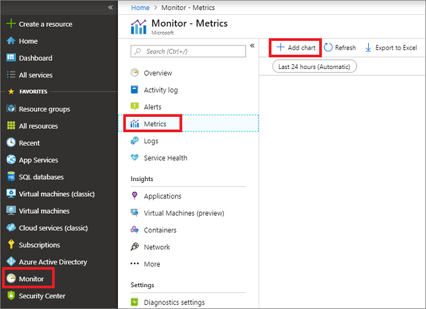
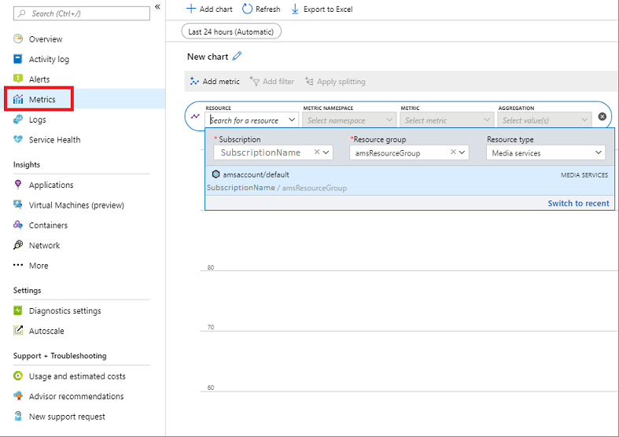
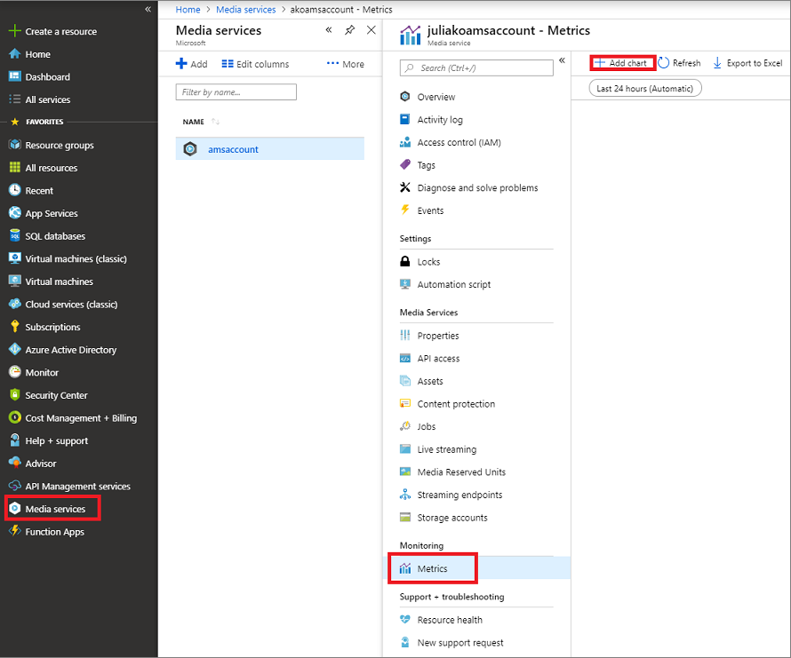

# Monitor Media Services metrics and diagnostic logs

[Azure Monitor](../../azure-monitor/overview.md) enables you to monitor metrics and diagnostic logs that help you understand how your applications are performing. You can monitor Media Services diagnostic logs and create alerts and notifications for the collected metrics and logs. You can send logs to [Azure Storage](https://azure.microsoft.com/services/storage/), stream them to [Azure Event Hubs](https://azure.microsoft.com/services/event-hubs/), and export them to [Log Analytics](https://azure.microsoft.com/services/log-analytics/), or use 3rd party services.

For detailed information, see [Azure Monitor Metrics](../../azure-monitor/platform/data-collection.md) and [Azure Monitor Diagnostic logs](../../azure-monitor/platform/diagnostic-logs-overview.md).

This topic discusses currently available [Media Services Metrics](#media-services-metrics) and [Media Services Diagnostic logs](#media-services-diagnostic-logs).

## Media Services metrics

Currently, you can view the following metrics:

|Name|Description|
|---|---|
|Requests|Gives details around total # of requests serviced by streaming endpoint.|
|Egress|Total number of egress bytes. For example, bytes streamed by streaming endpoint.|
|Success end to end Latency| Gives information about end to end latency of successful requests.|

You can [view metrics using the Azure portal](#view-metrics-using-portal) or [query metrics using the Azure CLI](#query-metrics-using-cli). 

### View metrics using portal 

You can view metrics using the Azure portal either from Azure Monitor or from your Media Services account.

#### Azure Monitor - Metrics 

In the Azure portal, navigate to **Monitor** -> **Metrics**.

Add a chart for your Media Services resource.

Add metrics that you want to monitor.

#### Media Services account - Metrics

In the Azure portal, navigate to <*your account*> -> **Metrics**.

Then, add a chart and a metric that you want to monitor.

For more information, see [Monitoring data collected by Azure Monitor](../../azure-monitor/platform/data-collection.md).

## Media Services diagnostic logs

Currently, you can get the following diagnostic logs:

|Name|Description|
|---|---|
|Key delivery service request|Logs that show the key delivery service request information. For more details, see [schemas](media-services-diagnostic-logs-schema.md).|

### Collect and consume log data from your Azure resources

See [How to collect and consume log data from your Azure resources](../../azure-monitor/platform/diagnostic-logs-overview.md).

# Next steps 

[Azure Monitor](../../azure-monitor/overview.md)
