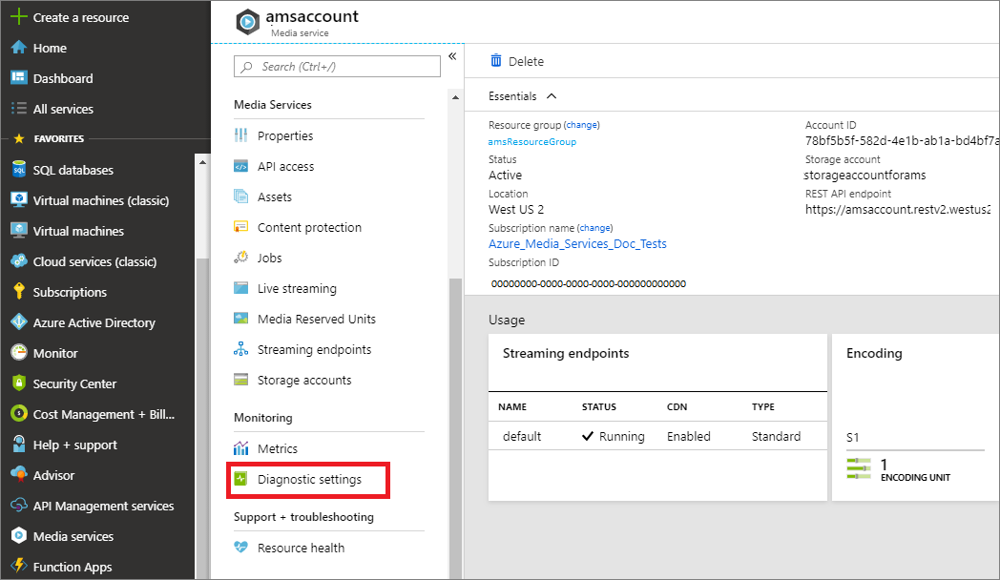
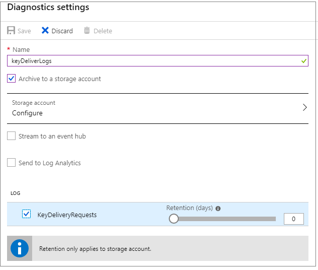

# Monitor Media Services diagnostic logs

[Azure Monitor](../../azure-monitor/overview.md) enables you to monitor metrics and diagnostic logs that help you understand how your applications are performing. For detailed description of this feature and to see why you would want to use Azure Media Services metrics and diagnostics logs, see [Monitor Media Services metrics and diagnostic logs](media-services-metrics-diagnostic-logs.md).

This article shows you how to route data to the storage account and then view the data.

## Prerequisites

- [Create a Media Services account](create-account-cli-how-to.md).
- Review  [Monitor Media Services metrics and diagnostic logs](media-services-metrics-diagnostic-logs.md).

## Route data to the storage account using the portal

1. Log in to the Azure portal at https://portal.azure.com.
1. Navigate to your Media Services account in and click **Diagnostic Settings** under **Monitor**. Here you see a list of all resources in your subscription that produce monitoring data through Azure Monitor.

    

1. Click **Add diagnostic setting**.

   A resource diagnostic setting is a definition of *what* monitoring data should be routed from a particular resource and *where* that monitoring data should go.

1. In the section that appears, give your setting a **name** and check the box for **Archive to a storage account**.

    Select the storage account to which you want to send logs and press **OK**.
1. Check all the boxes under **Log** and **Metric**. Depending on the resource type, you may only have one of these options. These checkboxes control what categories of log and metric data available for that resource type are sent to the destination you've selected, in this case, a storage account.

   
1. Set the **Retention (days)** slider to 30. This slider sets a number of days to retain the monitoring data in the storage account. Azure Monitor automatically deletes data older than the number of days specified. A retention of zero days stores the data indefinitely.
1. Click **Save**.

Monitoring data from your resource is now flowing into the storage account.

## Route data to the storage account using the Azure CLI

To enable storage of diagnostic logs in a Storage Account, you would run the following `az monitor diagnostic-settings` Azure CLI command:

```azurecli-interactive
az monitor diagnostic-settings create --name <diagnostic name> \
    --storage-account <name or ID of storage account> \
    --resource <target resource object ID> \
    --resource-group <storage account resource group> \
    --logs '[
    {
        "category": <category name>,
        "enabled": true,
        "retentionPolicy": {
            "days": <# days to retain>,
            "enabled": true
        }
    }]'
```

For example:

```azurecli-interactive
az monitor diagnostic-settings create --name amsv3diagnostic \
    --storage-account storageaccountforams  \
    --resource "/subscriptions/00000000-0000-0000-0000-0000000000/resourceGroups/amsResourceGroup/providers/Microsoft.Media/mediaservices/amsaccount" \
    --resource-group "amsResourceGroup" \
    --logs '[{"category": "KeyDeliveryRequests",  "enabled": true, "retentionPolicy": {"days": 3, "enabled": true }}]'
```

## View data in the storage account using the portal

If you have followed the preceding steps, data has begun flowing to your storage account.

You may need to wait up to five minutes before the event appears in the storage account.

1. In the portal, navigate to the **Storage Accounts** section by finding it on the left-hand navigation bar.
1. Identify the storage account you created in the preceding section and click on it.
1. Click on **Blobs**, then on the container labeled **insights-logs-keydeliveryrequests**. This is the container that has your logs in it. Monitoring data is broken out into containers by resource ID, then by date and time.
1. Navigate to the PT1H.json file by clicking into the containers for resource ID, date, and time. Click on the PT1H.json file and click **Download**.

 You can now view the JSON event that was stored in the storage account.

### Examples of PT1H.json

#### Clear key delivery log

```json
{
  "time": "2019-05-21T00:07:33.2820450Z",
  "resourceId": "/SUBSCRIPTIONS/00000000-0000-0000-0000-0000000000000/RESOURCEGROUPS/amsResourceGroup/PROVIDERS/MICROSOFT.MEDIA/MEDIASERVICES/AMSACCOUNT",
  "operationName": "MICROSOFT.MEDIA/MEDIASERVICES/CONTENTKEYS/READ",
  "operationVersion": "1.0",
  "category": "KeyDeliveryRequests",
  "resultType": "Succeeded",
  "resultSignature": "OK",
  "durationMs": 253,
  "identity": {
    "authorization": {
      "issuer": "myIssuer",
      "audience": "myAudience"
    },
    "claims": {
      "urn:microsoft:azure:mediaservices:contentkeyidentifier": "e4276e1d-c012-40b1-80d0-ac15808b9277",
      "nbf": "1558396914",
      "exp": "1558400814",
      "iss": "myIssuer",
      "aud": "myAudience"
    }
  },
  "level": "Informational",
  "location": "westus2",
  "properties": {
    "requestId": "fb5c2b3a-bffa-4434-9c6f-73d689649add",
    "keyType": "Clear",
    "keyId": "e4276e1d-c012-40b1-80d0-ac15808b9277",
    "policyName": "SharedContentKeyPolicyUsedByAllAssets",
    "tokenType": "JWT",
    "statusMessage": "OK"
  }
}
```

#### Widevine encrypted key delivery log

```json
{
  "time": "2019-05-20T23:15:22.7088747Z",
  "resourceId": "/SUBSCRIPTIONS/00000000-0000-0000-0000-0000000000000/RESOURCEGROUPS/amsResourceGroup/PROVIDERS/MICROSOFT.MEDIA/MEDIASERVICES/AMSACCOUNT",
  "operationName": "MICROSOFT.MEDIA/MEDIASERVICES/CONTENTKEYS/READ",
  "operationVersion": "1.0",
  "category": "KeyDeliveryRequests",
  "resultType": "Succeeded",
  "resultSignature": "OK",
  "durationMs": 69,
  "identity": {
    "authorization": {
      "issuer": "myIssuer",
      "audience": "myAudience"
    },
    "claims": {
      "urn:microsoft:azure:mediaservices:contentkeyidentifier": "0092d23a-0a42-4c5f-838e-6d1bbc6346f8",
      "nbf": "1558392430",
      "exp": "1558396330",
      "iss": "myIssuer",
      "aud": "myAudience"
    }
  },
  "level": "Informational",
  "location": "westus2",
  "properties": {
    "requestId": "49613dd2-16aa-4595-a6e0-4e68beae6d37",
    "keyType": "Widevine",
    "keyId": "0092d23a-0a42-4c5f-838e-6d1bbc6346f8",
    "policyName": "DRMContentKeyPolicy",
    "tokenType": "JWT",
    "statusMessage": "OK"
  }
}
```

## Additional notes

* Widevine is a service provided by Google Inc. and subject to the terms of service and Privacy Policy of Google, Inc.

## See also

* [Azure Monitor Metrics](../../azure-monitor/platform/data-platform.md)
* [Azure Monitor Diagnostic logs](../../azure-monitor/platform/platform-logs-overview.md)
* [How to collect and consume log data from your Azure resources](../../azure-monitor/platform/platform-logs-overview.md)

## Next steps

[Monitor metrics](media-services-metrics-howto.md)
