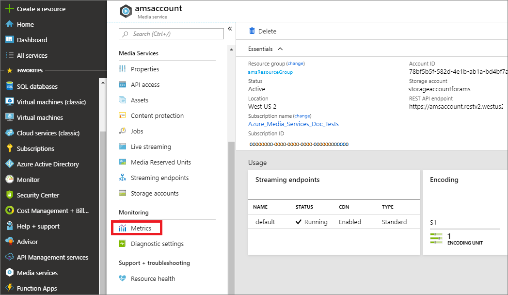

# Monitor Media Services metrics 

Metrics are collected at regular intervals whether or not the value changes. They're useful for alerting because they can be sampled frequently, and an alert can be fired quickly with relatively simple logic.

Currently, the following Media Services [Streaming Endpoints](streaming-endpoint-concept.md) metrics are emitted by Azure:

|Metric|Display name|Description|
|---|---|---|
|Requests|Requests|Gives details around total # of requests serviced by the Streaming Endpoint.|
|Egress|Egress|Total number of egress bytes. For example, bytes streamed by the Streaming Endpoint.|
|SuccessE2ELatency|Success end to end Latency|Time duration from when Streaming Endpoint received request and when last byte of the response was sent.|

Azure Monitor provides several ways to interact with metrics, including charting them in the portal, accessing them through the REST API, or querying them using CLI. This article shows how to monitor metrics with the Azure portal charts and Azure CLI.

## Prerequisites

* [Create a Media Services account](create-account-cli-how-to.md)
* Review [Monitor Media Services metrics and diagnostic logs](media-services-metrics-diagnostic-logs.md)

## View metrics in Azure portal

1. Log in to the Azure portal at https://portal.azure.com.
1. Navigate to you Azure Media Services account and select **Metrics**.

    
1. Select the resource for which you want to monitor metrics.

    
1. Give your chart a name.
1. Add metrics that you want to view.

    
1. You can pin your chart to your dashboard.

## View metrics with Azure CLI

To get "Egress" metrics with CLI, you would run the following `az monitor metrics` CLI command:

```cli
az monitor metrics list --resource \
   "/subscriptions/<subscription id>/resourcegroups/<resource group name>/providers/Microsoft.Media/mediaservices/<Media Services account name>/streamingendpoints/<streaming endpoint name>" \
   --metric "Egress"
```

To get other metrics, substitute "Egress" for the metric name you are interested in.

## See also

* [Azure Monitor Metrics](../../azure-monitor/platform/data-platform.md)
* [Create, view, and manage metric alerts using Azure Monitor](../../azure-monitor/platform/alerts-metric.md).

## Next steps

[Diagnostic logs](media-services-diagnostic-logs-howto.md)
