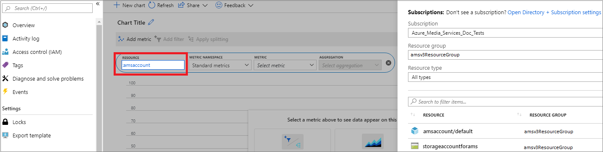
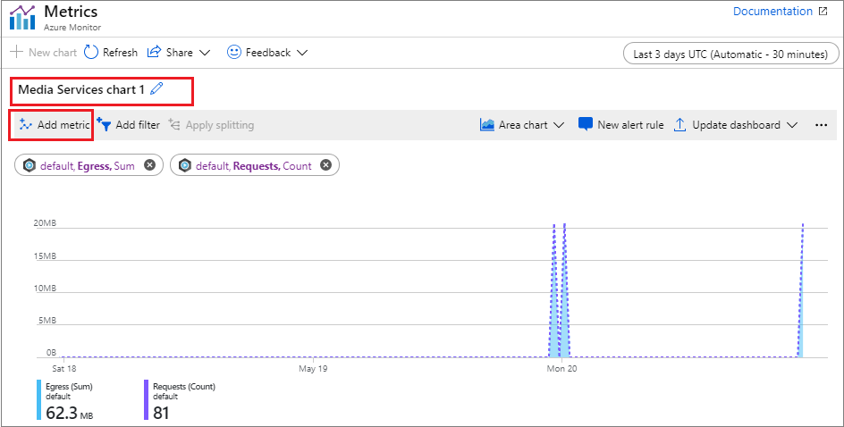

# Monitor Media Services metrics 

[Azure Monitor](../../azure-monitor/overview.md) enables you to monitor metrics and diagnostic logs that help you understand how your applications are performing. For detailed description of this feature and to see why you would want to use Azure Media Services metrics and diagnostics logs, see [Monitor Media Services metrics and diagnostic logs](media-services-metrics-diagnostic-logs.md).

Azure Monitor provides several ways to interact with metrics, including charting them in the portal, accessing them through the REST API, or querying them using CLI. This article shows how to monitor metrics with the Azure portal charts and Azure CLI.

## Prerequisites

- [Create a Media Services account](create-account-cli-how-to.md)
- Review  [Monitor Media Services metrics and diagnostic logs](media-services-metrics-diagnostic-logs.md)

## View metrics in Azure portal

1. Sign in to the Azure portal at https://portal.azure.com.
1. Navigate to your Azure Media Services account and select **Metrics**.
1. Click the **RESOURCE** box and select the resource for which you want to monitor metrics. 

    The **Select a resource** window appears on the right with the list of resources available to you. In this case you see 

    * &lt;Media Services account name&gt;
    * &lt;Media Services account name&gt;/&lt;streaming endpoint name&gt;
    * &lt;storage account name&gt;

    Select the resource and press **Apply**. For details about supported resources and metrics, see [Monitor Media Services metrics](media-services-metrics-diagnostic-logs.md).
 
    
    
    > [!NOTE]
    > To switch between resources for which you want to monitor metrics, click on the **RESOURCE** box again and repeat this step.
1. (Optionally) give your chart a name (edit the name by pressing the pencil at the top).
1. Add metrics that you want to view.

    
1. You can pin your chart to your dashboard.

## View metrics with Azure CLI

To get "Egress" metrics with CLI, you would run the following `az monitor metrics` CLI command:

```cli
az monitor metrics list --resource \
   "/subscriptions/<subscription id>/resourcegroups/<resource group name>/providers/Microsoft.Media/mediaservices/<Media Services account name>/streamingendpoints/<streaming endpoint name>" \
   --metric "Egress"
```

To get other metrics, substitute "Egress" for the metric name you are interested in.

## See also

* [Azure Monitor Metrics](../../azure-monitor/platform/data-platform.md)
* [Create, view, and manage metric alerts using Azure Monitor](../../azure-monitor/platform/alerts-metric.md).

## Next steps

[Diagnostic logs](media-services-diagnostic-logs-howto.md)
