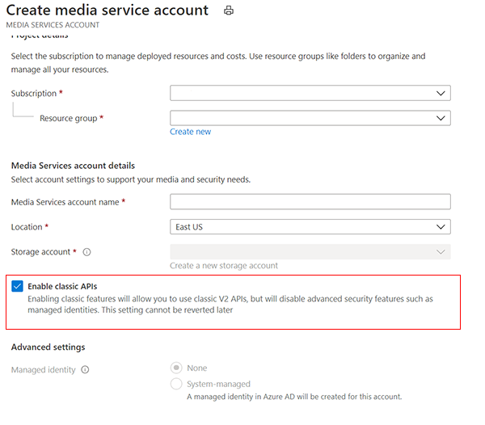

# API access differences between Azure Media Services V2 to v3 API

This article describes the API access differences between Azure Media Services V2 to V3.

## API Access

All Media Services accounts will have access to the V3 API. However, we strongly
recommend migration development on a fresh account before applying updated code
to an existing V2 account. This is because V3 entities aren't backwards
compatible with V2. Some V2 entities like Assets are forward compatible with V3.
You can continue to use existing accounts if you don’t mix the V2 and V3 APIs
and then try to go back to V2, but this is discouraged.

Access to the V2 API will be available until it is retired in 2024.

While you are migrating, you can create a V3 account that still has access to V2.  Creating the account can be done with:

- The REST API and older version
- Selecting the checkbox in the portal.

> [!div class="mx-imgBorder"]
> 

All the .NET, CLI, and other SDKs will be targeting the latest 2020-05-01 API, so find or configure the older API versions.

> [!NOTE]
> New accounts created with the 2020-05-01 API cannot use V2 APIs.

## Next steps

[!INCLUDE [migration guide next steps](./includes/migration-guide-next-steps.md)]
