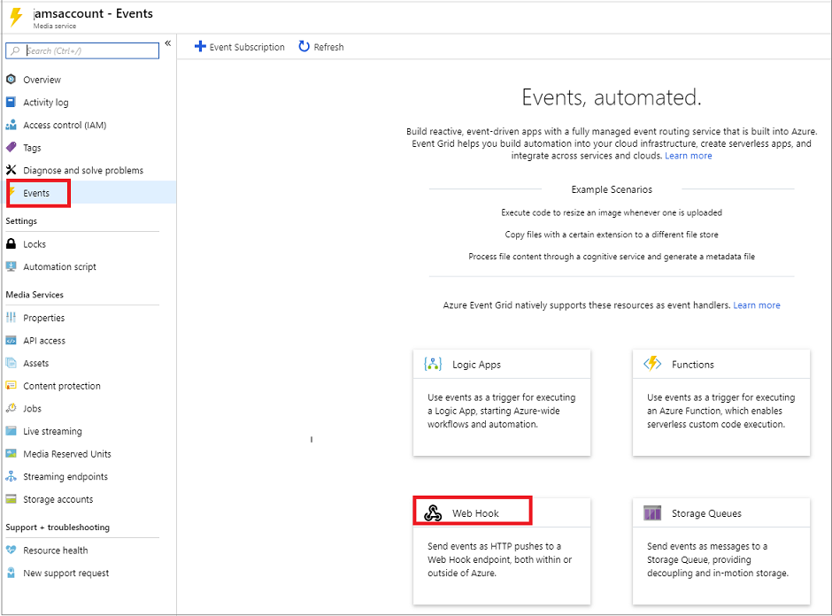
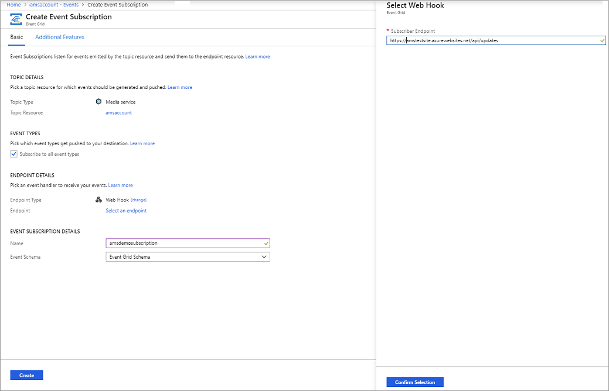

# Create and monitor Media Services events with Event Grid using the Azure portal

Azure Event Grid is an eventing service for the cloud. In this article, you use the Azure portal to subscribe to events for your Azure Media Services account and trigger events to view the result. Typically, you send events to an endpoint that processes the event data and takes actions. However, to simplify this article, you send the events to a web app that collects and displays the messages.

When you're finished, you see that the event data has been sent to the web app.

## Prerequisites 

Create a new Azure Media Services account, as described in [this quickstart](create-account-cli-quickstart.md).

## Create a message endpoint

Before subscribing to the events for the Media Services account, let's create the endpoint for the event message. Typically, the endpoint takes actions based on the event data. To simplify this article, you deploy a [pre-built web app](https://github.com/Azure-Samples/azure-event-grid-viewer) that displays the event messages. The deployed solution includes an App Service plan, an App Service web app, and source code from GitHub.

1. Select **Deploy to Azure** to deploy the solution to your subscription. In the Azure portal, provide values for the parameters.

   

1. The deployment may take a few minutes to complete. After the deployment has succeeded, view your web app to make sure it's running. In a web browser, navigate to: 
`https://<your-site-name>.azurewebsites.net`

If you switch to the "Azure Event Grid Viewer" site, you see it has no events yet.
   
[!INCLUDE [event-grid-register-provider-portal.md](../../includes/event-grid-register-provider-portal.md)]

## Subscribe to Media Services events

You subscribe to a topic to tell Event Grid which events you want to track, and where to send the events.

1. In the portal, select your Media Services account and select **Events**.
1. To send events to your viewer app, use a web hook for the endpoint. Select **More Options**, and **Web Hook**.

   

1. The event subscription is prefilled with values for your Media Services account. For the web hook endpoint, provide the URL of your web app and add `api/updates` to the home page URL. Give your subscription a name. When done, select **Create**.

   

1. Press **Confirm Selection**.
1. Press **Create**.
1. View your web app again, and notice that a subscription validation event has been sent to it. Event Grid sends the validation event so the endpoint can verify that it wants to receive event data. The web app includes code to validate the subscription. 

    Select the eye icon to expand the event data. Do not refresh the page, if you want to view all the events.

   

Now, let's trigger an event to see how Event Grid distributes the message to your endpoint.

## Send an event to your endpoint

You can trigger events for the Media Services account running an encoding job. You can follow [this quickstart](stream-files-dotnet-quickstart.md) to encode a file and start sending events. If you subscribed to all events, you will see a screen similar to this:

## Next steps

[Upload, encode, and stream](stream-files-tutorial-with-api.md)
