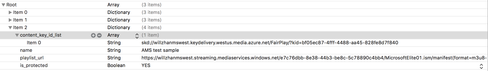

# Offline FairPlay Streaming for iOS with Media Services v3

 Azure Media Services provides a set of well-designed [content protection services](https://azure.microsoft.com/services/media-services/content-protection/) that cover:

- Microsoft PlayReady
- Google Widevine
    
    Widevine is a service provided by Google Inc. and subject to the terms of service and Privacy Policy of Google, Inc.
- Apple FairPlay
- AES-128 encryption

Digital rights management (DRM)/Advanced Encryption Standard (AES) encryption of content is performed dynamically upon request for various streaming protocols. DRM license/AES decryption key delivery services also are provided by Media Services.

Besides protecting content for online streaming over various streaming protocols, offline mode for protected content is also an often-requested feature. Offline-mode support is needed for the following scenarios:

* Playback when internet connection isn't available, such as during travel.
* Some content providers might disallow DRM license delivery beyond a country/region's border. If users want to watch content while traveling outside of the country/region, offline download is needed.
* In some countries/regions, internet availability and/or bandwidth is still limited. Users might choose to download first to be able to watch content in a resolution that is high enough for a satisfactory viewing experience. In this case, the issue typically isn't network availability but limited network bandwidth. Over-the-top (OTT)/online video platform (OVP) providers request offline-mode support.

This article covers FairPlay Streaming (FPS) offline-mode support that targets devices running iOS 10 or later. This feature isn't supported for other Apple platforms, such as watchOS, tvOS, or Safari on macOS.

> [!NOTE]
> Offline DRM is only billed for making a single request for a license when you download the content. Any errors are not billed.

## Prerequisites

Before you implement offline DRM for FairPlay on an iOS 10+ device:

* Review online content protection for FairPlay: 

    - [Apple FairPlay license requirements and configuration](fairplay-license-overview.md)
    - [Use DRM dynamic encryption and license delivery service](protect-with-drm.md)
    - A .NET sample that includes configuration of online FPS streaming: [ConfigureFairPlayPolicyOptions](https://github.com/Azure-Samples/media-services-v3-dotnet-tutorials/blob/master/AMSV3Tutorials/EncryptWithDRM/Program.cs#L505)
* Obtain the FPS SDK from the Apple Developer Network. The FPS SDK contains two components:

    - The FPS Server SDK, which contains the Key Security Module (KSM), client samples, a specification, and a set of test vectors.
    - The FPS Deployment Pack, which contains the D function specification, along with instructions about how to generate the FPS Certificate, customer-specific private key, and Application Secret Key. Apple issues the FPS Deployment Pack only to licensed content providers.
* Clone https://github.com/Azure-Samples/media-services-v3-dotnet-tutorials.git. 

    You will need to modify the code in [Encrypt with DRM using .NET](https://github.com/Azure-Samples/media-services-v3-dotnet-tutorials/tree/master/AMSV3Tutorials/EncryptWithDRM) to add FairPlay configurations.  

## Configure content protection in Azure Media Services

In the [GetOrCreateContentKeyPolicyAsync](https://github.com/Azure-Samples/media-services-v3-dotnet-tutorials/blob/master/AMSV3Tutorials/EncryptWithDRM/Program.cs#L189) method, do the following:

Uncomment the code that configures the FairPlay policy option:

```csharp
ContentKeyPolicyFairPlayConfiguration fairplayConfig = ConfigureFairPlayPolicyOptions();
```

Also, uncomment the code that adds CBCS ContentKeyPolicyOption into the list of ContentKeyPolicyOptions

```csharp
options.Add(
    new ContentKeyPolicyOption()
    {
        Configuration = fairplayConfig,
        Restriction = restriction,
        Name = "ContentKeyPolicyOption_CBCS"
    });
```

## Enable offline mode

To enable offline mode, create a custom StreamingPolicy and use its name when creating a StreamingLocator in [CreateStreamingLocatorAsync](https://github.com/Azure-Samples/media-services-v3-dotnet-tutorials/blob/master/AMSV3Tutorials/EncryptWithDRM/Program.cs#L563).
 
```csharp
CommonEncryptionCbcs objStreamingPolicyInput= new CommonEncryptionCbcs()
{
    Drm = new CbcsDrmConfiguration()
    {
        FairPlay = new StreamingPolicyFairPlayConfiguration()
        {
            AllowPersistentLicense = true  //this enables offline mode
        }
    },
    EnabledProtocols = new EnabledProtocols()
    {
        Hls = true,
        Dash = true //Even though DASH under CBCS is not supported for either CSF or CMAF, HLS-CMAF-CBCS uses DASH-CBCS fragments in its HLS playlist
    },

    ContentKeys = new StreamingPolicyContentKeys()
    {
        //Default key must be specified if keyToTrackMappings is present
        DefaultKey = new DefaultKey()
        {
            Label = "CBCS_DefaultKeyLabel"
        }
    }

```

Now your Media Services account is configured to deliver offline FairPlay licenses.

## Sample iOS Player

FPS offline-mode support is available only on iOS 10 and later. The FPS Server SDK (version 3.0 or later) contains the document and sample for FPS offline mode. 
Specifically, FPS Server SDK (version 3.0 or later) contains the following two items related to offline mode:

* Document: "Offline Playback with FairPlay Streaming and HTTP Live Streaming." Apple, September 14, 2016. In FPS Server SDK version 4.0, this document is merged into the main FPS document.
* Sample code: HLSCatalog sample (part of the Apple's FPS Server SDK) for FPS offline mode in the \FairPlay Streaming Server SDK version 3.1\Development\Client\HLSCatalog_With_FPS\HLSCatalog\. 
In the HLSCatalog sample app, the following code files are used to implement offline-mode features:

    - AssetPersistenceManager.swift code file: AssetPersistenceManager is the main class in this sample that demonstrates how to:

        - Manage downloading HLS streams, such as the APIs used to start and cancel downloads and to delete existing assets off devices.
        - Monitor the download progress.
    - AssetListTableViewController.swift and AssetListTableViewCell.swift code files: AssetListTableViewController is the main interface of this sample. It provides a list of assets the sample can use to play, download, delete, or cancel a download. 

These steps show how to set up a running iOS player. Assuming you start from the HLSCatalog sample in FPS Server SDK version 4.0.1, make the following code changes:

In HLSCatalog\Shared\Managers\ContentKeyDelegate.swift, implement the method `requestContentKeyFromKeySecurityModule(spcData: Data, assetID: String)` by using the following code. Let "drmUr" be a variable assigned to the HLS URL.

```swift
    var ckcData: Data? = nil
    
    let semaphore = DispatchSemaphore(value: 0)
    let postString = "spc=\(spcData.base64EncodedString())&assetId=\(assetIDString)"
    
    if let postData = postString.data(using: .ascii, allowLossyConversion: true), let drmServerUrl = URL(string: self.drmUrl) {
        var request = URLRequest(url: drmServerUrl)
        request.httpMethod = "POST"
        request.setValue(String(postData.count), forHTTPHeaderField: "Content-Length")
        request.setValue("application/x-www-form-urlencoded", forHTTPHeaderField: "Content-Type")
        request.httpBody = postData
        
        URLSession.shared.dataTask(with: request) { (data, _, error) in
            if let data = data, var responseString = String(data: data, encoding: .utf8) {
                responseString = responseString.replacingOccurrences(of: "<ckc>", with: "").replacingOccurrences(of: "</ckc>", with: "")
                ckcData = Data(base64Encoded: responseString)
            } else {
                print("Error encountered while fetching FairPlay license for URL: \(self.drmUrl), \(error?.localizedDescription ?? "Unknown error")")
            }
            
            semaphore.signal()
            }.resume()
    } else {
        fatalError("Invalid post data")
    }
    
    semaphore.wait()
    return ckcData
```

In HLSCatalog\Shared\Managers\ContentKeyDelegate.swift, implement the method `requestApplicationCertificate()`. This implementation depends on whether you embed the certificate (public key only) with the device or host the certificate on the web. The following implementation uses the hosted application certificate used in the test samples. Let "certUrl" be a variable that contains the URL of the application certificate.

```swift
func requestApplicationCertificate() throws -> Data {

        var applicationCertificate: Data? = nil
        do {
            applicationCertificate = try Data(contentsOf: URL(string: certUrl)!)
        } catch {
            print("Error loading FairPlay application certificate: \(error)")
        }
        
        return applicationCertificate
    }
```

For the final integrated test, both the video URL and the application certificate URL are provided in the section "Integrated Test."

In HLSCatalog\Shared\Resources\Streams.plist, add your test video URL. For the content key ID, use the FairPlay license acquisition URL with the skd protocol as the unique value.



Use your own test video URL, FairPlay license acquisition URL, and application certificate URL, if you have them set up. Or you can continue to the next section, which contains test samples.

## Integrated test

Three test samples in Media Services cover the following three scenarios:

* FPS protected, with video, audio, and alternate audio track
* FPS protected, with video and audio, but no alternate audio track
* FPS protected, with video only and no audio

You can find these samples at [this demo site](https://aka.ms/poc#22), with the corresponding application certificate hosted in an Azure web app.
With either the version 3 or version 4 sample of the FPS Server SDK, if a master playlist contains alternate audio, during offline mode it plays audio only. Therefore, you need to strip the alternate audio. In other words, the second and third samples listed previously work in online and offline mode. The sample listed first plays audio only during offline mode, while online streaming works properly.

## FAQ

The following frequently asked questions provide assistance with troubleshooting:

- **Why does only audio play but not video during offline mode?** This behavior seems to be by design of the sample app. When an alternate audio track is present (which is the case for HLS) during offline mode, both iOS 10 and iOS 11 default to the alternate audio track. To compensate this behavior for FPS offline mode, remove the alternate audio track from the stream. To do this on Media Services, add the dynamic manifest filter "audio-only=false." In other words, an HLS URL ends with .ism/manifest(format=m3u8-aapl,audio-only=false). 
- **Why does it still play audio only without video during offline mode after I add audio-only=false?** Depending on the content delivery network (CDN) cache key design, the content might be cached. Purge the cache.
- **Is FPS offline mode also supported on iOS 11 in addition to iOS 10?** Yes. FPS offline mode is supported for iOS 10 and iOS 11.
- **Why can't I find the document "Offline Playback with FairPlay Streaming and HTTP Live Streaming" in the FPS Server SDK?** Since FPS Server SDK version 4, this document was merged into the "FairPlay Streaming Programming Guide."
- **What is the downloaded/offline file structure on iOS devices?** The downloaded file structure on an iOS device looks like the following screenshot. The `_keys` folder stores downloaded FPS licenses, with one store file for each license service host. The `.movpkg` folder stores audio and video content. The first folder with a name that ends with a dash followed by a numeric contains video content. The numeric value is the PeakBandwidth of the video renditions. The second folder with a name that ends with a dash followed by 0 contains audio content. The third folder named "Data" contains the master playlist of the FPS content. Finally, boot.xml provides a complete description of the `.movpkg` folder content. 


A sample boot.xml file:

```xml
<?xml version="1.0" encoding="UTF-8"?>
<HLSMoviePackage xmlns:xsi="https://www.w3.org/2001/XMLSchema-instance" xmlns="http://apple.com/IMG/Schemas/HLSMoviePackage" xsi:schemaLocation="http://apple.com/IMG/Schemas/HLSMoviePackage /System/Library/Schemas/HLSMoviePackage.xsd">
  <Version>1.0</Version>
  <HLSMoviePackageType>PersistedStore</HLSMoviePackageType>
  <Streams>
    <Stream ID="1-4DTFY3A3VDRCNZ53YZ3RJ2NPG2AJHNBD-0" Path="1-4DTFY3A3VDRCNZ53YZ3RJ2NPG2AJHNBD-0" NetworkURL="https://willzhanmswest.streaming.mediaservices.windows.net/e7c76dbb-8e38-44b3-be8c-5c78890c4bb4/MicrosoftElite01.ism/QualityLevels(127000)/Manifest(aac_eng_2_127,format=m3u8-aapl)">
      <Complete>YES</Complete>
    </Stream>
    <Stream ID="0-HC6H5GWC5IU62P4VHE7NWNGO2SZGPKUJ-310656" Path="0-HC6H5GWC5IU62P4VHE7NWNGO2SZGPKUJ-310656" NetworkURL="https://willzhanmswest.streaming.mediaservices.windows.net/e7c76dbb-8e38-44b3-be8c-5c78890c4bb4/MicrosoftElite01.ism/QualityLevels(161000)/Manifest(video,format=m3u8-aapl)">
      <Complete>YES</Complete>
    </Stream>
  </Streams>
  <MasterPlaylist>
    <NetworkURL>https://willzhanmswest.streaming.mediaservices.windows.net/e7c76dbb-8e38-44b3-be8c-5c78890c4bb4/MicrosoftElite01.ism/manifest(format=m3u8-aapl,audio-only=false)</NetworkURL>
  </MasterPlaylist>
  <DataItems Directory="Data">
    <DataItem>
      <ID>CB50F631-8227-477A-BCEC-365BBF12BCC0</ID>
      <Category>Playlist</Category>
      <Name>master.m3u8</Name>
      <DataPath>Playlist-master.m3u8-CB50F631-8227-477A-BCEC-365BBF12BCC0.data</DataPath>
      <Role>Master</Role>
    </DataItem>
  </DataItems>
</HLSMoviePackage>
```

## Next steps

Check out how to [protect with AES-128](protect-with-aes128.md)
