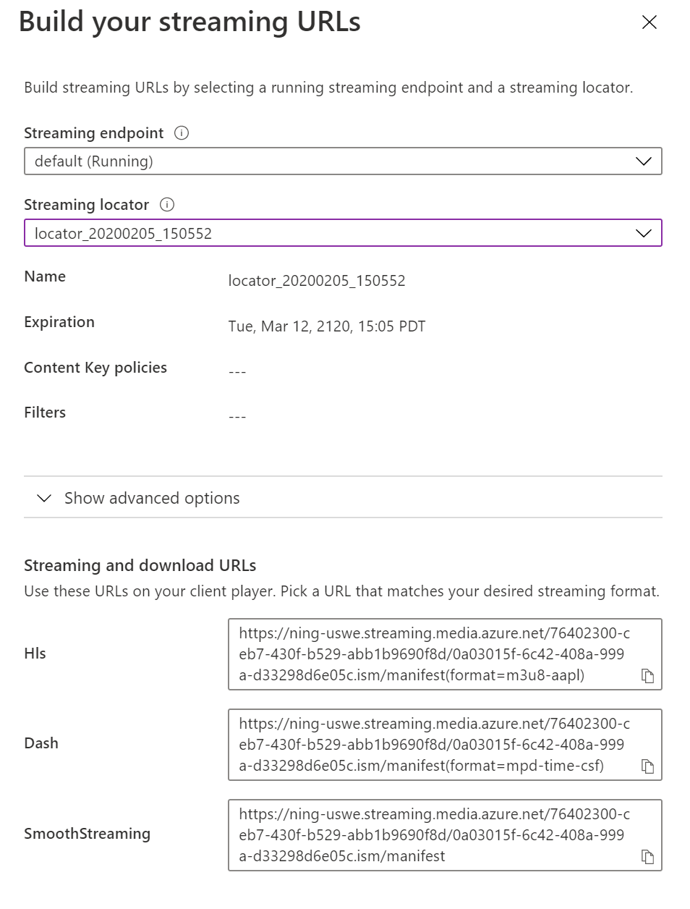

# How to use the Shaka player with Azure Media Services

[!INCLUDE [media services api v3 logo](./includes/v3-hr.md)]

## Overview

Shaka Player is an open-source JavaScript library for adaptive media. It plays adaptive media formats (such as DASH and HLS) in a browser, without using plugins or Flash. Instead, the Shaka Player uses the open web standards Media Source Extensions and Encrypted Media Extensions.

We recommend using [Mux.js](https://github.com/videojs/mux.js/) as, without it, the Shaka player would support HLS CMAF format, but not HLS TS.

Its official documentation can be found at [Shaka player documentation](https://shaka-player-demo.appspot.com/docs/api/tutorial-welcome.html).

## Sample code

Sample code for this article is available at [Azure-Samples/media-services-3rdparty-player-samples](https://github.com/Azure-Samples/media-services-3rdparty-player-samples).

## Implementing the player

Follow these instructions if you need to implement your own instance of the player:

1. Create an `index.html` file where you'll host the player. Add the following lines of code (you can replace the versions for newer if applicable):

    ```html
    <html>
      <head>
        <script src="//cdn.jsdelivr.net/npm/shaka-player@3.0.1/dist/shaka-player.compiled.js"></script>
        <script src="//cdn.jsdelivr.net/npm/mux.js@5.6.3/dist/mux.js"></script>
        <script type="module" src="index.js"></script>
      </head>
      <body>
        <video id="video" controls></video>
      </body>
    </html>
    ```

1. Add a JavaScript file with the following code:

    ```javascript
    // myScript.js
    shaka.polyfill.installAll();

    var video = document.getElementById('video');
    var player = new shaka.Player(video);
    window.player = player;

    var manifestUrl = 'https://amsplayeraccount-usw22.streaming.media.azure.net/00000000-0000-0000-0000-000000000000/sample-vod.ism/manifest(format=m3u8-aapl)';
    player.load(manifestUrl);
    ```

1. Replace `manifestUrl` with the HLS or DASH URL from the streaming locator of your asset, which can be found on the streaming locator page in the Azure portal.
    

1. Run a server (for example with `npm http-server`) and your player should be working...

## Set up captions

### Set up VOD captions

Run the following lines of code, and replace `captionUrl` with your .vtt directory (vtt file needs to be in the same host to avoid CORS error), `lang` with the two letter code for language, and `type` with either `caption` or `subtitle`:

```javascript
player.configure('streaming.alwaysStreamText', true)
player.load(manifestUrl).then(function(){
        player.addTextTrack(captionUrl, lang, type, 'text/vtt');
        var tracks = player.getTextTracks();
        player.selectTextTrack(tracks[0]);
});
```

### Set up live stream captions

Enable captions in live stream is configured adding the following line of code:

```javascript
player.setTextTrackVisibility(true)
```

## Set up token authentication

Run the following lines of code, and replace `token` with your token string:

```javascript
player.getNetworkingEngine().registerRequestFilter(function (type, request) {
  if (type === shaka.net.NetworkingEngine.RequestType.LICENSE) {
    request.headers['Authorization'] = 'Bearer ' + token;
  }
});
```

## Set up AES-128 encryption

Shaka Player doesn't currently support AES-128 encryption.

A link to a GitHub [issue](https://github.com/google/shaka-player/issues/850) to follow the status of this feature.

## Set up DRM protection

Shaka Player uses Encrypted Media Extensions (EME), which requires a secure URL to use. So, for testing any DRM protected content it's necessary to use https. If the site is using https, then the manifest and every segment will also need to use https. This is because of mixed content requirements.

The order of preference for Shaka management of the URL(s) of its license server(s):

1. ClearKey config, used for debugging, should override everything else. (The application can still specify a ClearKey license server.)
2. Application-configured servers, if any are present, should override anything from the manifest.
3. Manifest-provided license servers are only used if nothing else is specified.

To specify the license server URL for Widevine or PlayReady, we can use the following code:

```javascript
player.configure({
  drm: {
    servers: {
      "com.widevine.alpha": "YOUR WIDEVINE LICENSE URL",
      "com.microsoft.playready": "YOUR PLAYREADY LICENSE URL"
    }
  }
});

```

All FairPlay content requires setting a server certificate. It is set in the Player configuration:

```javascript
const req = await fetch("YOUR FAIRPLAY CERTIFICATE URL");
const cert = await req.arrayBuffer();
player.configure('drm.advanced.com\\.apple\\.fps\\.1_0.serverCertificate', new Uint8Array(cert));
```

For more information, see [Shaka player DRM protection documentation](https://shaka-player-demo.appspot.com/docs/api/tutorial-drm-config.html).

## Next steps

* [Use the Azure Media Player](../azure-media-player/azure-media-player-overview.md)
* [Quickstart: Encrypt content](drm-encrypt-content-how-to.md)
