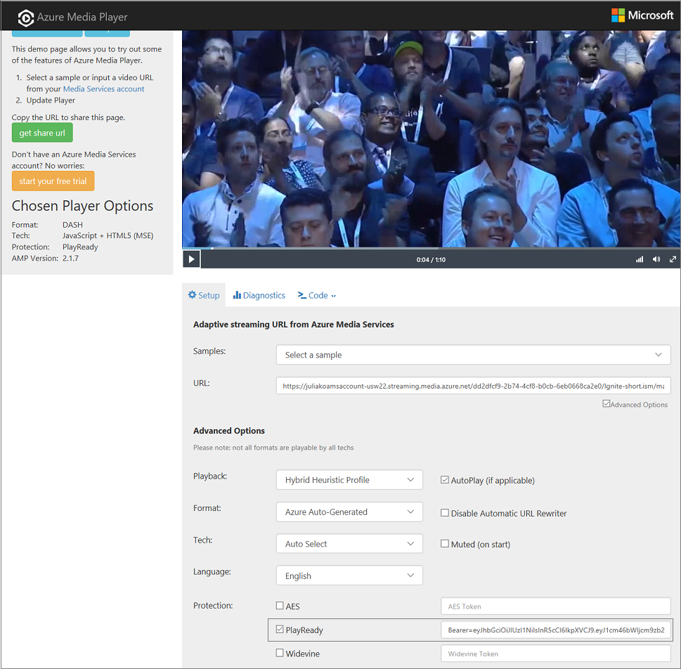
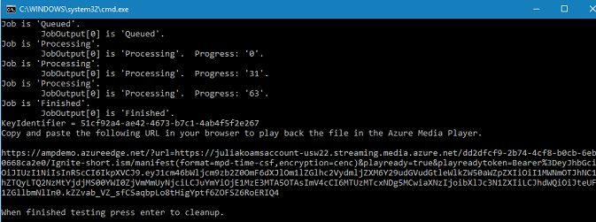

# Tutorial: Use DRM dynamic encryption and license delivery service

> [!NOTE]
> Even though this tutorial uses the [.NET SDK](https://docs.microsoft.com/dotnet/api/microsoft.azure.management.media.models.liveevent?view=azure-dotnet) examples, the general steps are the same for [REST API](https://docs.microsoft.com/rest/api/media/liveevents), [CLI](https://docs.microsoft.com/cli/azure/ams/live-event?view=azure-cli-latest), or other supported [SDKs](media-services-apis-overview.md#sdks).

You can use Azure Media Services to deliver your streams encrypted with Microsoft PlayReady, Google Widevine, or Apple FairPlay licenses. For in-depth explanation, see [Content protection with dynamic encryption](content-protection-overview.md).

Media Services also provides a service for delivering PlayReady, Widevine, and FairPlay DRM licenses. When a user requests DRM-protected content, the player app requests a license from the Media Services license service. If the player app is authorized, the Media Services license service issues a license to the player. A license contains the decryption key that can be used by the client player to decrypt and stream the content.

This article is based on the [Encrypting with DRM](https://github.com/Azure-Samples/media-services-v3-dotnet-tutorials/blob/master/AMSV3Tutorials/EncryptWithDRM) sample.

The sample described in this article produces the following result:



This tutorial shows you how to:

> [!div class="checklist"]
> * Create an encoding Transform.
> * Set the signing key used for verification of your token.
> * Set requirements on the content key policy.
> * Create a StreamingLocator with the specified streaming policy.
> * Create a URL used to playback your file.

## Prerequisites

The following items are required to complete the tutorial:

* Review the [Content protection overview](content-protection-overview.md) article.
* Review the [Design multi-DRM content protection system with access control](design-multi-drm-system-with-access-control.md).
* Install Visual Studio Code or Visual Studio.
* Create a new Azure Media Services account, as described in [this quickstart](create-account-cli-quickstart.md).
* Get credentials needed to use Media Services APIs by following [Access APIs](access-api-cli-how-to.md)
* Set the appropriate values in the app configuration file (appsettings.json).

## Download code

Clone a GitHub repository that contains the full .NET sample discussed in this article to your machine using the following command:

 ```bash
 git clone https://github.com/Azure-Samples/media-services-v3-dotnet-tutorials.git
 ```
 
The "Encrypt with DRM" sample is located in the [EncryptWithDRM](https://github.com/Azure-Samples/media-services-v3-dotnet-tutorials/blob/master/AMSV3Tutorials/EncryptWithDRM) folder.

> [!NOTE]
> The sample creates unique resources every time you run the app. Typically, you'll reuse existing resources like transforms and policies (if existing resource have required configurations).

## Start using Media Services APIs with .NET SDK

To start using Media Services APIs with .NET, create an **AzureMediaServicesClient** object. To create the object, you need to supply credentials needed for the client to connect to Azure using Azure AD. In the code you cloned at the beginning of the article, the **GetCredentialsAsync** function creates the ServiceClientCredentials object based on the credentials supplied in the local configuration file.

[!code-csharp[Main](../../../media-services-v3-dotnet-tutorials/AMSV3Tutorials/EncryptWithDRM/Program.cs#CreateMediaServicesClient)]

## Create an output asset  

The output [Asset](assets-concept.md) stores the result of your encoding job.  

[!code-csharp[Main](../../../media-services-v3-dotnet-tutorials/AMSV3Tutorials/EncryptWithDRM/Program.cs#CreateOutputAsset)]

## Get or create an encoding Transform

When creating a new [Transform](transforms-jobs-concept.md) instance, you need to specify what you want it to produce as an output. The required parameter is a `transformOutput` object, as shown in the code below. Each TransformOutput contains a **Preset**. Preset describes the step-by-step instructions of video and/or audio processing operations that are to be used to generate the desired TransformOutput. The sample described in this article uses a built-in Preset called **AdaptiveStreaming**. The Preset encodes the input video into an autogenerated bitrate ladder (bitrate-resolution pairs) based on the input resolution and bitrate, and produces ISO MP4 files with H.264 video and AAC audio corresponding to each bitrate-resolution pair. 

Before creating a new **Transform**, you should first check if one already exists using the **Get** method, as shown in the code that follows.  In Media Services v3, **Get** methods on entities return **null** if the entity doesn’t exist (a case-insensitive check on the name).

[!code-csharp[Main](../../../media-services-v3-dotnet-tutorials/AMSV3Tutorials/EncryptWithDRM/Program.cs#EnsureTransformExists)]

## Submit Job

As mentioned above, the **Transform** object is the recipe and a [Job](transforms-jobs-concept.md) is the actual request to Media Services to apply that **Transform** to a given input video or audio content. The **Job** specifies information like the location of the input video and the location for the output.

In this tutorial, we create the job's input based on a file that's ingested directly from an [HTTPs source URL](job-input-from-http-how-to.md).

[!code-csharp[Main](../../../media-services-v3-dotnet-tutorials/AMSV3Tutorials/EncryptWithDRM/Program.cs#SubmitJob)]

## Wait for the Job to complete

The job takes some time to complete. When it does, you want to be notified. The code sample below shows how to poll the service for the status of the **Job**. Polling isn't a recommended best practice for production apps because of potential latency. Polling can be throttled if overused on an account. Developers should instead use Event Grid. See [Route events to a custom web endpoint](job-state-events-cli-how-to.md).

The **Job** usually goes through the following states: **Scheduled**, **Queued**, **Processing**, **Finished** (the final state). If the job has come across an error, you get the **Error** state. If the job is in the process of being canceled, you get **Canceling** and **Canceled** when it's done.

[!code-csharp[Main](../../../media-services-v3-dotnet-tutorials/AMSV3Tutorials/EncryptWithDRM/Program.cs#WaitForJobToFinish)]

## Create a Content Key Policy

A content key provides secure access to your Assets. You need to create a [Content Key Policy](content-key-policy-concept.md) when encrypting your content with a DRM. The policy configures how the content key is delivered to end clients. The content key is associated with a Streaming Locator. Media Services also provides the key delivery service that delivers encryption keys and licenses to authorized users.

You need to set the requirements (restrictions) on the **Content Key Policy** that must be met to deliver keys with the specified configuration. In this example, we set the following configurations and requirements:

* Configuration

    The [PlayReady](playready-license-template-overview.md) and [Widevine](widevine-license-template-overview.md) licenses are configured so they can be delivered by the Media Services license delivery service. Even though this sample app doesn't configure the [FairPlay](fairplay-license-overview.md) license, it contains a method you can use to configure FairPlay. You can add FairPlay configuration as another option.

* Restriction

    The app sets a JSON Web Token (JWT) token type restriction on the policy.

When a stream is requested by a player, Media Services uses the specified key to dynamically encrypt your content. To decrypt the stream, the player requests the key from the key delivery service. To determine whether the user is authorized to get the key, the service evaluates the content key policy that you specified for the key.

[!code-csharp[Main](../../../media-services-v3-dotnet-tutorials/AMSV3Tutorials/EncryptWithDRM/Program.cs#GetOrCreateContentKeyPolicy)]

## Create a Streaming Locator

After the encoding is complete, and the content key policy is set, the next step is to make the video in the output Asset available to clients for playback. You make the video available in two steps:

1. Create a [Streaming Locator](streaming-locators-concept.md).
2. Build the streaming URLs that clients can use.

The process of creating the **Streaming Locator** is called publishing. By default, the **Streaming Locator** is valid immediately after you make the API calls. It lasts until it's deleted, unless you configure the optional start and end times.

When creating a **Streaming Locator**, you need to specify the desired `StreamingPolicyName`. In this tutorial, we're using one of the predefined Streaming Policies, which tells Azure Media Services how to publish the content for streaming. In this example, we set StreamingLocator.StreamingPolicyName to the "Predefined_MultiDrmCencStreaming" policy. The PlayReady and Widevine encryptions are applied and the key is delivered to the playback client based on the configured DRM licenses. If you also want to encrypt your stream with CBCS (FairPlay), use "Predefined_MultiDrmStreaming".

> [!IMPORTANT]
> When using a custom [Streaming Policy](streaming-policy-concept.md), you should design a limited set of such policies for your Media Service account, and re-use them for your StreamingLocators whenever the same encryption options and protocols are needed. Your Media Service account has a quota for the number of StreamingPolicy entries. You shouldn't be creating a new StreamingPolicy for each StreamingLocator.

[!code-csharp[Main](../../../media-services-v3-dotnet-tutorials/AMSV3Tutorials/EncryptWithDRM/Program.cs#CreateStreamingLocator)]

## Get a test token

In this tutorial, we specify for the content key policy to have a token restriction. The token-restricted policy must be accompanied by a token issued by a security token service (STS). Media Services supports tokens in the [JWT](https://msdn.microsoft.com/library/gg185950.aspx#BKMK_3) formats and that's what we configure in the sample.

The ContentKeyIdentifierClaim is used in the ContentKeyPolicy, which means that the token presented to the key delivery service must have the identifier of the ContentKey in it. In the sample, we don't specify a content key when creating the Streaming Locator, the system creates a random one for us. To generate the test token, we must get the ContentKeyId to put in the ContentKeyIdentifierClaim claim.

[!code-csharp[Main](../../../media-services-v3-dotnet-tutorials/AMSV3Tutorials/EncryptWithDRM/Program.cs#GetToken)]

## Build a streaming URL

Now that the [StreamingLocator](https://docs.microsoft.com/rest/api/media/streaminglocators) has been created, you can get the streaming URLs. To build a URL, you need to concatenate the [StreamingEndpoint](https://docs.microsoft.com/rest/api/media/streamingendpoints) host name and the **Streaming Locator** path. In this sample, the *default* **Streaming Endpoint** is used. When you first create a Media Service account, this *default* **Streaming Endpoint** will be in a stopped state, so you need to call **Start**.

[!code-csharp[Main](../../../media-services-v3-dotnet-tutorials/AMSV3Tutorials/EncryptWithDRM/Program.cs#GetMPEGStreamingUrl)]

When you run the app, you see the following screen:



You can open a browser and paste the resulting URL to launch the Azure Media Player demo page with the URL and token filled out for you already.

## Clean up resources in your Media Services account

Generally, you should clean up everything except objects that you're planning to reuse (typically, you'll reuse Transforms, StreamingLocators, and so on). If you want for your account to be clean after experimenting, delete the resources that you don't plan to reuse. For example, the following code deletes Jobs:

[!code-csharp[Main](../../../media-services-v3-dotnet-tutorials/AMSV3Tutorials/EncryptWithDRM/Program.cs#CleanUp)]

## Clean up resources

If you no longer need any of the resources in your resource group, including the Media Services and storage accounts you created for this tutorial, delete the resource group you created earlier.

Execute the following CLI command:

```azurecli
az group delete --name amsResourceGroup
```

## Additional notes

* Widevine is a service provided by Google Inc. and subject to the terms of service and Privacy Policy of Google, Inc.

## Ask questions, give feedback, get updates

Check out the [Azure Media Services community](media-services-community.md) article to see different ways you can ask questions, give feedback, and get updates about Media Services.

## Next steps

Check out

> [!div class="nextstepaction"]
> [Protect with AES-128](protect-with-aes128.md)
