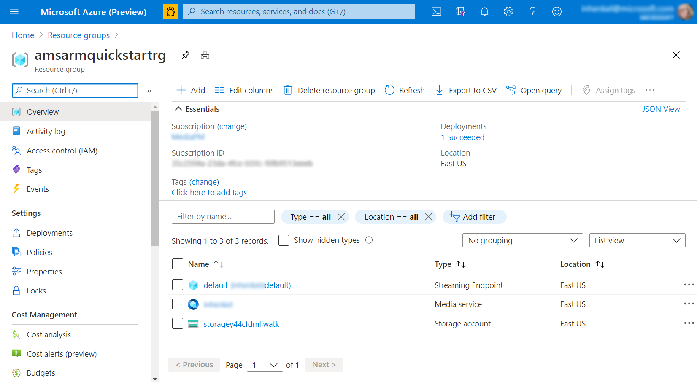

# Quickstart: Media Services account ARM template

[!INCLUDE [media services api v3 logo](./includes/v3-hr.md)]

This article shows you how to use an Azure Resource Manager template (ARM template) to create a media services account.

## Introduction

[!INCLUDE [About Azure Resource Manager](../../../includes/resource-manager-quickstart-introduction.md)]

Readers who are experienced with ARM templates can continue to the [deployment section](#deploy-the-template).

<!-- this section will be added when the template is merged. If your environment meets the prerequisites and you're familiar with using ARM templates, select the **Deploy to Azure** button. The template will open in the Azure portal.

[](https://portal.azure.com/#create/Microsoft.Template/uri/<template's URI>)
-->

## Prerequisites

If you don't have an Azure subscription, create a [free account](https://azure.microsoft.com/free/?WT.mc_id=A261C142F) before you begin.

If you have never deployed an ARM template before, it is helpful to read about [Azure ARM templates](../../azure-resource-manager/templates/index.yml) and go through the [tutorial](../../azure-resource-manager/templates/template-tutorial-create-first-template.md?tabs=azure-powershell).

## Review the template

<!-- this will be added when the template is merged. The template used in this quickstart is from [Azure Quickstart Templates](https://azure.microsoft.com/resources/templates/101-media-services-account-create/).

The syntax for the JSON code fence is:

:::code language="json" source="~/quickstart-templates/101-media-services-account-create/azuredeploy.json"::: -->

```json
{
  "$schema": "https://schema.management.azure.com/schemas/2015-01-01/deploymentTemplate.json#",
  "contentVersion": "1.0.0.0",
  "parameters": {
    "mediaServiceName": {
      "type": "string",
      "metadata": {
        "description": "Name of the Media Services account. A Media Services account name is unique in a given region, all lowercase letters or numbers with no spaces."
      }
    }
  },
  "variables": {
    "storageName": "[concat('storage', uniqueString(resourceGroup().id))]"
  },
  "resources": [
    {
      "name": "[parameters('mediaServiceName')]",
      "type": "Microsoft.Media/mediaServices",
      "apiVersion": "2018-07-01",
      "location": "[resourceGroup().location]",
      "dependsOn": [
        "[resourceId('Microsoft.Storage/storageAccounts', variables('storageName'))]"
      ],
      "properties": {
        "storageAccounts": [
          {
            "id": "[resourceId('microsoft.storage/storageaccounts/', variables('storageName'))]",
            "type": "Primary"
          }
        ]
      }
    },
    {
      "name": "[variables('storageName')]",
      "type": "Microsoft.Storage/storageAccounts",
      "sku": {
        "name": "Standard_LRS",
        "tier": "Standard"
      },
      "kind": "StorageV2",
      "apiVersion": "2017-10-01",
      "location": "[resourceGroup().location]",
      "tags": {},
      "scale": null,
      "properties": {
          "encryption": {
              "services": {
                  "file": {
                      "enabled": true
                  },
                  "blob": {
                      "enabled": true
                  }
              },
              "keySource": "Microsoft.Storage"
          },
          "accessTier": "Hot"
      }
    }
  ]
}

```

Three Azure resource types are defined in the template:

- [Microsoft.Media/mediaservices](/azure/templates/microsoft.media/mediaservices): create a Media Services account
- [Microsoft.Storage/storageAccounts](/azure/templates/microsoft.storage/storageaccounts): create a storage account

## Set the account

```azurecli-interactive

az account set --subscription {your subscription name or id}

```

## Create a resource group

```azurecli-interactive

az group create --name {the name you want to give your resource group} --location "{pick a location}"

```

## Assign a variable to your deployment file

For convenience, create a variable that stores the path to the template file. This variable makes it easier for you to run the deployment commands because you don't have to retype the path every time you deploy.

```azurecli-interactive

templateFile="{provide the path to the template file}"

```

## Deploy the template

You will be prompted to enter the media services account name.

```azurecli-interactive

az deployment group create --name {the name you want to give to your deployment} --resource-group {the name of resource group you created} --template-file $templateFile

```

## Review deployed resources

You should see a JSON response similar to the below:

```json
{
  "id": "/subscriptions/{subscriptionid}/resourceGroups/amsarmquickstartrg/providers/Microsoft.Resources/deployments/amsarmquickstartdeploy",
  "location": null,
  "name": "amsarmquickstartdeploy",
  "properties": {
    "correlationId": "{correlationid}",
    "debugSetting": null,
    "dependencies": [
      {
        "dependsOn": [
          {
            "id": "/subscriptions/{subscriptionid}/resourceGroups/amsarmquickstartrg/providers/Microsoft.Storage/storageAccounts/storagey44cfdmliwatk",
            "resourceGroup": "amsarmquickstartrg",
            "resourceName": "storagey44cfdmliwatk",
            "resourceType": "Microsoft.Storage/storageAccounts"
          }
        ],
        "id": "/subscriptions/35c2594a-23da-4fce-b59c-f6fb9513eeeb/resourceGroups/amsarmquickstartrg/providers/Microsoft.Media/mediaServices/{accountname}",
        "resourceGroup": "amsarmquickstartrg",
        "resourceName": "{accountname}",
        "resourceType": "Microsoft.Media/mediaServices"
      }
    ],
    "duration": "PT1M10.8615001S",
    "error": null,
    "mode": "Incremental",
    "onErrorDeployment": null,
    "outputResources": [
      {
        "id": "/subscriptions/{subscriptionid}/resourceGroups/amsarmquickstartrg/providers/Microsoft.Media/mediaServices/{accountname}",
        "resourceGroup": "amsarmquickstartrg"
      },
      {
        "id": "/subscriptions/{subscriptionid}/resourceGroups/amsarmquickstartrg/providers/Microsoft.Storage/storageAccounts/storagey44cfdmliwatk",
        "resourceGroup": "amsarmquickstartrg"
      }
    ],
    "outputs": null,
    "parameters": {
      "mediaServiceName": {
        "type": "String",
        "value": "{accountname}"
      }
    },
    "parametersLink": null,
    "providers": [
      {
        "id": null,
        "namespace": "Microsoft.Media",
        "registrationPolicy": null,
        "registrationState": null,
        "resourceTypes": [
          {
            "aliases": null,
            "apiVersions": null,
            "capabilities": null,
            "locations": [
              "eastus"
            ],
            "properties": null,
            "resourceType": "mediaServices"
          }
        ]
      },
      {
        "id": null,
        "namespace": "Microsoft.Storage",
        "registrationPolicy": null,
        "registrationState": null,
        "resourceTypes": [
          {
            "aliases": null,
            "apiVersions": null,
            "capabilities": null,
            "locations": [
              "eastus"
            ],
            "properties": null,
            "resourceType": "storageAccounts"
          }
        ]
      }
    ],
    "provisioningState": "Succeeded",
    "templateHash": "{templatehash}",
    "templateLink": null,
    "timestamp": "2020-11-24T23:25:52.598184+00:00",
    "validatedResources": null
  },
  "resourceGroup": "amsarmquickstartrg",
  "tags": null,
  "type": "Microsoft.Resources/deployments"
}

```

In the Azure portal, confirm that your resources have been created.



## Clean up resources

If you aren't planning to use the resources you just created, you can delete the resource group.

```azurecli-interactive

az group delete --name {name of the resource group}

```

## Next steps

To learn more about using an ARM template by following the process of creating a template with parameters, variables and more, try

> [!div class="nextstepaction"]
> [Tutorial: Create and deploy your first ARM template](../../azure-resource-manager/templates/template-tutorial-create-first-template.md)