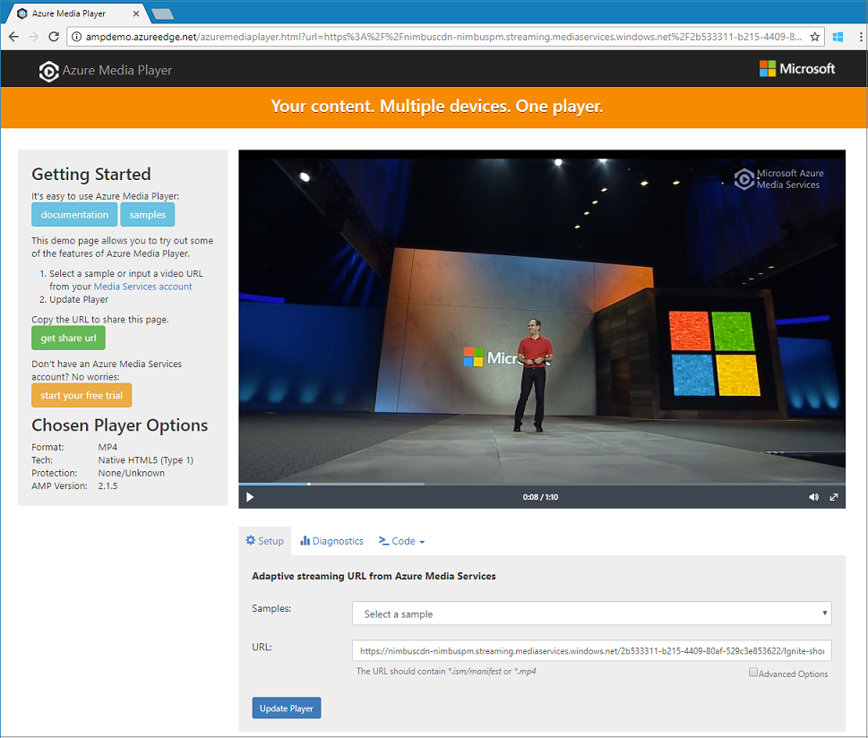

# Tutorial: Stream video files - .NET

This tutorial shows you how easy it is to encode and start streaming videos on a wide variety of browsers and devices using Azure Media Services. An input content can be specified using HTTPS URLs, SAS URLs, or paths to files located in Azure Blob storage.
The sample in this topic encodes content that you make accessible via an HTTPS URL. Note that currently, AMS v3 does not support chunked transfer encoding over HTTPS URLs.

By the end of the tutorial you will be able to stream a video.  



[!INCLUDE [quickstarts-free-trial-note](../../../includes/quickstarts-free-trial-note.md)]

## Prerequisites

- If you do not have Visual Studio installed, you can get [Visual Studio Community 2017](https://www.visualstudio.com/thank-you-downloading-visual-studio/?sku=Community&rel=15).
- [Create a Media Services account](create-account-cli-how-to.md).<br/>Make sure to remember the values that you used for the resource group name and Media Services account name.
- Follow the steps in [Access Azure Media Services API with the Azure CLI](access-api-cli-how-to.md) and save the credentials. You will need to use them to access the API.

## Download and configure the sample

Clone a GitHub repository that contains the streaming .NET sample to your machine using the following command:  

 ```bash
 git clone https://github.com/Azure-Samples/media-services-v3-dotnet-quickstarts.git
 ```

The sample is located in the [EncodeAndStreamFiles](https://github.com/Azure-Samples/media-services-v3-dotnet-quickstarts/tree/master/AMSV3Quickstarts/EncodeAndStreamFiles) folder.

Open [appsettings.json](https://github.com/Azure-Samples/media-services-v3-dotnet-quickstarts/blob/master/AMSV3Quickstarts/EncodeAndStreamFiles/appsettings.json) in you downloaded project. Replace the values with credentials that you got from [accessing APIs](access-api-cli-how-to.md).

The sample performs the following actions:

1. Creates a **Transform** (first, checks if the specified Transform exists). 
2. Creates an output **Asset** that is used as the encoding **Job**'s output.
3. Creates the **Job**'s input that is based on an HTTPS URL.
4. Submits the encoding **Job** using the input and output that was created earlier.
5. Checks the Job's status.
6. Creates a **Streaming Locator**.
7. Builds streaming URLs.

For explanations about what each function in the sample does, examine the code and look at the comments in [this source file](https://github.com/Azure-Samples/media-services-v3-dotnet-quickstarts/blob/master/AMSV3Quickstarts/EncodeAndStreamFiles/Program.cs).

## Run the sample app

When you run the app, URLs that can be used to playback the video using different protocols are displayed. 

1. Press Ctrl+F5 to run the *EncodeAndStreamFiles* application.
2. Choose the Apple's **HLS** protocol (ends with *manifest(format=m3u8-aapl)*) and copy the streaming URL from the console.


In the sample's [source code](https://github.com/Azure-Samples/media-services-v3-dotnet-quickstarts/blob/master/AMSV3Quickstarts/EncodeAndStreamFiles/Program.cs), you can see how the URL is built. To build it, you need to concatenate the streaming endpoint's host name and the streaming locator path.  

## Test with Azure Media Player

To test the stream, this article uses Azure Media Player. 

> [!NOTE]
> If a player is hosted on an https site, make sure to update the URL to "https".

1. Open a web browser and navigate to [https://aka.ms/azuremediaplayer/](https://aka.ms/azuremediaplayer/).
2. In the **URL:** box, paste one of the streaming URL values you got when you ran the application. 
 
     You can paste the URL in HLS, Dash, or Smooth format and Azure Media Player will switch to an appropriate streaming protocol for playback on your device automatically.
3. Press **Update Player**.

Azure Media Player can be used for testing but should not be used in a production environment. 

## Clean up resources

If you no longer need any of the resources in your resource group, including the Media Services and storage accounts you created for this tutorial, delete the resource group.

Execute the following CLI command:

```azurecli
az group delete --name amsResourceGroup
```

## Examine the code

For explanations about what each function in the sample does, examine the code and look at the comments in [this source file](https://github.com/Azure-Samples/media-services-v3-dotnet-quickstarts/blob/master/AMSV3Quickstarts/EncodeAndStreamFiles/Program.cs).

The [upload, encode, and stream files](stream-files-tutorial-with-api.md) tutorial gives you a more advanced streaming example with detailed explanations. 

### Job error codes

See [Error codes](https://docs.microsoft.com/rest/api/media/jobs/get#joberrorcode).

## Multithreading

The Azure Media Services v3 SDKs are not thread-safe. When working with multi-threaded application, you should generate a new  AzureMediaServicesClient object per thread.

## Next steps

> [!div class="nextstepaction"]
> [Tutorial: upload, encode, and stream files](stream-files-tutorial-with-api.md)
