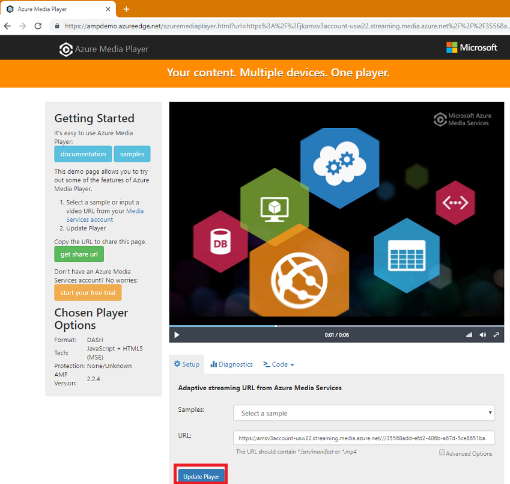

# How to encode and stream video files with Node.JS

[!INCLUDE [media services api v3 logo](./includes/v3-hr.md)]

This quickstart shows you how easy it is to encode and start streaming videos on a wide variety of browsers and devices using Azure Media Services. An input video file can be specified using HTTPS URLs, SAS URLs, or paths to files located in Azure Blob storage.

By the end of this quickstart you will know:

- How to encode with Node.JS
- How to stream with Node.JS
- How to upload a file from an HTTPS URL with Node.JS
- How to use an HLS or DASH client player with Node.JS

The sample in this article encodes content that you make accessible via an HTTPS URL. Note that currently, AMS v3 does not support chunked transfer encoding over HTTPS URLs.



[!INCLUDE [quickstarts-free-trial-note](../../../includes/quickstarts-free-trial-note.md)]

## Prerequisites

- Install [Node.js](https://nodejs.org/en/download/)
- [Create a Media Services account](./create-account-howto.md).<br/>Make sure to remember the values that you used for the resource group name and Media Services account name.
- Follow the steps in [Access Azure Media Services API with the Azure CLI](./access-api-howto.md) and save the credentials. You will need to use them to access the API.
- Walk through the [Configure and Connect with Node.js](./configure-connect-nodejs-howto.md) how-to first to understand how to use the Node.js client SDK

## Download and configure the sample

Clone a GitHub repository that contains the streaming Node.js sample to your machine using the following command:  

 ```bash
 git clone https://github.com/Azure-Samples/media-services-v3-node-tutorials.git
 ```

The sample is located in the [StreamFilesSample](https://github.com/Azure-Samples/media-services-v3-node-tutorials/tree/master/AMSv3Samples/StreamFilesSample) folder.

Open [index.ts](https://github.com/Azure-Samples/media-services-v3-node-tutorials/blob/master/AMSv3Samples/StreamFilesSample/index.ts) in your downloaded project. Update the *sample.env* file in the root folder with the values and credentials that you got from [accessing APIs](./access-api-howto.md). Rename the *sample.env* file to *.env* (Yes, just the extension).

The sample performs the following actions:

1. Creates a **Transform** with a [Content Aware Encoding preset](./content-aware-encoding.md). It first checks if the specified Transform exists.
1. Creates an output **Asset** that is used by the encoding **Job** to contain the output
1. Optionally uploads a local file using the Storage Blob SDK
1. Creates the **Job** input that is based on an HTTPS URL or uploaded file
1. Submits the encoding **Job**, using the input and output that was created earlier
1. Checks the Job's status
1. Downloads the output of the encoding job to a local folder
1. Creates a **Streaming Locator** to use in the player
1. Builds streaming URLs for HLS and DASH
1. Plays the content back in a player application - Azure Media Player

## Run the sample

1. The application downloads encoded files. Create a folder where you want the output files to go and update the value of the **outputFolder** variable in the [index.ts](https://github.com/Azure-Samples/media-services-v3-node-tutorials/blob/master/AMSv3Samples/StreamFilesSample/index.js#L59) file. It is set to "Temp" by default.
1. Open a **command prompt**, browse to the sample's directory.
1. Change directory into the AMSv3Samples folder.

    ```bash
    cd AMSv3Samples
    ```

1. Install the packages used in the *packages.json* file.

    ```bash
    npm install 
    ```

1. Change directory to the *StreamFilesSample* folder.

    ```bash
    cd StreamFilesSample
    ```

1. Launch Visual Studio Code from the *AMSv3Samples* Folder. (This is required to launch from the folder where the *.vscode* folder and *tsconfig.json* files are located.)

    ```bash
    cd ..
    code .
    ```

Open the folder for *StreamFilesSample*, and open the *index.ts* file in the Visual Studio Code editor.
While in the *index.ts* file, press F5 to launch the debugger.

## Test with Azure Media Player

Use Azure Media Player to test the stream. You can also use any HLS or DASH compliant player, like Shaka player, HLS.js, Dash.js, or others.

You should be able to click on the link generated in the sample and launch the AMP player with the DASH manifest already loaded.

> [!NOTE]
> If a player is hosted on an https site, make sure to update the URL to "https".

1. Open a web browser and navigate to [https://aka.ms/azuremediaplayer/](https://aka.ms/azuremediaplayer/).
2. In the **URL:** box, paste one of the streaming URL values you got when you ran the application.You can paste the URL in HLS, Dash, or Smooth format and Azure Media Player will switch to an appropriate streaming protocol for playback on your device automatically.
3. Press **Update Player**.

Azure Media Player can be used for testing but should not be used in a production environment.

## Clean up resources

If you no longer need any of the resources in your resource group, including the Media Services and storage accounts you created for this tutorial, delete the resource group.

Execute the following CLI command:

```azurecli
az group delete --name amsResourceGroup
```

## More developer documentation for Node.js on Azure

- [Azure for JavaScript & Node.js developers](/azure/developer/javascript/)
- [Media Services source code in the @azure/azure-sdk-for-js Git Hub repo](https://github.com/Azure/azure-sdk-for-js/tree/master/sdk/mediaservices/arm-mediaservices)
- [Azure Package Documentation for Node.js developers](/javascript/api/overview/azure/)

## See also

- [Job error codes](/rest/api/media/jobs/get#joberrorcode).
- [npm install @azure/arm-mediaservices](https://www.npmjs.com/package/@azure/arm-mediaservices)
- [Azure for JavaScript & Node.js developers](/azure/developer/javascript/)
- [Media Services source code in the @azure/azure-sdk-for-js repo](https://github.com/Azure/azure-sdk-for-js/tree/master/sdk/mediaservices/arm-mediaservices)

## Next steps

> [Media Services concepts](concepts-overview.md)
