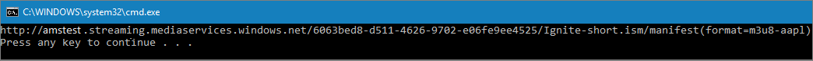

# Tutorial: Upload, encode, and stream videos

> [!NOTE]
> Even though the tutorial uses the [.NET SDK](https://docs.microsoft.com/dotnet/api/microsoft.azure.management.media.models.liveevent?view=azure-dotnet) examples, the general steps are the same for [REST API](https://docs.microsoft.com/rest/api/media/liveevents), [CLI](https://docs.microsoft.com/cli/azure/ams/live-event?view=azure-cli-latest), or other supported [SDKs](media-services-apis-overview.md#sdks).

Azure Media Services enables you to encode your media files into formats that can be played on a wide variety of browsers and devices. For example, you might want to stream your content in Apple's HLS or MPEG DASH formats. Before streaming, you should encode your high-quality digital media file. For encoding guidance, see [Encoding concept](encoding-concept.md). This tutorial uploads a local video file and encodes the uploaded file. You can also encode content that you make accessible via a HTTPS URL. For more information, see [Create a job input from an HTTP(s) URL](job-input-from-http-how-to.md).


This tutorial shows you how to:    

> [!div class="checklist"]
> * Download the sample app described in the topic
> * Examine the code that uploads, encodes, and streams
> * Run the app
> * Test the streaming URL
> * Clean up resources

[!INCLUDE [quickstarts-free-trial-note](../../../includes/quickstarts-free-trial-note.md)]

## Prerequisites

- If you do not have Visual Studio installed, you can get [Visual Studio Community 2017](https://www.visualstudio.com/thank-you-downloading-visual-studio/?sku=Community&rel=15).
- [Create a Media Services account](create-account-cli-how-to.md).<br/>Make sure to remember the values that you used for the resource group name and Media Services account name.
- Follow the steps in [Access Azure Media Services API with the Azure CLI](access-api-cli-how-to.md) and save the credentials. You will need to use them to access the API.

## Download and configure the sample

Clone a GitHub repository that contains the streaming .NET sample to your machine using the following command:  

 ```bash
 git clone https://github.com/Azure-Samples/media-services-v3-dotnet-tutorials.git
 ```

The sample is located in the [UploadEncodeAndStreamFiles](https://github.com/Azure-Samples/media-services-v3-dotnet-tutorials/tree/master/AMSV3Tutorials/UploadEncodeAndStreamFiles) folder.

Open [appsettings.json](https://github.com/Azure-Samples/media-services-v3-dotnet-tutorials/blob/master/AMSV3Tutorials/UploadEncodeAndStreamFiles/appsettings.json) in you downloaded project. Replace the values with credentials that you got from [accessing APIs](access-api-cli-how-to.md).

## Examine the code that uploads, encodes, and streams

This section examines functions defined in the [Program.cs](https://github.com/Azure-Samples/media-services-v3-dotnet-tutorials/blob/master/AMSV3Tutorials/UploadEncodeAndStreamFiles/Program.cs) file of the *UploadEncodeAndStreamFiles* project.

The sample performs the following actions:

1. Creates a new **Transform** (first, checks if the specified Transform exists). 
2. Creates an output **Asset** that is used as the encoding **Job**'s output.
3. Create an input **Asset** and uploads the specified local video file into it. The asset is used as the job's input. 
4. Submits the encoding job using the input and output that was created.
5. Checks the job's status.
6. Creates a **Streaming Locator**.
7. Builds streaming URLs.

### <a id="start_using_dotnet" />Start using Media Services APIs with .NET SDK

To start using Media Services APIs with .NET, you need to create an **AzureMediaServicesClient** object. To create the object, you need to supply credentials needed for the client to connect to Azure using Azure AD. In the code you cloned at the beginning of the article, the **GetCredentialsAsync** function creates the ServiceClientCredentials object based on the credentials supplied in local configuration file. 

[!code-csharp[Main](../../../media-services-v3-dotnet-tutorials/AMSV3Tutorials/UploadEncodeAndStreamFiles/Program.cs#CreateMediaServicesClient)]

### Create an input asset and upload a local file into it 

The **CreateInputAsset** function creates a new input [Asset](https://docs.microsoft.com/rest/api/media/assets) and uploads the specified local video file into it. This **Asset** is used as the input to your encoding Job. In Media Services v3, the input to a **Job** can either be an **Asset**, or it can be content that you make available to your Media Services account via HTTPS URLs. If you want to learn how to encode from a HTTPS URL, see [this](job-input-from-http-how-to.md) article.  

In Media Services v3, you use Azure Storage APIs to upload files. The following .NET snippet shows how.

The following function performs these actions:

* Creates an **Asset** 
* Gets a writable [SAS URL](https://docs.microsoft.com/azure/storage/common/storage-dotnet-shared-access-signature-part-1) to the asset’s [container in storage](https://docs.microsoft.com/azure/storage/blobs/storage-quickstart-blobs-dotnet#upload-blobs-to-a-container)
* Uploads the file into the container in storage using the SAS URL

[!code-csharp[Main](../../../media-services-v3-dotnet-tutorials/AMSV3Tutorials/UploadEncodeAndStreamFiles/Program.cs#CreateInputAsset)]

### Create an output asset to store the result of a job 

The output [Asset](https://docs.microsoft.com/rest/api/media/assets) stores the result of your encoding job. The project defines the **DownloadResults** function that downloads the results from this output asset into the "output" folder, so you can see what you got.

[!code-csharp[Main](../../../media-services-v3-dotnet-tutorials/AMSV3Tutorials/UploadEncodeAndStreamFiles/Program.cs#CreateOutputAsset)]

### Create a Transform and a Job that encodes the uploaded file

When encoding or processing content in Media Services, it is a common pattern to set up the encoding settings as a recipe. You would then submit a **Job** to apply that recipe to a video. By submitting new jobs for each new video, you are applying that recipe to all the videos in your library. A recipe in Media Services is called as a **Transform**. For more information, see [Transforms and Jobs](transform-concept.md). The sample described in this tutorial defines a recipe that encodes the video in order to stream it to a variety of iOS and Android devices. 

#### Transform

When creating a new [Transform](https://docs.microsoft.com/rest/api/media/transforms) instance, you need to specify what you want it to produce as an output. The required parameter is a **TransformOutput** object, as shown in the code below. Each **TransformOutput** contains a **Preset**. **Preset** describes the step-by-step instructions of video and/or audio processing operations that are to be used to generate the desired **TransformOutput**. The sample described in this article uses a built-in Preset called **AdaptiveStreaming**. The Preset encodes the input video into an auto-generated bitrate ladder (bitrate-resolution pairs) based on the input resolution and bitrate, and produces ISO MP4 files with H.264 video and AAC audio corresponding to each bitrate-resolution pair. For information about this Preset, see [auto-generating bitrate ladder](autogen-bitrate-ladder.md).

You can use a built-in EncoderNamedPreset or use custom presets. For more information, see [How to customize encoder presets](customize-encoder-presets-how-to.md).

When creating a [Transform](https://docs.microsoft.com/rest/api/media/transforms), you should first check if one already exists using the **Get** method, as shown in the code that follows.  In Media Services v3, **Get** methods on entities return **null** if the entity doesn’t exist (a case-insensitive check on the name).

[!code-csharp[Main](../../../media-services-v3-dotnet-tutorials/AMSV3Tutorials/UploadEncodeAndStreamFiles/Program.cs#EnsureTransformExists)]

#### Job

As mentioned above, the [Transform](https://docs.microsoft.com/rest/api/media/transforms) object is the recipe and a [Job](https://docs.microsoft.com/rest/api/media/jobs) is the actual request to Media Services to apply that **Transform** to a given input video or audio content. The **Job** specifies information like the location of the input video, and the location for the output.

In this example, the input video has been uploaded from your local machine. If you want to learn how to encode from a HTTPS URL, see [this](job-input-from-http-how-to.md) article.

[!code-csharp[Main](../../../media-services-v3-dotnet-tutorials/AMSV3Tutorials/UploadEncodeAndStreamFiles/Program.cs#SubmitJob)]

### Wait for the Job to complete

The job takes some time to complete and when it does you want to be notified. The code sample below shows how to poll the service for the status of the [Job](https://docs.microsoft.com/rest/api/media/jobs). Polling is not a recommended best practice for production applications because of potential latency. Polling can be throttled if overused on an account. Developers should instead use Event Grid.

Event Grid is designed for high availability, consistent performance, and dynamic scale. With Event Grid, your apps can listen for and react to events from virtually all Azure services, as well as custom sources. Simple, HTTP-based reactive event handling helps you build efficient solutions through intelligent filtering and routing of events.  See [Route events to a custom web endpoint](job-state-events-cli-how-to.md).

The **Job** usually goes through the following states: **Scheduled**, **Queued**, **Processing**, **Finished** (the final state). If the job has encountered an error, you get the **Error** state. If the job is in the process of being canceled, you get **Canceling** and **Canceled** when it is done.

[!code-csharp[Main](../../../media-services-v3-dotnet-tutorials/AMSV3Tutorials/UploadEncodeAndStreamFiles/Program.cs#WaitForJobToFinish)]

### Job error codes

See [Error codes](https://docs.microsoft.com/rest/api/media/jobs/get#joberrorcode).

### Get a Streaming Locator

After the encoding is complete, the next step is to make the video in the output Asset available to clients for playback. You can accomplish this in two steps: first, create a [Streaming Locator](https://docs.microsoft.com/rest/api/media/streaminglocators), and second, build the streaming URLs that clients can use. 

The process of creating a **Streaming Locator** is called publishing. By default, the **Streaming Locator** is valid immediately after you make the API calls, and lasts until it is deleted, unless you configure the optional start and end times. 

When creating a [StreamingLocator](https://docs.microsoft.com/rest/api/media/streaminglocators), you will need to specify the desired **StreamingPolicyName**. In this example, you will be streaming in-the-clear (or non-encrypted content) so the predefined clear streaming policy (**PredefinedStreamingPolicy.ClearStreamingOnly**) is used.

> [!IMPORTANT]
> When using a custom [Streaming Policy](https://docs.microsoft.com/rest/api/media/streamingpolicies), you should design a limited set of such policies for your Media Service account, and re-use them for your StreamingLocators whenever the same encryption options and protocols are needed. Your Media Service account has a quota for the number of Streaming Policy entries. You should not be creating a new Streaming Policy for each Streaming Locator.

The following code assumes that you are calling the function with a unique locatorName.

[!code-csharp[Main](../../../media-services-v3-dotnet-tutorials/AMSV3Tutorials/UploadEncodeAndStreamFiles/Program.cs#CreateStreamingLocator)]

While the sample in this topic discusses streaming, you can use the same call to create a Streaming Locator for delivering video via progressive download.

### Get streaming URLs

Now that the [Streaming Locator](https://docs.microsoft.com/rest/api/media/streaminglocators) has been created, you can get the streaming URLs, as shown in **GetStreamingURLs**. To build a URL, you need to concatenate the [Streaming Endpoint](https://docs.microsoft.com/rest/api/media/streamingendpoints) host name and the **Streaming Locator** path. In this sample, the *default* **Streaming Endpoint** is used. When you first create a Media Service account, this *default* **Streaming Endpoint** will be in a stopped state, so you need to call **Start**.

> [!NOTE]
> In this method, you  need the locatorName that was used when creating the **Streaming Locator** for the output Asset.

[!code-csharp[Main](../../../media-services-v3-dotnet-tutorials/AMSV3Tutorials/UploadEncodeAndStreamFiles/Program.cs#GetStreamingURLs)]

### Clean up resources in your Media Services account

Generally, you should clean up everything except objects that you are planning to reuse (typically, you will reuse Transforms, and you will persist StreamingLocators, etc.). If you want for your account to be clean after experimenting, you should delete the resources that you do not plan to reuse.  For example, the following code deletes Jobs.

[!code-csharp[Main](../../../media-services-v3-dotnet-tutorials/AMSV3Tutorials/UploadEncodeAndStreamFiles/Program.cs#CleanUp)]

## Run the sample app

1. Press Ctrl+F5 to run the *EncodeAndStreamFiles* application.
2. Copy one of the streaming URLs from the console.

This example displays URLs that can be used to play back the video using different protocols:



## Test the streaming URL

To test the stream, this article uses Azure Media Player. 

> [!NOTE]
> If a player is hosted on an https site, make sure to update the URL to "https".

1. Open a web browser and navigate to [https://aka.ms/azuremediaplayer/](https://aka.ms/azuremediaplayer/).
2. In the **URL:** box, paste one of the streaming URL values you got when you ran the application. 
3. Press **Update Player**.

Azure Media Player can be used for testing but should not be used in a production environment. 

## Clean up resources

If you no longer need any of the resources in your resource group, including the Media Services and storage accounts you created for this tutorial, delete the resource group you created earlier.

Execute the following CLI command:

```azurecli
az group delete --name amsResourceGroup
```

## Multithreading

The Azure Media Services v3 SDKs are not thread-safe. When developing a multi-threaded application, you should generate and use a new  AzureMediaServicesClient object per thread.

## Ask questions, give feedback, get updates

Check out the [Azure Media Services community](media-services-community.md) article to see different ways you can ask questions, give feedback, and get updates about Media Services.

## Next steps

Now that you know how to upload, encode, and stream your video, see the following article: 

> [!div class="nextstepaction"]
> [Analyze videos](analyze-videos-tutorial-with-api.md)
