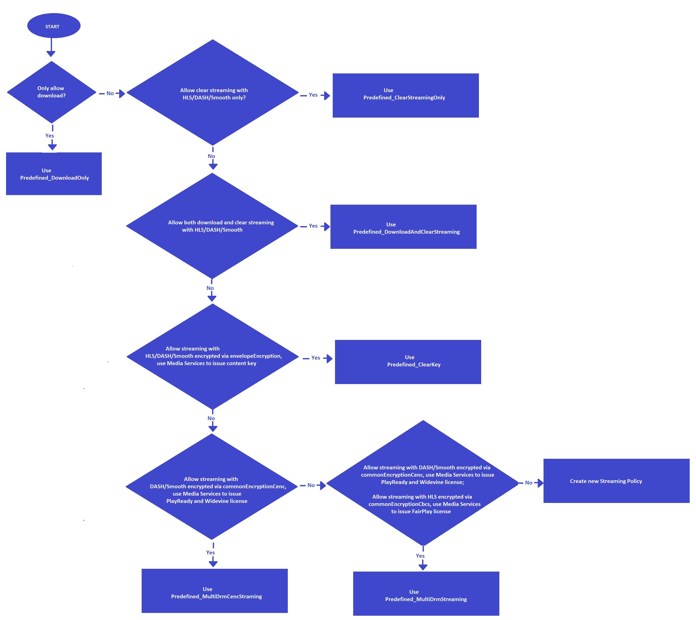

---
# Mandatory fields. See more on aka.ms/skyeye/meta.
title: Streaming Policies in Azure Media Services 
description: This article gives an explanation of what Streaming Policies are, and how they are used by Azure Media Services.
services: media-services
documentationcenter: ''
author: IngridAtMicrosoft
manager: femila
editor: ''

ms.service: media-services
ms.workload: 
ms.topic: conceptual
ms.date: 05/28/2019
ms.author: inhenkel
---

# Streaming Policies

In Azure Media Services v3, [Streaming Policies](/rest/api/media/streamingpolicies) enable you to define streaming protocols and encryption options for your [Streaming Locators](stream-streaming-locators-concept.md). Media Services v3 provides some predefined Streaming Policies so that you can use them directly for trial or production. 

The currently available predefined Streaming Policies:<br/>
* 'Predefined_DownloadOnly'
* 'Predefined_ClearStreamingOnly'
* 'Predefined_DownloadAndClearStreaming'
* 'Predefined_ClearKey'
* 'Predefined_MultiDrmCencStreaming' 
* 'Predefined_MultiDrmStreaming'

The following "Decision tree" helps you choose a predefined Streaming Policy for your scenario.

> [!IMPORTANT]
> * Properties of **Streaming Policies** that are of the Datetime type are always in UTC format.
> * You should design a limited set of policies for your Media Service account and reuse them for your Streaming Locators whenever the same options are needed. For more information, see [Quotas and limits](limits-quotas-constraints-reference.md).

## Decision tree

Click the image to view it full size.  

[](./media/streaming-policy/large.png#lightbox)

If encrypting your content, you need to create a [Content Key Policy](drm-content-key-policy-concept.md), the **Content Key Policy** is not needed for clear streaming or downloading. 

If you have special requirements (for example, if you want to specify different protocols, need to use a custom key delivery service, or need to use a clear audio track), you can [create](/rest/api/media/streamingpolicies/create) a custom Streaming Policy. 

## Get a Streaming Policy definition  

If you want to see the definition of a Streaming Policy, use [Get](/rest/api/media/streamingpolicies/get) and specify the policy name. For example:

### REST

Request:

```
GET https://management.azure.com/subscriptions/00000000-0000-0000-0000-000000000000/resourceGroups/contoso/providers/Microsoft.Media/mediaServices/contosomedia/streamingPolicies/clearStreamingPolicy?api-version=2018-07-01
```

Response:

```
{
  "name": "clearStreamingPolicy",
  "id": "/subscriptions/00000000-0000-0000-0000-000000000000/resourceGroups/contoso/providers/Microsoft.Media/mediaservices/contosomedia/streamingPolicies/clearStreamingPolicy",
  "type": "Microsoft.Media/mediaservices/streamingPolicies",
  "properties": {
    "created": "2018-08-08T18:29:30.8501486Z",
    "noEncryption": {
      "enabledProtocols": {
        "download": true,
        "dash": true,
        "hls": true,
        "smoothStreaming": true
      }
    }
  }
}
```

## Filtering, ordering, paging

See [Filtering, ordering, paging of Media Services entities](filter-order-page-entitites-how-to.md).

## Next steps

* [Stream a file](stream-files-dotnet-quickstart.md)
* [Use AES-128 dynamic encryption and the key delivery service](drm-playready-license-template-concept.md)
* [Use DRM dynamic encryption and license delivery service](drm-protect-with-drm-tutorial.md)
