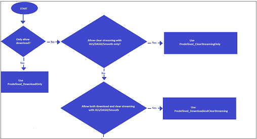

---
# Mandatory fields. See more on aka.ms/skyeye/meta.
title: Streaming Policies in Azure Media Services | Microsoft Docs
description: This article gives an explanation of what Streaming Policies are, and how they are used by Azure Media Services.
services: media-services
documentationcenter: ''
author: Juliako
manager: femila
editor: ''

ms.service: media-services
ms.workload: 
ms.topic: article
ms.date: 05/15/2019
ms.author: juliako
---

# Streaming Policies

In Azure Media Services v3, [Streaming Policies](https://docs.microsoft.com/rest/api/media/streamingpolicies) enable you to define streaming protocols and encryption options for your [Streaming Locators](streaming-locators-concept.md). Media Services v3 provides some predefined Streaming Policies so that you can use them directly for trial or production. 

The currently available predefined Streaming Policies:<br/>'Predefined_DownloadOnly', 'Predefined_ClearStreamingOnly', 'Predefined_DownloadAndClearStreaming', 'Predefined_ClearKey', 'Predefined_MultiDrmCencStreaming' and 'Predefined_MultiDrmStreaming'.

If you have special requirements (for example, if you want to specify different protocols, need to use a custom key delivery service, or need to use a clear audio track), you can create a custom Streaming Policy. 

 
> [!IMPORTANT]
> * Properties of **Streaming Policies** that are of the Datetime type are always in UTC format.
> * You should design a limited set of policies for your Media Service account and reuse them for your Streaming Locators whenever the same options are needed. For more information, see [Quotas and limitations](limits-quotas-constraints.md).

## Decision tree

The following decision tree will help you choose a predefined Streaming Policy for your scenario.

Click the image to view it full size.  <br/>
<a href="./media/streaming-policy/large.png" target="_blank"></a> 

## Examples

### Not encrypted

If you want to stream your file in-the-clear (non-encrypted), set the predefined clear streaming policy: to 'Predefined_ClearStreamingOnly' (in .NET, you can use the PredefinedStreamingPolicy.ClearStreamingOnly enum).

```csharp
StreamingLocator locator = await client.StreamingLocators.CreateAsync(
    resourceGroup,
    accountName,
    locatorName,
    new StreamingLocator
    {
        AssetName = assetName,
        StreamingPolicyName = PredefinedStreamingPolicy.ClearStreamingOnly
    });
```

### Encrypted 

If you need to encrypt your content with envelope and cenc encryption, set your policy to 'Predefined_MultiDrmCencStreaming'. This policy indicates that you want for two content keys (envelope and CENC) to get generated and set on the locator. Thus, the envelope, PlayReady, and Widevine encryptions are applied (the key is delivered to the playback client based on the configured DRM licenses).

```csharp
StreamingLocator locator = await client.StreamingLocators.CreateAsync(
    resourceGroup,
    accountName,
    locatorName,
    new StreamingLocator
    {
        AssetName = assetName,
        StreamingPolicyName = "Predefined_MultiDrmCencStreaming",
        DefaultContentKeyPolicyName = contentPolicyName
    });
```

If you also want to encrypt your stream with CBCS (FairPlay), use 'Predefined_MultiDrmStreaming'.

## Filtering, ordering, paging

See [Filtering, ordering, paging of Media Services entities](entities-overview.md).

## Next steps

* [Stream a file](stream-files-dotnet-quickstart.md)
* [Use AES-128 dynamic encryption and the key delivery service](protect-with-aes128.md)
* [Use DRM dynamic encryption and license delivery service](protect-with-drm.md)
