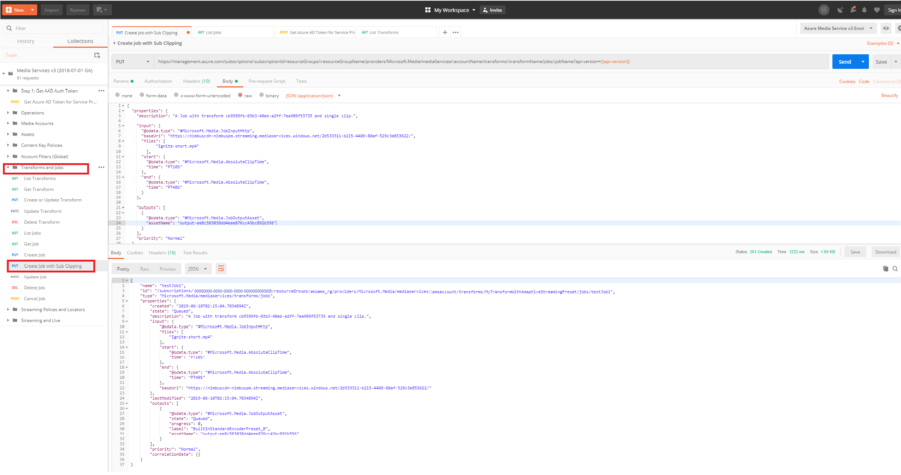

# Subclip a video when encoding with Media Services - REST

You can trim or subclip a video when encoding it using a [Job](https://docs.microsoft.com/rest/api/media/jobs). This functionality works with any [Transform](https://docs.microsoft.com/rest/api/media/transforms) that is built using either the [BuiltInStandardEncoderPreset](https://docs.microsoft.com/rest/api/media/transforms/createorupdate#builtinstandardencoderpreset) presets, or the [StandardEncoderPreset](https://docs.microsoft.com/rest/api/media/transforms/createorupdate#standardencoderpreset) presets. Also, see [Subclipping scenarios](encoding-concept.md#creating-job-input-with-subclipping).

The REST example in this topic creates a job that trims a video as it submits an encoding job. You can see how to create a Transform and input and output Assets in the [Encode a remote file based on URL and stream the video](stream-files-tutorial-with-rest.md) tutorial. 

## Prerequisites

To complete the steps described in this topic, you have to:

- [Create an Azure Media Services account](create-account-cli-how-to.md)
- [Configure Postman for Azure Media Services REST API calls](media-rest-apis-with-postman.md)
    
    Make sure to follow the last step in the topic [Get Azure AD Token](media-rest-apis-with-postman.md#get-azure-ad-token). 
- Create a Transform and an output Assets. You can see how to create a Transform and an output Assets in the [Encode a remote file based on URL and stream the video - REST](stream-files-tutorial-with-rest.md) tutorial.

## Create a subclipping job

1. In the Postman collection that you downloaded, select **Transforms and jobs** -> **Create Job with Sub Clipping**.
1. Update the value of "transformName" environment variable. 
1. Select the Body tab and update the "myOutputAsset" with your output Asset name.
1. Press **Send**.

    

You see the **Response** with the info about a job that was created and its status. 

## Next steps

[How to encode with a custom transform](custom-preset-rest-howto.md) 
