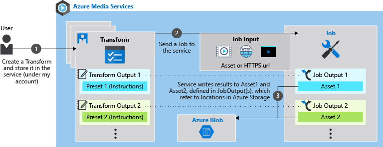
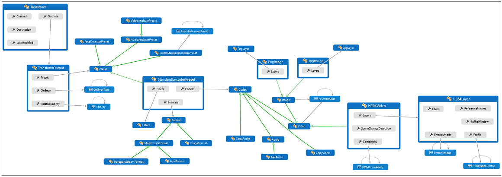
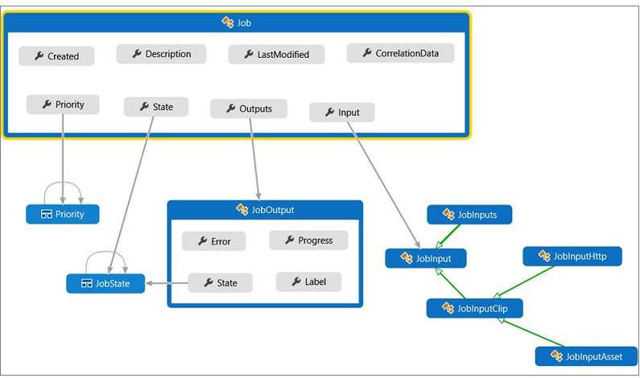

---
# Mandatory fields. See more on aka.ms/skyeye/meta.
title: Transforms and Jobs in Azure Media Services | Microsoft Docs
description: When using Media Services, you need to create a Transform to describe the rules or specifications for processing your videos. This article gives an overview of what Transform is and how to use it. 
services: media-services
documentationcenter: ''
author: Juliako
manager: femila
editor: ''

ms.service: media-services
ms.workload: 
ms.topic: article
ms.date: 05/08/2019
ms.author: juliako
---

# Transforms and Jobs

This topic gives details about [Transforms](https://docs.microsoft.com/rest/api/media/transforms) and [Jobs](https://docs.microsoft.com/rest/api/media/jobs) and explains the relationship between these entities. 

## Overview 

### Transforms/Jobs workflow

The following diagram shows transforms/jobs workflow.

#### Typical workflow

1. Create a Transform 
2. Submit Jobs under that Transform 
3. List Transforms 
4. Delete a Transform, if you are not planning to use it in the future. 

#### Example

Suppose you wanted to extract the first frame of all your videos as a thumbnail image – the steps you would take are: 

1. Define the recipe, or the rule for processing your videos - "use the first frame of the video as the thumbnail". 
2. For each video you would tell the service: 
    1. Where to find that video,  
    2. Where to write the output thumbnail image. 

A **Transform** helps you create the recipe once (Step 1), and submit Jobs using that recipe (Step 2).

> [!NOTE]
> Properties of **Transform** and **Job** that are of the Datetime type are always in UTC format.

## Transforms

Use **Transforms** to configure common tasks for encoding or analyzing videos. Each **Transform** describes a recipe, or a workflow of tasks for processing your video or audio files. A single Transform can apply more than one rule. For example, a Transform could specify that each video be encoded into an MP4 file at a given bitrate, and that a thumbnail image be generated from the first frame of the video. You would add one TransformOutput entry for each rule that you want to include in your Transform. You use presets to tell the Transform how the input media files should be processed.

### Viewing schema

In Media Services v3, presets are strongly typed entities in the API itself. You can find  the "schema" definition for these objects in [Open API Specification (or Swagger)](https://github.com/Azure/azure-rest-api-specs/tree/master/specification/mediaservices/resource-manager/Microsoft.Media/stable/2018-07-01). You can also view the preset definitions (like **StandardEncoderPreset**) in the [REST API](https://docs.microsoft.com/rest/api/media/transforms/createorupdate#standardencoderpreset), [.NET SDK](https://docs.microsoft.com/dotnet/api/microsoft.azure.management.media.models.standardencoderpreset?view=azure-dotnet) (or other Media Services v3 SDK reference documentation).

### Creating Transforms

You can create Transforms using REST, CLI, or use any of the published SDKs. The Media Services v3 API is driven by Azure Resource Manager, so you can also use Resource Manager templates to create and deploy Transforms in your Media Services account. Role-based access control can be used to lock down access to Transforms.

### Updating Transforms

If you need to update your [Transform](https://docs.microsoft.com/rest/api/media/transforms), use the **Update** operation. It is intended for making changes to the description, or the priorities of the underlying TransformOutputs. It is recommended that such updates be performed when all in-progress jobs have completed. If you intend to rewrite the recipe, you need to create a new Transform.

### Transform object diagram

The following diagram shows the **Transform** object and the objects it references including the derivation relationships. The gray arrows show a type that the Job references and the green arrows show class derivation relationships. Click the image to view it full size.  

 

## Jobs

A **Job** is the actual request to Azure Media Services to apply the **Transform** to a given input video or audio content. Once the Transform has been created, you can submit jobs using Media Services APIs, or any of the published SDKs. The **Job** specifies information such as the location of the input video, and the location for the output. You can specify the location of your input video using: HTTPS URLs, SAS URLs, or [Assets](https://docs.microsoft.com/rest/api/media/assets).  

### Job input from HTTPS

Use [job input from HTTPS](job-input-from-http-how-to.md) if your content is already accessible via a URL and you don't need to store the source file in Azure (for example, import from S3). This method is also suitable if you have the content in Azure Blob storage but have no need for the file to be in an Asset. Currently, this method only supports a single file for input.

### Asset as Job input

Use [Asset as job input](job-input-from-local-file-how-to.md) if the input content is already in an Asset or the content is stored in local file. It is also a good option if you plan to publish the input asset for streaming or download (say you want to publish the mp4 for download but also want to do speech to text or face detection). This method supports multi-file assets (for example, MBR streaming sets that were encoded locally).

### Checking Job progress

The progress and state of jobs can be obtained by monitoring events with Event Grid. For more information, see [Monitor events using EventGrid](job-state-events-cli-how-to.md).

### Updating Jobs

The Update operation on the [Job](https://docs.microsoft.com/rest/api/media/jobs) entity can be used to modify the *description*, and the *priority* properties after the job has been submitted. A change to the *priority* property is effective only if the job is still in a queued state. If the job has begun processing, or has finished, changing priority has no effect.

### Job object diagram

The following diagram shows the **Job** object and the objects it references including the derivation relationships. Click the image to view it full size.  

 

## Configure Media Reserved Units

For the Audio Analysis and Video Analysis Jobs that are triggered by Media Services v3 or Video Indexer, it is highly recommended to provision your account with 10 S3 Media Reserved Units (MRUs). If you need more than 10 S3 MRUs, open a support ticket using the [Azure portal](https://portal.azure.com/).

For details, see [Scale media processing with CLI](media-reserved-units-cli-how-to.md).

## Ask questions, give feedback, get updates

Check out the [Azure Media Services community](media-services-community.md) article to see different ways you can ask questions, give feedback, and get updates about Media Services.

## See also

* [Error codes](https://docs.microsoft.com/rest/api/media/jobs/get#joberrorcode)
* [Filtering, ordering, paging of Media Services entities](entities-overview.md)

## Next steps

- Before you start developing, review [Developing with Media Services v3 APIs](media-services-apis-overview.md) (includes information on accessing APIs, naming conventions, etc.)
- Check out these tutorials:

    - [Tutorial: Upload, encode, and stream videos using .NET](stream-files-tutorial-with-api.md)
    - [Tutorial: Analyze videos with Media Services v3 using .NET](analyze-videos-tutorial-with-api.md)
