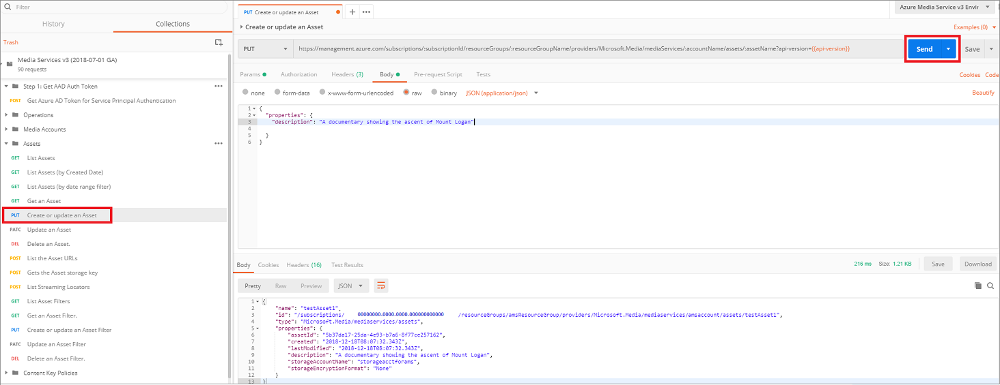
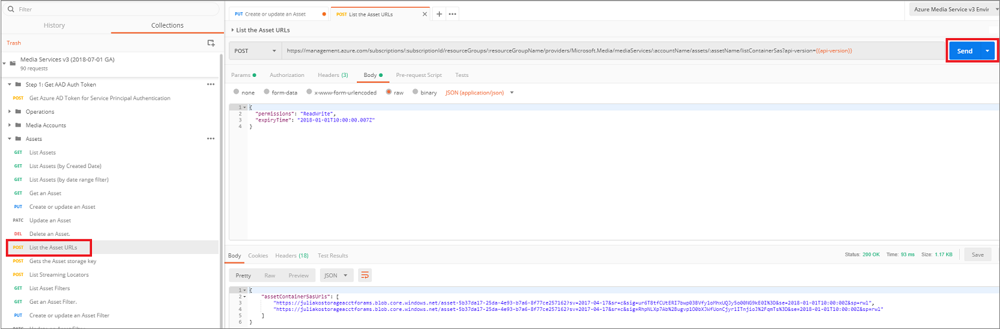

# Upload files into a Media Services v3 account using REST

In Media Services, you upload your digital files into a blob container associated with an asset. The [Asset](https://docs.microsoft.com/rest/api/media/operations/asset) entity can contain video, audio, images, thumbnail collections, text tracks and closed caption files (and the metadata about these files). Once the files are uploaded into the asset's container, your content is stored securely in the cloud for further processing  and streaming.

This article shows you how to upload a local file using REST.

## Prerequisites

To complete the steps described in this topic, you have to:

- Review [Asset concept](assets-concept.md).
- [Configure Postman for Azure Media Services REST API calls](media-rest-apis-with-postman.md).
    
    Make sure to follow the last step in the topic [Get Azure AD Token](media-rest-apis-with-postman.md#get-azure-ad-token). 

## Create an asset

This section shows how to create a new Asset.

1. Select **Assets** -> **Create or update an Asset**.
2. Press **Send**.

    

You see the **Response** with the info about newly created asset.

## Get a SAS URL with read-write permissions 

This section shows how to get a SAS URL that was generated for the created asset. The SAS URL was created with read-write permissions and can be used to upload digital files into the Asset container.

1. Select **Assets** -> **List the Asset URLs**.
2. Press **Send**.

    

You see the **Response** with the info about asset's URLs. Copy the first URL and use it to upload your file.

## Upload a file to blob storage using the upload URL

Use the Azure Storage APIs or SDKs (for example, the [Storage REST API](../../storage/common/storage-rest-api-auth.md) or [.NET SDK](../../storage/blobs/storage-quickstart-blobs-dotnet.md).

## Next steps

[Tutorial: Encode a remote file based on URL and stream the video - REST](stream-files-tutorial-with-rest.md)
