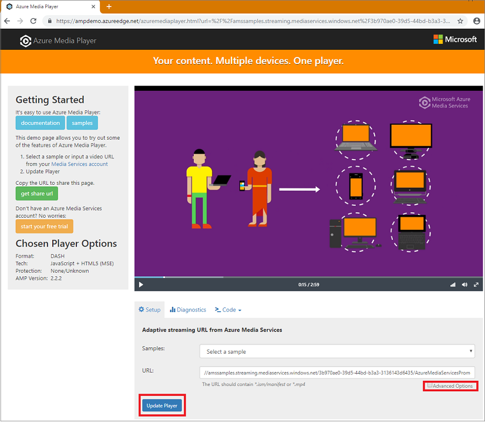
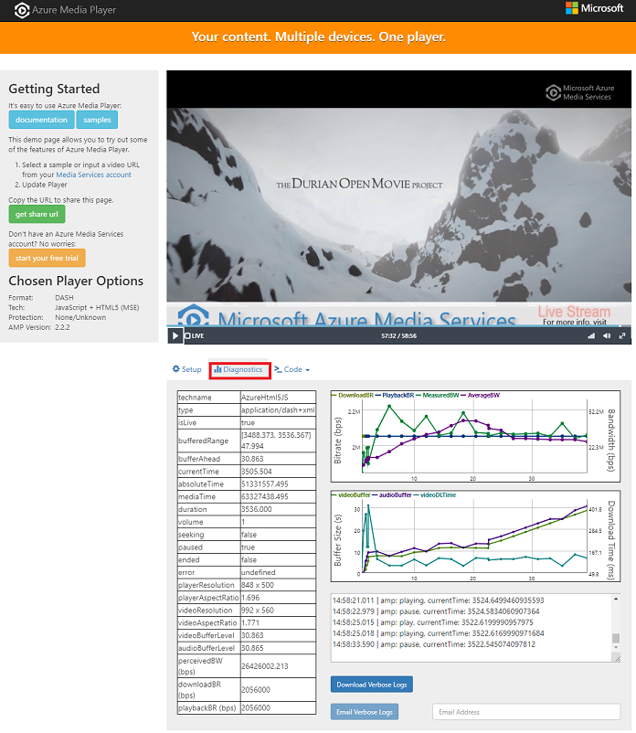

---
# Mandatory fields. See more on aka.ms/skyeye/meta.
title: Playback with Azure Media Player - Azure | Microsoft Docs
description: Azure Media Player is a web video player built to play back media content from Microsoft Azure Media Services on a wide variety of browsers and devices.
services: media-services
documentationcenter: ''
author: Juliako
manager: femila
editor: ''

ms.service: media-services
ms.workload: 
ms.topic: article
ms.date: 07/17/2019
ms.author: juliako

---

# Azure Media Player overview

Azure Media Player is a web video player built to play back media content from Microsoft Azure Media Services on a wide variety of browsers and devices. Azure Media Player utilizes industry standards, such as HTML5, Media Source Extensions (MSE), and Encrypted Media Extensions (EME) to provide an enriched adaptive streaming experience. When these standards are not available on a device or in a browser, Azure Media Player uses Flash and Silverlight as fallback technology. Regardless of the playback technology used, developers will have a unified JavaScript interface to access APIs. This allows for content served by Azure Media Services to be played across a wide-range of devices and browsers without any extra effort.

Microsoft Azure Media Services allows for content to be served up with HLS, DASH, Smooth Streaming streaming formats to play back content. Azure Media Player takes into account these various formats and automatically plays the best link based on the platform/browser capabilities. Media Services also allows for dynamic encryption of assets with PlayReady encryption or AES-128 bit envelope encryption. Azure Media Player allows for decryption of PlayReady and AES-128 bit encrypted content when appropriately configured. 

> [!NOTE]
> HTTPS playback is required for Widevine encrypted content.

## Use Azure Media Player demo page

### Start using

You can use the [Azure Media Player demo page](https://aka.ms/azuremediaplayer) to play Azure Media Services samples or your own stream.  

To play a new video, paste a different URL and press **Update**.

To configure various playback options (for example, tech, language, or encryption), press **Advanced Options**.

### Monitor diagnostics of a video stream

You can use the [Azure Media Player demo page](https://aka.ms/azuremediaplayer) to monitor diagnostics of a video stream. 

## Set up Azure Media Player in your HTML

Azure Media Player is easy to set up. It only takes a few moments to get basic playback of media content from your Media Services account. See [Azure Media Player documentation](https://aka.ms/ampdocs) for details on how to set up and configure Azure Media Player. 

## Additional notes

* Widevine is a service provided by Google Inc. and subject to the terms of service and Privacy Policy of Google, Inc.

## Next steps

- [Azure Media Player documentation](https://aka.ms/ampdocs)
- [Azure Media Player samples](https://aka.ms/ampsamples)
