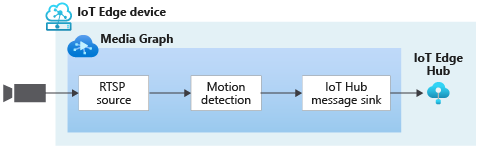
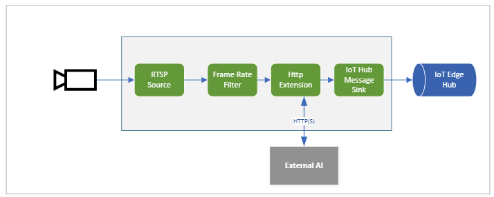
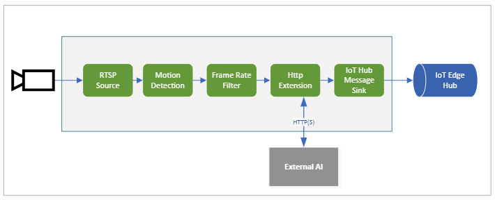

# Analyzing live video without any recording

## Suggested pre-reading 

* [Media graph concept](media-graph-concept.md)
* [Event-based video recording](event-based-video-recording-concept.md)

## Overview  

You can use a media graph to analyze live video, without recording any portions of the video to a file or an asset. The media graphs shown below are similar to the ones in the article on [Event-Based Video Recording](event-based-video-recording-concept.md), but without an asset sink node or file sink node.

### Motion detection

The media graph shown below consists of a [RTSP source](media-graph-concept.md#rtsp-source) node, a [motion detection processor](media-graph-concept.md#motion-detection-processor) node, and an [IoT Hub message sink](media-graph-concept.md#iot-hub-message-sink) node. The JSON representation of the graph topology of such a media graph can be found [here](https://github.com/Azure/live-video-analytics/blob/master/MediaGraph/topologies/motion-detection/topology.json). This graph enables you to detect motion in the incoming live video stream and relay the motion events to other apps and services via the IoT Hub message sink node. The external apps or services can trigger an alert or send a notification to appropriate personnel.

### Analyzing video using a custom vision model 

The media graph shown below enables you to analyze a live video stream using a custom vision model packaged in a separate module. The JSON representation of the graph topology of such a media graph can be found [here](https://github.com/Azure/live-video-analytics/blob/master/MediaGraph/topologies/httpExtension/topology.json). You can see some examples [here](https://github.com/Azure/live-video-analytics/tree/master/utilities/video-analysis) on wrapping models into IoT Edge modules that run as an inference service.

In this media graph, the frame rate filter processor node lowers the frame rate of the incoming live video stream before sending it to a [HTTP extension processor](media-graph-concept.md#http-extension-processor) node, which sends image frames (in JPEG, BMP, or PNG formats) to an external inference service over REST. The results from the external inference service are retrieved by the HTTP extension node, and relayed to the IoT Edge hub via IoT Hub message sink node. This type of media graph can be used to build solutions for a variety of scenarios, such as understanding the time-series distribution of vehicles at an intersection, understanding the consumer traffic pattern in a retail store, and so on.

An enhancement to this example is to use a motion detector processor ahead of the frame rate filter processor node. This will reduce the load on the inference service, since it is used only when there is motion activity in the video.

## Next steps

[Continuous video recording](continuous-video-recording-concept.md)
