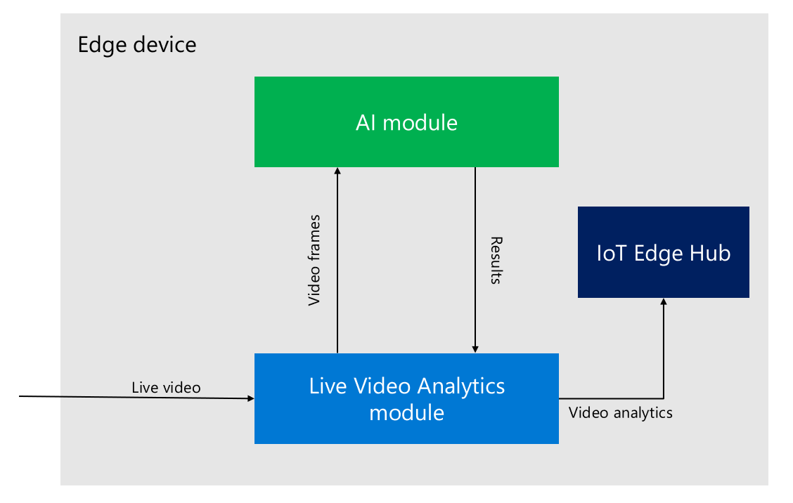
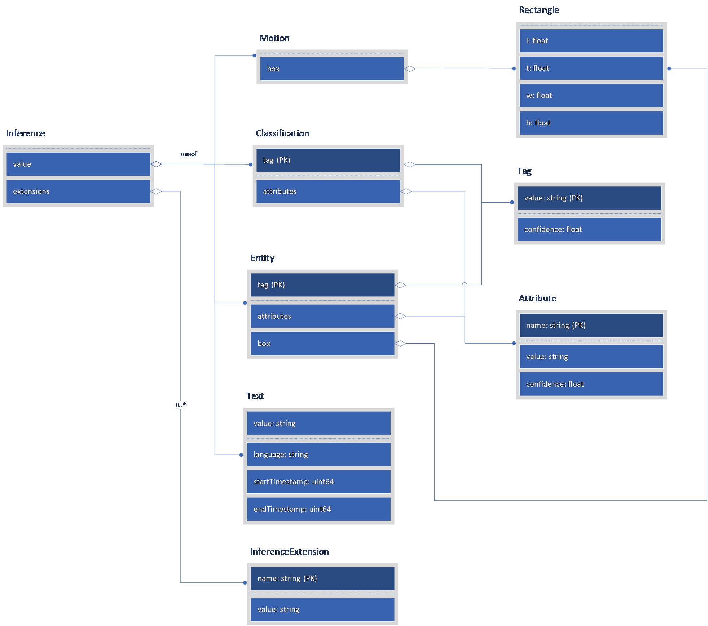

# Analyze live video with AI of your choice

In this article, you will learn how to build an IoT Edge module that can be integrated with Live Video Analytics on IoT Edge to analyze live video using a computer vision model of your choice. 

## Pre-reading

[Media graph concept](media-graph-concept.md)

## Media graph extension

Live Video Analytics on IoT Edge defines an extensibility model that enables you to extend the media graph processing capabilities to your own media analytics components through a graph extension. Your analytics component can make use of traditional image-processing techniques or computer vision AI models. Graph extensions are enabled by including the [HTTP extension processor](media-graph-concept.md#http-extension-processor) node in a media graph. The HTTP extension processor can relay video frames to an HTTP endpoint specified by you and acts as the interface to your component via that. The connection can be made to a local or remote endpoint and it can be secured by authentication and TLS encryption, if required. Additionally, the processor allows for optional scaling and encoding of the video frames before they are relayed forward.

You can choose to run the inference model of your choice on any available inference runtime, such as ONNX, TensorFlow, PyTorch, or others on your own docker container. You can also use the programing language and libraries of your choice to expose the image inferencing capabilities though an HTTP server on your own container. The inferencing container should be deployed alongside Live Video Analytics edge module for best performance and will then be invoked via the HTTP extension processor include in your graph topology.
Additionally, the frequency of the calls into your custom module can be throttled by optionally adding a [motion detector processor](media-graph-concept.md#motion-detection-processor) and a [frame rate filter processor](media-graph-concept.md#frame-rate-filter-processor) upstream to the HTTP extension processor.

The diagram below depicts the high-level data flow:



This enables you to analyze video using AI models of your choice to meet your unique business needs. The AI models could be from the open-source community, or from your own data scientists or from a specialized AI provider.

## Media graph HTTP extension contract definitions

This section defines the HTTP contract that defines the data flow.

### HTTP extensibility protocol  

The HTTP contract is defined as follows:

* Your module acts as the HTTP server.
* Live Video Analytics on IoT Edge module acts as the HTTP client.

### Request

Requests from Live Video Analytics module to your module would be as follows:

|||
|---|---|
|POST| `https://hostname/optional-path?optional-query`|
|Accept|application/json, */*|
|Authorization|	Basic, Digest, Bearer (through custom header support)|
|Content-Type|image/jpeg<br/>image/png<br/>image/bmp<br/>image/x-raw|
|Content-Length|Body length, in bytes|
|User-Agent|Azure Media Services|
|Body|Image bytes, binary encoded in one of the supported content types.|

#### Example

```
POST http://localhost:8080/inference HTTP/1.1
Host: localhost:8080
x-ms-client-request-id: d6050cd4-c9f2-42d3-9adc-53ba7e440f17
Content-Type: image/bmp
Content-Length: 519222

(Image Binary Content)
```

### Response

Responses from your module to Live Video Analytics module should be as follows

|||
|---|---|
|Status Codes|200 OK - Inference results found<br/>204 No Content - No content found by the AI<br/>400 Bad Request - Not expected<br/>500 Internal Server Error - Not expected<br/>503 Server Busy - AMS will back-off based on “Retry-After” header or based on a default amount of time in case header not preset.|
|Content-Type|application/json|
|Content-Length|	Body length, in bytes|
|Body|JSON object with single “inferences” property.|

#### Example

```
HTTP/1.1 200 OK
Content-Type: application/json
Content-Length: 468
Server: Microsoft-HTTPAPI/2.0
Date: Fri, 17 Apr 2020 04:44:01 GMT

{
  "inferences": [
    {
      "type": "entity",
      "entity": {
        "tag": { "value": "car", "confidence": 0.9048132 },
        "box": { "l": 0.42681578, "t": 0.47660735, "w": 0.019501392, "h": 0.020954132 }
      }
    },
    {
      "type": "entity",
      "entity": {
        "tag": { "value": "car", "confidence": 0.8953932 },
        "box": { "l": 0.55083525, "t": 0.4843858, "w": 0.046550274, "h": 0.046502113 }
      }
    }    
  ]
}
```

It is highly recommended that responses are returned using valid JSON documents following the pre-established schema defined below. This will better ensure interoperability with other components and possible future capabilities added to the Live Video Analytics module.

If your module returns a response where the content type is not “application/json”, Live Video Analytics will encode the message as a base 64 content and serialize it as an opaque JSON payload.

If your module returns a response with content type as “application/json” but the JSON schema doesn’t follow the [inference metadata schema outlined below](#inference-metadata-schema), the message payload will be forwarded through the pipeline, but interoperability will be reduced.

> [!NOTE]
> If your module doesn’t produce any result, it should return HTTP 204 Status Code (No Content) with an empty response body. Live Video Analytics will understand this as an empty result and won’t forward the event throughout the pipeline.

### Inference metadata schema

Each Inference object follows this superset schema:

```
{
  "type": "[classification|motion|entity|text|other]",
  "subtype": "",              // Free form subtype id

  // Object has *at most one of* the following
  "classification":
  {
    "tag": 
    {
      "value": "",            // Tag value
      "confidence": 0.0       // Tag confidence
    },
    "attributes":[            // Optional attributes
      {
        "name": "",           
        "value": "",          
        "confidence": 0.0     
      }
    ]
  },

  "motion":
  {
    "box": { "l": 0.0, "t": 0.0, "w": 0.0, "h": 0.0 }
    // "regionId": ""
  },

  "entity":
  {
    "tag": 
    {
      "value": "",            // Tag value
      "confidence": 0.0       // Tag confidence
    },
    "attributes":[            // Optional attributes
      {
        "name": "",           
        "value": "",          
        "confidence": 0.0     
      }
    ],
    "box": { "l": 0.0, "t": 0.0, "w": 0.0, "h": 0.0 }
  },

  "text":
  {
    "value": "",              // Text value
    "language": "",           // Optional BCP47 Language Code (https://tools.ietf.org/html/bcp47)
    "startTimestamp": 0,      // Optional start timestamp
    "endTimestamp": 0         // Optional end timestamp
  },

  // Plus every object can have zero or more extensions
  "extensions":
  {
    "name1": "value1",
    "name2": "value2"
    // ...
  }
}
```
 
### Data contracts - class hierarchy



### Examples  

The example below contains a single event with all the supported inference types:

```
{
  "inferences": [
    // Light detection
    {
      "type": "classification",
      "subtype": "lightDetection",
      "classification": {
        "tag": { "value": "daylight", "confidence": 0.86 },
        "attributes": [
            { "name": "isBlackAndWhite", "value": "false", "confidence": 0.71 }
        ]
      }
    },

    // Motion detection
    {
      "type": "motion",
      "subtype": "motionDetection",
      "motion":
      {
        "box": { "l": 0.0, "t": 0.0, "w": 0.0, "h": 0.0 }
      }
    },

    // Object detection
    {
      "type": "entity",
      "subtype": "objectDetection",    
      "entity":
      {
        "tag": { "value": "dog", "confidence": 0.97 },
        "box": { "l": 0.0, "t": 0.0, "w": 0.0, "h": 0.0 }
      }
    },

    // Vehicle identification
    {
      "type": "entity",
      "subtype": "vehicleIdentification",    
      "entity":
      {
        "tag": { "value": "007-SPY", "confidence": 0.82 },
        "attributes":[  
          { "name": "color", "value": "black", "confidence": 0.90 },
          { "name": "body", "value": "coupe", "confidence": 0.87 },
          { "name": "make", "value": "Aston Martin", "confidence": 0.35 },
          { "name": "model", "value": "DBS V12", "confidence": 0.33 }
        ],
        "box": { "l": 0.0, "t": 0.0, "w": 0.0, "h": 0.0 }
      }
    },

    // People identification
    {
      "type": "entity",
      "subtype": "peopleIdentification",    
      "entity":
      {
        "tag": { "value":"Erwin Schrödinger", "confidence": 0.50 },
        "attributes":[  
          { "name": "age", "value": "73", "confidence": 0.87 },
          { "name": "glasses", "value": "yes", "confidence": 0.94 }
        ],
        "box": { "l": 0.0, "t": 0.0, "w": 0.0, "h": 0.0 }
      },
    }
  ]
}
```
 
## Sample HTTP extension modules

A few sample HTTP extension modules can be found in the [Live Video Analytics GitHub repo](https://github.com/Azure/live-video-analytics/tree/master/utilities/video-analysis). One of these [video analysis samples](https://github.com/Azure/live-video-analytics/tree/master/utilities/video-analysis/yolov3-onnx) shows how to use [Yolov3](https://pjreddie.com/darknet/yolo/) [ONNX](http://onnx.ai/) model to build an IoT Edge module for object detection. You can use the same approach to build a module of your own with an AI model of your choice.

## Next steps

[Troubleshoot](troubleshoot-how-to.md)
