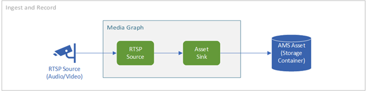
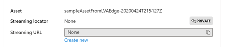

# Tutorial: continuous video recording to cloud and playback from cloud  

In this tutorial, you will learn how to use Live Video Analytics on IoT Edge to continuously record video to the cloud, and stream any portion of that video using Azure Media Services. This is useful for safety scenarios, where there is a need to maintain an archive of the footage from a camera for multiple days (or weeks).

The tutorial shows you how to:

> [!div class="checklist"]
> * Download the sample app described in the topic.
> * Examine the code that performs CVR.
> * Run the sample code.
> * Examine the results, view the video.

[!INCLUDE [quickstarts-free-trial-note](../../../includes/quickstarts-free-trial-note.md)]

## Suggested pre-reading  

It is recommended that you read through the following documentation pages

* [Live video analytics on IoT Edge overview](overview.md)
* [Live video analytics on IoT Edge terminology](terminology.md)
* [Continuous video recording scenarios](continuous-video-recording-concept.md)

## Prerequisites

* Azure resources are deployed in the Azure subscription using the quickstart script<!--TODO Link-->. The deployed resources include

    * IoT Hub
    * Storage
    * Media Services
    * Virtual machine
* Visual Studio Code on your development machine
* Visual Studio Code Extensions
    
    * Azure IoT Tools
    * C#
* [.NET Core 3.1 SDK](https://dotnet.microsoft.com/download/dotnet-core/thank-you/sdk-3.1.201-windows-x64-installer)

## Overview

As covered in the [continuous video recording scenarios](continuous-video-recording-concept.md)(CVR), CVR refers to the process of continuously recording the video from a video source. This tutorial will help you go through a sample that will enable you to realize this scenario.



## Download and configure the sample 

1. Clone or download the [Quickstart RC2 repo](https://github.com/Azure-Samples/lva-edge-rc2). <!--(TODO, change this for launch)--> 
1. Open the project in Visual Studio Code.
1. Copy appsettings.json created by the quickstart script to src/quick-start/app folder. Alternatively you can enter the values for IoThubConnectionString and deviceId yourself. Note that deviceId refers to the IoT Edge device ID. This should look as follows.

    ```
    {
        "IoThubConnectionString" : "HostName=xxx.azure-devices.net;SharedAccessKeyName=iothubowner;SharedAccessKey=XXX",
        "deviceId" : "lva-sample-device",
        "moduleId" : "lvaEdge"
    }
    ```            
1. Copy .env file created by the quickstart script to src/quick-start/edge folder. Alternatively, you can enter the values manually. The contents of this file should look as follows (with values filled out)

    ```
    SUBSCRIPTION_ID=""
    RESOURCE_GROUP=""
    AMS_ACCOUNT=""
    AAD_TENANT_ID=""
    AAD_SERVICE_PRINCIPAL_ID=""
    AAD_SERVICE_PRINCIPAL_SECRET=""
    OUTPUT_VIDEO_FOLDER_ON_DEVICE=""
    INPUT_VIDEO_FOLDER_ON_DEVICE=""
    CONTAINER_REGISTRY_USERNAME_myacr=""
    CONTAINER_REGISTRY_PASSWORD_myacr=""
    ```
    
    <!--NOTE: ONLY FOR THE BUG BASH during internal testing, add the 4 lines from these Comments-->

## Examine the sample 

1. Browse to src/quick-start folder in VS Code.
1. You will see two folders – edge and app:

    * Edge folder contains .env file and deployment.template.json. The deployment template refers to the deployment manifest for the edge device with some placeholder values. The .env file has the values for those variables.
    * App folder contains the following files

         * Appsettings.json has the settings required for the program (as covered in the previous section)
         * Graphsettings.json has the Media Graph related settings required for the sample program. The settings are as follows
    1. graphTopologyUrl points to the graph topology JSON
    1. graphInstanceName refers to the graph name that the sample program will use when creating the graph instance
    1. graphInstanceDescription refers to the graph description that the sample program will use when creating the graph instance.

         * Cvr_app.csproj is the project file for VS Code
         * Program.cs has the sample program code. The program does the following
    1. Loads the app settings and graph setting
    1. Invoke the LVA on IoT Edge Direct Methods to create topology, instantiate the graph and activate the graph
    1. Pauses for you to examine the graph output in the terminal window and the events sent to IoT hub in the “output” window
    1. Deactivate the graph instance, delete the graph instance, and delete the graph topology

## Run the sample  

1. Right-click on src/quick-start/edge/deployment.template.json and select “Generate IoT Edge Deployment Manifest”. This will create the IoT Edge deployment manifest at src/quick-start/edge/config/deployment.json.
1. Right-click on scr/quick-start/edge/config/deployment.amd64.json and select “Create Deployment for Single Device”. 
1. VS Code will prompt you to input the IoTHub connection string. You can copy it from the appsettings.json file.
1. Next, VS Code will ask you select an IoT hub device. Select your IoT Edge device.
1. At this stage, the deployment of edge modules to your IoT Edge device has started.
1. In about 30 seconds, refresh the Azure IOT Hub on the bottom-left section and you should have the edge device with the modules deployed
1. Right click on the Device and click on “Start Monitoring Built-in Event Endpoint”
1. Overwrite the contents of src/quick-start/app/graphsettings.json file with the following
    
    ```
    {
        "graphTopologyUrl" : " https://lvamedia.blob.core.windows.net/topologies/cvr.json",    
    
        "graphInstanceName" : "cvr graph",
        "graphInstanceDescription" : "Continuous Video Recording"
    }
    ````
1. Press “F5”. This will start the debug session. 
1. At this stage, the terminal window will show the console output from the program and the “output” window will start showing the events being sent to IoT Hub.
1. The Media Graph will continue to run, and print results – the RTSP simulator will keep looping the source video. In order to stop the Media Graph, you can do the following. The Program will have paused at the Console.Readline() stage. Go the TERMINAL window, and hit the “Enter” key. The Media Graph will be stopped, and the Program will exit.

## Examine the output  

In the Media Graph <Link to diagram above>, the results from the motion detector processor node are sent via the IoT Hub sink node to the IoT Hub. The text you see in the OUTPUT window of Visual Studio Code follow the streaming messaging format established for device-to-cloud communications by IoT Hub:

* A set of application properties. A dictionary of string properties that an application can define and access, without needing to deserialize the message body. IoT Hub never modifies these properties
* An opaque binary body

In the messages below, the application properties and the content of the body are defined by the Live Video Analytics module. <!--TODO: add link to sections in our Telemetry article when ready>-->

### Diagnostic events  

#### Media session established event  

When the Media Graph is instantiated, the RTSP Source node attempts to connect to the RTSP server running on the rtspsim-live55 container. If successful, it will print this event. The event type is Microsoft.Media.MediaGraph.Diagnostics.MediaSessionEstablished.
[IoTHubMonitor] [9:42:18 AM] Message received from [lvaedgesample/lvaEdge]:

```
{
  "body": {
    "sdp": "SDP:\nv=0\r\no=- 1586450538111534 1 IN IP4 nnn.nn.0.6\r\ns=Matroska video+audio+(optional)subtitles, streamed by the LIVE555 Media Server\r\ni=media/camera-300s.mkv\r\nt=0 0\r\na=tool:LIVE555 Streaming Media v2020.03.06\r\na=type:broadcast\r\na=control:*\r\na=range:npt=0-300.000\r\na=x-qt-text-nam:Matroska video+audio+(optional)subtitles, streamed by the LIVE555 Media Server\r\na=x-qt-text-inf:media/camera-300s.mkv\r\nm=video 0 RTP/AVP 96\r\nc=IN IP4 0.0.0.0\r\nb=AS:500\r\na=rtpmap:96 H264/90000\r\na=fmtp:96 packetization-mode=1;profile-level-id=4D0029;sprop-parameter-sets=Z00AKeKQCgC3YC3AQEBpB4kRUA==,aO48gA==\r\na=control:track1\r\n"
  },
  "applicationProperties": {
    "dataVersion": "1.0",
    "topic": "/subscriptions/{subscriptionID}/resourceGroups/{name}/providers/microsoft.media/mediaservices/hubname",
    "subject": "/graphInstances/GRAPHINSTANCENAMEHERE/sources/rtspSource",
    "eventType": "Microsoft.Media.MediaGraph.Diagnostics.MediaSessionEstablished",
    "eventTime": "2020-04-09T16:42:18.1280000Z"
  }
}
```

<!--#### Operational events OPERATIONAL EVENTS (THESE ARE NOT YET IMPLEMENTED)

MediaGraph Activated 
MediaGraph Deactivated
-->

#### Media services asset  

You can see the Media Services asset that was created by the graph by logging in to the Azure portal, and view the video.

1. Open your web browser, and go to the Microsoft Azure portal. Enter your credentials to sign in to the portal. The default view is your service dashboard.
1. Locate your Media Services account among the resources you have in your subscription, and open the account blade
1. Click on Assets in the left-hand column
1. You will find an Asset listed with the name sampleAssetFromLVAEdge-{DateTime} – this is the naming pattern chosen in your Media Graph topology file
1. Click on the Asset
1. In the Asset details page, click on the “Create new” below the Streaming URL text box

    
1. In the wizard that opens, accept the default options and hit "Add".<!-- You can see <TODO: link to the concept doc we have about playback-->

    > [!TIP]
    > Make sure your Streaming Endpoint is up and running.
    
    1. The player should load the video, and you should be able to hit **Play** to view

<!--TODO: Link to the note on latency in the How-to -->

## Clean up resources

If you're not going to continue to use this application, delete
resources created in this tutorial.

## Next steps

> [!div class="nextstepaction"]
> * Use an IP camera with support for RTSP instead of using the RTSP simulator. You can search for IP cameras with RTSP support on the ONVIF conformant products page by looking for devices that conform with profiles G, S, or T.<br/>
> *	Use an AMD64 or X64 Linux device (vs. using an Azure Linux VM). This device must be in the same network as the IP camera. You can follow instructions in Install Azure IoT Edge runtime on Linux and then follow instructions in this Quickstart guide to register the device with Azure IoT Hub.
