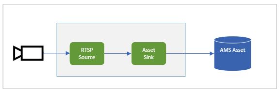
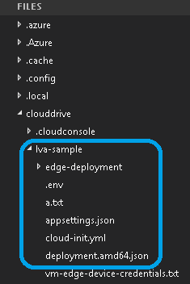
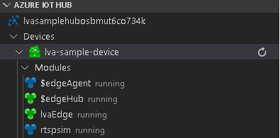
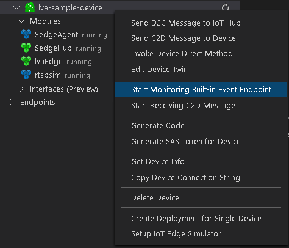

# Tutorial: Continuous video recording to the cloud and playback from the cloud

In this tutorial, you'll learn how to use Azure Live Video Analytics on Azure IoT Edge to perform [continuous video recording](continuous-video-recording-concept.md) (CVR) to the cloud and stream any portion of that video by using Azure Media Services. This capability is useful for scenarios such as safety and compliance where there's a need to maintain an archive of the footage from a camera for days or weeks. 

In this tutorial you will:

> [!div class="checklist"]
> * Set up the relevant resources.
> * Examine the code that performs CVR.
> * Run the sample code.
> * Examine the results, and view the video.

[!INCLUDE [quickstarts-free-trial-note](../../../includes/quickstarts-free-trial-note.md)]

## Suggested pre-reading  

Read these articles before you begin:

* [Live Video Analytics on IoT Edge overview](overview.md)
* [Live Video Analytics on IoT Edge terminology](terminology.md)
* [Media graph concepts](media-graph-concept.md) 
* [Continuous video recording scenarios](continuous-video-recording-concept.md)

## Prerequisites

Prerequisites for this tutorial are:

* [Visual Studio Code](https://code.visualstudio.com/) on your development machine with the [Azure IoT Tools](https://marketplace.visualstudio.com/items?itemName=vsciot-vscode.azure-iot-tools) and the [C#](https://marketplace.visualstudio.com/items?itemName=ms-dotnettools.csharp) extensions.

    > [!TIP]
    > You might be prompted to install Docker. Ignore this prompt.
* [.NET Core 3.1 SDK](https://dotnet.microsoft.com/download/dotnet-core/thank-you/sdk-3.1.201-windows-x64-installer) on your development machine.
* Complete the [Live Video Analytics resources setup script](https://github.com/Azure/live-video-analytics/tree/master/edge/setup).

At the end of these steps, you'll have relevant Azure resources deployed in your Azure subscription:

* Azure IoT Hub
* Azure Storage account
* Azure Media Services account
* Linux VM in Azure, with the [IoT Edge runtime](https://docs.microsoft.com/azure/iot-edge/how-to-install-iot-edge-linux) installed

## Concepts

As explained in the [media graph concept](media-graph-concept.md) article, a media graph lets you define:

- Where media should be captured from.
- How it should be processed.
- Where the results should be delivered. 
 
 To accomplish CVR, you need to capture the video from an RTSP-capable camera and continuously record it to an [Azure Media Services asset](terminology.md#asset). This diagram shows a graphical representation of that media graph.



In this tutorial, you'll use one edge module built by using the [Live555 Media Server](https://github.com/Azure/live-video-analytics/tree/master/utilities/rtspsim-live555) to simulate an RTSP camera. Inside the media graph, you'll use an [RTSP source](media-graph-concept.md#rtsp-source) node to get the live feed and send that video to the [asset sink node](media-graph-concept.md#asset-sink), which records the video to an asset.

## Set up your development environment

Before you begin, check that you've completed the third bullet in [Prerequisites](#prerequisites). After the resource setup script finishes, select the curly brackets to expose the folder structure. You'll see a few files created under the ~/clouddrive/lva-sample directory.



Of interest in this tutorial are the files:

* **~/clouddrive/lva-sample/edge-deployment/.env**: Contains properties that Visual Studio Code uses to deploy modules to an edge device.
* **~/clouddrive/lva-sample/appsettings.json**: Used by Visual Studio Code for running the sample code.

You'll need the files for these steps:

1. Clone the repo from the GitHub link https://github.com/Azure-Samples/live-video-analytics-iot-edge-csharp.
1. Start Visual Studio Code, and open the folder where you downloaded the repo.
1. In Visual Studio Code, browse to the src/cloud-to-device-console-app folder and create a file named **appsettings.json**. This file contains the settings needed to run the program.
1. Copy the contents from the ~/clouddrive/lva-sample/appsettings.json file. The text should look like:
    ```
    {  
        "IoThubConnectionString" : "HostName=xxx.azure-devices.net;SharedAccessKeyName=iothubowner;SharedAccessKey=XXX",  
        "deviceId" : "lva-sample-device",  
        "moduleId" : "lvaEdge"  
    }
    ```
    The IoT Hub connection string lets you use Visual Studio Code to send commands to the edge modules via Azure IoT Hub.
    
1. Next, browse to the src/edge folder and create a file named **.env**.
1. Copy the contents from the ~/clouddrive/lva-sample/.env file. The text should look like:

    ```
    SUBSCRIPTION_ID="<Subscription ID>"  
    RESOURCE_GROUP="<Resource Group>"  
    AMS_ACCOUNT="<AMS Account ID>"  
    IOTHUB_CONNECTION_STRING="HostName=xxx.azure-devices.net;SharedAccessKeyName=iothubowner;SharedAccessKey=xxx"  
    AAD_TENANT_ID="<AAD Tenant ID>"  
    AAD_SERVICE_PRINCIPAL_ID="<AAD SERVICE_PRINCIPAL ID>"  
    AAD_SERVICE_PRINCIPAL_SECRET="<AAD SERVICE_PRINCIPAL ID>"  
    INPUT_VIDEO_FOLDER_ON_DEVICE="/home/lvaadmin/samples/input"  
    OUTPUT_VIDEO_FOLDER_ON_DEVICE="/home/lvaadmin/samples/output"  
    APPDATA_FOLDER_ON_DEVICE="/var/local/mediaservices"
    CONTAINER_REGISTRY_USERNAME_myacr="<your container registry username>"  
    CONTAINER_REGISTRY_PASSWORD_myacr="<your container registry username>"      
    ```

## Examine the sample files

In Visual Studio Code, open src/edge/deployment.template.json. This template defines which edge modules you'll deploy to the edge device (the Azure Linux VM). There are two entries under the **modules** section with the following names:

* **lvaEdge**: This is the Live Video Analytics on IoT Edge module.
* **rtspsim**: This is the RTSP simulator.

Next, browse to the src/cloud-to-device-console-app folder. Here you'll see the appsettings.json file that you created along with a few other files:

* **c2d-console-app.csproj**: The project file for Visual Studio Code.
* **operations.json**: This file lists the different operations that you would run.
* **Program.cs**: The sample program code, which:
    * Loads the app settings.
    * Invokes direct methods exposed by the Live Video Analytics on IoT Edge module. You can use the module to analyze live video streams by invoking its [direct methods](direct-methods.md).
    * Pauses for you to examine the output from the program in the **TERMINAL** window and the events generated by the module in the **OUTPUT** window.
    * Invokes direct methods to clean up resources.

## Generate and deploy the IoT Edge deployment manifest 

The deployment manifest defines what modules are deployed to an edge device and the configuration settings for those modules. Follow these steps to generate a manifest from the template file, and then deploy it to the edge device.

1. Start Visual Studio Code.
1. Set the IoT Hub connection string by selecting the **More actions** icon next to the **AZURE IOT HUB** pane in the lower-left corner. Copy the string from the src/cloud-to-device-console-app/appsettings.json file. 

    
1. Right-click the src/edge/deployment.template.json file, and select **Generate IoT Edge Deployment Manifest**. Visual Studio Code uses the values from the .env file to replace the variables found in the deployment template file. This action creates a manifest file in the src/edge/config folder named **deployment.amd64.json**.

   
1. Right-click the src/edge/config/deployment.amd64.json file, and select **Create Deployment for Single Device**.

   
1. You're then asked to **Select an IoT Hub device**. Select lva-sample-device from the drop-down list.
1. In about 30 seconds, refresh Azure IoT Hub in the lower-left section. You should see the edge device has the following modules deployed:
    * Live Video Analytics on IoT Edge (module name **lvaEdge**)
    * RTSP simulator (module name **rtspsim**)
 
    

## Prepare to monitor the modules 

When you use the Live Video Analytics on IoT Edge module to record the live video stream, it sends events to IoT Hub. To see these events, follow these steps:

1. Open the Explorer pane in Visual Studio Code, and look for **Azure IoT Hub** in the lower-left corner.
1. Expand the **Devices** node.
1. Right-click the lva-sample-device file, and select **Start Monitoring Built-in Event Endpoint**.

    

## Run the program 

1. In Visual Studio Code, go to src/cloud-to-device-console-app/operations.json.
1. Under the **GraphTopologySet** node, edit the following:

    `"topologyUrl" : "https://raw.githubusercontent.com/Azure/live-video-analytics/master/MediaGraph/topologies/cvr-asset/topology.json" `
1. Next, under the **GraphInstanceSet** and **GraphTopologyDelete** nodes, ensure that the value of **topologyName** matches the value of the **name** property in the previous graph topology:

    `"topologyName" : "CVRToAMSAsset"`  
1. Open the [topology](https://raw.githubusercontent.com/Azure/live-video-analytics/master/MediaGraph/topologies/cvr-asset/topology.json) in a browser, and look at assetNamePattern. To make sure you have an asset with a unique name, you might want to change the graph instance name in the operations.json file (from the default value of Sample-Graph-1).

    `"assetNamePattern": "sampleAsset-${System.GraphTopologyName}-${System.GraphInstanceName}"`    
1. Start a debugging session by selecting F5. You'll see some messages printed in the **TERMINAL** window.
1. The operations.json file starts off with calls to GraphTopologyList and GraphInstanceList. If you've cleaned up resources after previous quickstarts or tutorials, this action returns empty lists and then pauses for you to select **Enter**, as shown:

    ```
    --------------------------------------------------------------------------
    Executing operation GraphTopologyList
    -----------------------  Request: GraphTopologyList  --------------------------------------------------
    {
      "@apiVersion": "1.0"
    }
    ---------------  Response: GraphTopologyList - Status: 200  ---------------
    {
      "value": []
    }
    --------------------------------------------------------------------------
    Executing operation WaitForInput
    Press Enter to continue
    ```

1. After you select **Enter** in the **TERMINAL** window, the next set of direct method calls is made:
   * A call to GraphTopologySet by using the previous topologyUrl
   * A call to GraphInstanceSet by using the following body
     
     ```
     {
       "@apiVersion": "1.0",
       "name": "Sample-Graph-1",
       "properties": {
         "topologyName": "CVRToAMSAsset",
         "description": "Sample graph description",
         "parameters": [
           {
             "name": "rtspUrl",
             "value": "rtsp://rtspsim:554/media/camera-300s.mkv"
           },
           {
             "name": "rtspUserName",
             "value": "testuser"
           },
           {
             "name": "rtspPassword",
             "value": "testpassword"
           }
         ]
       }
     }
     ```
   * A call to GraphInstanceActivate to start the graph instance and to start the flow of video
   * A second call to GraphInstanceList to show that the graph instance is in the running state 
1. The output in the **TERMINAL** window pauses now at a **Press Enter to continue** prompt. Don't select **Enter** at this time. Scroll up to see the JSON response payloads for the direct methods you invoked.
1. If you now switch over to the **OUTPUT** window in Visual Studio Code, you'll see messages being sent to IoT Hub by the Live Video Analytics on IoT Edge module.

   These messages are discussed in the following section.
1. The graph instance continues to run and record the video. The RTSP simulator keeps looping the source video. To stop recording, go back to the **TERMINAL** window and select **Enter**. The next series of calls are made to clean up resources by using:

   * A call to GraphInstanceDeactivate to deactivate the graph instance.
   * A call to GraphInstanceDelete to delete the instance.
   * A call to GraphTopologyDelete to delete the topology.
   * A final call to GraphTopologyList to show that the list is now empty.

## Interpret the results 

When you run the media graph, the Live Video Analytics on IoT Edge module sends certain diagnostic and operational events to the IoT Edge hub. These events are the messages you see in the **OUTPUT** window of Visual Studio Code. They contain a body section and an applicationProperties section. To understand what these sections represent, see [Create and read IoT Hub messages](https://docs.microsoft.com/azure/iot-hub/iot-hub-devguide-messages-construct).

In the following messages, the application properties and the content of the body are defined by the Live Video Analytics module.

## Diagnostics events 

### MediaSession Established event

When the graph instance is activated, the RTSP source node attempts to connect to the RTSP server running in the rtspsim module. If successful, it prints this event:

```
[IoTHubMonitor] [9:42:18 AM] Message received from [lvaedgesample/lvaEdge]:
{
  "body": {
    "sdp": "SDP:\nv=0\r\no=- 1586450538111534 1 IN IP4 XXX.XX.XX.XX\r\ns=Matroska video+audio+(optional)subtitles, streamed by the LIVE555 Media Server\r\ni=media/camera-300s.mkv\r\nt=0 0\r\na=tool:LIVE555 Streaming Media v2020.03.06\r\na=type:broadcast\r\na=control:*\r\na=range:npt=0-300.000\r\na=x-qt-text-nam:Matroska video+audio+(optional)subtitles, streamed by the LIVE555 Media Server\r\na=x-qt-text-inf:media/camera-300s.mkv\r\nm=video 0 RTP/AVP 96\r\nc=IN IP4 0.0.0.0\r\nb=AS:500\r\na=rtpmap:96 H264/90000\r\na=fmtp:96 packetization-mode=1;profile-level-id=4D0029;sprop-parameter-sets=XXXXXXXXXXXXXXXXXXXXXX\r\na=control:track1\r\n"
  },
  "applicationProperties": {
    "dataVersion": "1.0",
    "topic": "/subscriptions/{subscriptionID}/resourceGroups/{name}/providers/microsoft.media/mediaservices/hubname",
    "subject": "/graphInstances/Sample-Graph-1/sources/rtspSource",
    "eventType": "Microsoft.Media.MediaGraph.Diagnostics.MediaSessionEstablished",
    "eventTime": "2020-04-09T09:42:18.1280000Z"
  }
}
```

* The message is a Diagnostics event (MediaSessionEstablished). It indicates that the RTSP source node (the subject) established a connection with the RTSP simulator and began to receive a (simulated) live feed.
* The subject section in applicationProperties references the node in the graph topology from which the message was generated. In this case, the message originates from the RTSP source node.
* The eventType section in applicationProperties indicates that this is a Diagnostics event.
* The eventTime section indicates the time when the event occurred.
* The body section contains data about the Diagnostics event, which in this case is the [SDP](https://en.wikipedia.org/wiki/Session_Description_Protocol) details.

## Operational events 

### RecordingStarted event

When the asset sink node starts to record video, it emits this event of type Microsoft.Media.Graph.Operational.RecordingStarted:

```
[IoTHubMonitor] [9:42:38 AM] Message received from [lva-sample-device/lvaEdge]:
{
  "body": {
    "outputType": "assetName",
    "outputLocation": "sampleAsset-CVRToAMSAsset-Sample-Graph-1"
  },
  "applicationProperties": {
    "topic": "/subscriptions/{subscriptionID}/resourceGroups/{resource-group-name}/providers/microsoft.media/mediaservices/{ams-account-name}",
    "subject": "/graphInstances/Sample-Graph-1/sinks/assetSink",
    "eventType": "Microsoft.Media.Graph.Operational.RecordingStarted",
    "eventTime": "2020-04-09T09:42:38.1280000Z",
    "dataVersion": "1.0"
  }
}
```

The subject section in applicationProperties references the asset sink node in the graph, which generated this message.

The body section contains information about the output location. In this case, it's the name of the Azure Media Services asset into which video is recorded. Make a note of this value.

### RecordingAvailable event

As the name suggests, the RecordingStarted event is sent when recording has started, but video data might not have been uploaded to the asset yet. When the asset sink node has uploaded video data to the asset, it emits this event of type Microsoft.Media.Graph.Operational.RecordingAvailable:

```
[IoTHubMonitor] [[9:43:38 AM] Message received from [lva-sample-device/lvaEdge]:
{
  "body": {
    "outputType": "assetName",
    "outputLocation": "sampleAsset-CVRToAMSAsset-Sample-Graph-1"
  },
  "applicationProperties": {
    "topic": "/subscriptions/{subscriptionID}/resourceGroups/{resource-group-name}/providers/microsoft.media/mediaservices/{ams-account-name}",
    "subject": "/graphInstances/Sample-Graph-1/sinks/assetSink",
    "eventType": "Microsoft.Media.Graph.Operational.RecordingAvailable",
    "eventTime": "2020-04-09T09:43:38.1280000Z",
    "dataVersion": "1.0"
  }
}
```

This event indicates that enough data was written to the asset for players or clients to start playback of the video.

The subject section in applicationProperties references the AssetSink node in the graph, which generated this message.

The body section contains information about the output location. In this case, it's the name of the Azure Media Services asset into which video is recorded.

### RecordingStopped event

When you deactivate the Graph Instance, the asset sink node stops recording video to the asset. It emits this event of type Microsoft.Media.Graph.Operational.RecordingStopped:

```
[IoTHubMonitor] [11:33:31 PM] Message received from [lva-sample-device/lvaEdge]:
{
  "body": {
    "outputType": "assetName",
    "outputLocation": "sampleAsset-CVRToAMSAsset-Sample-Graph-1"
  },
  "applicationProperties": {
    "topic": "/subscriptions/{subscriptionID}/resourceGroups/{resource-group-name}/providers/microsoft.media/mediaservices/{ams-account-name}",
    "subject": "/graphInstances/Sample-Graph-1/sinks/assetSink",
    "eventType": "Microsoft.Media.Graph.Operational.RecordingStopped",
    "eventTime": "2020-04-10T11:33:31.051Z",
    "dataVersion": "1.0"
  }
}
```

This event indicates that recording has stopped.

The subject section in applicationProperties references the AssetSink node in the graph, which generated this message.

The body section contains information about the output location, which in this case is the name of the Azure Media Services asset into which video is recorded.

## Media Services asset  

You can examine the Media Services asset that was created by the media graph by logging in to the Azure portal and viewing the video.

1. Open your web browser, and go to the [Azure portal](https://portal.azure.com/). Enter your credentials to sign in to the portal. The default view is your service dashboard.
1. Locate your Media Services account among the resources you have in your subscription, and open the account pane.
1. Select **Assets** in the **Media Services** list.

    
1. You'll find an asset listed with the name sampleAsset-CVRToAMSAsset-Sample-Graph-1. This is the naming pattern chosen in your graph topology file.
1. Select the asset.
1. On the asset details page, select **Create new** under the **Streaming URL** text box.

    

1. In the wizard that opens, accept the default options and select **Add**. For more information, see [Video playback](video-playback-concept.md).

    > [!TIP]
    > Make sure your [streaming endpoint is running](../latest/streaming-endpoint-concept.md).
1. The player should load the video. Select **Play** to view it.

> [!NOTE]
> Because the source of the video was a container simulating a camera feed, the time stamps in the video are related to when you activated the graph instance and when you deactivated it. To see how to browse a multiday recording and view portions of that archive, see the [Playback of multi-day recordings](playback-multi-day-recordings-tutorial.md) tutorial. In that tutorial, you also can see the time stamps in the video displayed onscreen.

## Clean up resources

If you intend to try the other tutorials, hold on to the resources you created. Otherwise, go to the Azure portal, browse to your resource groups, select the resource group under which you ran this tutorial, and delete the resource group.

## Next steps

* Use an [IP camera](https://en.wikipedia.org/wiki/IP_camera) with support for RTSP instead of using the RTSP simulator. You can search for IP cameras with RTSP support on the [ONVIF conformant products page](https://www.onvif.org/conformant-products/) by looking for devices that conform with profiles G, S, or T.
* Use an AMD64 or X64 Linux device (vs. using an Azure Linux VM). This device must be in the same network as the IP camera. Follow the instructions in [Install Azure IoT Edge runtime on Linux](https://docs.microsoft.com/azure/iot-edge/how-to-install-iot-edge-linux). Then follow the instructions in the [Deploy your first IoT Edge module to a virtual Linux device](https://docs.microsoft.com/azure/iot-edge/quickstart-linux) quickstart to register the device with Azure IoT Hub.
