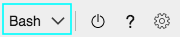

# Create custom Azure Resource Manager role and assign to service principal

Live Video Analytics on IoT Edge module instance needs an active Azure Media Services account for it to function properly. The relationship between the Live Video Analytics on IoT Edge module and the Azure Media Service account is established via a set of module twin properties. One of those twin properties is a [service principal](https://docs.microsoft.com/azure/active-directory/develop/app-objects-and-service-principals#service-principal-object) that enables the module instance to communicate with and trigger necessary operations on the Media Services account. To minimize potential misuse and/or accidental data exposure from the edge device, this service principal should have the least amount of privileges.

This article shows you the steps for creating a custom Azure Resource Manager role with Azure Cloud Shell, which then is used to create a service principal.

## Prerequisites  

Prerequisites for this article are as follows:

* Azure subscription with owner subscription.
* An Azure Active Directory with privileges to create an app and assign service principal to a role.

The easiest way to check whether your account has adequate permissions is through the portal. See [Check required permission](https://docs.microsoft.com/azure/active-directory/develop/howto-create-service-principal-portal#required-permissions).

## Overview  

We will go over the steps to creating a custom role and linking it with a service principal in the following order:

1. Create a Media Service account, if you don’t already have one.
1. Create a service principal.
1. Create a custom Azure Resource Manager role with limited privileges.
1. “Restrict” the service principal privileges using the custom role created.
1. Run a simple test to see if we are able to successfully restrict the service principal.
1. Capture the parameters that will be used in the IoT Edge deployment manifests.

### Create a Media Services account  

If you don’t have a Media Service  account, use the following steps to create one.

1. Browse to the [Cloud Shell](https://shell.azure.com/).
1. Select "Bash" as your environment in the drop-down on the left-hand side of the shell window

    
1. Set your Azure subscription as the default account using the following command template:
    
    ```
    az account set --subscription " <yourSubscriptionName or yourSubscriptionId>"
    ```
1. Create a [resource group](https://docs.microsoft.com/cli/azure/group?view=azure-cli-latest#az-group-create) and a [storage account](https://docs.microsoft.com/cli/azure/storage/account?view=azure-cli-latest#az-storage-account-create).
1. Now, create an Azure Media Service account by using the following command template in Cloud Shell:

    ```
    az ams account create --name <yourAMSAccountName>  --resource-group <yourResouceGroup>  --storage-account <yourStorageAccountName>
    ```

### Create service principal  

We will now create a new service principal and link it to your Media Service account.

Without any authentication parameters, password-based authentication is used with a random password for your service principal. In Cloud Shell, use the following command template:

```
az ams account sp create --account-name < yourAMSAccountName > --resource-group < yourResouceGroup >
```

This command produces a response like this:

```
{
  "AadClientId": "00000000-0000-0000-0000-000000000000",
  "AadEndpoint": "https://login.microsoftonline.com",
  "AadSecret": "<yourServicePrincipalPassword>",
  "AadTenantId": "00000000-0000-0000-0000-000000000000",
  "AccountName": " <yourAMSAccountName >",
  "ArmAadAudience": "https://management.core.windows.net/",
  "ArmEndpoint": "https://management.azure.com/",
  "Region": "Central US",
  "ResourceGroup": " <yourResouceGroup >",
  "SubscriptionId": "<yourSubscriptionId>"
}

```
1. The output for a service principal with password authentication includes the password key that in this case is the “AadSecret” parameter. 

    Make sure you copy this value - it can't be retrieved. If you forget the password, [reset the service principal credentials](https://docs.microsoft.com/cli/azure/create-an-azure-service-principal-azure-cli?view=azure-cli-latest#reset-credentials).
1. The appId and tenant key appear in the output as “AadClientId” and “AadTenantId” respectively. They are used in service principal authentication. Record their values, but they can be retrieved at any point with [az ad sp list](https://docs.microsoft.com/cli/azure/ad/sp?view=azure-cli-latest#az-ad-sp-list).

### Create a custom role definition  

To create a custom role, here are steps you should follow:

1. Create a Role Definition JSON file on your local system and save the following text in the file. 
    1. Replace < yourSubscriptionId> with your Azure Subscription ID
    1. The only actions allowed for this role are:
        * listContainerSas – helps the module list storage container URLs with shared access signatures (SAS) for uploading and downloading asset content.
        * Write assets – helps the module create or update any asset
        * listEdgePolicies – lists the policies that are applied to the edge device  
        
        ```
        {
          "Name": "LVAEdge User",
          "IsCustom": true,
          "Description": "Can create assets, view list of containers and view Edge policies",
          "Actions": [
            "Microsoft.Media/mediaservices/assets/listContainerSas/action",
            "Microsoft.Media/mediaservices/assets/write",
            "Microsoft.Media/mediaservices/listEdgePolicies/action"
          ],
          "NotActions": [],
          "DataActions": [],
          "NotDataActions": [],
          "AssignableScopes": [
            "/subscriptions/<yourSubscriptionId>"
          ]
        }
        ```  
          
1. Once created, run the following command template to create the new role definition in the subscription:
    
    ```
    az role definition create --role-definition "<location of the Role Definition JSON file >"
    ```

    Upon successful execution of the command, you will see the following output:
    
    ```
    {
      "assignableScopes": [
      "/subscriptions/<yourSubscriptionId>"
      ],
      "description": "Can create assets, view list of containers and view Edge policies",
      "id": "/subscriptions/<yourSubscriptionId>/providers/Microsoft.Authorization/roleDefinitions/<unique name>",
      "name": "<unique name>",
      "permissions": [
        {
          "actions": [
            "Microsoft.Media/mediaservices/assets/listContainerSas/action",
            "Microsoft.Media/mediaservices/assets/write",
            "Microsoft.Media/mediaservices/listEdgePolicies/action",
          ],
          "dataActions": [],
          "notActions": [],
          "notDataActions": []
        }
      ],
      "roleName": " LVAEdge User ",
      "roleType": "CustomRole",
      "type": "Microsoft.Authorization/roleDefinitions"
    }
    ```

### Create role assignment  

To add a role assignment, you will need the objectId of the service principal you want to assign the custom role you just created.

Use the following command in Cloud Shell to get the objectId:

```
az ad sp show --id "<appId>" | Select-String "objectId"
```

> [!NOTE]
> `<appId>` can be retrieved from the output of the [Create service principal](#create-service-principal) step.

The above command will print out the objectId of the service principal. 

```
“objectId” : “<yourObjectId>”,
```

Use [az role assignment create command](https://docs.microsoft.com/cli/azure/role/assignment?view=azure-cli-latest#az-role-assignment-create) template to the link the custom role with the service principal:

```
az role assignment create --role “LVAEdge User” --assignee-object-id < objectId>	
```

Parameters:

|Parameters|Description| 
|---|---|
|--role	|Custom Role name or ID. In our case: “LVAEdge User”.|
|--assignee-object-id|Object ID of the service principal you will use.|

The result will look like:

```
{
  "canDelegate": null,
  "id": "/subscriptions/<yourSubscriptionId>/providers/Microsoft.Authorization/roleAssignments/<yourCustomRoleId>",
  "name": "<yourCustomRoleId>",
  "principalId": "<yourServicePrincipalId>",
  "principalType": "ServicePrincipal",
  "roleDefinitionId": "/subscriptions/<yourSubscriptionId>/providers/Microsoft.Authorization/roleDefinitions/<yourRoleDefinitionId>",
  "scope": "/subscriptions/<yourSubscriptionId>",
  "type": "Microsoft.Authorization/roleAssignments"
} 
```

### Confirm that role assignment happened

To confirm that the service principal is now linked with the custom role we just created, run the following command:

```
az role assignment list  --assignee < objectId>
```

The result should look like:

```
[
  {
    "canDelegate": null,
    "id": "/subscriptions/xxx/providers/Microsoft.Authorization/roleAssignments/00000000-0000-0000-0000-000000000000",
    "name": "00000000-0000-0000-0000-000000000000",
    "principalId": "<yourServicePrincipalID>",
    "principalName": "<yourServicePrincipalName>",
    "principalType": "ServicePrincipal",
    "roleDefinitionId": "/subscriptions/xxx/providers/Microsoft.Authorization/roleDefinitions/zzz",
    "roleDefinitionName": "LVAEdge User",
    "scope": "/subscriptions/<yourSubscription ID>",
    "type": "Microsoft.Authorization/roleAssignments
  }
]  
```
 
Look for the “roleDefinitionName” and see that its value is set to “LVAEdge User”. 

This confirms that we have linked the custom user role with the service principal that is used for our application.

### Test the service principal RBAC  

1. Login using the Service Principal. For this, we will need 3 pieces of information for the Azure Active Directory to grant us the proper access token that we can get from the output of the [Create service principal](#create-service-principal) step:
    1. AadClientID 
    1. AadSecret
    1. AadTenantId
1. Now, lets try to log in using the command template below:
    
    ```
    az login --service-principal --username "< AadClientID>" --password " <AadSecret>" --tenant "<AadTenantId>"
    ```
3.	Now, let’s see if the login is restricted to the service principal with “LVAEdge User” role by trying to create a resource group to make sure it fails. Run the following command in Cloud Shell:

    ```
    az group create --location "central us" --name "testresourcegroup"
    ```

    This command should fail and will look like:
    
    ```
    The client '<AadClientId>' with object id '<AadClientId>' does not have authorization to perform action 'Microsoft.Resources/subscriptions/resourcegroups/write' over scope '/subscriptions/<yourSubscriptionId>/resourcegroups/testresourcegroup' or the scope is invalid. If access was recently granted, please refresh your credentials.
    ```

## Next steps  

Note the following values from this article. These values will be required for you to configure the twin properties of the Live Video Analytics on IoT Edge module, see [Module twin JSON schema](module-twin-configuration-schema.md).

| Variable from this article|Twin property name for Live Video Analytics on IoT Edge|
|---|---|
|AadSecret |	aadServicePrincipalPassword|
|AadTenantId |	aadTenantId|
|AadClientId 	|aadServicePrincipalAppId|
