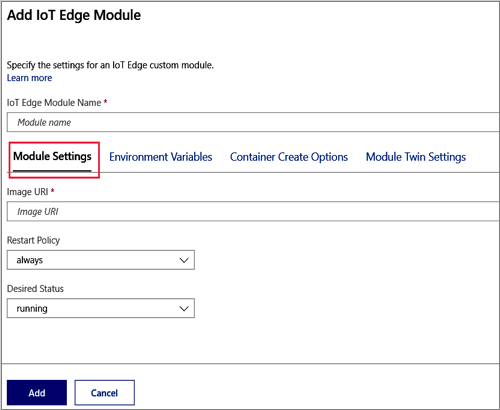
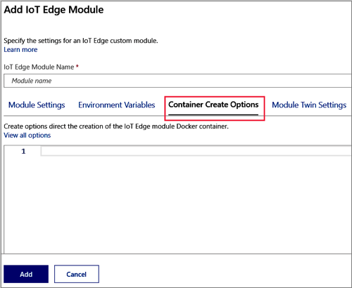
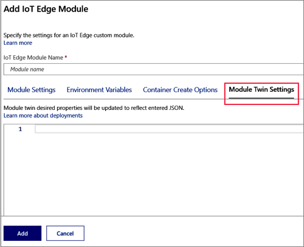
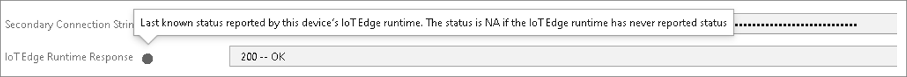
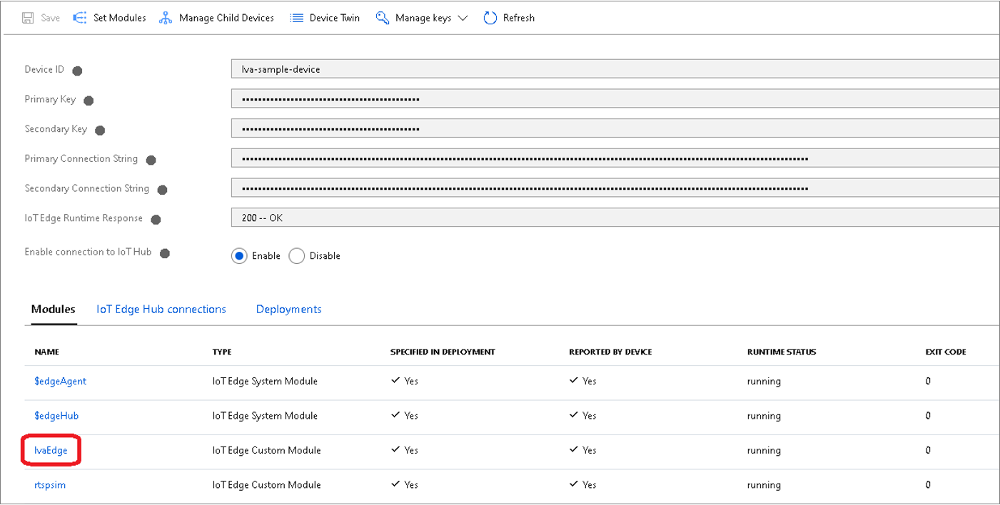
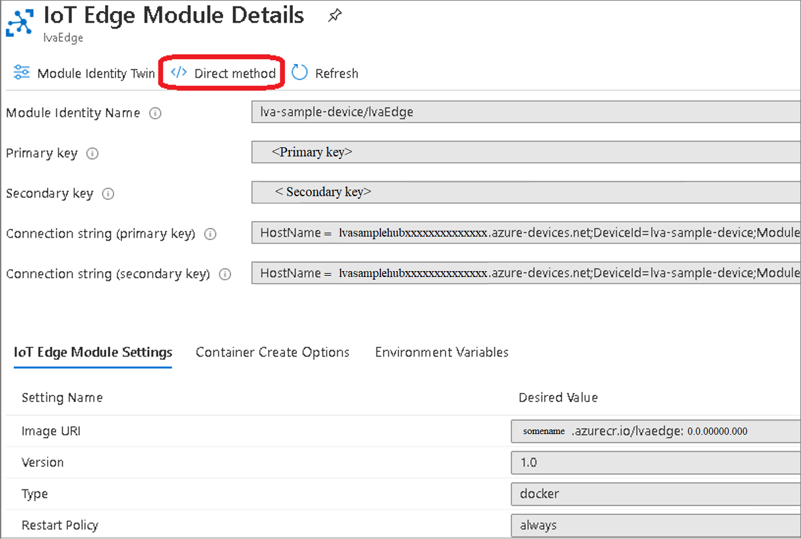
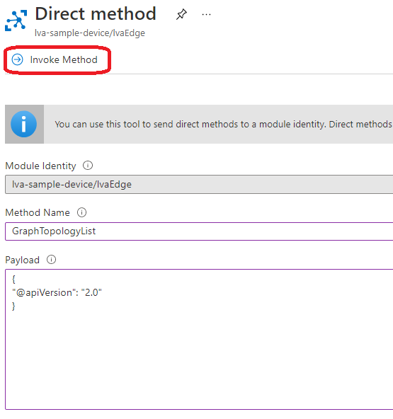
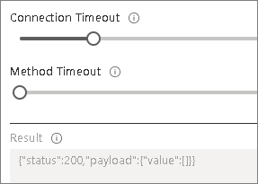

# Deploy Live Video Analytics on an IoT Edge device

This article lists the steps that will help you deploy Live Video Analytics on your IoT Edge device. You would do this, for example, if you have access to a local Linux machine, and/or have previously created an Azure Media Services account.


## Prerequisites

* A Linux machine that meets the HW/SW constraints for Live Video Analytics
* Azure subscription to which you have [owner privileges](https://docs.microsoft.com/azure/role-based-access-control/built-in-roles#owner)
* [Create and setup IoT Hub](https://docs.microsoft.com/azure/iot-hub/iot-hub-create-through-portal)
* [Register IoT Edge device](https://docs.microsoft.com/azure/iot-edge/how-to-register-device)
* [Install the Azure IoT Edge runtime on Debian-based Linux systems](https://docs.microsoft.com/azure/iot-edge/how-to-install-iot-edge-linux)
* [Create an Azure Media Services account](../latest/create-account-howto.md)
    * Use one of these regions: East US 2, Central US, North Central US, Japan West, West US 2, West Central US, Canada East, UK South, France Central, France South, Switzerland North, Switzerland West, and Japan West.
    * It is recommended that you use General-purpose v2 (GPv2) Storage accounts.

## Configuring Azure resources for using Live Video Analytics

### Create custom Azure Resource Manager role

See [Create custom Azure Resource Manager role](create-custom-azure-resource-manager-role-how-to.md) and assign it to a service principal for Live Video Analytics use.

### Set up a premium streaming endpoint

If you intend to use Live Video Analytics to record video to the cloud, and subsequently play it back, then you should be updating your Media Service to use a [premium streaming endpoint](../latest/streaming-endpoint-concept.md#types).  

This is an optional step. You can use this Azure CLI command to do so:

```azure-cli
az ams streaming-endpoint scale --resource-group $RESOURCE_GROUP --account-name $AMS_ACCOUNT -n default --scale-units 1
```

You can use this command to start the streaming endpoint 

> [!IMPORTANT]
> Your subscription will start getting billed at this point.

```azure-cli
az ams streaming-endpoint start --resource-group $RESOURCE_GROUP --account-name $AMS_ACCOUNT -n default --no-wait
```

Follow the steps in this article to get credentials to access the Media Service APIs: [access the Media Service APIs](../latest/access-api-howto.md#use-the-azure-portal).

## Create and use local user account for deployment
To run the Live Video Analytics on IoT Edge module create a local user account with as few privileges as possible. As an example, run the following commands on your Linux machine:

```
sudo groupadd -g 1010 localuser
sudo adduser --home /home/edgeuser --uid 1010 -gid 1010 edgeuser
```

## Granting permissions to device storage

Now that you have created a local user account, 

* You will need a local folder to store the application configuration data. Create a folder and grant permissions to the localuser account write to that folder using the following commands:

```
sudo mkdir /var/lib/azuremediaservices
sudo chown -R edgeuser /var/lib/azuremediaservices
```

* You will also need a folder to [record videos to a local file](event-based-video-recording-concept.md#video-recording-based-on-events-from-other-sources). Use the following commands to create a local folder for the same:

```
sudo mkdir /var/media
sudo chown -R edgeuser /var/media
```

## Deploy Live Video Analytics Edge module

<!-- (To JuliaKo: this is similar to https://docs.microsoft.com/azure/iot-edge/how-to-deploy-blob)-->
The Live Video Analytics on IoT Edge exposes module twin properties that are documented in [Module Twin configuration schema](module-twin-configuration-schema.md). 

### Deploy using the Azure portal

The Azure portal guides you through creating a deployment manifest and pushing the deployment to an IoT Edge device.
Select your device

1. Sign in to the [Azure portal](https://ms.portal.azure.com/) and navigate to your IoT hub.
1. Select **IoT Edge** from the menu.
1. Click on the ID of the target device from the list of devices.
1. Select **Set Modules**.

#### Configure a deployment manifest

A deployment manifest is a JSON document that describes which modules to deploy, how data flows between the modules, and desired properties of the module twins. The Azure portal has a wizard that walks you through creating a deployment manifest. It has three steps organized into tabs: **Modules**, **Routes**, and **Review + Create**.

#### Add modules

1. In the **IoT Edge Modules** section of the page, click the **Add** dropdown and select **IoT Edge Module** to display the **Add IoT Edge Module** page.
1. On the **Module Settings** tab, provide a name for the module and then specify the container image URI:   
    Examples:
    
    * **IoT Edge Module Name**: lvaEdge
    * **Image URI**: mcr.microsoft.com/media/live-video-analytics:1.0	 
    
    
    
    > [!TIP]
    > Don't select **Add** until you've specified values on the **Module Settings**, **Container Create Options**, and **Module Twin Settings** tabs as described in this procedure.
    
    > [!IMPORTANT]
    > Azure IoT Edge is case-sensitive when you make calls to modules. Make note of the exact string you use as the module name.`

1. Open the **Environment Variables** tab.
   
   Copy and paste the following JSON into the box, to provide the user ID and the group ID to be used to save the application data and the video outputs.
    ```   
   {
        "LOCAL_USER_ID": 
        {
            "value": "1010"
        },
        "LOCAL_GROUP_ID": {
            "value": "1010"
        }
    }
     ``` 

1. Open the **Container Create Options** tab.

    
 
    Copy and paste the following JSON into the box, to limit the size of the log files produced by the module.
    
    ```    
    {
        "HostConfig": {
            "LogConfig": {
                "Type": "",
                "Config": {
                    "max-size": "10m",
                    "max-file": "10"
                }
            },
            "Binds": [
               "/var/lib/azuremediaservices:/var/lib/azuremediaservices",
               "/var/media:/var/media"
            ]
        }
    }
    ````
   
   The "Binds" section in the JSON has 2 entries:
   1. "/var/lib/azuremediaservices:/var/lib/azuremediaservices": This is used to bind the persistent application configuration data from the container and store it on the edge device.
   1. "/var/media:/var/media": This binds the media folders between the edge device and the container. This is used to store the video recordings when you run a media graph topology that supports storing of video clips on the edge device.
   
1. On the **Module Twin Settings** tab, copy the following JSON and paste it into the box.
 
    

    Live Video Analytics on IoT Edge requires a set of mandatory twin properties in order to run, as listed in [Module Twin configuration schema](module-twin-configuration-schema.md).  

    The JSON that you need to enter into Module Twin Settings edit box will look like this:    
    ```
    {
        "applicationDataDirectory": "/var/lib/azuremediaservices",
        "azureMediaServicesArmId": "/subscriptions/{subscriptionID}/resourceGroups/{resourceGroupName}/providers/microsoft.media/mediaservices/{AMS-account-name}",
        "aadTenantId": "{the-ID-of-your-tenant}",
        "aadServicePrincipalAppId": "{the-ID-of-the-service-principal-app-for-ams-account}",
        "aadServicePrincipalSecret": "{secret}"
    }
    ```
    These are **required** properties and for the JSON above,  
    * {subscriptionID} - this is your Azure Subscription ID
    * {resourceGroupName} - this the resource group to which your Media Service account belongs
    * {AMS-account-name} - this is the name of your Media Services account
    
    To get the other values, see [Access Azure Media Services API](../latest/access-api-howto.md#use-the-azure-portal).  
    * aadTenantId - this is the ID of your tenant and is the same as the "AadTenantId" from the above link.
    * aadServicePrincipalAppId - this is the app ID of the service principal for your Media Service Account and is the same as the "AadClientId" from the above link.
    * aadServicePrincipalSecret - this is the password of the service principal and is the same as the "AadSecret" from the above link.

    Below are some additional **recommended** properties that can be added to the JSON and will help in monitoring the module. For more information, see [monitoring and logging](monitoring-logging.md):
    
    ```
    "diagnosticsEventsOutputName": "lvaEdgeDiagnostics",
    "OperationalEventsOutputName": "lvaEdgeOperational",
    "logLevel": "Information",
    "logCategories": "Application,Events"
    ```
    
    Following are some **optional** properties that you could add in the JSON:
    
    ```
    "aadEndpoint": "https://login.microsoftonline.com",
    "aadResourceId": "https://management.core.windows.net/",
    "armEndpoint": "https://management.azure.com/",
    "allowUnsecuredEndpoints": true
    ```
   [!Note]
   The twin property **allowUnsecuredEndpoints** is set as true for the purpose of the tutorials and the quickstarts.   
   You should set this property to **false** when running in production environment. This will ensure that the application will block all unsecured endpoints and in order to run the graph topologies, valid connection credentials will be needed.  
   
    Select Add to add the module twin properties.
1. Select **Next: Routes** to continue to the routes section.
    Specify routes.

Keep the default routes and select **Next: Review + create** to continue to the review section.

#### Review deployment

The review section shows you the JSON deployment manifest that was created based on your selections in the previous two sections. There are also two modules declared that you didn't add: $edgeAgent and $edgeHub. These two modules make up the IoT Edge runtime and are required defaults in every deployment.

Review your deployment information, then select Create.

### Verify your deployment

After you create the deployment, you return to the IoT Edge page of your IoT hub.

1.	Select the IoT Edge device that you targeted with the deployment to open its details.
2.	In the device details, verify that the blob storage module is listed as both **Specified in deployment and Reported by device**.

It may take a few moments for the module to be started on the device and then reported back to IoT Hub. Refresh the page to see an updated status.
Status code: 200 –OK means that [the IoT Edge runtime](https://docs.microsoft.com/azure/iot-edge/iot-edge-runtime) is healthy and is operating fine.



#### Invoke a direct method

Next, lets test the sample by invoking a direct method. Read [direct methods for Live Video Analytics on IoT Edge](direct-methods.md) to understand all the direct methods provided by our lvaEdge module.

1. Clicking on the edge module you created, will take you to its configuration page.  

    
1. Click on the Direct Method menu option.

    > [!NOTE] 
    > You will need to add a value in the Connection string sections as you can see on the current page. You do not need to hide or change anything in the **Setting name** section. It is ok to let it be public.

    
1. Next, Enter "GraphTopologyList" in the Method Name box.
1. Next, copy and paste the below JSON payload in the payload box.
    
    ```
    {
        "@apiVersion" : "1.0"
    }
    ```
1. Click on “Invoke Method” option on top of the page

    
1. You should see a status 200 message in the Result box

     

## Next steps

[Quickstart: Get started - Live Video Analytics on IoT Edge](get-started-detect-motion-emit-events-quickstart.md)
