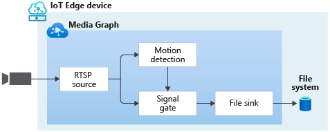
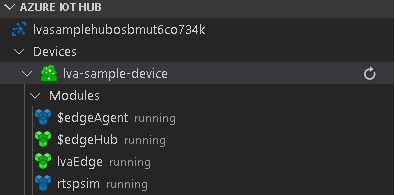
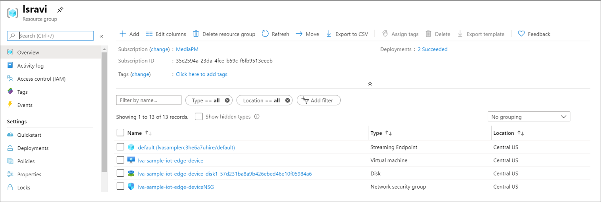
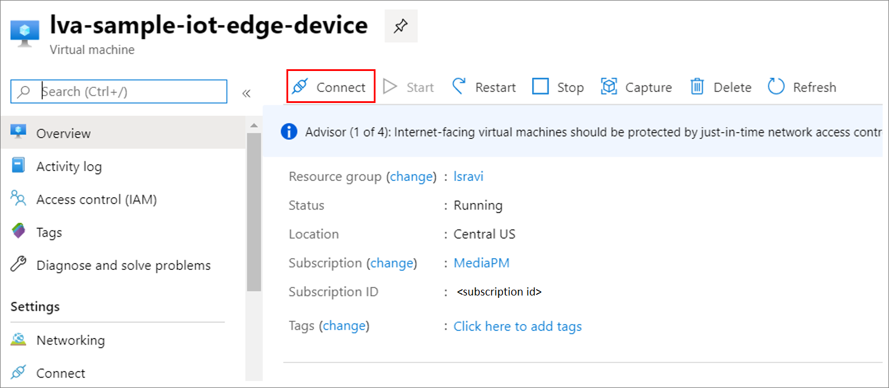
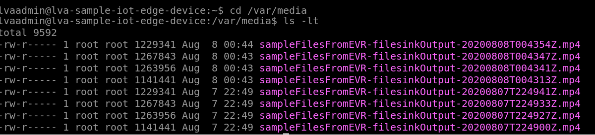

# Quickstart: Detect motion, record video on edge devices
 
This quickstart shows you how to use Live Video Analytics on IoT Edge to analyze the live video feed from a (simulated) IP camera, detect if any motion is present, and if so, record an MP4 video clip to the local file system on the edge device. It uses an Azure VM as an IoT Edge device and a simulated live video stream. This article is based on sample code written in C#.

This article builds on top of [this](detect-motion-emit-events-quickstart.md) quickstart. 

## Prerequisites

* An Azure account with an active subscription. [Create an account for free](https://azure.microsoft.com/free/?WT.mc_id=A261C142F).
* [Visual Studio Code](https://code.visualstudio.com/) on your machine with the following extensions:
    * [Azure IoT Tools](https://marketplace.visualstudio.com/items?itemName=vsciot-vscode.azure-iot-tools)
    * [C#](https://marketplace.visualstudio.com/items?itemName=ms-dotnettools.csharp)
* [.NET Core 3.1 SDK](https://dotnet.microsoft.com/download/dotnet-core/3.1) installed on your system
* If you have not previously completed [this](detect-motion-emit-events-quickstart.md) quickstart, then finish the following steps:
     * [Set up Azure resources](detect-motion-emit-events-quickstart.md#set-up-azure-resources)
     * [Set up your development environment](detect-motion-emit-events-quickstart.md#set-up-your-development-environment)
     * [Generate and deploy the IoT Edge deployment manifest](detect-motion-emit-events-quickstart.md#generate-and-deploy-the-iot-edge-deployment-manifest)
     * [Prepare for monitoring events](detect-motion-emit-events-quickstart.md#prepare-for-monitoring-events)

> [!TIP]
> When installing the Azure IoT Tools, you might be prompted to install docker. Feel free to ignore it.

## Review the sample video
As part of the steps above to set up the Azure resources, a (short) video of a parking lot will be copied to the Linux VM in Azure being used as the IoT Edge device. This video file will be used to simulate a live stream for this tutorial.

You can use an application like [VLC Player](https://www.videolan.org/vlc/), launch it, hit Control+N, and paste [this](https://lvamedia.blob.core.windows.net/public/lots_015.mkv) link to the parking lot video to start playback. At about the 5-second mark, a white car moves through the parking lot.

When you complete the steps below, you will have used Live Video Analytics on IoT Edge to detect that motion of the car, and record a video clip starting at around that 5-second mark.

## Overview



The diagram above shows how the signals flow in this quickstart. An edge module (detailed [here](https://github.com/Azure/live-video-analytics/tree/master/utilities/rtspsim-live555)) simulates an IP camera hosting an RTSP server. An [RTSP source](media-graph-concept.md#rtsp-source) node pulls the video feed from this server, and sends video frames to the [motion detection processor](media-graph-concept.md#motion-detection-processor) node. The RTSP source sends the same video frames to a [signal gate processor](media-graph-concept.md#signal-gate-processor) node, which remains closed until it is triggered by an event.

When the motion detection processor determines that motion is present in the video, it sends an event to the signal gate processor node, triggering it. The gate opens for the configured duration of time, sending video frames to the [file sink](media-graph-concept.md#file-sink) node. This sink node records the video as an MP4 file to the local file system of your edge device, at the configured location.

In this quickstart, you will:

1. Create and deploy the media graph
1. Interpret the results
1. Clean up resources

## Examine and edit the sample files
As part of the pre-requisites, you would have downloaded the sample code to a folder. Launch Visual Studio Code, and open the folder.

1. In Visual Studio Code, browse to "src/edge". You will see the .env file that you created along with a few deployment template files
    * The deployment template refers to the deployment manifest for the edge device with some placeholder values. The .env file has the values for those variables.
1. Next, browse to "src/cloud-to-device-console-app" folder. Here you will see the appsettings.json file that you created along with a few other files:
    * c2d-console-app.csproj - This is the project file for Visual Studio Code
    * operations.json - This file will list the different operations that you would like the program to run
    * Program.cs - This is the sample program code, which does the following:

        * Loads the app settings
        * Invokes direct methods exposed by the Live Video Analytics on IoT Edge module. You can use the module to analyze live video streams by invoking its [direct methods](direct-methods.md) 
        * Pauses for you to examine the output from the program in the TERMINAL window and the events generated by the module in the OUTPUT window
        * Invokes direct methods to clean up resources   

1. Make the following edits to the operations.json file
    * Change the link to the graph topology:
    `"topologyUrl" : "https://raw.githubusercontent.com/Azure/live-video-analytics/master/MediaGraph/topologies/evr-motion-files/topology.json"`
    * Under GraphInstanceSet, edit the name of the graph topology to match the value in the link above
    `"topologyName" : "EVRToFilesOnMotionDetection"`
    * Also edit the RTSP URL to point to the desired video file
    `"value": "rtsp://rtspsim:554/media/lots_015.mkv"`
    * Under GraphTopologyDelete, edit the name
    `"name": "EVRToFilesOnMotionDetection"`

## Review - check status of the modules
At the [Generate and deploy the IoT Edge deployment manifest](detect-motion-emit-events-quickstart.md#generate-and-deploy-the-iot-edge-deployment-manifest) step, in Visual Studio Code, if you expand the "lva-sample-device" node under AZURE IOT HUB (at the bottom-left section) you should see the following modules deployed

    1. The Live Video Analytics module, named as “lvaEdge”
    1. A module named “rtspsim” which simulates an RTSP Server, acting as the source of a live video feed

        


## Review - prepare for monitoring events
Check that you have completed the steps to [Prepare for monitoring events](detect-motion-emit-events-quickstart.md#prepare-for-monitoring-events)


## Run the sample program

1. Start a debugging session (hit F5). You will start seeing some messages printed in the TERMINAL window.
1. The operations.json starts off with calls to the direct methods GraphTopologyList and GraphInstanceList. If you have cleaned up resources after previous quickstarts, this will return empty lists, and then pause for you to hit Enter
```
--------------------------------------------------------------------------
Executing operation GraphTopologyList
-----------------------  Request: GraphTopologyList  --------------------------------------------------
{
  "@apiVersion": "1.0"
}
---------------  Response: GraphTopologyList - Status: 200  ---------------
{
  "value": []
}
--------------------------------------------------------------------------
Executing operation WaitForInput
Press Enter to continue
```
1. When you press the "Enter" key in the TERMINAL window, the next set of direct method calls are made
     * A call to GraphTopologySet using the topologyUrl above
     * A call to GraphInstanceSet using the following body
     ```
     {
       "@apiVersion": "1.0",
       "name": "Sample-Graph",
       "properties": {
         "topologyName": "EVRToFilesOnMotionDetection",
         "description": "Sample graph description",
         "parameters": [
           {
             "name": "rtspUrl",
             "value": "rtsp://rtspsim:554/media/lots_015.mkv"
           },
           {
             "name": "rtspUserName",
             "value": "testuser"
           },
           {
             "name": "rtspPassword",
             "value": "testpassword"
           }
         ]
       }
     }
     ```
     * A call to GraphInstanceActivate to start the graph instance, and start the flow of video
     * A second call to GraphInstanceList to show that the graph instance is indeed in the running state
1. The output in the TERMINAL window will pause now at a 'Press Enter to continue' prompt. Do not hit "Enter" at this time. You can scroll up to see the JSON response payloads for the direct methods you invoked
1. If you now switch over to the OUTPUT window in Visual Studio Code, you will see messages that are being sent to the IoT Hub, by the  Live Video Analytics on IoT Edge module.
     * These messages are discussed in the section below
1. The media graph will continue to run, and print results – the RTSP simulator will keep looping the source video. In order to stop the media graph, you go back to the TERMINAL window and hit "Enter". The next series of calls are made to clean up resources:
     * A call to GraphInstanceDeactivate to deactivate the graph instance
     * A call to GraphInstanceDelete to delete the instance
     * A call to GraphTopologyDelete to delete the topology
     * A final call to GraphTopologyList to show that the list is now empty

## Interpret results 
When you run the media graph, the results from the motion detector processor node are sent via the IoT Hub sink node to the IoT Hub. The messages you see in the OUTPUT window of Visual Studio Code contain a "body" section and an "applicationProperties" section. To understand what these sections represent, read [this](https://docs.microsoft.com/azure/iot-hub/iot-hub-devguide-messages-construct) article.

In the messages below, the application properties and the content of the body are defined by the Live Video Analytics module.

## MediaSession Established event

When a media graph is instantiated, the RTSP source node attempts to connect to the RTSP server running on the rtspsim-live555 container. If successful, it will print this event:

```
[IoTHubMonitor] [05:37:21 AM] Message received from [lva-sample-device/lvaEdge]:
{  
"body": {
"sdp": "SDP:\nv=0\r\no=- 1586450538111534 1 IN IP4 xxx.xxx.xxx.xxx\r\ns=Matroska video+audio+(optional)subtitles, streamed by the LIVE555 Media Server\r\ni=media/camera-300s.mkv\r\nt=0 0\r\na=tool:LIVE555 Streaming Media v2020.03.06\r\na=type:broadcast\r\na=control:*\r\na=range:npt=0-300.000\r\na=x-qt-text-nam:Matroska video+audio+(optional)subtitles, streamed by the LIVE555 Media Server\r\na=x-qt-text-inf:media/camera-300s.mkv\r\nm=video 0 RTP/AVP 96\r\nc=IN IP4 0.0.0.0\r\nb=AS:500\r\na=rtpmap:96 H264/90000\r\na=fmtp:96 packetization-mode=1;profile-level-id=4D0029;sprop-parameter-sets={SPS}\r\na=control:track1\r\n"  
},  
"applicationProperties": {  
    "dataVersion": "1.0",  
    "topic": "/subscriptions/{subscriptionID}/resourceGroups/{name}/providers/microsoft.media/mediaservices/hubname",  
    "subject": "/graphInstances/Sample-Graph-1/sources/rtspSource",  
    "eventType": "Microsoft.Media.MediaGraph.Diagnostics.MediaSessionEstablished",  
    "eventTime": "2020-05-21T05:37:21.398Z",
    }  
}
```

* The message is a Diagnostics event, MediaSessionEstablished, indicates that the RTSP source node (the subject) was able to establish connection with the RTSP simulator, and begin to receive a (simulated) live feed.
* The "subject" in applicationProperties references the node in the graph topology from which the message was generated. In this case, the message is originating from the RTSP source node.
* "eventType" in applicationProperties indicates that this is a Diagnostics event.
* "eventTime" indicates the time when the event occurred.
* "body" contains data about the diagnostic event, which, in this case, is the [SDP](https://en.wikipedia.org/wiki/Session_Description_Protocol) details.


## Recording Started event

As explained [here](#overview), when motion is detected, the signal gate processor node is activated and the file sink node in the media graph starts to the write an MP4 file. The file sink node sends an Operational event. The type is set to “motion” to indicate it’s a result from the Motion Detection Processor, and the eventTime tells you at what time (UTC) motion occurred. Below is an example:

```
[IoTHubMonitor] [05:37:27 AM] Message received from [lva-sample-device/lvaEdge]:
{
  "body": {
    "outputType": "filePath",
    "outputLocation": "/var/media/sampleFilesFromEVR-filesinkOutput-20200521T053726Z.mp4"
  },
  "applicationProperties": {
    "topic": "/subscriptions/{subscriptionID}/resourceGroups/{name}/providers/microsoft.media/mediaservices/hubname",  
    "subject": "/graphInstances/Sample-Graph-1/sinks/fileSink",
    "eventType": "Microsoft.Media.Graph.Operational.RecordingStarted",
    "eventTime": "2020-05-21T05:37:27.713Z",
    "dataVersion": "1.0"
  }
}
```

* "subject" in applicationProperties references the node in the media graph from which the message was generated. In this case, the message is originating from the file sink node.
* "eventType" in applicationProperties indicates that this is an Operational event.
* "eventTime" indicates the time when the event occurred. Note that this 5-6 seconds after the MediaSessionEstablished and video starts to flow. This corresponds to the 5-6 second mark when the [car started to move](#review-the-sample-video) into the parking lot
* "body" contains data about the operational event, which in this case is "outputType" and "outputLocation" data.
* "outputType" indicates that this information is about the file path
* "outputLocation" provides the location of the MP4 file, from within the edge module

## Recording Stopped and Available events

If you examine the properties of the signal gate processor node in the [graph topology](https://github.com/Azure/live-video-analytics/blob/master/MediaGraph/topologies/evr-motion-files/topology.json), you will see that the activation times have been set to 5 seconds. So about 5 seconds after the RecordingStarted event is received, you will get a
* RecordingStopped event, indicating that the recording has stopped
* RecordingAvailable event, indicating that the MP4 file can now be used for viewing

The two events are typically emitted with seconds of each other.

### Playing back the MP4 clip

1. The MP4 files are written to a directory on the edge device that you configured in the .env file via this key - OUTPUT_VIDEO_FOLDER_ON_DEVICE. If you left it to the default value then the results should be in /home/lvaadmin/samples/output/
1. Go to your resource group, find the VM and connect using Bastion

    
 
    
1. Once signed in (using credentials that were generated during [this](detect-motion-emit-events-quickstart.md#set-up-azure-resources) step), on the command prompt, go to the relevant directory (default: /home/lvaadmin/samples/output) and you should see the MP4 files  there. You can [scp the files](https://docs.microsoft.com/azure/virtual-machines/linux/copy-files-to-linux-vm-using-scp) over to your local machine and play them back via [VLC player](https://www.videolan.org/vlc/) or any other MP4 player.

    

## Clean up resources

If you intend to try the other quickstarts, you should hold on to the resources created. Otherwise, go to the Azure portal, browse to your resource groups, select the resource group under which you ran this quickstart, and delete all the resources.

## Next steps

* Run  the [Run Live Video Analytics with your own model](use-your-model-quickstart.md) quickstart, which shows how to apply AI to live video feeds.
* Review additional challenges for advanced users:

    * Use an [IP camera](https://en.wikipedia.org/wiki/IP_camera) with support for RTSP instead of using the RTSP simulator. You can search for IP cameras with RTSP support on the [ONVIF conformant products](https://en.wikipedia.org/wiki/IP_camera) page by looking for devices that conform with profiles G, S, or T.
    * Use an AMD64 or X64 Linux device (vs. using an Azure Linux VM). This device must be in the same network as the IP camera. You can follow instructions in [Install Azure IoT Edge runtime on Linux](https://docs.microsoft.com/azure/iot-edge/how-to-install-iot-edge-linux) and then follow instructions in the [Deploy your first IoT Edge module to a virtual Linux device](https://docs.microsoft.com/azure/iot-edge/quickstart-linux) quickstart to register the device with Azure IoT Hub.
