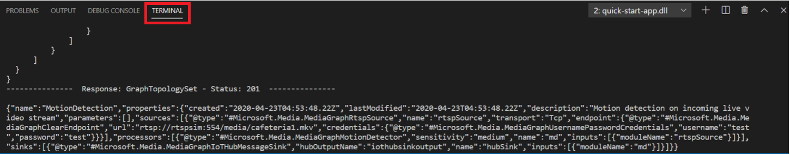

# Quickstart: Detect motion, record video on edge devices
 
In this quickstart, you will analyze the live video feed from a (simulated) IP camera, detect if any motion is present, and if so, record a mp4 video clip to your local file system on the edge device. This article illustrates a programmatic way of invoking the sequence of direct method calls that you executed as part of the [Detect motion, record video to Media Services](detect-motion-record-video-clips-media-services-quickstart.md) quickstart. It uses a Linux Azure VM as an IoT Edge device and a simulated live video stream.

## Prerequisites

This article builds on top of the [getting started](get-started-detect-motion-emit-events-quickstart.md) quickstart. Also, recommended for this quickstart is to finish the [Event-based recording of videos using Live Video Analytics on IoT Edge](detect-motion-record-video-clips-media-services-quickstart.md) quickstart, as that depicts the manual way to run the below depicted graph topology.
Just like in the previous quickstarts, to run this quickstart, you need to have installed:

* An Azure account with an active subscription. [Create an account for free](https://azure.microsoft.com/free/?WT.mc_id=A261C142F).
* [Visual Studio Code](https://code.visualstudio.com/) on your machine with [Azure IoT Tools extension](https://marketplace.visualstudio.com/items?itemName=vsciot-vscode.azure-iot-tools)

## Overview


The diagram above shows how the signals flow in this quickstart. A docker container using [rtspsim-live555](https://github.com/Azure/live-video-analytics/tree/master/utilities/rtspsim-live555) simulates an IP camera hosting an RTSP server. An [RTSP source](media-graph-concept.md#rtsp-source) node pulls the video feed from this server, and sends the video frames to the [motion detection processor](media-graph-concept.md#motion-detection-processor)  node. The same video feed is sent by the RTSP source to a signal gate, which buffers the feed and waits for an event to open. 

When the motion detection processor determines that motion is present in the video, it emits an event to the [signal gate processor](media-graph-concept.md#signal-gate-processor) triggering the gate. When such an event arrives at the signal gate, it has the ability to open for a preconfigured amount of time relaying the video feed to the [file sink](media-graph-concept.md#file-sink) that records the video as an mp4 file at the specified local path on your edge device’s files system.

In this quickstart, you will:

1. Set up Azure resources
1. Create and deploy the media graph
1. Interpret the results
1. Clean up resources

## Set up Azure resources

The following Azure resources are required for this tutorial

* IoT Hub
* Storage Account
* Azure Media Services
* [Linux Azure VM with IoT Edge runtime](https://docs.microsoft.com/azure/iot-edge/how-to-install-iot-edge-linux)

You can use the Live Video Analytics resources setup script to deploy the Azure resources mentioned above in your Azure subscription. To do so, follow the steps below

1. Browse to https://shell.azure.com
1. If this is the first time you are using Cloud Shell, you will prompted to select a subscription to create a storage account and Microsoft Azure Files share. Select "Create storage" to do create the storage account for storing your Cloud Shell session information
1. Select "Bash" as your environment in the drop-down on the left-hand side of the shell window

    
1. Run the following command

    `bash -c "$(curl -sL https://aka.ms/lva-edge/setup-resources-for-samples)"`

    If the script completes successfully, you should see all the resources mentioned above in your subscription.
1. In the Cloud Shell, where you ran the script to set up the resources, you should see, curly brackets

    1. Click on the curly brackets to expose the folder structure
    2. You will see three files created under clouddrive/lva-sample.
    3. Of interest currently are the .env files, appsettings.json and vm-edge-device-credentials.txt. You will need these to update the files in Visual Studio Code later in the quickstart. You may want to copy them into a local file for now.

    

## Create and deploy the media graph

### Set up the environment

1. Clone the repo from here https://github.com/Azure-Samples/lva-edge-rc4
1. Launch Visual Studio Code (VSCode) and open the folder where the repo is downloaded to.
1. In VSCode, browse to "src/cloud-to-device-console-app" folder and create a file named "appsettings.json". This file will contain the settings needed to run the program.
1. Copy the contents from clouddrive/lva-sample/appsettings.json file into the appsettings.json file you created in VSCode.

The text should look like:

    ````
    {
    "IoThubConnectionString" : "HostName=xxx.azure-devices.net;SharedAccessKeyName=iothubowner;SharedAccessKey=XXX",
    "deviceId" : "lva-sample-device",
    "moduleId" : "lvaEdge"
    }
    ```
1. Next, browse to "src/edge" folder and create a file named ".env". (please note the dot before the filename)
1. Copy the contents from clouddrive/lva-sample/.env file into the .env file you created in VSCode.

    The keys should look like the below. Appropriate values would be filled in for you, if the Azure resources set up in the prior section completed accurately.

    ```
    SUBSCRIPTION_ID="<Subscription ID>" 
    RESOURCE_GROUP="<Resource Group>" 
    AMS_ACCOUNT="<AMS Account ID>" 
    IOTHUB_CONNECTION_STRING="HostName=xxx.azure-devices.net;SharedAccessKeyName=iothubowner;SharedAccessKey=xxx" 
    AAD_TENANT_ID="<AAD Tenant ID>" 
    AAD_SERVICE_PRINCIPAL_ID="<AAD SERVICE_PRINCIPAL ID>" 
    AAD_SERVICE_PRINCIPAL_SECRET="<AAD SERVICE_PRINCIPAL ID>" INPUT_VIDEO_FOLDER_ON_DEVICE="/home/lvaadmin/samples/input" OUTPUT_VIDEO_FOLDER_ON_DEVICE="/home/lvaadmin/samples/input" 
    CONTAINER_REGISTRY_USERNAME_myacr="<your container registry username>" 
    CONTAINER_REGISTRY_PASSWORD_myacr="<your container registry username>"
    ```
    
### Examine the sample files

1. In VSCode, browse to "src/edge". You will see the .env file that you created along with a few deployment template files

    * The deployment template refers to the deployment manifest for the edge device with some placeholder values. The .env file has the values for those variables.
1. Next, browse to "src/cloud-to-device-console-app" folder. Here you will see the appsettings.json file that you created along with a few other files:

    * c2d-console-app.csproj - This is the project file for VSCode
    * operations.json - This file will list the different operations that you would like the program to run
    * Program.cs - This is the sample program code, which does the following:

        * Loads the app settings
        * Invokes the Live Video Analytics on IoT Edge Direct Methods to create topology, instantiate the graph and activate the graph
        * Pauses for you to examine the graph output in the terminal window and the events sent to IoT hub in the “output” window
        * Deactivate the graph instance, delete the graph instance, and delete the graph topology

### Generate and deploy the IoT Edge deployment manifest

1. In VSCode, navigate to "src/cloud-to-device-console-app/operations.json"

    1. Under GraphTopologySet, ensure the following:
"topologyUrl" : " https://github.com/Azure/live-video-analytics/blob/master/MediaGraph/topologies/evr-motion-files/topology.json"
    1. Under GraphInstanceSet, ensure: "topologyName" : "EVRToFilesOnMotionDetection"
    1. Under GraphTopologyDelete, ensure "name": " EVRToFilesOnMotionDetection "
1. Right click on "src/edge/deployment.template.json" file and click on “Generate IoT Edge Deployment Manifest”

      
1. This should create a manifest file in src/edge/config folder named "deployment.amd64.json"
1. Set the IoTHub connection string by clicking on the "More actions" icon next to AZURE IOT HUB pane in the bottom left corner. You can copy the string from the appsettings.json file. (Here is another recommended approach to ensure you have the proper IoT Hub configured within VSCode via the [Select Iot Hub command](https://github.com/Microsoft/vscode-azure-iot-toolkit/wiki/Select-IoT-Hub))

    
1. Right click on "src/edge/config/deployment.amd64.json" and click “Create Deployment for Single Device” and select the name of your edge device. 

    
1. You will then be asked to select an IoT Hub device. Select lva-sample-device from the drop-down.
1. In about 30 seconds, refresh the Azure IOT Hub on the bottom-left section and you should have the edge device with the following modules deployed

    1. The Live Video Analytics module, named as “lvaEdge”
    1. A module named “rtspsim” which simulates an RTSP Server, acting as the source of a live video feed

        

### Prepare for monitoring events

Right click on the Live Video Analytics device and click on “Start Monitoring Built-in Event Endpoint”. This step is needed to monitor the IoT Hub events and see it in the output window of VSCode. 


### Run the sample program

1. Start a debugging session (hit F5). You will start seeing some messages printed in the TERMINAL window. In the OUTPUT window, you will see messages that are being sent to the IoT Hub, by the lvaEdge module.
1. In the TERMINAL window, you will see the responses to the Direct Method calls

    
1. In the OUTPUT window, you will see messages that are being sent to the IoT Hub, by the lvaEdge module

    
1. The media graph will continue to run, and print results – the RTSP simulator will keep looping the source video. To stop the media graph, you can do the following:

    1. The Program will have paused at the Console.Readline() stage. Go the TERMINAL window and hit the “Enter” key. The media graph will be stopped, and the Program will exit.

## Interpret results 

### Monitoring the events sent to the IoT Edge Hub - Connection Established event

When the media graph is instantiated, the RTSP Source node attempts to connect to the RTSP server running on the [rtspsim-live55](https://github.com/Azure/live-video-analytics/tree/master/utilities/rtspsim-live555) container. If successful, it will print this event. Note that the event type is Microsoft.Media.MediaGraph.Diagnostics.MediaSessionEstablished.

```
[IoTHubMonitor] [9:42:18 AM] Message received from [lvaedgesample/lvaEdge]:
{
  "body": {
    "sdp": "SDP:\nv=0\r\no=- 1586450538111534 1 IN IP4 nnn.nn.0.6\r\ns=Matroska video+audio+(optional)subtitles, streamed by the LIVE555 Media Server\r\ni=media/camera-300s.mkv\r\nt=0 0\r\na=tool:LIVE555 Streaming Media v2020.03.06\r\na=type:broadcast\r\na=control:*\r\na=range:npt=0-300.000\r\na=x-qt-text-nam:Matroska video+audio+(optional)subtitles, streamed by the LIVE555 Media Server\r\na=x-qt-text-inf:media/camera-300s.mkv\r\nm=video 0 RTP/AVP 96\r\nc=IN IP4 0.0.0.0\r\nb=AS:500\r\na=rtpmap:96 H264/90000\r\na=fmtp:96 packetization-mode=1;profile-level-id=4D0029;sprop-parameter-sets=Z00AKeKQCgC3YC3AQEBpB4kRUA==,aO48gA==\r\na=control:track1\r\n"
  },
  "applicationProperties": {
    "dataVersion": "1.0",
    "topic": "/subscriptions/{subscriptionID}/resourceGroups/{name}/providers/microsoft.media/mediaservices/hubname",
    "subject": "/graphInstances/GRAPHINSTANCENAMEHERE/sources/rtspSource",
    "eventType": "Microsoft.Media.MediaGraph.Diagnostics.MediaSessionEstablished",
    "eventTime": "2020-04-09T16:42:18.1280000Z"
  }
}
```

Note the following in the above message

* "subject" in applicationProperties indicates that the message was generated from the RTSP source node in the media graph
* "eventType" in applicationProperties indicates that this is a Diagnostic event
* "body" contains data about the diagnostic event. In this case, the event is MediaSessionEstablished and hence the body contains the sdp information.

### Playing back the mp4 clip

1. You should have mp4 video clips files in the output folder of the edge device that you configured in the .env file via this key - OUTPUT_VIDEO_FOLDER_ON_DEVICE. If you left it to the default value then the results should be in the following folder on your edge device
1. Go to your resource group, find the VM and connect using bastion

    
 
    
1. Once signed in, on the command prompt, go to the relevant folder (default: /home/lvaadmin/samples/output) and you should see the mp4 files clips there. You can [scp the files](https://docs.microsoft.com/azure/virtual-machines/linux/copy-files-to-linux-vm-using-scp) over to your local machine and play them back via [VLC player](https://www.videolan.org/vlc/) or any other mp4 player.

    

## Clean up resources

If you intend to try the other quickstarts, you should hold on to the resources created. Otherwise, go to the Azure portal, browse to your resource groups, select the resource group under which you ran this quickstart, and delete all the resources.

## Next steps

* Run  the [Run Live Video Analytics with your own model](use-your-model-quickstart.md) quickstart, which shows how to apply AI to live video feeds.
* Review additional challenges for advanced users:

    * Use an [IP camera](https://en.wikipedia.org/wiki/IP_camera) with support for RTSP instead of using the RTSP simulator. You can search for IP cameras with RTSP support on the [ONVIF conformant products](https://en.wikipedia.org/wiki/IP_camera) page by looking for devices that conform with profiles G, S, or T.
    * Use an AMD64 or X64 Linux device (vs. using an Azure Linux VM). This device must be in the same network as the IP camera. You can follow instructions in [Install Azure IoT Edge runtime on Linux](https://docs.microsoft.com/azure/iot-edge/how-to-install-iot-edge-linux) and then follow instructions in the [Deploy your first IoT Edge module to a virtual Linux device](https://docs.microsoft.com/azure/iot-edge/quickstart-linux) quickstart to register the device with Azure IoT Hub.
