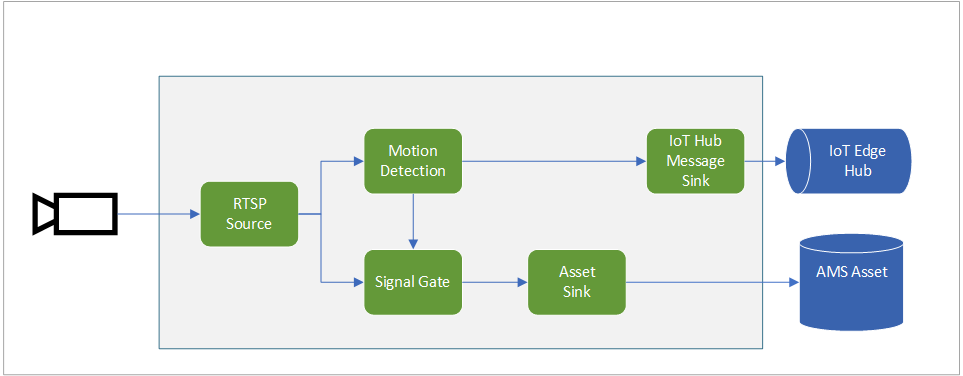
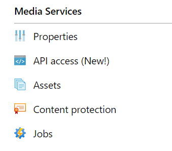
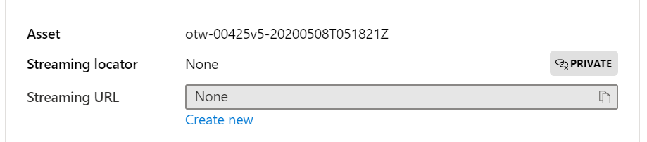
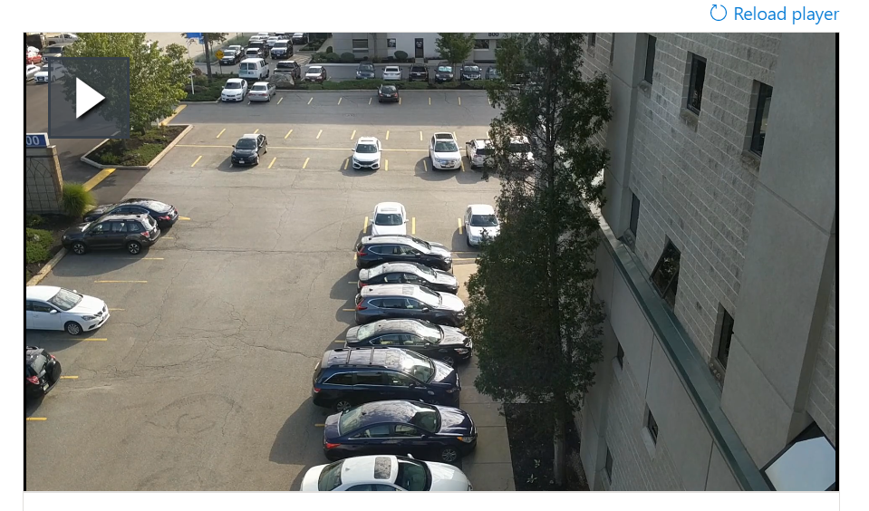

# Quickstart: Event-based recording of videos using Live Video Analytics on IoT Edge

This article walks you through the steps to use Live Video Analytics on IoT Edge for event-based recording. It uses a Linux Azure VM as an IoT Edge device and a simulated live video stream. This video stream is analyzed for the presence of moving objects. When motion is detected, events are sent to Azure IoT Hub, and the relevant part of the video stream is recorded as an Asset in Azure Media Services.

This article builds on top of the [Getting Started quickstart](get-started-detect-motion-emit-events-quickstart.md).

## Prerequisites

* An Azure account with an active subscription. [Create an account for free](https://azure.microsoft.com/free/?WT.mc_id=A261C142F).
* [Visual Studio Code](https://code.visualstudio.com/) on your machine with [Azure IoT Tools extension](https://marketplace.visualstudio.com/items?itemName=vsciot-vscode.azure-iot-tools)
* Complete [Setting up Azure resources](https://github.com/Azure-Samples/lva-edge-rc3/blob/master/src/quick-start/quickstart.md#set-up-azure-resources), [Deploying modules](https://github.com/Azure-Samples/lva-edge-rc3/blob/master/src/quick-start/quickstart.md#deploy-modules-on-your-edge-device), and [Configuring Visual Studio Code](https://github.com/Azure-Samples/lva-edge-rc3/blob/master/src/quick-start/quickstart.md#configure-azure-iot-tools-extension-in-visual-studio-code).

## Review the sample video

As part of the steps above to set up the Azure resources, a (short) video of a parking lot will be copied to the Linux Azure VM being used as the IoT Edge device. This video file will be used to simulate a live stream for this tutorial.

You can use an application like VLC Player, launch it, hit Control+N, and paste this link to the parking lot video to start playback. Note that at about the 5-second mark, a white car moves through the parking lot.

When you complete the steps below, you will have used Live Video Analytics on IoT Edge to detect that motion of the car, and record a video clip starting at around that 5-second mark. Following is the visual representation of the overall flow.



## Use Live Video Analytics on IoT Edge Direct Methods

Read [Direct Methods for Live Video Analytics on IoT Edge](direct-methods.md) to understand all the Direct Methods provided by the module.

### Invoke GraphTopologyList

1. Right-click on "lvaEdge" module and select "Invoke Module Direct Method" from the context menu.
1. You will see an edit box pop in the top-middle of Visual Studio Code window. Enter "GraphTopologyList" in the edit box and press enter.
1. Next, copy and paste the below JSON payload in the edit box and press enter.
    
    ```
    {
        "@apiVersion" : "1.0"
    }
    ```

    Within a few seconds, you will see the "Output" window popup with the following response
    
    ```
    [DirectMethod] Invoking Direct Method [GraphTopologyList] to [lva-sample-device/lvaEdge] ...
    [DirectMethod] Response from [lva-sample-device/lvaEdge]:
    {
      "status": 200,
      "payload": {
        "value": []
      }
    }
    ```
    
    The above response is expected as no MediaGraph topologies have been created.

### Invoke GraphTopologySet

Using the same steps as those outlined for invoking GraphTopologyList, you can invoke GraphTopologySet to set a [Media Graph topology](media-graph-concept.md) using the following JSON as the payload. You will be creating a topology named as "EVRtoAssetsOnMotionDetecion".

```
{
    "@apiVersion": "1.0",
    "name": "EVRtoAssetsOnMotionDetecion",
    "properties": {
      "description": "Event-based video recording to Assets based on motion events",
      "parameters": [
        {
            "name": "rtspUserName",
            "type": "String",
            "description": "rtsp source user name.",
            "default": "dummyUserName"
        },
        {
            "name": "rtspPassword",
            "type": "String",
            "description": "rtsp source password.",
            "default" : "dummyPassword"
        },
        {
            "name": "rtspUrl",
            "type": "String",
            "description": "rtsp Url"
        },
        {
            "name": "motionSensitivity",
            "type": "String",
            "description": "motion detection sensitivity",
            "default" : "medium"
        },
        {
            "name": "hubSinkOutputName",
            "type": "String",
            "description": "hub sink output name",
            "default" : "iothubsinkoutput"
        }                              
    ],         

      "sources": [
        {
          "@type": "#Microsoft.Media.MediaGraphRtspSource",
          "name": "rtspSource",
          "endpoint": {
            "@type": "#Microsoft.Media.MediaGraphClearEndpoint",
            "url": "${rtspUrl}",
            "credentials": {
              "@type": "#Microsoft.Media.MediaGraphUsernamePasswordCredentials",
              "username": "${rtspUserName}",
              "password": "${rtspPassword}"
            }
          }
        }
      ],
      "processors": [
        {
          "@type": "#Microsoft.Media.MediaGraphMotionDetectionProcessor",
          "name": "md",
          "sensitivity": "${motionSensitivity}",
          "inputs": [
            {
              "nodeName": "rtspSource"
            }
          ]
        },
        {
          "@type": "#Microsoft.Media.MediaGraphSignalGateProcessor",
          "name": "signalGateProcessor",
          "inputs": [
            {
              "nodeName": "md"
            },
            {
              "nodeName": "rtspSource"
            }
          ],
          "activationEvaluationWindow": "PT1S",
          "activationSignalOffset": "PT0S",
          "minimumActivationTime": "PT30S",
          "maximumActivationTime": "PT30S"
        }
      ],
      "sinks": [
        {
          "@type": "#Microsoft.Media.MediaGraphAssetSink",
          "name": "assetSink",
          "assetNamePattern": "sampleAssetFromEVR-LVAEdge-${System.DateTime}",
          "segmentLength": "PT0M30S",
          "localMediaCacheMaximumSizeMb": "2048",
          "localMediaCachePath": "/var/lib/azuremediaservices/tmp/",
          "inputs": [
            {
              "nodeName": "signalGateProcessor"
            }
          ]
        },
        {
          "@type": "#Microsoft.Media.MediaGraphIoTHubMessageSink",
          "name": "hubSink",
          "hubOutputName": "${hubSinkOutputName}",
          "inputs": [
            {
              "nodeName": "md"
            }
          ]
        }
      ]
    }
}
```

The above JSON payload results in the creation of a MediaGraph topology that defines five parameters (four of which have default values). The topology has one source node (RTSP Source), two processor nodes (Motion Detection Processor and Signal Gate Processor), and two sink nodes (IoT Hub Sink and Asset Sink). The visual representation of the topology is shown above.

Within a few seconds you will see the following response in the Output window

```
[DirectMethod] Invoking Direct Method [GraphTopologySet] to [lva-sample-device/lvaEdge] ...
[DirectMethod] Response from [lva-sample-device/lvaEdge]:
{
  "status": 201,
  "payload": {
    "systemData": {
      "createdAt": "2020-05-12T22:05:31.603Z",
      "lastModifiedAt": "2020-05-12T22:05:31.603Z"
    },
    "name": "EVRtoAssetsOnMotionDetecion",
    "properties": {
      "description": "Event-based video recording to Assets based on motion events",
      "parameters": [
        {
          "name": "rtspUserName",
          "type": "String",
          "description": "rtsp source user name.",
          "default": "dummyUserName"
        },
        {
          "name": "rtspPassword",
          "type": "String",
          "description": "rtsp source password.",
          "default": "dummyPassword"
        },
        {
          "name": "rtspUrl",
          "type": "String",
          "description": "rtsp Url"
        },
        {
          "name": "motionSensitivity",
          "type": "String",
          "description": "motion detection sensitivity",
          "default": "medium"
        },
        {
          "name": "hubSinkOutputName",
          "type": "String",
          "description": "hub sink output name",
          "default": "iothubsinkoutput"
        }
      ],
      "sources": [
        {
          "@type": "#Microsoft.Media.MediaGraphRtspSource",
          "name": "rtspSource",
          "transport": "Tcp",
          "endpoint": {
            "@type": "#Microsoft.Media.MediaGraphClearEndpoint",
            "url": "${rtspUrl}",
            "credentials": {
              "@type": "#Microsoft.Media.MediaGraphUsernamePasswordCredentials",
              "username": "${rtspUserName}",
              "password": "${rtspPassword}"
            }
          }
        }
      ],
      "processors": [
        {
          "@type": "#Microsoft.Media.MediaGraphMotionDetectionProcessor",
          "sensitivity": "${motionSensitivity}",
          "name": "md",
          "inputs": [
            {
              "nodeName": "rtspSource",
              "outputSelectors": []
            }
          ]
        },
        {
          "@type": "#Microsoft.Media.MediaGraphSignalGateProcessor",
          "activationEvaluationWindow": "PT1S",
          "activationSignalOffset": "PT0S",
          "minimumActivationTime": "PT30S",
          "maximumActivationTime": "PT30S",
          "name": "signalGateProcessor",
          "inputs": [
            {
              "nodeName": "md",
              "outputSelectors": []
            },
            {
              "nodeName": "rtspSource",
              "outputSelectors": []
            }
          ]
        }
      ],
      "sinks": [
        {
          "@type": "#Microsoft.Media.MediaGraphAssetSink",
          "localMediaCachePath": "/var/lib/azuremediaservices/tmp/",
          "localMediaCacheMaximumSizeMb": "2048",
          "segmentLength": "PT0M30S",
          "assetNamePattern": "sampleAssetFromEVR-LVAEdge-${System.DateTime}",
          "name": "assetSink",
          "inputs": [
            {
              "nodeName": "signalGateProcessor",
              "outputSelectors": []
            }
          ]
        },
        {
          "@type": "#Microsoft.Media.MediaGraphIoTHubMessageSink",
          "hubOutputName": "${hubSinkOutputName}",
          "name": "hubSink",
          "inputs": [
            {
              "nodeName": "md",
              "outputSelectors": []
            }
          ]
        }
      ]
    }
  }
}
```

Note that the status returned is 201, indicating that a new topology was created. Try the following as next steps

* Invoke GraphTopologySet again and note that the status code returned is 200. Status code 200 indicates that an existing topology was successfully updated.
* Invoke GraphTopologySet again but change the description string. Note the status code in the response is 200 and the description is updated to the new value.
* Invoke GraphTopologyList as outlined in the previous section and note that now you can see the "EVRtoAssetsOnMotionDetecion" topology in the returned payload.

### Invoke GraphTopologyGet

Now invoke GraphTopologyGet with the following payload
```

{
    "@apiVersion" : "1.0",
    "name" : "EVRtoAssetsOnMotionDetecion"
}
```

Within a few seconds, you should see the following response in the Output window

```
[DirectMethod] Invoking Direct Method [GraphTopologyGet] to [lva-sample-device/lvaEdge] ...
[DirectMethod] Response from [lva-sample-device/lvaEdge]:
{
  "status": 200,
  "payload": {
    "systemData": {
      "createdAt": "2020-05-12T22:05:31.603Z",
      "lastModifiedAt": "2020-05-12T22:05:31.603Z"
    },
    "name": "EVRtoAssetsOnMotionDetecion",
    "properties": {
      "description": "Event-based video recording to Assets based on motion events",
      "parameters": [
        {
          "name": "rtspUserName",
          "type": "String",
          "description": "rtsp source user name.",
          "default": "dummyUserName"
        },
        {
          "name": "rtspPassword",
          "type": "String",
          "description": "rtsp source password.",
          "default": "dummyPassword"
        },
        {
          "name": "rtspUrl",
          "type": "String",
          "description": "rtsp Url"
        },
        {
          "name": "motionSensitivity",
          "type": "String",
          "description": "motion detection sensitivity",
          "default": "medium"
        },
        {
          "name": "hubSinkOutputName",
          "type": "String",
          "description": "hub sink output name",
          "default": "iothubsinkoutput"
        }
      ],
      "sources": [
        {
          "@type": "#Microsoft.Media.MediaGraphRtspSource",
          "name": "rtspSource",
          "transport": "Tcp",
          "endpoint": {
            "@type": "#Microsoft.Media.MediaGraphClearEndpoint",
            "url": "${rtspUrl}",
            "credentials": {
              "@type": "#Microsoft.Media.MediaGraphUsernamePasswordCredentials",
              "username": "${rtspUserName}",
              "password": "${rtspPassword}"
            }
          }
        }
      ],
      "processors": [
        {
          "@type": "#Microsoft.Media.MediaGraphMotionDetectionProcessor",
          "sensitivity": "${motionSensitivity}",
          "name": "md",
          "inputs": [
            {
              "nodeName": "rtspSource",
              "outputSelectors": []
            }
          ]
        },
        {
          "@type": "#Microsoft.Media.MediaGraphSignalGateProcessor",
          "activationEvaluationWindow": "PT1S",
          "activationSignalOffset": "PT0S",
          "minimumActivationTime": "PT30S",
          "maximumActivationTime": "PT30S",
          "name": "signalGateProcessor",
          "inputs": [
            {
              "nodeName": "md",
              "outputSelectors": []
            },
            {
              "nodeName": "rtspSource",
              "outputSelectors": []
            }
          ]
        }
      ],
      "sinks": [
        {
          "@type": "#Microsoft.Media.MediaGraphAssetSink",
          "localMediaCachePath": "/var/lib/azuremediaservices/tmp/",
          "localMediaCacheMaximumSizeMb": "2048",
          "segmentLength": "PT0M30S",
          "assetNamePattern": "sampleAssetFromEVR-LVAEdge-${System.DateTime}",
          "name": "assetSink",
          "inputs": [
            {
              "nodeName": "signalGateProcessor",
              "outputSelectors": []
            }
          ]
        },
        {
          "@type": "#Microsoft.Media.MediaGraphIoTHubMessageSink",
          "hubOutputName": "${hubSinkOutputName}",
          "name": "hubSink",
          "inputs": [
            {
              "nodeName": "md",
              "outputSelectors": []
            }
          ]
        }
      ]
    }
  }
}
```

Note the following in the response payload

* Status code is 200, indicating success.
* The payload has the "created" and the "lastModified" timestamp.

### Invoke GraphInstanceSet

Now invoke Direct Method GraphInstanceSet with the following payload

```
{
    "@apiVersion" : "1.0",
    "name" : "Sample-Graph-2",
    "properties" : {
        "topologyName" : "EVRtoAssetsOnMotionDetecion",
        "description" : "Sample graph description",
        "parameters" : [
            { "name" : "rtspUrl", "value" : "rtsp://rtspsim:554/media/lots_015.mkv" }
        ]
    }
}
```

Note the following

* The payload above specifies the topology name for which the instance needs to be created
* The payload contains parameter value for "rtspUrl", which did not have a default value in the topology payload

Within few seconds, you will see the following response in the Output window:

```
[DirectMethod] Invoking Direct Method [GraphInstanceSet] to [lva-sample-device/lvaEdge] ...
[DirectMethod] Response from [lva-sample-device/lvaEdge]:
{
  "status": 201,
  "payload": {
    "systemData": {
      "createdAt": "2020-05-12T23:30:20.666Z",
      "lastModifiedAt": "2020-05-12T23:30:20.666Z"
    },
    "name": "Sample-Graph-2",
    "properties": {
      "state": "Inactive",
      "description": "Sample graph description",
      "topologyName": "EVRtoAssetsOnMotionDetecion",
      "parameters": [
        {
          "name": "rtspUrl",
          "value": "rtsp://rtspsim:554/media/lots_015.mkv"
        }
      ]
    }
  }
}
```

Note the following in the response payload

* Status code is 201, indicating a new instance was created
* State is "Inactive", indicating that the MediaGraph was created but not activated. You can read about MediaGraph states in the MediaGraph concept page

Try the following as next steps

* Invoke GraphInstanceSet again with the same payload and note that the returned status code is now 200.
* Invoke GraphInstanceSet again but with a different description and note that the updated description in the response payload, indicating that the MediaGraph instance was successfully updated.
* Invoke GraphInstanceSet but change the name to "Sample-Graph-3" and observe the response payload. Note that a new graph instance is created (that is, status code is 201). Remember to clean up such duplicate instances when you are done with the quickstart.

### Prepare for monitoring events

The Media Graph you created uses the Motion Detection Processor node to detect motion, and such events are relayed to your IoT Hub. In order to prepare for observing such events, follow these steps

1. Open the Explorer pane in VSCode and look for Azure IOT Hub at the bottom-left corner.
1. Expand the Devices node
1. Right-clink on lva-sample-device and chose the option "Start Monitoring Built-in Event Monitoring"

    
    
    Within seconds, you will see the following messages in the Output window:

    ```
    [IoTHubMonitor] Start monitoring message arrived in built-in endpoint for all devices ...
    [IoTHubMonitor] Created partition receiver [0] for consumerGroup [$Default]
    [IoTHubMonitor] Created partition receiver [1] for consumerGroup [$Default]
    [IoTHubMonitor] Created partition receiver [2] for consumerGroup [$Default]
    [IoTHubMonitor] Created partition receiver [3] for consumerGroup [$Default]
    ```

###  Invoke GraphInstanceActivate

Now invoke Direct Method GraphInstanceActivate with the following payload

```
{
    "@apiVersion" : "1.0",
    "name" : "Sample-Graph-2"
}
```

Within few seconds, you should see the following response in the Output window

```
[DirectMethod] Invoking Direct Method [GraphInstanceActivate] to [lva-sample-device/lvaEdge] ...
[DirectMethod] Response from [lva-sample-device/lvaEdge]:
{
  "status": 200,
  "payload": null
}
```

Status code of 200 in the response payload indicates that the MediaGraph was successfully activated.

### Invoke GraphInstanceGet

Now invoke Direct Method GraphInstanceGet with the following payload

```
{
    "@apiVersion" : "1.0",
    "name" : "Sample-Graph-2"
}
```

Within few seconds, you should see the following response in the Output window

```
[DirectMethod] Invoking Direct Method [GraphInstanceGet] to [lva-sample-device/lvaEdge] ...
[DirectMethod] Response from [lva-sample-device/lvaEdge]:
{
  "status": 200,
  "payload": {
    "systemData": {
      "createdAt": "2020-05-12T23:30:20.666Z",
      "lastModifiedAt": "2020-05-12T23:30:20.666Z"
    },
    "name": "Sample-Graph-2",
    "properties": {
      "state": "Active",
      "description": "Sample graph description",
      "topologyName": "EVRtoAssetsOnMotionDetecion",
      "parameters": [
        {
          "name": "rtspUrl",
          "value": "rtsp://rtspsim:554/media/lots_015.mkv"
        }
      ]
    }
  }
}
```

Note the following in the response payload

* Status code is 200, indicating success.
* State is "Active", indicating the MediaGraph is now in "Active" state.

## Observe the results

The MediaGraph that we created and activated above, uses the motion detection processor to detect motion in the incoming live video stream and output events to IoT Hub sink. These events are then relayed to your IoT Hub, which can now be observed. You will see the following messages in the Output window

```
[IoTHubMonitor] [4:33:04 PM] Message received from [lva-sample-device/lvaEdge]:
{
  "body": {
    "sdp": "SDP:\nv=0\r\no=- 1589326384077235 1 IN IP4 XXX.XX.XX.XXX\r\ns=Matroska video+audio+(optional)subtitles, streamed by the LIVE555 Media Server\r\ni=media/lots_015.mkv\r\nt=0 0\r\na=tool:LIVE555 Streaming Media v2020.04.12\r\na=type:broadcast\r\na=control:*\r\na=range:npt=0-73.000\r\na=x-qt-text-nam:Matroska video+audio+(optional)subtitles, streamed by the LIVE555 Media Server\r\na=x-qt-text-inf:media/lots_015.mkv\r\nm=video 0 RTP/AVP 96\r\nc=IN IP4 0.0.0.0\r\nb=AS:500\r\na=rtpmap:96 H264/90000\r\na=fmtp:96 packetization-mode=1;profile-level-id=640028;sprop-parameter-sets=XXXXXXXXXXXXXXXXXXXXXXXXXXXXXXXXXXX\r\na=control:track1\r\n"
  },
  "applicationProperties": {
    "topic": "/subscriptions/XXXXXXXX-XXXX-XXXX-XXXX-XXXXXXXXXXXX/resourceGroups/<my-resource-group>/providers/microsoft.media/mediaservices/<ams-account-name>",
    "subject": "/graphInstances/Sample-Graph-2/sources/rtspSource",
    "eventType": "Microsoft.Media.Graph.Diagnostics.MediaSessionEstablished",
    "eventTime": "2020-05-12T23:33:04.077Z",
    "dataVersion": "1.0"
  }
}
[IoTHubMonitor] [4:33:09 PM] Message received from [lva-sample-device/lvaEdge]:
{
  "body": {
    "timestamp": 143039375044290,
    "inferences": [
      {
        "type": "motion",
        "motion": {
          "box": {
            "l": 0.48954,
            "t": 0.140741,
            "w": 0.075,
            "h": 0.058824
          }
        }
      }
    ]
  },
  "applicationProperties": {
    "topic": "/subscriptions/XXXXXXXX-XXXX-XXXX-XXXX-XXXXXXXXXXXX/resourceGroups/<my-resource-group>/providers/microsoft.media/mediaservices/<ams-account-name>",
    "subject": "/graphInstances/Sample-Graph-2/processors/md",
    "eventType": "Microsoft.Media.Graph.Analytics.Inference",
    "eventTime": "2020-05-12T23:33:09.381Z",
    "dataVersion": "1.0"
  }
}
```

Note the following in the above messages

* Each message contains a "body" section and an "applicationProperties" section. To understand what these sections represent, read the article [Create and Read IoT Hub message](https://docs.microsoft.com/azure/iot-hub/iot-hub-devguide-messages-construct)
* The first message is a Diagnostics event, MediaSessionEstablished, saying that the RTSP Source node (subject) was able to establish connection with the RTSP simulator, and begin to receive a (simulated) live feed
* The "subject" in applicationProperties references the node in the MediaGraph from which the message was generated. In this case, the message is originating from the RTSP Source node.
* "eventType" in applicationProperties indicates that this is a Diagnostics event
* "eventTime" indicates the time when the event occurred.
* "body" contains data about the diagnostic event - it's the SDP message
* The second message is an Analytics event. Note that it is sent roughly 5 seconds after the MediaSessionEstablished message, which corresponds to the delay between the start of the video, and when the car drives through the parking lot
* The "subject" in applicationProperties references the Motion Detection Processor node in the graph, which generated this message
* The event is an Inference event and hence the body contains "timestamp" and "inferences" data.
* "inferences" section indicates that the "type" is "motion" and has additional data about the "motion" event.

The next message you will see is the following.

```
[IoTHubMonitor] [4:33:10 PM] Message received from [lva-sample-device/lvaEdge]:
{
  "body": {
    "outputType": "assetName",
    "outputLocation": "sampleAssetFromEVR-LVAEdge-20200512T233309Z"
  },
  "applicationProperties": {
    "topic": "/subscriptions/XXXXXXXX-XXXX-XXXX-XXXX-XXXXXXXXXXXX/resourceGroups/<my-resource-group>/providers/microsoft.media/mediaservices/<ams-account-name>",
    "subject": "/graphInstances/Sample-Graph-2/sinks/assetSink",
    "eventType": "Microsoft.Media.Graph.Operational.RecordingStarted",
    "eventTime": "2020-05-12T23:33:10.392Z",
    "dataVersion": "1.0"
  }
}
```

* The third message is an Operational event. Note that it is sent almost immediately after the motion detection message, which acted as the trigger to start recording
* The "subject" in applicationProperties references the AssetSink node in the graph, which generated this message
* The body contains information about the output location, which in this case is the name of the Azure Media Service Asset into which video is recorded. You should note down this value.

In the topology, the Signal Gate Processor was configured with activation times of 30 seconds, which means that the graph will record roughly 30 seconds worth of video into the Asset. During that 30 seconds, the Motion Detection Processor will continue to emit Inference events, which will show up in the Output window. After some time, you will see the following message.

```
[IoTHubMonitor] [4:33:31 PM] Message received from [lva-sample-device/lvaEdge]:
{
  "body": {
    "outputType": "assetName",
    "outputLocation": "sampleAssetFromEVR-LVAEdge-20200512T233309Z"
  },
  "applicationProperties": {
    "topic": "/subscriptions/XXXXXXXX-XXXX-XXXX-XXXX-XXXXXXXXXXXX/resourceGroups/<my-resource-group>/providers/microsoft.media/mediaservices/<ams-account-name>",
    "subject": "/graphInstances/Sample-Graph-2/sinks/assetSink",
    "eventType": "Microsoft.Media.Graph.Operational.RecordingAvailable",
    "eventTime": "2020-05-12T23:33:31.051Z",
    "dataVersion": "1.0"
  }
}
```

* This message is also an Operational event. The event, RecordingAvailable, indicates that enough data has been written to the Asset in order for players/clients to initiate playback of the video
* The "subject" in applicationProperties references the AssetSink node in the graph, which generated this message
* The body contains information about the output location, which in this case is the name of the Azure Media Service Asset into which video is recorded.

If you let the Media Graph continue to run you will see this message.

```
[IoTHubMonitor] [4:33:40 PM] Message received from [lva-sample-device/lvaEdge]:
{
  "body": {
    "outputType": "assetName",
    "outputLocation": "sampleAssetFromEVR-LVAEdge-20200512T233309Z"
  },
  "applicationProperties": {
    "topic": "/subscriptions/XXXXXXXX-XXXX-XXXX-XXXX-XXXXXXXXXXXX/resourceGroups/<my-resource-group>/providers/microsoft.media/mediaservices/<ams-account-name>",
    "subject": "/graphInstances/Sample-Graph-2/sinks/assetSink",
    "eventType": "Microsoft.Media.Graph.Operational.RecordingStopped",
    "eventTime": "2020-05-12T23:33:40.014Z",
    "dataVersion": "1.0"
  }
}
```

* This message is also an Operational event. The event, RecordingStopped, indicates that recording has stopped.
* Note that roughly 30 seconds has elapsed since the RecordingStarted event, matching the values of the activation times in the Signal Gate Processor
* The "subject" in applicationProperties references the AssetSink node in the graph, which generated this message
* The body contains information about the output location, which in this case is the name of the Azure Media Service Asset into which video is recorded.

If you let the Media Graph continue to run, the RTSP simulator will reach the end of the video file and stop/disconnect. The RTSP Source node will then reconnect to the simulator, and the process will repeat.
    
## Invoke additional Direct Methods

Now, lets invoke Direct Methods to deactivate the MediaGraph and delete the MediaGraph topology and instance

### Invoke GraphInstanceDeactivate

Invoke Direct Method GraphInstanceDeactivate with the following payload

```
{
    "@apiVersion" : "1.0",
    "name" : "Sample-Graph-2"
}
```

Within few seconds, you should see the following response in the Output window

```
[DirectMethod] Invoking Direct Method [GraphInstanceDeactivate] to [lva-sample-device/lvaEdge] ...
[DirectMethod] Response from [lva-sample-device/lvaEdge]:
{
  "status": 200,
  "payload": null
}
```

Status code of 200 indicates that the MediaGraph was successfully deactivated.

Try the following, as next steps

* Invoke GraphTopologyGet as indicated in the earlier sections and observe the "state" value.

### Invoke GraphTopologyDelete

Invoke Direct Method GraphTopologyDelete with the following payload

```
{
    "@apiVersion" : "1.0",
    "name" : "EVRtoAssetsOnMotionDetecion"
}
```

Within few seconds, you should see the following response in the Output window

```
[DirectMethod] Invoking Direct Method [GraphTopologyDelete] to [lva-sample-device/lvaEdge] ...
[DirectMethod] Response from [lva-sample-device/lvaEdge]:
{
  "status": 200,
  "payload": null
}
```

Status code of 200 indicates that the MediaGraph topology was successfully deleted.

Try the following as next steps

* Invoke GraphTopologyList and observe that there are no topologies anymore.
* Invoke GraphInstanceList with the same payload as GraphTopologyList and observe that are no instances enumerated.

## Playing back the recorded video

Next, you can use the Azure portal to play back the video you recorded.

1. Log into the Azure portal, type "Media Services" in the search box
1. Locate your Azure Media Services account and open it
1. Locate and select the Assets entry in the Media Services listing

    
1. If this is your first use of Azure Media Services, only the Assets generated from this quickstart will be listed, and you can pick the oldest one.
1. Else, use the name of the Asset that was provided as the outputLocation in the Operational events above
1. In the details page that opens, click on the "Create new" link just below the Streaming URL textbox

    
1. In the pane that opens for "Add streaming locator", accept the defaults and hit "Add" at the bottom.
1. In the Asset details page, the video player should now load to the first frame of the video, and you can hit the play button. You should see the car moving in the parking lot    

    

> [!NOTE]
> Since the simulated live video starts when you activate the graph, the time-of-day values are not relevant, and not exposed via this player shortcut. The tutorial on continuous video recording and playback shows you how you can display the timestamps.

## Clean up resources

If you're not going to continue to use this application, delete resources created in this quickstart.

## Next steps

* Learn how to invoke Live Video Analytics on IoT Edge Direct Methods programmatically.
* Learn more about diagnostic messages.    