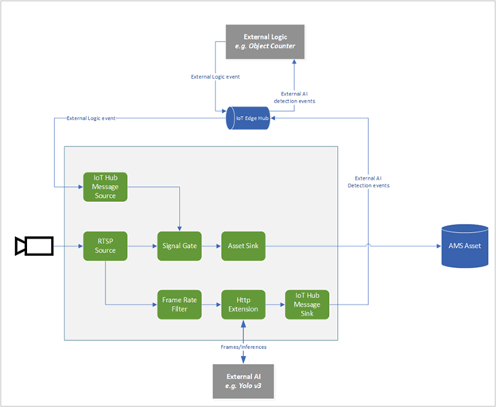
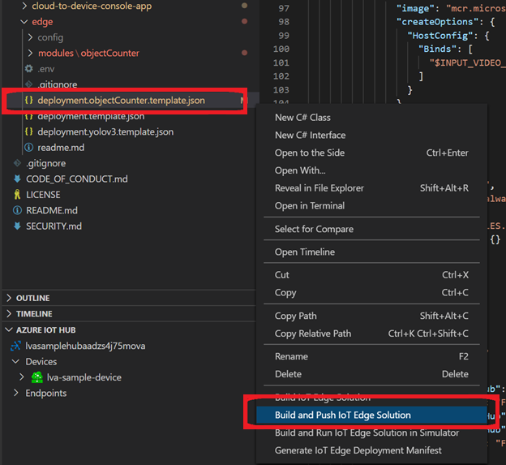
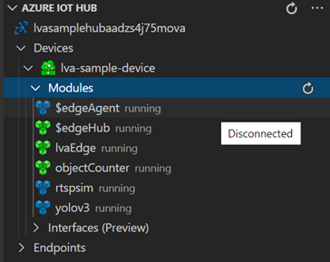

# Tutorial: Event-based video recording to the cloud and playback from the cloud

In this tutorial, you'll learn how to use Azure Live Video Analytics on Azure IoT Edge to selectively record portions of a live video source to Azure Media Services in the cloud. This use case is referred to as [event-based video recording](event-based-video-recording-concept.md) (EVR) in this tutorial. To record portions of a live video, you'll use an object detection AI model to look for objects in the video and record video clips only when a certain type of object is detected. You'll also learn about how to play back the recorded video clips by using Media Services. This capability is useful for a variety of scenarios where there's a need to keep an archive of video clips of interest. 

In this tutorial, you will:

> [!div class="checklist"]
> * Set up the relevant resources.
> *	Examine the code that performs EVR.
> *	Run the sample code.
> *	Examine the results, and view the video.

[!INCLUDE [quickstarts-free-trial-note](../../../includes/quickstarts-free-trial-note.md)]

## Suggested pre-reading  

Read these articles before you begin:

* [Live Video Analytics on IoT Edge overview](overview.md)
* [Live Video Analytics on IoT Edge terminology](terminology.md)
* [Media graph concepts](media-graph-concept.md) 
* [Event-based video recording](event-based-video-recording-concept.md)
* [Tutorial: Developing an IoT Edge module](https://docs.microsoft.com/azure/iot-edge/tutorial-develop-for-linux)
* [How to edit deployment.*.template.json](https://github.com/microsoft/vscode-azure-iot-edge/wiki/How-to-edit-deployment.*.template.json)
* Section on [how to declare routes in IoT Edge deployment manifest](https://docs.microsoft.com/azure/iot-edge/module-composition#declare-routes)

## Prerequisites

Prerequisites for this tutorial are:

* [Visual Studio Code](https://code.visualstudio.com/) on your development machine with the [Azure IoT Tools](https://marketplace.visualstudio.com/items?itemName=vsciot-vscode.azure-iot-tools) and [C#](https://marketplace.visualstudio.com/items?itemName=ms-dotnettools.csharp) extensions.

    > [!TIP]
    > You might be prompted to install Docker. Ignore this prompt.
* [.NET Core 3.1 SDK](https://dotnet.microsoft.com/download/dotnet-core/thank-you/sdk-3.1.201-windows-x64-installer) on your development machine.
* Complete the [Live Video Analytics resources setup script](https://github.com/Azure/live-video-analytics/tree/master/edge/setup), and [set up the environment](https://review.docs.microsoft.com/en-us/azure/media-services/live-video-analytics-edge/detect-motion-emit-events-quickstart?branch=release-preview-media-services-lva#set-up-the-environment)

At the end of these steps, you'll have relevant Azure resources deployed in your Azure subscription:

* Azure IoT Hub
* Azure Storage account
* Azure Media Services account
* Linux VM in Azure, with the [IoT Edge runtime](https://docs.microsoft.com/azure/iot-edge/how-to-install-iot-edge-linux) installed

## Concepts

Event-based video recording refers to the process of recording video triggered by an event. That event could be generated from:
- Processing of the video signal itself, for example, upon detecting a moving object in the video.
- An independent source, for example, the opening of a door. 

Alternatively, you can trigger recording only when an inferencing service detects that a specific event has occurred. In this tutorial, you'll use a video of vehicles moving on a freeway and record video clips whenever a truck is detected.



The diagram is a pictorial representation of a [media graph](media-graph-concept.md) and additional modules that accomplish the desired scenario. Four IoT Edge modules are involved:

* Live Video Analytics on an IoT Edge module.
* An edge module running an AI model behind an HTTP endpoint. This AI module uses the [YOLO v3](https://github.com/Azure/live-video-analytics/tree/master/utilities/video-analysis/yolov3-onnx) model, which can detect many types of objects.
* A custom module to count and filter objects, which is referred to as an Object Counter in the diagram. You'll build an Object Counter and deploy it in this tutorial.
* An [RTSP simulator module](https://github.com/Azure/live-video-analytics/tree/master/utilities/rtspsim-live555) to simulate an RTSP camera.
    
As the diagram shows, you'll use an [RTSP source](media-graph-concept.md#rtsp-source) node in the media graph to capture the simulated live video of traffic on a highway and send that video to two paths:

* The first path is to a [frame rate filter processor](media-graph-concept.md#frame-rate-filter-processor) node that outputs video frames at the specified (reduced) frame rate. Those video frames are sent to an HTTP extension node. The node then relays the frames, as images, to the AI module YOLO v3, which is an object detector. The node receives the results, which are the objects (vehicles in traffic) detected by the model. The HTTP extension node then publishes the results via the IoT Hub message sink node to the IoT Edge hub.
* The objectCounter module is set up to receive messages from the IoT Edge hub, which include the object detection results (vehicles in traffic). The module checks these messages and looks for objects of a certain type, which were configured via a setting. When such an object is found, this module sends a message to the IoT Edge hub. Those "object found" messages are then routed to the IoT Hub source node of the media graph. Upon receiving such a message, the IoT Hub source node in the media graph triggers the [signal gate processor](media-graph-concept.md#signal-gate-processor) node. The signal gate processor node then opens for a configured amount of time. Video flows through the gate to the asset sink node for that duration. That portion of the live stream is then recorded via the [asset sink](media-graph-concept.md#asset-sink) node to an [asset](terminology.md#asset) in your Azure Media Services account.

## Set up your development environment

Before you begin, check that you completed the third bullet in [Prerequisites](#prerequisites). After the resource setup script finishes, select the curly brackets to expose the folder structure. You'll see a few files created under the ~/clouddrive/lva-sample directory.


Of interest in this tutorial are the files:

* **~/clouddrive/lva-sample/edge-deployment/.env**: Contains properties that Visual Studio Code uses to deploy modules to an edge device.
* **~/clouddrive/lva-sample/appsetting.json**: Used by Visual Studio Code for running the sample code.

You'll need the files for these steps.

1. Clone the repo from the GitHub link https://github.com/Azure-Samples/live-video-analytics-iot-edge-csharp.
1. Start Visual Studio Code, and open the folder where you downloaded the repo.
1. In Visual Studio Code, browse to the src/cloud-to-device-console-app folder and create a file named **appsettings.json**. This file contains the settings needed to run the program.
1. Copy the contents from the ~/clouddrive/lva-sample/appsettings.json file. The text should look like:

    ```
    {  
        "IoThubConnectionString" : "HostName=xxx.azure-devices.net;SharedAccessKeyName=iothubowner;SharedAccessKey=XXX",  
        "deviceId" : "lva-sample-device",  
        "moduleId" : "lvaEdge"  
    }
    ```

    The IoT Hub connection string lets you use Visual Studio Code to send commands to the edge modules via Azure IoT Hub.
    
1. Next, browse to the src/edge folder and create a file named **.env**.
1. Copy the contents from the ~/clouddrive/lva-sample/.env file. The text should look like:

    ```
    SUBSCRIPTION_ID="<Subscription ID>"  
    RESOURCE_GROUP="<Resource Group>"  
    AMS_ACCOUNT="<AMS Account ID>"  
    IOTHUB_CONNECTION_STRING="HostName=xxx.azure-devices.net;SharedAccessKeyName=iothubowner;SharedAccessKey=xxx"  
    AAD_TENANT_ID="<AAD Tenant ID>"  
    AAD_SERVICE_PRINCIPAL_ID="<AAD SERVICE_PRINCIPAL ID>"  
    AAD_SERVICE_PRINCIPAL_SECRET="<AAD SERVICE_PRINCIPAL ID>"  
    INPUT_VIDEO_FOLDER_ON_DEVICE="/home/lvaadmin/samples/input"  
    OUTPUT_VIDEO_FOLDER_ON_DEVICE="/home/lvaadmin/samples/output"  
    APPDATA_FOLDER_ON_DEVICE="/var/local/mediaservices"
    CONTAINER_REGISTRY_USERNAME_myacr="<your container registry username>"  
    CONTAINER_REGISTRY_PASSWORD_myacr="<your container registry username>"      
    ```

## Examine the template file 

In the previous step, you started Visual Studio Code and opened the folder that contains the sample code.

In Visual Studio Code, browse to src/edge. You'll see the .env file that you created and a few deployment template files. This template defines which edge modules you'll deploy to the edge device (the Azure Linux VM). The .env file contains values for the variables used in these templates, such as the Media Services credentials.

Open src/edge/deployment.objectCounter.template.json. There are four entries under the **modules** section that correspond to the items listed in the previous "Concepts" section:

* **lvaEdge**: This is the Live Video Analytics on IoT Edge module.
* **yolov3**: This is the AI module built by using the YOLO v3 model.
* **rtspsim**: This is the RTSP simulator.
* **objectCounter**: This is the module that looks for specific objects in the results from yolov3.

For the objectCounter module, see the string (${MODULES.objectCounter}) used for the "image" value. This is based on the [tutorial](https://docs.microsoft.com/azure/iot-edge/tutorial-develop-for-linux) on developing an IoT Edge module. Visual Studio Code automatically recognizes that the code for the objectCounter module is under src/edge/modules/objectCounter. 

Read [this section](https://docs.microsoft.com/azure/iot-edge/module-composition#declare-routes) on how to declare routes in the IoT Edge deployment manifest. Then examine the routes in the template JSON file. Note how:

* LVAToObjectCounter is used to send specific events to a specific endpoint in the objectCounter module.
* ObjectCounterToLVA is used to send a trigger event to a specific endpoint (which should be the IoT Hub source node) in the lvaEdge module.
* objectCounterToIoTHub is used as a debug tool to help you see the output from objectCounter when you run this tutorial.

> [!NOTE]
> Check the desired properties for the objectCounter module, which are set up to look for objects that are tagged as "truck" with a confidence level of at least 50%.

## Generate and deploy the IoT Edge deployment manifest 

The deployment manifest defines what modules are deployed to an edge device and the configuration settings for those modules. Follow these steps to generate a manifest from the template file, and then deploy it to the edge device.

Using Visual Studio Code, follow [these instructions](https://docs.microsoft.com/azure/iot-edge/tutorial-develop-for-linux#build-and-push-your-solution) to sign in to Docker. Then select **Build and Push IoT Edge Solution**. Use src/edge/deployment.objectCounter.template.json for this step.



This action builds the objectCounter module for object counting and pushes the image to your Azure Container Registry.

* Check that you have the environment variables CONTAINER_REGISTRY_USERNAME_myacr and CONTAINER_REGISTRY_PASSWORD_myacr defined in the .env file.

This step creates the IoT Edge deployment manifest at src/edge/config/deployment.objectCounter.amd64.json. Right-click that file, and select **Create Deployment for Single Device**.


If this is your first tutorial with Live Video Analytics on IoT Edge, Visual Studio Code prompts you to input the IoT Hub connection string. You can copy it from the appsettings.json file.

Next, Visual Studio Code asks you to select an IoT Hub device. Select your IoT Edge device, which should be lva-sample-device.

At this stage, the deployment of edge modules to your IoT Edge device has started.
In about 30 seconds, refresh Azure IoT Hub in the lower-left section in Visual Studio Code. You should see that there are four modules deployed named lvaEdge, rtspsim, yolov3, and objectCounter.



## Prepare for monitoring events

To see the events from the objectCounter module and from the Live Video Analytics on IoT Edge module, follow these steps:

1. Open the Explorer pane in Visual Studio Code, and look for **Azure IoT Hub** in the lower-left corner.
1. Expand the **Devices** node.
1. Right-click the lva-sample-device file, and select **Start Monitoring Built-in Event Endpoint**.

   

## Run the program

1. In Visual Studio Code, go to src/cloud-to-device-console-app/operations.json.

1. Under the **GraphTopologySet** node, edit the following:

    `"topologyUrl" : "https://raw.githubusercontent.com/Azure/live-video-analytics/master/MediaGraph/topologies/evr-hubMessage-assets/topology.json"`
    
1. Next, under the **GraphInstanceSet** and **GraphTopologyDelete** nodes, edit:

    `"topologyName" : "EVRtoAssetsOnObjDetect"`
1. Start a debugging session by selecting F5. You'll see some messages printed in the **TERMINAL** window.

1. The operations.json file starts off with calls to GraphTopologyList and GraphInstanceList. If you've cleaned up resources after previous quickstarts or tutorials, this action returns empty lists and pauses for you to select **Enter**, as shown:

    ```
    --------------------------------------------------------------------------
    Executing operation GraphTopologyList
    -----------------------  Request: GraphTopologyList  --------------------------------------------------
    {
      "@apiVersion": "1.0"
    }
    ---------------  Response: GraphTopologyList - Status: 200  ---------------
    {
      "value": []
    }
    --------------------------------------------------------------------------
    Executing operation WaitForInput
    Press Enter to continue
    ```

1. After you select **Enter** in the **TERMINAL** window, the next set of direct method calls is made:
   * A call to GraphTopologySet by using the previous topologyUrl
   * A call to GraphInstanceSet by using the following body
     
        ```
        {
          "@apiVersion": "1.0",
          "name": "Sample-Graph-1",
          "properties": {
            "topologyName": "EVRtoAssetsOnObjDetect",
            "description": "Sample graph description",
            "parameters": [
              {
                "name": "rtspUrl",
                "value": "rtsp://rtspsim:554/media/camera-300s.mkv"
              },
              {
                "name": "rtspUserName",
                "value": "testuser"
              },
              {
                "name": "rtspPassword",
                "value": "testpassword"
              }
            ]
          }
        }
        ```
    
   * A call to GraphInstanceActivate to start the graph instance and start the flow of video
   * A second call to GraphInstanceList to show that the graph instance is in the running state
     
1. The output in the **TERMINAL** window pauses now at a **Press Enter to continue** prompt. Don't select **Enter** at this time. Scroll up to see the JSON response payloads for the direct methods you invoked.

1. If you now switch over to the **OUTPUT** window in Visual Studio Code, you'll see messages being sent to IoT Hub by the Live Video Analytics on IoT Edge module.

   These messages are discussed in the following section.
     
1. The graph instance continues to run and record the video. The RTSP simulator keeps looping the source video. Review the messages as discussed in the following section. Then to stop the instance, go back to the **TERMINAL** window and select **Enter**. The next series of calls are made to clean up resources by using:

   * A call to GraphInstanceDeactivate to deactivate the graph instance.
   * A call to GraphInstanceDelete to delete the instance.
   * A call to GraphTopologyDelete to delete the topology.
   * A final call to GraphTopologyList to show that the list is now empty.

## Interpret the results 

When you run the media graph, the Live Video Analytics on IoT Edge module sends certain diagnostic and operational events to the IoT Edge hub. These events are the messages you see in the **OUTPUT** window of Visual Studio Code. They contain a body section and an applicationProperties section. To understand what these sections represent, see [Create and read IoT Hub messages](https://docs.microsoft.com/azure/iot-hub/iot-hub-devguide-messages-construct).

In the following messages, the application properties and the content of the body are defined by the Live Video Analytics module.

## Diagnostics events

### MediaSessionEstablished event 

When a media graph is instantiated, the RTSP source node attempts to connect to the RTSP server running on the RTSP simulator container. If successful, it prints this event. The event type is Microsoft.Media.MediaGraph.Diagnostics.MediaSessionEstablished.

```
[IoTHubMonitor] [5:53:17 PM] Message received from [lva-sample-device/lvaEdge]:
{
  "body": {
    "sdp": "SDP:\nv=0\r\no=- 1586450538111534 1 IN IP4 XXX.XX.XX.XX\r\ns=Matroska video+audio+(optional)subtitles, streamed by the LIVE555 Media Server\r\ni=media/camera-300s.mkv\r\nt=0 0\r\na=tool:LIVE555 Streaming Media v2020.03.06\r\na=type:broadcast\r\na=control:*\r\na=range:npt=0-300.000\r\na=x-qt-text-nam:Matroska video+audio+(optional)subtitles, streamed by the LIVE555 Media Server\r\na=x-qt-text-inf:media/camera-300s.mkv\r\nm=video 0 RTP/AVP 96\r\nc=IN IP4 0.0.0.0\r\nb=AS:500\r\na=rtpmap:96 H264/90000\r\na=fmtp:96 packetization-mode=1;profile-level-id=4D0029;sprop-parameter-sets=XXXXXXXXXXXXXXXXXXXXXX\r\na=control:track1\r\n"
  },
  "applicationProperties": {
    "topic": "/subscriptions/{subscriptionID}/resourceGroups/{resource-group-name}/providers/microsoft.media/mediaservices/{ams-account-name}",
    "subject": "/graphInstances/Sample-Graph-1/sources/rtspSource",
    "eventType": "Microsoft.Media.Graph.Diagnostics.MediaSessionEstablished",
    "eventTime": "2020-05-17T17:53:16.981Z",
    "dataVersion": "1.0"
  }
}
```


* The message is a Diagnostics event (MediaSessionEstablished). It indicates that the RTSP source node (the subject) established a connection with the RTSP simulator and began to receive a (simulated) live feed.
* The subject section in applicationProperties references the node in the graph topology from which the message was generated. In this case, the message originates from the RTSP source node.
* The eventType section in applicationProperties indicates that this is a Diagnostics event.
* The eventTime section indicates the time when the event occurred. This is the time when the traffic video (MKV file) started to arrive into the module as a live stream.
* The body section contains data about the Diagnostics event, which in this case is the [SDP](https://en.wikipedia.org/wiki/Session_Description_Protocol) details.


## Operational events

After the media graph runs for a while, eventually you'll get an event from the objectCounter module. 

```
[IoTHubMonitor] [5:53:44 PM] Message received from [lva-sample-device/objectCounter]:
{
  "body": {
    "count": 2
  },
  "applicationProperties": {
    "eventTime": "2020-05-17T17:53:44.062Z"
  }
}
```

The applicationProperties section contains the event time. This is the time when the objectCounter module observed that the results from the yolov3 module contained objects of interest (trucks).

You might see more of these events show up as other trucks are detected in the video.

### RecordingStarted event

Almost immediately after the Object Counter sends the event, you'll see an event of type Microsoft.Media.Graph.Operational.RecordingStarted:

```
[IoTHubMonitor] [5:53:46 PM] Message received from [lva-sample-device/lvaEdge]:
{
  "body": {
    "outputType": "assetName",
    "outputLocation": "sampleAssetFromEVR-LVAEdge-20200517T175346Z"
  },
  "applicationProperties": {
    "topic": "/subscriptions/{subscriptionID}/resourceGroups/{resource-group-name}/providers/microsoft.media/mediaservices/{ams-account-name}",
    "subject": "/graphInstances/Sample-Graph-1/sinks/assetSink",
    "eventType": "Microsoft.Media.Graph.Operational.RecordingStarted",
    "eventTime": " 2020-05-17T17:53:46.132Z",
    "dataVersion": "1.0"
  }
}
```

The subject section in applicationProperties references the asset sink node in the graph, which generated this message. The body section contains information about the output location. In this case, it's the name of the Azure Media Services asset into which video is recorded. Make a note of this value.

### RecordingAvailable event

When the asset sink node has uploaded video to the asset, it emits this event of type Microsoft.Media.Graph.Operational.RecordingAvailable:

```
[IoTHubMonitor] [5:54:15 PM] Message received from [lva-sample-device/lvaEdge]:
{
  "body": {
    "outputType": "assetName",
    "outputLocation": "sampleAssetFromEVR-LVAEdge-20200517T175346Z"
  },
  "applicationProperties": {
    "topic": "/subscriptions/{subscriptionID}/resourceGroups/{resource-group-name}/providers/microsoft.media/mediaservices/{ams-account-name}",
    "subject": "/graphInstances/Sample-Graph-1/sinks/assetSink",
    "eventType": "Microsoft.Media.Graph.Operational.RecordingAvailable",
    "eventTime": "2020-05-17T17:54:15.808Z",
    "dataVersion": "1.0"
  }
}
```

This event indicates that enough data was written to the asset for players or clients to start playback of the video. The subject section in applicationProperties references the AssetSink node in the graph, which generated this message. The body section contains information about the output location. In this case, it's the name of the Azure Media Services asset into which video is recorded.

### RecordingStopped event

If you examine the activation settings (maximumActivationTime) for the signal gate processor node in the [topology](https://github.com/Azure/live-video-analytics/tree/master/MediaGraph/topologies/evr-hubMessage-assets/topology.json), you'll see that the gate is set up to close after 30 seconds of video is sent through. Roughly 30 seconds after the RecordingStarted event, you should see an event of type Microsoft.Media.Graph.Operational.RecordingStopped. This event indicates that the asset sink node has stopped recording video to the asset.

```
[IoTHubMonitor] [5:54:15 PM] Message received from [lva-sample-device/lvaEdge]:
{
  "body": {
    "outputType": "assetName",
    "outputLocation": "sampleAssetFromEVR-LVAEdge-20200517T175346Z"
  },
  "applicationProperties": {
    "topic": "/subscriptions/{subscriptionID}/resourceGroups/{resource-group-name}/providers/microsoft.media/mediaservices/{ams-account-name}",
    "subject": "/graphInstances/Sample-Graph-1/sinks/assetSink",
    "eventType": "Microsoft.Media.Graph.Operational.RecordingStopped",
    "eventTime": "2020-05-17T17:54:15.040Z",
    "dataVersion": "1.0"
  }
}
```

This event indicates that recording has stopped. The subject section in applicationProperties references the AssetSink node in the graph, which generated this message. The body section contains information about the output location. In this case, it's the name of the Azure Media Services asset into which video is recorded.

## Media Services asset  

You can examine the Media Services asset that was created by the graph by logging in to the Azure portal and viewing the video.

1. Open your web browser, and go to the [Azure portal](https://portal.azure.com/). Enter your credentials to sign in to the portal. The default view is your service dashboard.
1. Locate your Media Services account among the resources you have in your subscription. Open the account pane.
1. Select **Assets** in the **Media Services** list.

    
1. You'll find an asset listed with the name sampleAssetFromEVR-LVAEdge-{DateTime}. This is the name provided in the outputLocation property of the RecordingStarted event. The assetNamePattern in the topology determines how this name was generated.
1. Select the asset.
1. On the asset details page, select **Create new** under the **Streaming URL** text box.

    

1. In the wizard that opens, accept the default options and select **Add**. For more information, see [video playback](video-playback-concept.md).

    > [!TIP]
    > Make sure your [streaming endpoint is running](../latest/streaming-endpoint-concept.md).
1. The player should load the video. Select **Play** to view it.

> [!NOTE]
> Because the source of the video was a container simulating a camera feed, the time stamps in the video are related to when you activated the graph instance and when you deactivated it. If you use the playback controls built into the [Playback of multi-day recordings](playback-multi-day-recordings-tutorial.md) tutorial, you can see the time stamps in the video displayed onscreen.

## Clean up resources

If you intend to try the other tutorials, hold on to the resources you created. Otherwise, go to the Azure portal, browse to your resource groups, select the resource group under which you ran this tutorial, and delete the resource group.

## Next steps

* Use an [IP camera](https://en.wikipedia.org/wiki/IP_camera) with support for RTSP instead of using the RTSP simulator. You can search for IP cameras with RTSP support on the [ONVIF conformant products page](https://www.onvif.org/conformant-products/) by looking for devices that conform with profiles G, S, or T.
* Use an AMD64 or X64 Linux device (vs. using an Azure Linux VM). This device must be in the same network as the IP camera. Follow the instructions in [Install Azure IoT Edge runtime on Linux](https://docs.microsoft.com/azure/iot-edge/how-to-install-iot-edge-linux). Then follow the instructions in the [Deploy your first IoT Edge module to a virtual Linux device](https://docs.microsoft.com/azure/iot-edge/quickstart-linux) quickstart to register the device with Azure IoT Hub.
