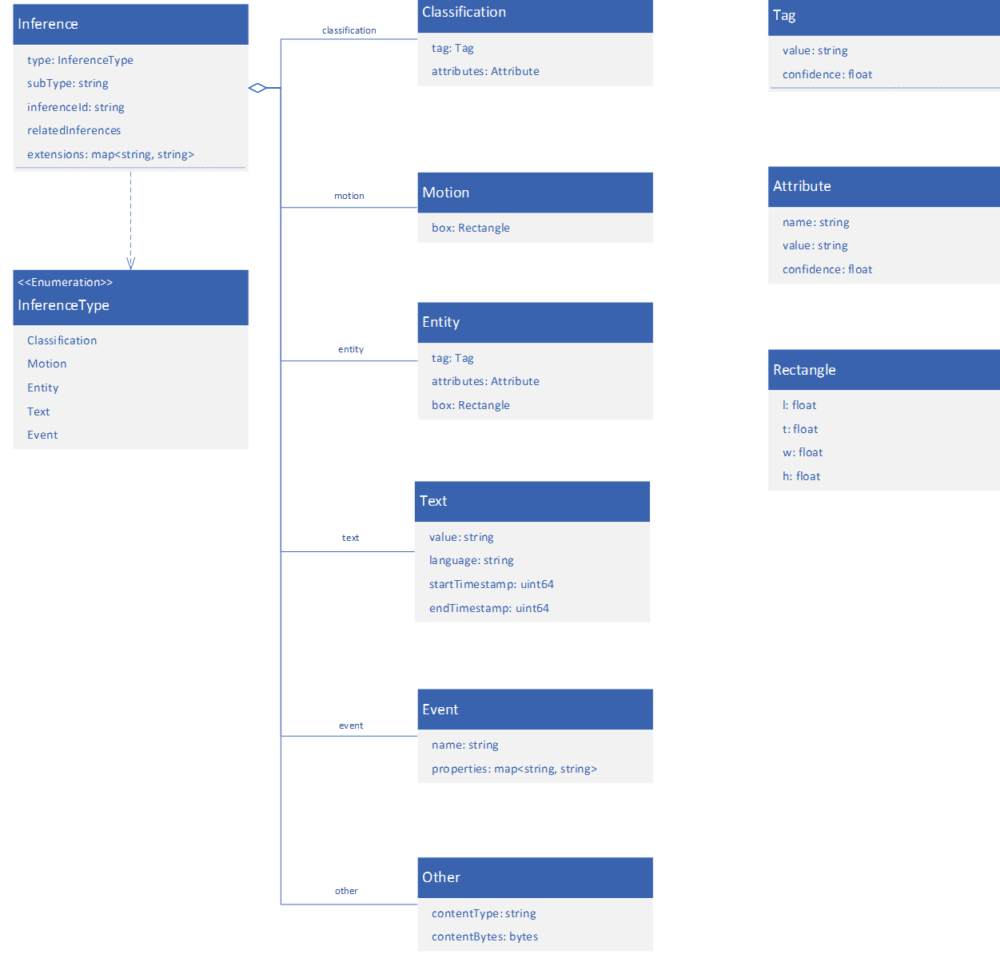

# Inference metadata schema 

Each Inference object regardless of using HTTP based contract or gRPC based contract follows this object model:


 
|Type Definition|Description|
|---|---|
|Tag|Tag or label associated with the result.|
|Attribute|Additional attribute associated with the result.|
|Attribute|List	Optional list of attributes.|
|Rectangle|Rectangular region relative to the image top left corner.|
|Classification|Label of classifier often applicable to the whole sample.|
|Entity|Entity detected or identified on the sample.|
|Event|Event detected on the sample.|
|Motion|Motion detected on the sample.|
|Text|Text associated with the sample.|
|Other|Allows for opaque payloads to be serialized.|
|Common|Inference Type	Single inference data associated with a sample. This is used when you have extension defined inference type.|

The example below contains a single event with some supported inference types:

```
[ 
  // Light Detection 
  { 
    "type": "classification", 
    "subtype": "lightDetection", 
    "classification": { 
      "tag": { "value": "daylight", "confidence": 0.86 }, 
      "attributes": [ 
          { "name": "isBlackAndWhite", "value": "false", "confidence": 0.71 } 
      ] 
    } 
  }, 
 
  // Motion Detection 
  { 
    "type": "motion", 
    "subtype": "motionDetection", 
    "motion": 
    { 
      "box": { "l": 0.0, "t": 0.0, "w": 0.0, "h": 0.0 } 
    } 
  }, 
 
  // Yolo V3 
  { 
    "type": "entity", 
    "subtype": "objectDetection",     
    "entity": 
    { 
      "tag": { "value": "dog", "confidence": 0.97 }, 
      "box": { "l": 0.0, "t": 0.0, "w": 0.0, "h": 0.0 } 
    } 
  }, 
 
  // Vehicle Identification 
  { 
    "type": "entity", 
    "subtype": "vehicleIdentification",     
    "entity": 
    { 
      "tag": { "value": "007-SPY", "confidence": 0.82 }, 
      "attributes":[   
        { "name": "color", "value": "black", "confidence": 0.90 }, 
        { "name": "body", "value": "coupe", "confidence": 0.87 }, 
        { "name": "make", "value": "Aston Martin", "confidence": 0.35 }, 
        { "name": "model", "value": "DBS V12", "confidence": 0.33 } 
      ], 
      "box": { "l": 0.0, "t": 0.0, "w": 0.0, "h": 0.0 } 
    } 
  }, 
 
  // People Identification 
  { 
    "type": "entity", 
    "subtype": "peopleIdentification",     
    "entity": 
    { 
      "tag": { "value":"Erwin Schrödinger", "confidence": 0.50 }, 
      "attributes":[   
        { "name": "age", "value": "73", "confidence": 0.87 }, 
        { "name": "glasses", "value": "yes", "confidence": 0.94 } 
      ], 
      "box": { "l": 0.0, "t": 0.0, "w": 0.0, "h": 0.0 } 
    }, 
 
    // Open type coming from the gRPC Map 
    "extensions":  
    { 
      "vector": "e1xkaXNwbGF5c3R5bGUgaVxoYmFyIHtcZnJhYyB7ZH17ZHR9fVx2ZXJ0IFxQc2kgKHQpXHJhbmdsZSA9e1xoYXQge0h9fVx2ZXJ0IFxQc2kgKHQpXHJhbmdsZSB9KQ==", 
      "skeleton": "p1,p2,p3,p4" 
    } 
  }, 
 
  // Captions 
  {     
    "type": "text", 
    "subtype": "speechToText",   
    "text": 
    { 
      "value": "Humor 75%. Confirmed. Self-destruct sequence in T minus 10… 9…", 
      "language": "en-US", 
      "startTimestamp": 12000, 
      "endTimestamp": 13000 
    } 
]
```

## Next steps

- [gRPC data contract](grpc-data-contract.md)
- [HTTP data contract](http-data-contract.md)