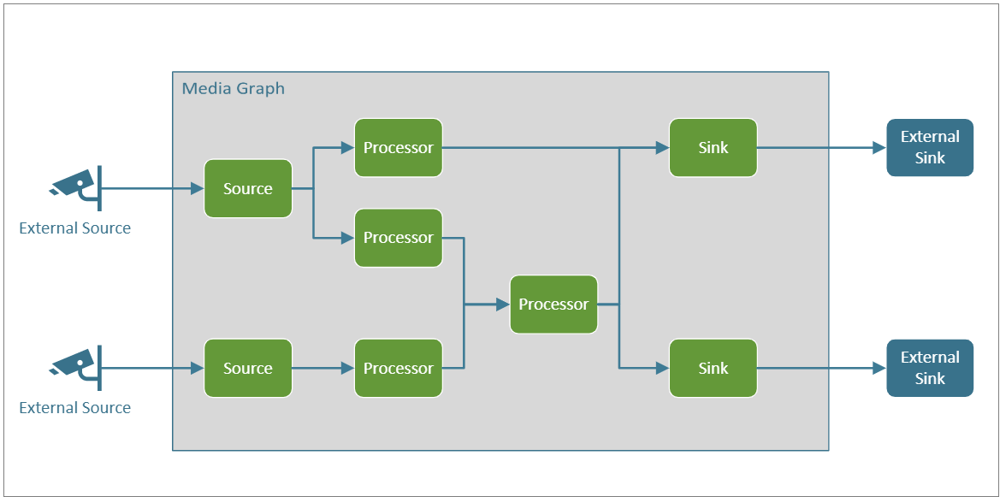

# Media Graph concept

## Suggested pre-reading

* [Live video analytics on IoT Edge Overview](overview.md)
* [Live video analytics on IoT Edge Terminology](terminology.md)

## Overview

Media Graph lets you define where media should be captured from, how it should be processed, and where the results should be delivered. You accomplish this by connecting components, or nodes, in the desired manner. The diagram below provides a graphical representation of a Media Graph.   

A Media Graph has the following nodes:

* A source node, which represents ingestion of media into the Media Graph. Media in this context, conceptually, could be an audio stream, a video stream, a data stream, or a stream that has audio, video, and/or data combined together in a single stream.
* A processor node, which represents processing of the media within the Media Graph.
* A sink node, which represents delivery of the processing results outside the Media Graph.

Live video analytics on IoT Edge supports different types of sources, processors, and sinks.

## Media graph topologies and instances 

Live video analytics on IoT Edge enables you to manage media graphs via two concepts – "Graph Topology" and "Graph Instance". A Graph Topology enables you to define a blueprint of a graph, with parameters as placeholders for values. The topology defines what nodes are used in the media graph, and how they are connected within the media graph. Values for the parameters can be specified when creating graph instances referencing the topology. This enables you to create multiple instances referencing the same topology but with different values for the parameters specified in the topology. 

## Media graph states  

A Media Graph can be in one of following states:

* Inactive – This represents the state where a Media Graph is configured but not active.
* Activating – This is the state when a Media Graph is being instantiated (that is, the transition state between Inactive and Active).
* Active – This is the state when a Media Graph is active. 

    > [!NOTE]
    >  Media Graph can be active without data flowing through it (for example, the input video source goes offline).
* Deactivating – This is the state when a Media Graph is transitioning from Active to Inactive.

The diagram below illustrates the Media Graph state machine.

## Sources, processors, and sinks  

With the latest release, Live video analytics on IoT Edge, supports the following types of nodes within a Media Graph:

### Sources 

#### RTSP source 

An RTSP source enables ingestion of media from a [RTSP](https://tools.ietf.org/html/rfc2326) server. Surveillance and IP-based cameras transmit their data in a protocol called RTSP (real-time-streaming-protocol) which is different than other types of devices like phones and video cameras. This protocol is used for establishing and controlling the media sessions between a server (the camera) and a client. The RTSP source node in a Media Graph acts as a client and can establish a session with an RTSP server. Many devices such as most [IP cameras](https://en.wikipedia.org/wiki/IP_camera) have a built-in RTSP server. [ONVIF](https://www.onvif.org/) mandates RTSP to be supported in its definition of [Profiles G, S & T](https://www.onvif.org/wp-content/uploads/2019/12/ONVIF_Profile_Feature_overview_v2-3.pdf) compliant devices. The RTSP source requires you to specify an RTSP URL, along with credentials to enable an authenticated connection.

#### IoT Hub Message source 

Like other [IoT Edge modules](../../iot-edge/iot-edge-glossary.md#iot-edge-module), Live Video Analytics on IoT Edge module can receive messages via the [IoT Edge hub](../../iot-edge/iot-edge-glossary.md#iot-edge-hub). These messages can be sent from other modules, or apps running on the Edge device, or from the cloud. Such messages are delivered (routed) to a [named input](../../iot-edge/module-composition.md#sink) on the module. An IoT Hub Message source allows such messages to reach a media graph. These messages or signals can then be used internally in the media graph, typically to activate Signal Gates (see [signal gates](#signal-gate-processor) below). 

For example, you can have an IoT Edge module that listens to a sensor that detects when a door is opened, and the module sends that event to the IoT Edge hub, from where it gets routed to the IoT Hub Message Source. The IoT Hub Message Source can pass the event to the Signal Gate processor, which then turns on recording of the camera feed into a file. 

### Processors  

#### Motion detection processor 

The Motion Detection Processor enables you to detect motion in live video. It examines incoming video frames and determines if there is movement in the video. If motion is detected, it passes on the video frames to the downstream component, and emits an event. Motion detection processor (in conjunction with other Media Graph nodes) can be used to trigger recording of the incoming video when there is motion detected.

#### Frame rate filter processor  

The frame rate filter processor enables you to sample frames from the incoming video stream at a specified frame rate. This enables you to reduce the number of frames sent to down-stream components (such as Http Graph extension processor) for further processing.

#### HTTP graph extension processor 

The Http graph extension processor enables you to connect your own IoT Edge module to a media graph. The Http graph extension processor takes as input decoded video frames and relays such frames to a Http REST endpoint exposed by your module. The processor has the capability to authenticate with the REST endpoint if required. Additionally, the processor has in-built image formatter that allows scaling and encoding of video frames before they are relayed forward. Scaling has options for the image aspect ratio to be preserved, padded or stretched while encoding provides options for different image encoding such as jpeg, png, or bmp.

#### Signal gate processor  

The Signal Gate processor allows for media to be conditionally forwarded from one node to another. It also acts as a buffer, allowing for synchronization of media and events. An example use case is to insert a Signal Gate Processor between the RTSP Source and Asset Sink and using the output of motion detector processor to trigger the gate. With such a Media Graph, you can trigger recording of media only when motion is detected in the incoming video feed. 

### Sinks  

#### Asset sink  

An Asset Sink enables a Media Graph to write media (video and/or audio) data to an Azure Media Services asset. There can only be one asset sink in a media graph. See the [asset](terminology.md#asset) section for more information about assets, and their role in recording and playback of media.  

#### File sink  

The File Sink enables a Media Graph to write media (video and/or audio) data to a location on the local file system of the IoT Edge device. There can only be one File Sink in a media graph, and it must be downstream of a Signal Gate processor. This limits the duration of the output files to values specified in the Signal gate processor properties.

#### IoT Hub message sink  

An IoT Hub Message Sink enables you to publish events to IoT Edge hub. The Edge hub can then route the data to other modules or apps on the Edge device, or to IoT Hub in the cloud (per routes specified in the deployment manifest). The IoT Hub Message Sink can  accept events from upstream processors such as a motion detection processor, or from an external inference service via Http extension processor.

## Scenarios

Using a combination of the sources, processors, and sinks defined above, you can use Media Graph for a variety of live video analytics related scenarios. A few example scenarios are as follows

* [Continuous video recording](continuous-video-recording-concept.md)
* [Event-based video recording](event-based-video-recording-concept.md)
* [Live video analytics without video recording](analyze-live-video-concept.md)

## Next steps

[Azure IoT Edge](https://docs.microsoft.com/azure/iot-edge/)
<!--
## Next steps

Follow the [Quickstart: Run Live Video Analytics with your own model](use-your-model-quickstart.md) article to see how you can run motion detection on a live video feed.
-->