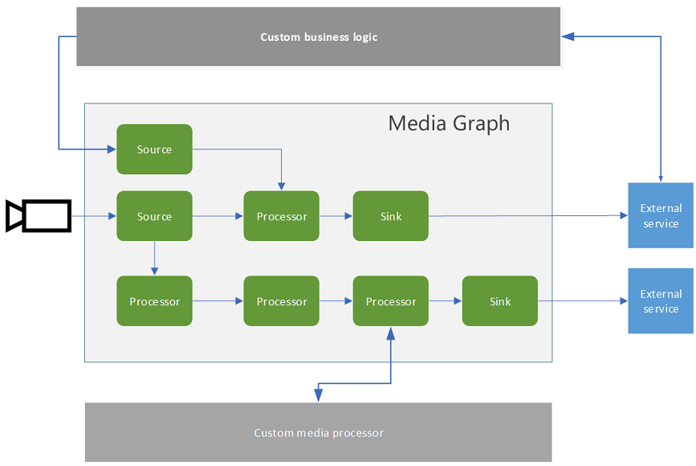
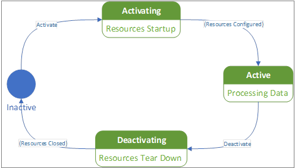

# Media graph

## Suggested pre-reading

* [Live Video Analytics on IoT Edge overview](overview.md)
* [Live Video Analytics on IoT Edge terminology](terminology.md)

## Overview

A media graph lets you define where media should be captured from, how it should be processed, and where the results should be delivered. You accomplish this by connecting components, or nodes, in the desired manner. The diagram below provides a graphical representation of a media graph.  

Live Video Analytics on IoT Edge supports different types of sources, processors, and sinks.

* **Source nodes** enable capturing of media into the media graph. Media in this context, conceptually, could be an audio stream, a video stream, a data stream, or a stream that has audio, video, and/or data combined together in a single stream.
* **Processor nodes** enable processing of media within the media graph.
* **Sink nodes** enable delivering the processing results to services and apps outside the media graph.

## Media graph topologies and instances 

Live Video Analytics on IoT Edge enables you to manage media graphs via two concepts – "graph topology" and "graph instance". A graph topology enables you to define the blueprint of a graph, with parameters as placeholders for values. The topology defines what nodes are used in the media graph, and how they are connected within the media graph. For example, if you wanted to record the feed from a camera, then you would need a graph with a source node that receives video, and a sink node that writes the video.

The values for the parameters in the topology are specified when you create graph instances that reference the topology. This enables you to create multiple instances referencing the same topology but with different values for the parameters specified in the topology. In the above example, you could have used parameters to represent the camera's IP address, and the name for the recorded video. You could create many graph instances with that topology - one instance for each camera in a building, perhaps, each with the specific IP address and specific name.

## Media graph states  

A media graph can be in one of the following states:

* Inactive –  represents the state where a media graph is configured but not active.
* Activating – the state when a media graph is being instantiated (that is, the transition state between inactive and active).
* Active – the state when a media graph is active. 

    > [!NOTE]
    >  Media graph can be active without data flowing through it (for example, the input video source goes offline).
* Deactivating – This is the state when a media graph is transitioning from active to inactive.

The diagram below illustrates the media graph state machine.

## Sources, processors, and sinks  

Live Video Analytics on IoT Edge supports the following types of nodes within a media graph:

### Sources 

#### RTSP source 

An RTSP source node enables you to ingest media from a [RTSP](https://tools.ietf.org/html/rfc2326 server. Surveillance and IP-based cameras transmit their data in a protocol called RTSP (real-time-streaming-protocol) which is different than other types of devices like phones and video cameras. This protocol is used for establishing and controlling the media sessions between a server (the camera) and a client. The RTSP source node in a media graph acts as a client and can establish a session with an RTSP server. Many devices such as most [IP cameras](https://en.wikipedia.org/wiki/IP_camera) have a built-in RTSP server. [ONVIF](https://www.onvif.org/) mandates RTSP to be supported in its definition of [Profiles G, S & T](https://www.onvif.org/wp-content/uploads/2019/12/ONVIF_Profile_Feature_overview_v2-3.pdf) compliant devices. The RTSP source node requires you to specify an RTSP URL, along with credentials to enable an authenticated connection.

#### IoT Hub message source 

Like other [IoT Edge modules](../../iot-edge/iot-edge-glossary.md#iot-edge-module), Live Video Analytics on IoT Edge module can receive messages via the [IoT Edge hub](../../iot-edge/iot-edge-glossary.md#iot-edge-hub). These messages can be sent from other modules, or apps running on the Edge device, or from the cloud. Such messages are delivered (routed) to a [named input](../../iot-edge/module-composition.md#sink) on the module. An IoT Hub message source node allows such messages to reach a media graph. These messages or signals can then be used internally in the media graph, typically to activate signal gates (see [signal gates](#signal-gate-processor) below). 

For example, you can have an IoT Edge module that generates a message when a door is opened. The message from that module can be routed to IoT Edge hub, from where it can be then routed to the IoT hub message source of a media graph. Within the media graph, the IoT hub message source can pass the event to a signal gate processor, which can then turn on recording of the video from an RTSP source into a file. 

### Processors  

#### Motion detection processor 

The motion detection processor node enables you to detect motion in live video. It examines incoming video frames and determines if there is movement in the video. If motion is detected, it passes on the video frames to the downstream component, and emits an event. The motion detection processor node (in conjunction with other nodes) can be used to trigger recording of the incoming video when there is motion detected.

#### Frame rate filter processor  

The frame rate filter processor node enables you to sample frames from the incoming video stream at a specified rate. This enables you to reduce the number of frames sent to down-stream components (such as HTTP extension processor node) for further processing.

#### HTTP extension processor

The HTTP extension processor node enables you to connect your own IoT Edge module to a media graph. This node takes decoded video frames as the input, and relays such frames to a HTTP REST endpoint exposed by your module. This node has the ability to authenticate with the REST endpoint if required. Additionally, the node has a built-in image formatter for scaling and encoding of video frames before they are relayed to the REST endpoint. The scaler has options for the image aspect ratio to be preserved, padded or stretched. The image encoder supports jpeg, png, or bmp formats.

#### Signal gate processor  

The signal gate processor node enables you to conditionally forward media from one node to another. It also acts as a buffer, allowing for synchronization of media and events. A typical use case is to insert a signal gate processor node between the RTSP source node and the asset sink node, and using the output of a motion detector processor node to trigger the gate. With such a media graph, you would be recording video only when motion is detected.

### Sinks  

#### Asset sink  

An asset sink node enables you to write media (video and/or audio) data to an Azure Media Services asset. There can only be one asset sink node in a media graph. See the [asset](terminology.md#asset) section for more information about assets, and their role in recording and playback of media. You can also see the [continuous video recording](continuous-video-recording-concept.md) article for details on how the properties of this node are used.

#### File sink  

The file sink node enables you to write media (video and/or audio) data to a location on the local file system of the IoT Edge device. There can only be one file sink node in a media graph, and it must be downstream of a signal gate processor node. This limits the duration of the output files to values specified in the signal gate processor node properties.

#### IoT Hub message sink  

An IoT Hub message sink node enables you to publish events to IoT Edge hub. The IoT Edge hub can then route the data to other modules or apps on the edge device, or to IoT Hub in the cloud (per routes specified in the deployment manifest). The IoT Hub message sink node can accept events from upstream processors such as a motion detection processor node, or from an external inference service via a HTTP extension processor node.

## Rules on the use of nodes

See [quotas](quotas-limitations.md#limitations-on-graph-topologies-at-preview) for additional rules on how different nodes can be used within a media graph.

## Scenarios

Using a combination of the sources, processors, and sinks defined above, you can build media graphs for a variety of scenarios  involving analysis of live video. Example scenarios are:

* [Continuous video recording](continuous-video-recording-concept.md)
* [Event-based video recording](event-based-video-recording-concept.md)
* [Live Video Analytics without video recording](analyze-live-video-concept.md)

## Next steps

To see how you can run motion detection on a live video feed, see [Quickstart: Run Live Video Analytics with your own model](use-your-model-quickstart.md).
